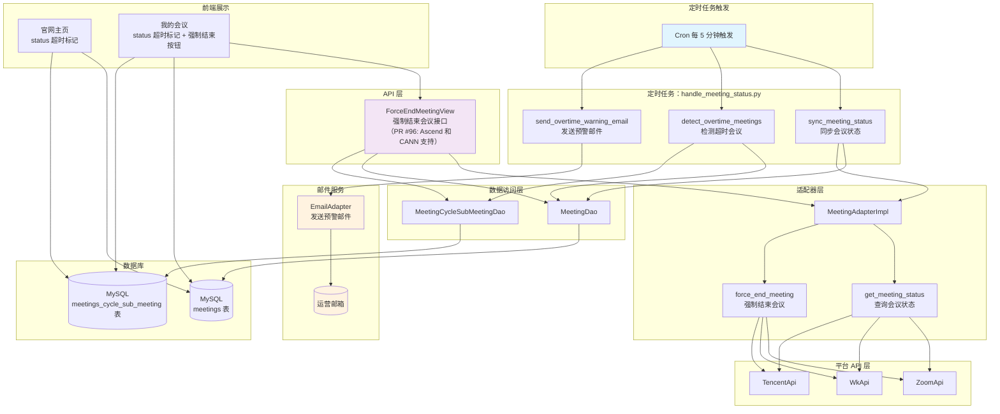
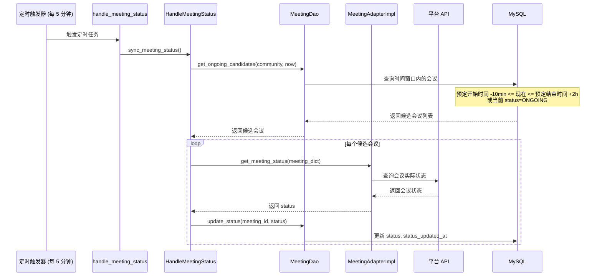
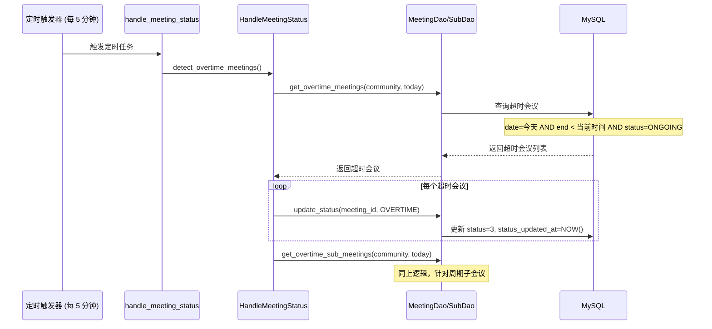
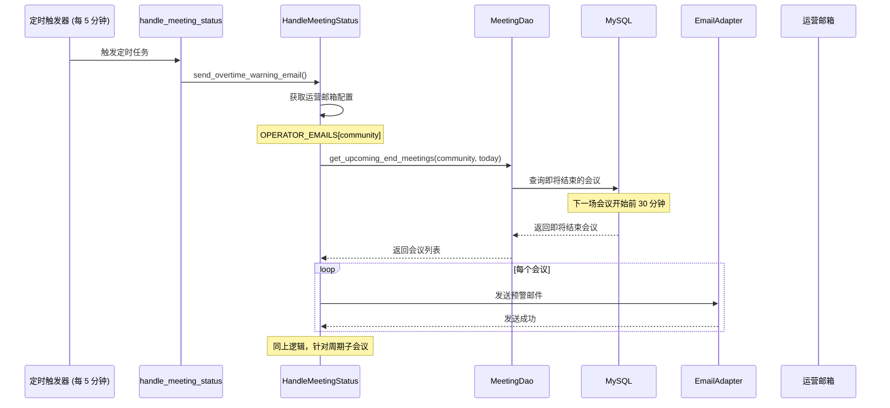
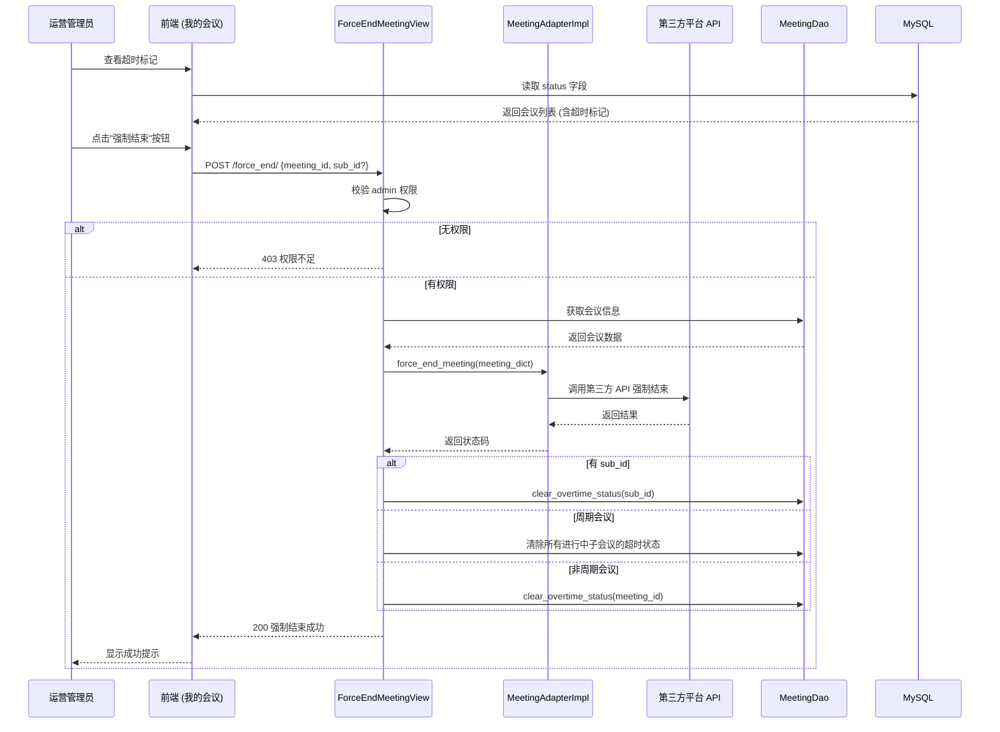
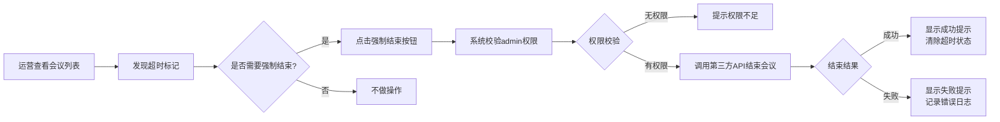

# #100 会议超时处理功能架构设计说明书 (Architecture Design Document)
---

## 1. 基础信息

* **需求链接**: https://github.com/opensourceways/backlog/issues/100
* **需求名称**: 会议超时处理功能
* **开发责任人**: Tom_zc
* **设计目标**: 在 meeting-platform 中实现会议超时检测、预警通知和运营强制结束功能，将会议优先权的决策交给运营，解决共享资源场景下的会议冲突问题。

---

## 2. 功能设计

> **说明**：描述系统的组件构成、职责划分及交互逻辑。

### 2.1 架构图

> 描述会议超时处理功能的系统组件交互关系。

**设计说明/归档：**



**关键设计说明：**
- 单一定时任务：`handle_meeting_status.py` 负责状态同步、超时检测和预警邮件（每 5 分钟执行）
- 时间对齐：5 分钟与定会时间点（0/15/30/45）保持一致
- 通过适配器模式支持多平台（Zoom、WeLink、腾讯会议）
- 前端通过读取 `status` 字段（值为 3 表示 OVERTIME）展示超时标记
- 运营通过 API 强制结束会议，而非系统自动强制结束（PR #96：Ascend 和 CANN 会议支持 admin 权限后台强制结束）

### 2.2 数据流图

> 描述会议超时处理的数据生命周期。

**设计说明/归档：**

#### 2.2.1 会议状态同步流程



#### 2.2.2 超时检测流程



#### 2.2.3 预警邮件发送流程



#### 2.2.4 运营强制结束会议流程



### 2.3 组件职责与接口

> 列出新增/修改的组件及其定义的 API 规范。

**设计说明/归档：**

#### 2.3.1 模型层变更 (models.py)

**Meeting 模型新增字段：**

| 字段名 | 类型 | 默认值 | 说明 |
|--------|------|--------|------|
| `status` | IntegerField | 0 | 会议业务状态：NOT_STARTED(0), ONGOING(1), ENDED(2), OVERTIME(3), CANCELLED(4) |
| `status_updated_at` | DateTimeField | null | 状态更新时间 |

**MeetingCycleSubMeeting 模型新增字段：**

| 字段名 | 类型 | 默认值 | 说明 |
|--------|------|--------|------|
| `status` | IntegerField | 0 | 会议业务状态：NOT_STARTED(0), ONGOING(1), ENDED(2), OVERTIME(3), CANCELLED(4) |
| `status_updated_at` | DateTimeField | null | 状态更新时间 |

**业务状态枚举（meeting_status.py）：**

```python
class BusinessMeetingStatus(EnumBase):
    """会议状态"""
    NOT_STARTED = (0, '未开始')
    ONGOING = (1, '进行中')
    ENDED = (2, '已结束')
    OVERTIME = (3, '已超时')
    CANCELLED = (4, '已取消')
```

**状态计算逻辑（serializer）：**

```python
def calculate_business_status(meeting_data, now=None):
    """计算会议业务状态

    - 0: 未开始 (当前时间 < 会议开始时间)
    - 1: 进行中 (会议时间段内 且 status=1)
    - 2: 已结束 (当前时间 > 会议结束时间 且 status=2)
    - 3: 超时 (当前时间 > 会议结束时间 且 status=1)
    - 4: 已取消 (is_delete=True)
    """
```

#### 2.3.2 DAO 层变更

**MeetingDao 新增方法：**

| 方法名 | 功能 | 参数 |
|--------|------|------|
| `get_status_sync_candidates(community, now)` | 获取今天所有需要同步状态的会议 | community, now |
| `update_status(meeting_id, status)` | 更新会议状态 | meeting_id, status |
| `clear_status(meeting_id)` | 清除会议状态（标记为已结束） | meeting_id |
| `get_upcoming_end_meetings(community, today, warning_minutes)` | 获取即将结束的会议（用于预警邮件） | community, today, warning_minutes=10 |
| `get_meeting_sponsors(community, sponsor_keyword)` | 获取会议发起者列表（支持模糊查询） | community, sponsor_keyword |
| `get_non_cycle_meetings(community, filters)` | 获取非周期会议列表（用于合并列表接口） | community, filters |

**MeetingCycleSubMeetingDao 新增方法：**

| 方法名 | 功能 | 参数 |
|--------|------|------|
| `get_status_sync_candidates(community, today)` | 获取今天所有周期子会议 | community, today |
| `update_status(sub_meeting_id, status)` | 更新子会议状态 | sub_meeting_id, status |
| `clear_status(sub_id)` | 清除子会议状态（标记为已结束） | sub_id |
| `get_upcoming_end_sub_meetings(community, today, warning_minutes)` | 获取即将结束的周期子会议 | community, today, warning_minutes=10 |
| `mark_warning_email_sent(sub_meeting_id)` | 标记已发送预警邮件 | sub_meeting_id |
| `reset_warning_email_status(sub_id)` | 重置预警邮件状态 | sub_id |
| `get_expanded_sub_meetings(community, filters)` | 获取周期子会议列表（展开后用于合并列表） | community, filters |

#### 2.3.3 定时任务实现

**handle_meeting_status.py（统一定时任务）：**

```python
# meeting_platform/apps/meeting/management/commands/handle_meeting_status.py

class HandleMeetingStatus:
    """会议状态处理类"""

    def sync_meeting_status(self):
        """同步会议状态"""
        now = datetime.datetime.now()
        today = now.strftime('%Y-%m-%d')

        # 同步非周期会议状态
        meetings = self.meeting_dao.get_status_sync_candidates(self.community, now)
        for meeting in meetings:
            try:
                meeting_dict = model_to_dict(meeting)
                status = self.meeting_adapter_impl.get_meeting_status(meeting_dict)
                self.meeting_dao.update_status(meeting.id, status)

                # 如果会议从"未进行中"变为"进行中"，重置预警邮件状态
                if status == BusinessMeetingStatus.ONGOING.value:
                    self.meeting_dao.reset_warning_email_status(meeting.id)
                # 如果会议已结束，清除超时状态
                if status == BusinessMeetingStatus.ENDED.value:
                    self.meeting_dao.clear_status(meeting.id)
            except Exception as e:
                logger.error(f"[sync_meeting_status] meeting {meeting.mid} error: {e}")

        # 同步周期子会议状态
        sub_meetings = self.meeting_cycle_sub_dao.get_status_sync_candidates(self.community, today)
        for sub in sub_meetings:
            try:
                meeting_dict = model_to_dict(sub)
                status = self.meeting_adapter_impl.get_meeting_status(meeting_dict)
                self.meeting_cycle_sub_dao.update_status(sub.id, status)

                if status == BusinessMeetingStatus.ONGOING.value:
                    self.meeting_cycle_sub_dao.reset_warning_email_status(sub.sub_id)
                if status == BusinessMeetingStatus.ENDED.value:
                    self.meeting_cycle_sub_dao.clear_status(sub.sub_id)
            except Exception as e:
                logger.error(f"[sync_meeting_status] sub_meeting {sub.sub_id} error: {e}")

    def detect_overtime_meetings(self):
        """检测超时会议并更新标记"""
        now = datetime.datetime.now()
        today = now.strftime('%Y-%m-%d')

        # 检测非周期会议：结束时间已到但状态仍为 ONGOING
        overtime_meetings = self.meeting_dao.get_overtime_meetings(self.community, today)
        for meeting in overtime_meetings:
            if meeting.status == BusinessMeetingStatus.ONGOING.value:
                self.meeting_dao.update_status(meeting.id, BusinessMeetingStatus.OVERTIME.value)

        # 检测周期会议子会议
        overtime_sub_meetings = self.meeting_cycle_sub_dao.get_overtime_sub_meetings(self.community, today)
        for sub_meeting in overtime_sub_meetings:
            if sub_meeting.status == BusinessMeetingStatus.ONGOING.value:
                self.meeting_cycle_sub_dao.update_status(sub_meeting.id, BusinessMeetingStatus.OVERTIME.value)

    def send_overtime_warning_email(self):
        """发送超时预警邮件（在下一场会议开始前 30 分钟）"""
        now = datetime.datetime.now()
        today = now.strftime('%Y-%m-%d')

        # 获取运营邮箱配置
        operator_emails = settings.OPERATOR_EMAILS.get(self.community, [])
        if not operator_emails:
            return

        # 获取即将结束的非周期会议
        upcoming_meetings = self.meeting_dao.get_upcoming_end_meetings(self.community, today)
        for meeting in upcoming_meetings:
            self._send_warning_email(meeting, operator_emails)
            self.meeting_dao.mark_warning_email_sent(meeting.id)

        # 获取即将结束的周期子会议
        upcoming_sub_meetings = self.meeting_cycle_sub_dao.get_upcoming_end_sub_meetings(self.community, today)
        for sub_meeting in upcoming_sub_meetings:
            self._send_warning_email(sub_meeting.meeting, operator_emails, sub_meeting)
            self.meeting_cycle_sub_dao.mark_warning_email_sent(sub_meeting.id)
```

#### 2.3.4 API 层变更 (controller/inner.py)

**新增接口：**

| 接口路径 | 方法 | 功能 | 请求参数 |
|----------|------|------|----------|
| `/inner/v1/meeting/force_end/` | POST | 强制结束会议（统一接口） | `meeting_id`(必填), `sub_id`(可选) |
| `/inner/v1/meeting/sponsor/` | GET | 获取会议发起者列表 | `community`(必填), `sponsor`(可选，模糊查询) |
| `/inner/v1/meeting/list/` | GET | 合并会议列表（新增） | 见下方详细说明 |

**接口详细说明：**

##### (1) ForceEndMeetingView - 强制结束会议

```python
# meeting_platform/apps/meeting/controller/inner.py

class ForceEndMeetingView(GenericAPIView):
    """强制结束会议（内部 API）- 统一接口
    PR #96: Ascend 和 CANN 会议支持 admin 权限（运营者）后台强制结束会议

    请求参数（POST body）：
    - 非周期会议：{"meeting_id": 123}
    - 周期子会议：{"meeting_id": 123, "sub_id": "xxx"}
    """
    serializer_class = EmptySerializers
    app_class = MeetingApp()

    @capture_my_validation_exception
    def post(self, request, *args, **kwargs):
        meeting_id = request.data.get('meeting_id')
        if not meeting_id:
            raise MyValidationError(RetCode.STATUS_PARAMETER_ERROR)
        sub_id = request.data.get('sub_id')
        self.app_class.force_stop_meeting(meeting_id, sub_id)
        return ret_json(data={"message": "Meeting force ended successfully"})
```

##### (2) MeetingSponsorView - 获取会议发起者列表

```python
# meeting_platform/apps/meeting/controller/inner.py

class MeetingSponsorView(GenericAPIView):
    """会议发起者查询接口

    请求参数：
    - community: 社区名称（必填）
    - sponsor: 发起者名称模糊查询（可选）
    - page: 页码（默认 1）
    - page_size: 每页数量（默认 20，最大 100）

    返回字段：
    - list: 发起者名称列表
    - total: 总数量
    - page: 当前页码
    - page_size: 每页数量
    """
    serializer_class = EmptySerializers
    queryset = None
    authentication_classes = (BasicAuthentication,)
    app_class = MeetingApp()

    @capture_my_validation_exception
    def get(self, request):
        # 参数验证
        community = request.query_params.get("community")
        if not community:
            raise MyValidationError(RetCode.STATUS_PARAMETER_ERROR)

        if community not in settings.COMMUNITY_SUPPORT:
            raise MyValidationError(RetCode.STATUS_PARAMETER_ERROR)
        # 模糊查询参数
        sponsor_keyword = request.query_params.get('sponsor')

        data = self.app_class.get_meeting_sponsors(
            community=community,
            sponsor_keyword=sponsor_keyword,
        )
        return ret_json(data=data)
```

##### (3) MeetingListView - 合并会议列表

```python
# meeting_platform/apps/meeting/controller/inner.py

class MeetingListView(GenericAPIView):
    """会议列表接口（合并周期和非周期会议）

    请求参数：
    - community: 社区名称（必填）
    - topic: 会议名称，支持模糊查询
    - date: 日期筛选（格式：YYYY-MM-DD）
    - start_date: 开始日期（与 end_date 配合使用）
    - end_date: 结束日期
    - sponsor: 发起人筛选
    - group_name: SIG 筛选，支持模糊查询
    - platform: 平台筛选
    - status: 业务状态筛选（0-4）
    - include_private: 是否包含私有会议，默认 false
    - page: 页码（默认 1）
    - page_size: 每页数量（默认 20，最大 100）
    - order_by: 排序字段（可选值：date/start/end/sponsor/group_name/platform，默认 date）
    - order_type: 排序方式（可选值：asc/desc，默认 asc）

    返回字段：
    - id: 会议 ID（周期会议为父会议 ID）
    - topic: 会议主题
    - sponsor: 发起人
    - group_name: SIG 名称
    - community: 社区
    - platform: 平台
    - date: 会议日期
    - start: 开始时间
    - end: 结束时间
    - status: 业务状态（0=未开始，1=进行中，2=已结束，3=超时，4=已取消）
    - is_cycle: 是否周期会议
    - sub_id: 子会议 ID（周期会议有值）
    - mid: 会议 ID
    """
    serializer_class = MeetingListSerializer
    query_serializer_class = MeetingListQuerySerializer
    app_class = MeetingApp()

    @capture_my_validation_exception
    def get(self, request, *args, **kwargs):
        # 1. 使用序列化器验证参数
        query_serializer = self.query_serializer_class(data=request.query_params)
        query_serializer.is_valid(raise_exception=True)
        params = query_serializer.validated_data

        # 2. 构建筛选条件
        filters = {
            'date': params.get('date'),
            'start_date': params.get('start_date'),
            'end_date': params.get('end_date'),
            'sponsor': params.get('sponsor'),
            'status': params.get('status'),
            'group_name': params.get('group_name'),
            'platform': params.get('platform'),
            'topic': params.get('topic'),
            'include_private': params.get('include_private', False),
        }

        # 3. 调用 Application 层
        result = self.app_class.get_merged_meeting_list(
            community=params['community'],
            filters=filters,
            order_by=params.get('order_by', 'date'),
            order_type=params.get('order_type', 'desc'),
            page=params.get('page', 1),
            page_size=params.get('page_size', 20)
        )

        # 4. 序列化
        serializer = self.serializer_class(result['list'], many=True)
        result['list'] = serializer.data
        return ret_json(data=result)
```

**路由配置：**

```python
# meeting_platform/apps/meeting/urls.py

from django.urls import path
from .controller.inner import ForceEndMeetingView, MeetingSponsorView, MeetingListView

urlpatterns = [
    path('meeting/force_end/', ForceEndMeetingView.as_view()),           # 强制结束会议
    path('meeting/sponsor/', MeetingSponsorView.as_view()),              # 获取会议发起者列表
    path('meeting/list/', MeetingListView.as_view()),                    # 合并会议列表（新增）
]
```

#### 2.3.5 配置说明

```python
# meeting_platform/settings/prod.py

# 运营团队邮箱配置（用于超时预警邮件）
# 格式：{"community_name": ["email1@example.com", "email2@example.com"]}
OPERATOR_EMAILS = VAULT_CONF.get("OPERATOR_EMAILS", {})
```

### 2.4 UX设计

> 设计目标：确保功能不仅"可用"，而且"好用"，降低开发者的认知负担和运维人员的误操作风险。

**设计说明/归档：**

#### 2.4.1 交互流程



#### 2.4.2 前端交互设计要点

| 交互元素 | 设计说明 |
|---------|---------|
| **超时标记展示** | 会议状态为 OVERTIME(status=3) 时，显示醒目的超时标记（如红色图标或文字提示） |
| **强制结束按钮** | 仅对 admin 角色可见，按钮文案明确（"强制结束会议"），避免误操作 |
| **权限提示** | 非 admin 用户查看超时会议时，不显示强制结束按钮，或显示"需管理员权限"提示 |
| **操作反馈** | 强制结束后显示成功/失败提示，失败时提供错误原因 |
| **确认机制** | 强制结束前建议增加二次确认，防止误操作 |

#### 2.4.3 错误提示文案

| 错误场景 | 中文提示 | 英文提示 |
|---------|---------|---------|
| 权限不足 | 无权限强制结束会议，仅 admin 角色可操作 | No permission to force end meeting. Only admin role can perform this operation. |
| 会议不存在 | 会议不存在或已被删除 | Meeting does not exist or has been deleted. |
| 强制结束失败 | 强制结束会议失败，请稍后重试 | Failed to force end meeting. Please try again later. |
| 强制结束成功 | 会议已成功强制结束 | Meeting has been successfully force ended. |

### 2.5 SOD设计

> 设计目标：通过维护SOD权限设计文档，确保权限设计可审计、可复用、可跨服务重用。

**涉及权限设计**：本需求新增 admin 权限供运营人员使用（PR #96：Ascend 和 CANN 会议支持 admin 权限后台强制结束会议）。

**权限模型说明：**

| 权限项 | 权限描述 | 适用角色 | 适用社区 |
|--------|---------|---------|---------|
| `admin` | 后台强制结束会议权限 | 运营人员 | Ascend、CANN |
| `committer` | 会议管理基础权限 | SIG committer | 所有社区 |
| `maintainer` | 会议管理基础权限 | SIG maintainer | 所有社区 |

**权限校验逻辑：**
- 强制结束 API (`ForceEndMeetingView`) 仅校验 admin 权限
- 非 admin 用户调用 API 返回 403 错误码

### 2.6 功能设计分解 TASK 清单

**设计说明/归档：**

**任务清单:**

| 任务 ID | 功能任务描述 | 责任人 |
|---------|-------------|--------|
| **TASK1** | 权限中心增加 admin 权限配置（PR #96：Ascend 和 CANN 会议支持） | Tom_zc |
| **TASK2** | 模型层新增 status 和 status_updated_at 字段 | Tom_zc |
| **TASK3** | DAO 层实现超时检测相关的数据访问方法 | Tom_zc |
| **TASK4** | 适配器层新增 force_end_meeting 和 get_meeting_status 方法 | Tom_zc |
| **TASK5** | 定时任务 handle_meeting_status.py 实现 | Tom_zc |
| **TASK6** | API 层实现强制结束会议接口 ForceEndMeetingView | Tom_zc |
| **TASK7** | 前端官网主页增加超时标记展示 | Tom_zc |
| **TASK8** | 前端我的会议增加超时标记和强制结束按钮 | Tom_zc |
| **TASK9** | 编写单元测试 | Tom_zc |

---

## 3. 非功能设计

### 3.1 安全与隐私设计评估和设计

> **注意**：仅当需求判定为 **`need_security`** 时，本章节为必填项。

> 关注点：防御能力与合规边界。

### 3.1.1 威胁分析 (Threat Modeling)

**设计说明/归档：**

会议超时处理功能涉及敏感操作（强制结束会议），以下是潜在威胁分析：

| 威胁类别 | 攻击场景描述 (Scenario) | 风险等级/评分 | 对应减缓措施 (Mitigation) |
|---------|------------------------|--------------|--------------------------|
| **权限提升** | 非授权用户尝试调用强制结束 API | 高 | API 层校验 admin 权限，返回 403 |
| **信息泄露** | 攻击者通过 API 枚举获取会议状态 | 低 | 仅返回必要信息，不暴露敏感数据 |
| **拒绝服务** | 恶意频繁调用强制结束 API | 中 | API 限流保护 |
| **篡改** | 攻击者修改他人会议的超时状态 | 中 | 数据库字段受权限保护，仅 admin 可修改 |

### 3.1.2 安全设计实现 (Security Mechanisms)

**设计说明/归档：**

* **权限控制**：强制结束 API 仅限 admin 角色调用
* **API 限流**：对强制结束 API 实施请求频率限制，防止恶意调用
* **审计日志**：记录所有强制结束操作的操作者、时间、目标会议，便于审计追溯
* **输入验证**：所有 API 参数进行严格校验，防止注入攻击

### 3.1.3 安全任务分解 (Security Task Breakdown)

**设计说明/归档：**

**任务清单:**

| 任务 ID | 安全任务描述 | 责任人 |
|---------|-------------|--------|
| **SEC-TASK1** | 验证 API 权限校验逻辑，确保仅 admin 角色可调用强制结束接口 | Tom_zc |
| **SEC-TASK2** | 实现强制结束 API 限流保护，防止恶意调用 | Tom_zc |
| **SEC-TASK3** | 添加操作审计日志，记录强制结束操作的操作者、时间、目标会议 | Tom_zc |
| **SEC-TASK4** | 验证输入参数校验，防止 SQL 注入和 XSS 攻击 | Tom_zc |

### 3.2 可靠性与韧性设计评估和设计（可选）

> **关注点**：极端情况下的生存与恢复能力。

**设计说明/归档：**

* **定时任务容错**：单个会议状态同步失败不影响其他会议处理，异常被捕获并记录日志
* **邮件发送容错**：预警邮件发送失败时记录错误日志，不影响其他流程
* **状态一致性**：强制结束后同步更新 `status`、`status_updated_at` 字段，确保数据一致性

### 3.3 可服务性与可观测性评估和设计（可选）

> **关注点**：排障效率与全生命周期管理，确保故障可感知、可定位、可修复。

**设计说明/归档：**

* **日志记录**：定时任务执行情况、API 调用情况、异常情况均记录详细日志
* **监控指标**：建议添加以下监控指标：
  - 定时任务执行耗时
  - 超时会议数量
  - 预警邮件发送成功率
  - 强制结束 API 调用次数

### 3.4 性能与伸缩性评估和设计（可选）

> **关注点**：社区生态兼容性与未来扩展。

**设计说明/归档：**

* **定时任务性能考量**：
  - 任务每 5 分钟执行一次，时间窗口内会议数量预估 50-200 场
  - 单次会议状态查询耗时约 100-300ms（第三方 API 调用）
  - 建议批量处理时控制并发数，避免 API 限流

* **数据库性能优化**：
  - `status` 字段建议添加索引，优化超时会议查询性能
  - `status_updated_at` 字段可用于增量查询，减少全表扫描

* **扩展性考量**：
  - 定时任务可通过增加执行频率提升实时性（如改为 3 分钟）
  - 支持新增会议平台时，只需扩展适配器层实现
  - 预警邮件机制可扩展支持多种通知渠道（如短信、钉钉）

**任务清单:**

| 任务 ID | 性能任务描述 | 责任人 |
|---------|-------------|--------|
| **PERF-TASK1** | 根据数据量评估是否需要为 `status` 字段添加数据库索引 | Tom_zc |
| **PERF-TASK2** | 测试定时任务执行耗时，确保在 5 分钟内完成所有会议处理 | Tom_zc |

---
