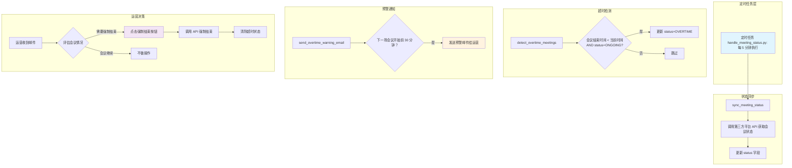

# #100 会议超时处理功能需求分析说明书

## 1. 基础信息

* **需求链接**: https://github.com/opensourceways/backlog/issues/100
* **需求名称**: 会议超时处理功能
* **开发责任人**: Tom_zc

---

## 2. 需求场景说明

> 描述"在什么情况下，为了解决什么问题，用户需要做什么"。

**需求背景：**

如果同一天，连续两场会议共用一个后台资源，社区会出现因上一场会议超时影响下一场会议的问题。早期方案是超时自动强制结束，但这种方式可能欠缺人性化考虑，比如上一场用户的会议比较紧急或者重要，需要下一场会议避开等情况，此时就需要运营者的介入处理协商沟通。

**需求价值：**

当会议产生冲突时，将会议的优先权交给运营来决策。

**核心设计理念：**

这是一个**半自动**的机制，而非全自动：
- 系统自动检测超时状态并标记
- 系统自动发送预警邮件通知运营
- **运营决策是否强制结束**，而非系统自动强制结束

---

## 3. 需求验收标准

> 明确需求完成的标志，必须是可量化、可测试的。

**验收标准:**

- **权限配置**：权限中心增加 admin 权限供运营使用（PR #96：Ascend 和 CANN 会议支持 admin 权限后台强制结束会议）
- **角色支持**：会议支持 admin、committer、maintainer 等角色
- **权限校验**：强制结束接口仅 admin 角色可调用
- **适用范围**：支持 Ascend、CANN 社区的运营者在后台强制结束会议
- **官网主页展示**：超时会议在官网主页显示超时标记
- **我的会议展示**：超时会议在"我的会议"页面显示超时标记
- **标记逻辑正确**：使用业务会议状态字段 `status` 表示会议状态，状态值 `OVERTIME(3)` 表示会议超时
- **定时任务同步**：定时任务 `handle_meeting_status.py` 每隔 5 分钟刷新一次会议状态，正确更新 `status` 字段
- **超时检测**：当会议结束时间已到且 status 为 ONGOING 时，更新为 OVERTIME 状态
- **前端按钮**：我的会议页面为管理员提供"强制结束会议"按钮，仅 admin 角色可见并可调用接口
- **API 可用**：后端提供强制结束会议的 API 接口，支持 Zoom、WeLink、腾讯会议三个平台
- **预警邮件通知**：在下一场会议开始前 30 分钟发送预警邮件给运营人员（通过 `OPERATOR_EMAILS` 配置）

---

## 4. 需求设计与分解

> 说明：基于初步方案，将需求拆解为可实施的原子 Task。后续的流程判定将严格依据这些 Task 的影响范围进行。

### 4.1 核心逻辑方案

**逻辑方案:**

**关键模块说明：**

| 模块 | 文件 | 职责 |
|------|------|------|
| **权限中心** | 权限配置文件 | 新增 admin 权限，供运营使用（PR #96：Ascend 和 CANN 会议支持） |
| **模型层** | `models.py` | Meeting 和 MeetingCycleSubMeeting 新增 `status` 和 `status_updated_at` 字段 |
| **DAO 层** | `meeting_dao.py`、`meeting_cycle_sub_dao.py` | 提供状态同步、超时检测、预警邮件相关的数据访问方法 |
| **定时任务** | `handle_meeting_status.py` | 每 5 分钟执行状态同步、超时检测、预警邮件发送 |
| **API 层** | `controller/inner.py` | 提供强制结束会议的 API 接口（ForceEndMeetingView） |
| **适配器层** | `meeting_adapter_impl.py` | 多平台的强制结束和状态查询实现 |

### 4.2 任务清单

**任务清单:**

| 任务 ID | 任务描述 (Task Description) | 预期产出 (Deliverables) | 预期工作量（人天） |
|---------|----------------------------|------------------------|-------------------|
| **TASK1** | 权限中心增加 admin 权限配置（PR #96：Ascend 和 CANN 会议支持） | 权限配置文件 | 0.5 |
| **TASK2** | 模型层新增 status 和 status_updated_at 字段 | `models.py` 字段定义 + 迁移文件 | 0.5 |
| **TASK3** | DAO 层实现超时检测相关的数据访问方法 | `meeting_dao.py`、`meeting_cycle_sub_dao.py` 新增方法 | 1 |
| **TASK4** | 适配器层新增 `force_end_meeting` 和 `get_meeting_status` 方法 | `meeting_adapter_impl.py` + 各平台 Action 和 API | 1.5 |
| **TASK5** | 定时任务 `handle_meeting_status.py` 实现 | `handle_meeting_status.py` | 1 |
| **TASK6** | API 层实现强制结束会议接口 `ForceEndMeetingView` | `inner.py` 新增 API 视图 | 1 |
| **TASK7** | 前端官网主页增加超时标记展示 | 前端代码 | 0.5 |
| **TASK8** | 前端我的会议增加超时标记和强制结束按钮 | 前端代码 | 1 |
| **TASK9** | 编写单元测试 | 测试文件 | 1 |

---

## 5. 需求相关性分析

> **操作说明**：根据上述拆解出的 Task，识别其变更行为。任何一项勾选为"是"：打上对应 issue 标签，必须执行对应的流程门禁。全部未勾选：该需求自动判定为轻量化特性，打上 need_light 标签。

### A. 安全相关性分析

> 若涉及以下任一项，打标 `need_security`标签，PR 必须关联特性 issue 的架构设计文档（含安全设计部分）**如勾选需要给出原因**。

* [ ] **边界变更**：新增公网端口、修改防火墙规则、变更网关配置。
* [ ] **凭证处理**：涉及密钥（Secret/Key）、Token、证书的存储或分发。
* [x] **权限调整**：修改权限模型、服务账号（SA）权限或鉴权逻辑。

  > TASK1 新增 admin 权限用于运营人员强制结束会议，涉及权限模型变更，触发本项。
* [ ] **供应链**：引入新的第三方二进制文件、SDK 或重大版本依赖升级。
* [ ] **隐私风险评估**：涉及用户个人数据（Email、手机号、IP、邮箱 等）的处理。
* [ ] **AI 使用**：涉及 AIGC 能力应用，并提供服务。

### B. 架构设计相关性分析

> 若涉及以下任一项，打标 `need_design`标签，PR 必须关联特性 issue 的架构设计文档。 **如勾选需要给出原因**。

* [x] A 环节判定需要完成安全设计
* [ ] 改变了现有系统的物理/逻辑拓扑
* [x] **新增或大幅修改对外暴露的 API/CLI 接口**

  > TASK6 新增强制结束会议 API（ForceEndMeetingView），属于对外暴露接口的新增，触发本项。
* [ ] 引入了新的中间件、数据库或三方核心组件

### C. 系统集成测试相关性分析

> 若涉及以下任一项，打标 `need_itest` 标签，PR 必须关联特性 issue 的测试策略和测试报告文档。 **如勾选需要给出原因**。

* [x] 上述环节判定需要执行安全设计或架构设计。
* [ ] **跨组件影响**：变更会触发下游服务或关联系统的连锁反应（级联效应）。
* [x] **核心组件管控**：含项目定级为 Core 的核心逻辑变更。

  > 会议管理为核心功能，涉及会议状态管理、定时任务调度等核心逻辑，触发本项。
* [ ] **环境强依赖**：功能高度依赖内核参数、网络拓扑或特定的物理挂载。
* [x] **端到端流程**：涉及从用户输入到持久化存储的全链路逻辑。

  > 完整链路为：定时任务触发 -> 第三方 API 调用 -> 状态检测 -> 数据库更新 -> 邮件发送 -> 前端展示 -> API 调用，覆盖从触发到持久化的全链路，触发本项。

### D. 用户体验相关性分析

> 若涉及以下任一项，打标 `need_ux` 标签，PR 必须关联特性 issue 的用户体验设计文档。 **如勾选需要给出原因**。

* [x] **交互逻辑变更**：涉及 Web 门户、控制台（Dashboard）或命令行工具（CLI）的交互流程调整。

  > TASK7、TASK8 涉及官网主页和我的会议页面新增超时标记和强制结束按钮，属于前端交互变更，触发本项。
* [ ] **感知性能变动**：变更可能显著影响页面的加载时间、同步请求的响应时延或异步任务的进度反馈。
* [x] **文档与辅助能力**：涉及报错提示语、帮助中心链接、FAQ 或新功能的 Runbook 说明。

  > 新增强制结束操作的错误提示和成功反馈，属于文档与辅助能力变更。
* [ ] **无障碍与多语种**：涉及国际化（i18n）支持、辅助功能或不同终端（移动端/桌面端）的适配。

### 5.1 需求相关性分析汇总结果

* [x] need_security（需架构设计（含安全威胁分析和安全设计））
* [x] **need_design**（需架构设计）
* [x] **need_itest**（需执行测试策略设计和全链路集成测试）
* [x] **need_ux**（需架构设计（含 UX 设计））
* [ ] need_light（上述均未勾选，走快速合入通道）

---

## 6. 价值识别与业务评估

> **判定准则**：基础设施接纳需求必须具备明确的 ROI（投资回报比）或合规必要性。

| 维度 | 评估问题 | 结论/说明 |
|------|----------|----------|
| **范围判定** | 该需求是否属于基础设施范围内？ | 是，meeting-platform 属于 openEuler 社区会议管理基础设施，超时处理是平台核心能力的增强 |
| **规划一致性** | 该需求是否在年度技术规划中？ | 是，会议资源管理是平台运维的重点优化方向 |
| **优先级** | 该需求优先级评估（高/中/低）？ | 高，会议超时直接影响下一场会议的正常进行，属于用户体验的关键问题 |
| **通用性** | 该需求是否解决 3 个以上业务方的共性痛点？ | 是，所有使用共享资源的会议都可能面临超时冲突问题 |
| **必要性** | 现有组件通过配置变更是否无法实现目标或没有不用开发的替代方案？ | 是，需要定时检测、状态标记、预警通知、强制结束等组合能力，无法通过配置变更实现 |
| **工作量** | 预计总工作量 | 8 人天 |
| **价值评估** | 实现后能减少多少手动操作或提升多少系统稳定性？ | 实现后运营可主动发现和处理超时会议，减少因超时导致的会议冲突投诉；将决策权交给运营，更具人性化 |

> **状态定义：** **Accept (准入)** | **Reject (驳回)** | **Pending (待议)**

**建议结论**：Accept

**原因描述:** 会议超时是影响用户体验的关键问题，当同一天连续两场会议共用后台资源时，超时会直接导致下一场会议无法正常开始。本需求通过定时检测、状态标记、预警通知的组合方案，将会议优先权的决策交给运营，比自动强制结束更具人性化。整体实现成本可控（8 人天），建议准入。

---
