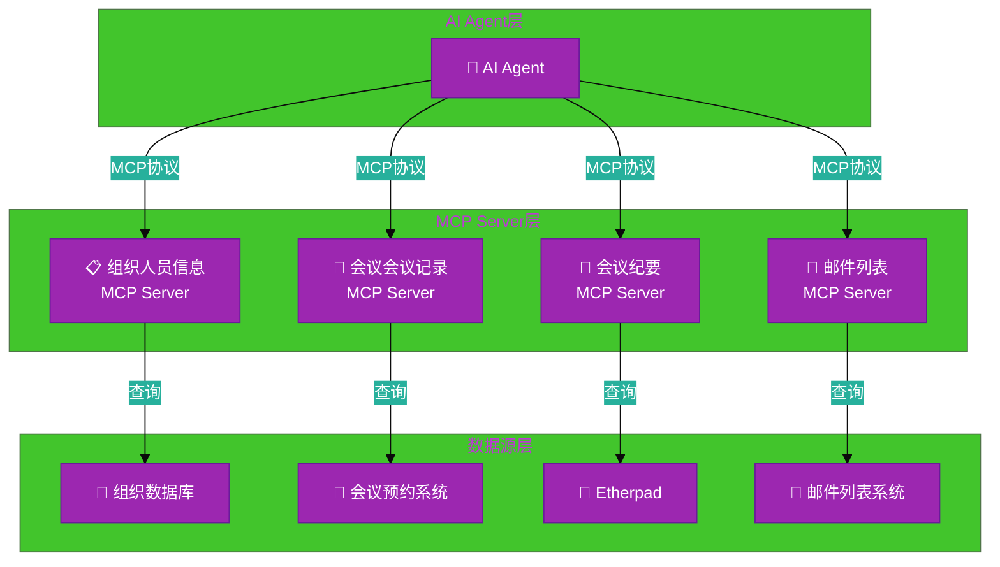
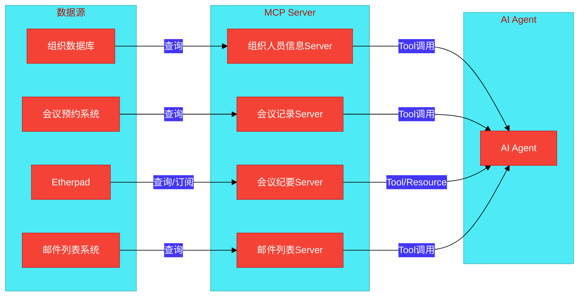

# #108 数据中台社区会议信息MCP Server架构设计说明书 (Architecture Design Document)
---

## 1. 基础信息

* **需求链接**: https://github.com/opensourceways/backlog/issues/108
* **需求名称**: 数据中台社区会议信息MCP Server开发
* **开发责任人**: **Kaede10**
* **设计目标**: 通过4个独立的MCP Server实现，为AI Agent提供统一的数据访问接口，支持组织人员信息、会议记录、会议纪要和邮件列表的自动化查询。

---

## 2. 功能设计

> **说明**：描述系统的组件构成、职责划分及交互逻辑。

### 2.1 架构图

> 此处建议插入架构拓扑系统组件图或时序图，描述组件间的交互关系。推荐使用Mermaid实现，可代码化，GitHub可渲染。
> **不涉及需要说明原因**

**设计说明/归档:** 4个独立的MCP Server，每个Server对接一个数据源，通过MCP协议向AI Agent暴露Tool和Resource接口。

**系统架构图（使用Mermaid）：**

**架构说明：**

- **AI Agent层**：通过MCP协议调用各个Server的Tool和Resource
- **MCP Server层**：4个独立Server，每个负责一个数据源的访问
- **数据源层**：现有的组织数据库、会议预约系统、Etherpad和邮件列表系统

### 2.2 数据流图

> 此处建议插入数据流图，描述核心业务数据的生命周期，即威胁建模的基础。推荐使用Mermaid实现，可代码化，GitHub可渲染。
> **不涉及需要说明原因**

**设计说明/归档:** 数据从各个数据源通过MCP Server流向AI Agent，支持查询和订阅两种模式。

**数据流图（使用Mermaid）：**

**数据流说明：**

- **查询模式**：AI Agent通过Tool调用获取数据
- **订阅模式**：AI Agent通过Resource订阅会议纪要内容变更
- **数据流向**：单向从数据源流向AI Agent

### 2.3 组件职责与接口

> 列出新增/修改的组件及其定义的 API 规范。**不涉及需要说明原因**

**设计说明/归档:** 4个MCP Server，每个Server提供多个Tool接口，会议纪要Server还提供Resource接口。

**组件职责表：**

| 组件名称 | 职责 | 提供接口 | 输入 | 输出 |
|---------|------|---------|------|------|
| 组织人员信息MCP Server | 查询组织类型、组织详情、成员信息、会议规则 | 5个Tool | org_type, org_id | 组织类型列表、组织详情、成员列表、会议规则 |
| 会议记录MCP Server | 查询会议预约记录、出席情况、最近会议 | 3个Tool | org_id, period, meeting_id | 会议列表、出席信息、会议详情 |
| 会议纪要MCP Server | 查询pad内容、更新时间，订阅内容变更 | 3个Tool + 1个Resource | pad_name, org_id | pad内容内容、更新时间、订阅通知 |
| 邮件列表MCP Server | 搜索邮件、获取邮件详情、列出邮件列表 | 3个Tool | list_id, keywords, email_id, org_id | 邮件列表、邮件详情、邮件列表地址 |

**接口规范：**

**组织人员信息MCP Server - Tool列表：**
1. `list_org_types()` → `List[str]` - 列出所有组织类型
2. `list_organizations(org_type: str)` → `List[Organization]` - 列出指定类型的组织
3. `get_org_detail(org_id: str)` → `OrganizationDetail` - 获取组织详情
4. `get_org_members(org_id: str)` → `List[Member]` - 获取组织成员
5. `get_meeting_rules(org_id: str)` → `MeetingRules` - 获取会议规则

**会议记录MCP Server - Tool列表：**
1. `list_meeting_schedules(org_id: str, period: str)` → `List[Meeting]` - 查询会议预约
2. `get_meeting_attendance(meeting_id: str)` → `AttendanceInfo` - 查询出席情况
3. `get_last_meeting(org_id: str)` → `Meeting` - 查询最近会议

**会议纪要MCP Server - Tool列表：**
1. `get_pad_content(pad_name: str)` → `str` - 获取pad内容
2. `get_pad_last_updated(pad_name: str)` → `datetime` - 获取更新时间
3. `list_org_pads(org_id: str)` → `List[PadInfo]` - 列出组织pad

**邮件列表MCP Server - Tool列表：**
1. `search_emails(list_id: str, keywords: List[str], date_from: str, date_to: str)` → `List[Email]` - 搜索邮件
2. `get_email_detail(email_id: str)` → `EmailDetail` - 获取邮件详情
3. `list_mailing_lists(org_id: str)` → `List[str]` - 列出邮件列表

### 2.4 UX设计

> 设计目标：确保功能不仅"可用"，而且"好用"，降低开发者的认知负担和运维人员的误操作风险。 **不涉及需要说明原因**

**设计说明/归档:** 不涉及，原因：本需求为后端MCP Server开发，不涉及用户界面交互。

### 2.5 SOD设计

> 设计目标：通过维护SOD权限设计文档，确保权限设计可审计、可复用、可跨服务重用。 SOD权限设计参考[XX SOD权限设计.md](XX%20SOD%E6%9D%83%E9%99%90%E8%AE%BE%E8%AE%A1.md)
> 
>**不涉及需要说明原因**
>
>**需要说明文档位置**

**设计说明/归档:** 不涉及，原因：本需求为数据查询服务，不涉及权限分离设计。

### 2.6 功能设计分解TASK清单

**设计说明/归档:** 按照需求分析中的3个Task进行功能设计分解。

**任务清单:**

| 任务 ID             | 可服务性任务描述                                    | 责任人    |
|-------------------|---------------------------------------------|--------|
| **TASK1 #108-1** | 实现组织人员信息MCP Server，完成5个Tool接口开发 | Kaede10 |
| **TASK2 #108-2** | 实现会议记录和会议纪要MCP Server，完成6个Tool和1个Resource接口开发 | Kaede10 |
| **TASK3 #108-3** | 实现邮件列表MCP Server，完成3个Tool接口开发 | Kaede10 |

---

## 3. 非功能设计

### 3.2 可靠性与韧性设计评估和设计（可选）

> **注意**：根据项目定级决定，含Core、Critical服务变更需要完成

> **关注点**：极端情况下的生存与恢复能力。
> **参考：**
> * 面向失败设计：是否识别了强依赖风险？当游依赖失效时，本服务是否具备降级或熔断能力？
> * 重试与避让：重试逻辑中是否包含指数退避和随机抖动以防止请求风暴？
> * 熔断限流：核心接口是否定义了明确的限流阈值？是否实现了断路器模式以保护下游？
> * 幂等设计：所有涉及写操作的任务是否支持重复调用而无副作用？

**设计说明/归档:** 不涉及，原因：本需求为查询服务，无写操作，无需熔断和限流设计。

**任务清单:**

| 任务 ID             | 可靠性与韧性任务描述                         | 责任人 |
|-------------------|------------------------------------|-----|
| **TASK1 #108-1** | 不涉及 | Kaede10 |

---

### 3.3 可服务性与可观测性评估和设计（可选）

> **关注点**：排障效率与全生命周期管理，确保故障可感知、可定位、可修复。

> **参考：**
>* 排障文档：是否提供了错误码对照表及对应的排障步骤？
>* 健康诊断：是否提供 /health 或 /status 接口，展示系统内部子模块的状态？
>* 平滑变更：升级或配置变更时如何实现灰度发布？是否具备一键回滚的判定指标？
>* 黄金指标覆盖：是否已定义并暴露出延迟、错误、流量和饱和度指标？

**设计说明/归档:** 不涉及，原因：本需求为开发阶段，不涉及生产环境的可观测性设计。

**任务清单:**

| 任务 ID             | 可服务性任务描述                                    | 责任人    |
|-------------------|---------------------------------------------|--------|
| **TASK1 #108-1** | 不涉及 | Kaede10 |

---

### 3.4 性能与伸缩性评估和设计（可选）

> **关注点**：社区生态兼容性与未来扩展。

> **参考：**
> * 并发模型：在高并发场景下，锁竞争、连接池和线程池的配置是否已评估？
> * 水平扩展：服务是否实现了完全无状态化，支持快速扩容？
> * 延迟评估：关键路径的延迟是否业务需求？是否存在明显的 IO 或计算瓶颈？

**设计说明/归档:** 不涉及，原因：本需求为数据查询服务，无高并发要求，性能优化在开发完成后进行评估。

**任务清单:**

| 任务 ID             | 性能任务描述                               | 责任人    |
|-------------------|--------------------------------------|--------|
| **TASK1 #108-1** | 不涉及 | Kaede10 |

---
