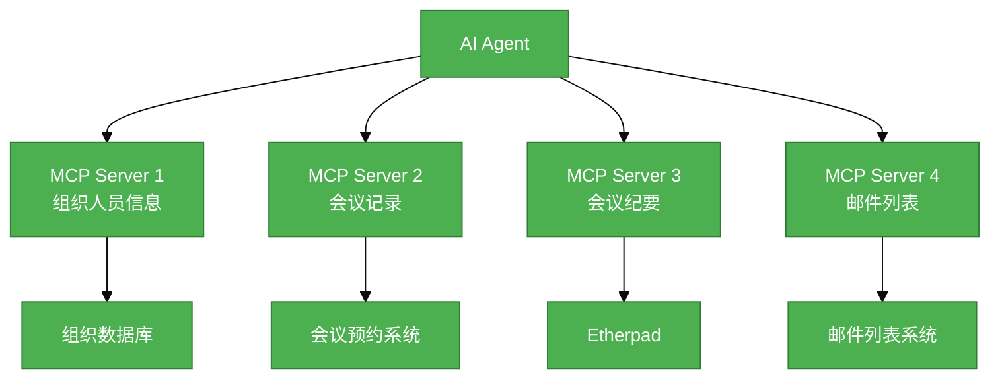

# #108 数据中台社区会议信息MCP Server需求分析说明书

## 1. 基础信息

* **需求链接**: https://github.com/opensourceways/backlog/issues/108
* **需求名称**: 数据中台社区会议信息MCP Server开发
* **开发责任人**: **Kaede10**

---

## 2. 需求场景说明

> 描述"在什么情况下，为了解决什么问题，用户需要做什么"。

**场景说明:** 基础设施团队需要为AI Agent提供统一的数据访问接口，通过MCP Server暴露组织人员信息、会议记录、会议纪要和邮件列表等数据，使AI Agent能够自动查询和分析社区运作数据。

## 3 需求验收标准

> 明确需求完成的标志，必须是可量化、可测试的。

**验收标准:**

- 4个MCP Server全部部署成功，所有Tool可正常调用
- 组织人员信息MCP Server的5个Tool返回数据格式符合规范，支持按组织类型查询
- 会议记录MCP Server的3个Tool能够准确查询会议预约和出席情况
- 会议纪要MCP Server的3个Tool能够获取pad内容
- 邮件列表MCP Server的3个Tool能够搜索邮件并获取邮件详情

---

## 4. 需求设计与分解

> 说明：基于初步方案，将需求拆解为可实施的原子Task。后续的流程判定将严格依据这些Task的影响范围进行。

### 4.1 核心逻辑方案

> 简述实现逻辑（如：数据流向、模块改动、新增配置项等），作为任务拆解的理论依据。推荐使用Mermaid图表展示流程，支持GitHub原生渲染。

**逻辑方案:** 基于MCP协议开发4个独立的Server，每个Server对接一个数据源，通过Tool和Resource接口向AI Agent暴露数据查询能力。数据源包括社区组织数据库、会议预约系统、Etherpad和邮件列表系统。

**流程图示例（使用Mermaid）：**

### 4.2 任务清单

**任务清单:**

| 任务 ID              | 任务描述 (Task Description)            | 预期产出 (Deliverables) | 预期工作量（人天）    |
|--------------------|------------------------------------|---------------------|--------------|
| **task1 #108-1** | 实现组织人员信息与运作规则MCP Server（5个Tool） | MCP Server代码 + 接口文档 | **5** |
| **task2 #108-2** | 实现会议记录和会议纪要MCP Server（6个Tool） | MCP Server代码 + 接口文档 | **5** |
| **task3 #108-3** | 实现邮件列表MCP Server（3个Tool） | MCP Server代码 + 接口文档 | **5** |

---

## 5. 需求相关性分析

> **操作说明**：根据上述拆解出的Task，识别其变更行为。任何一项勾选为"是"：打上对应issue标签，必须执行对应的流程门禁。全部未勾选：该需求自动判定为轻量化特性，打上need_light标签。

### A. 安全相关性分析

> 若涉及以下任一项，打标 `need_security`标签，PR 必须关联特性issue的架构设计文档（含安全设计部分）**如勾选需要给出原因**。

**[已完成]**

* [ ] **边界变更**：新增公网端口、修改防火墙规则、变更网关配置。
* [ ] **凭证处理**：涉及密钥（Secret/Key）、Token、证书的存储或分发。
* [ ] **权限调整**：修改权限模型、服务账号（SA）权限或鉴权逻辑。
* [ ] **供应链**：引入新的第三方二进制文件、SDK 或重大版本依赖升级。
* [ ] **隐私风险评估**：涉及用户个人数据（Email、手机号、IP、邮箱 等）的处理。
* [ ] **AI使用**：涉及AIGC能力应用，并提供服务。

### B. 架构设计相关性分析

> 若涉及以下任一项，打标 `need_design`标签，PR 必须关联特性issue的架构设计文档。 **如勾选需要给出原因**。

**[已完成]**

* [x] A环节判定需要完成安全设计
* [ ] 改变了现有系统的物理/逻辑拓扑
* [x] 新增或大幅修改对外暴露的 API/CLI 接口
* [x] 引入了新的中间件、数据库或三方核心组件 **[勾选必填]**_原因：引入了MCP Server框架，需要4个独立的MCP Server实例_

### C. 系统集成测试相关性分析

> *若涉及以下任一项，打标 `need_itest`标签，PR必须关联特性issue的测试策略和测试报告文档。 **如勾选需要给出原因**。

**[已完成]**

* [x] 上述环节判定需要执行安全设计或架构设计。
* [ ] **跨组件影响**：变更会触发下游服务或关联系统的连锁反应（级联效应）。
* [ ] **核心组件管控**：含项目定级为 Core 的核心逻辑变更。
* [ ] **环境强依赖**：功能高度依赖内核参数、网络拓扑或特定的物理挂载。
* [x] **端到端流程**：涉及从用户输入到持久化存储的全链路逻辑。

### D. 用户体验相关性分析

> 若涉及以下任一项，打标 `need_ux`标签，PR必须关联特性issue的用户体验体验设计文档。 **如勾选需要给出原因**。

**[已完成]**

* [ ] **交互逻辑变更**：涉及 Web 门户、控制台（Dashboard）或命令行工具（CLI）的交互流程调整。
* [ ] **感知性能变动**：变更可能显著影响页面的加载时间、同步请求的响应时延或异步任务的进度反馈。
* [ ] **文档与辅助能力**：涉及报错提示语、帮助中心链接、FAQ 或新功能的 Runbook 说明。
* [ ] **无障碍与多语种**：涉及国际化（i18n）支持、辅助功能或不同终端（移动端/桌面端）的适配。

### 5.1 需求相关性分析汇总结果

**[已完成]**

* [ ] need_security (需架构设计（含安全威胁分析和安全设计）)
* [x] need_design (需架构设计)
* [x] need_itest (需执行测试策略设计和全链路集成测试)
* [ ] need_ux (需架构设计（含UX设计))
* [ ] need_light (上述均未勾选，走快速合入通道)

---

## 6. 价值识别与业务评估

> **判定准则**：基础设施接纳需求必须具备明确的 ROI（投资回报比）或合规必要性。

| 维度        | 评估问题                            | 结论/说明               |
|-----------|---------------------------------|---------------------|
| **范围判定**  | 该需求是否属于基础设施范围内？                 | **是**   |
| **规划一致性** | 该需求是否是否在年度技术规划中？                | **是**   | 
| **优先级**   | 该需求优先级评估（高/中/低）？                | **高** | 
| **通用性**   | 该需求是否解决 3 个以上业务方的共性痛点？          | **是**   |
| **必要性**   | 现有组件通过配置变更是否无法实现目标或没有不用开发的替代方案？ | **是**   | 
| **工作量**   | 预计总工作量 **15** 人天？        | **15 人天**  | 
| **价值评估**  | 实现后能减少多少手动操作或提升多少系统稳定性？         | **为AI Agent提供统一数据访问能力，支持自动化社区运作分析**  |

> **状态定义：** **Accept (准入)** | **Reject (驳回)** |  **Pending (待议)**

**建议结论**： **Accept**

**原因描述:** 该需求通过MCP Server为AI Agent提供统一的数据访问接口，使AI Agent能够自动查询和分析社区运作数据，支持自动化社区治理，符合基础设施团队的技术演进方向。

---
