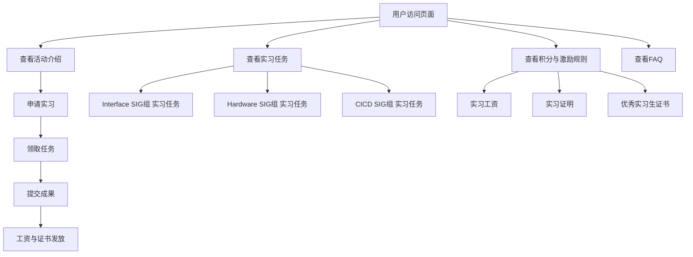
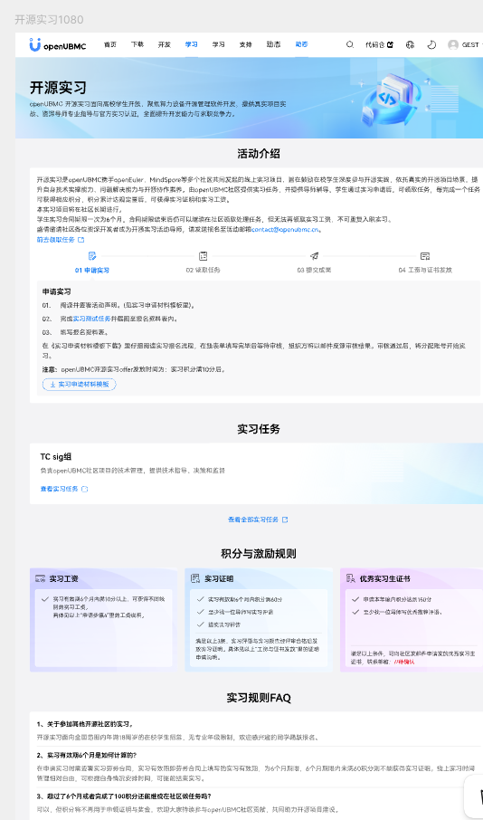
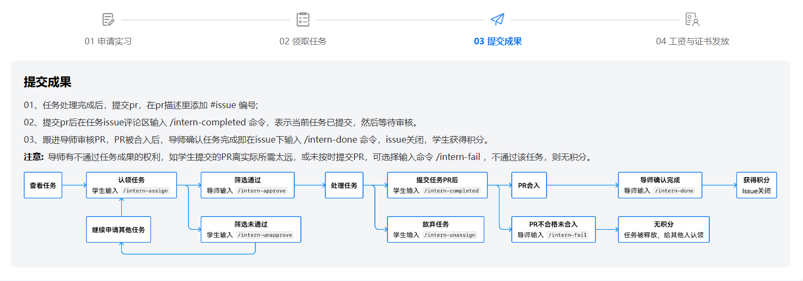
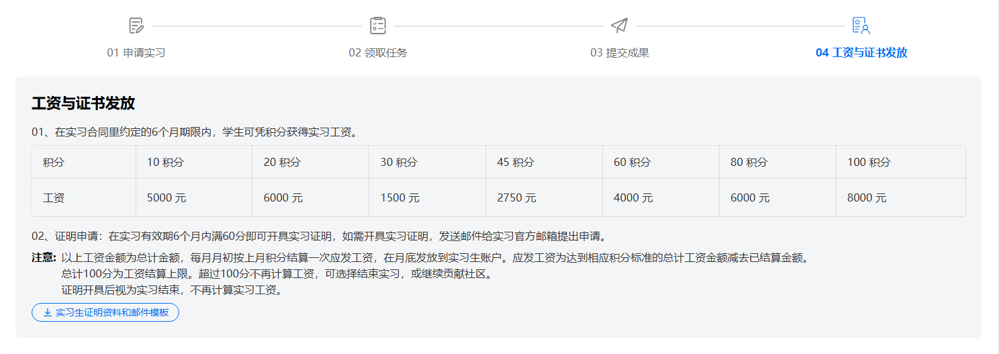
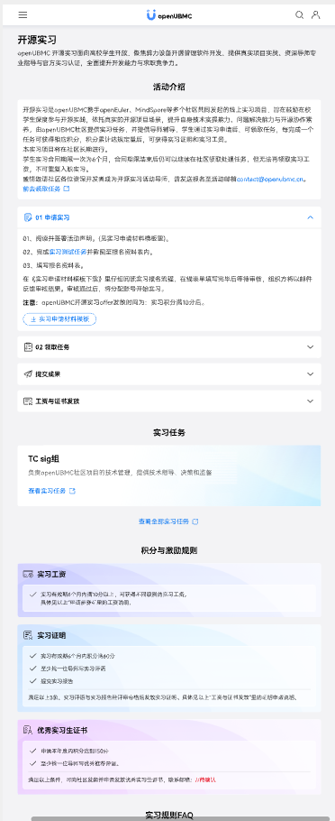

# #111 openUBMC 新增开源实习页面架构设计说明书 (Architecture Design Document)
---

## 1. 基础信息

* **需求链接**: https://github.com/opensourceways/backlog/issues/111
* **需求名称**: openUBMC 新增开源实习页面
* **开发责任人**: sky-winter
* **设计目标**: 为openUBMC社区新增开源实习页面，展示实习活动介绍、实习任务、积分与激励规则、FAQ等内容，提供完整的实习申请与任务参与流程。

---

## 2. 功能设计

> **说明**：描述系统的组件构成、职责划分及交互逻辑。

### 2.1 架构图
* openUBMC 新增开源实习页面

**设计说明/归档：**
开源实习页面采用模块化设计，包含以下核心模块：
1. **活动介绍模块**：展示实习项目背景、目的和参与方式
2. **申请流程模块**：展示申请实习→领取任务→提交成果→工资与证书发放的完整流程
3. **实习任务模块**：展示各SIG组（Interface SIG组、Hardware SIG组、CICD SIG组）的实习任务
4. **积分与激励规则模块**：展示实习工资、实习证明、优秀实习生证书的获取条件
5. **FAQ模块**：解答实习相关常见问题

### 2.2 数据流图

### 2.3 组件职责与接口

**设计说明/归档：**
* 接口信息
静态页面不涉及接口交互，仅展示静态内容。
### 2.4 UX设计

> 设计目标：确保功能不仅“可用”，而且“好用”，降低开发者的认知负担和运维人员的误操作风险。

**设计说明/归档：**

#### 页面布局设计  
ubmc开源实习页面高保真如下：  
  
申请实习步骤如下：  
1、申请实习，点击链接可以查看实习任务，点击下载实习申请材料模板，可进行模板下载  
  
2、领取任务，点击实习任务模板领取邮件模板按钮，下载实习任务邮件模板  
 
3、点击提交成果，可查看成果信息

4、工资与证书发放，点击实习生证明材料和邮件模板，可下载对应文件

移动端，整体页面如下：  

### 2.5 SOD设计
> 设计目标：通过维护SOD权限设计文档，确保权限设计可审计、可复用、可跨服务重用。
**不涉及需要说明原因** 不涉及SOD权限设计

**设计说明/归档：** 不涉及权限设计

### 2.6 功能设计分解TASK清单

**任务清单:**

| 任务 ID     | 可服务性任务描述   | 责任人                      |
|-----------|------------|--------------------------|
| **TASK** | openUBMC 新增开源实习页面 | sky-winter                  |

---
