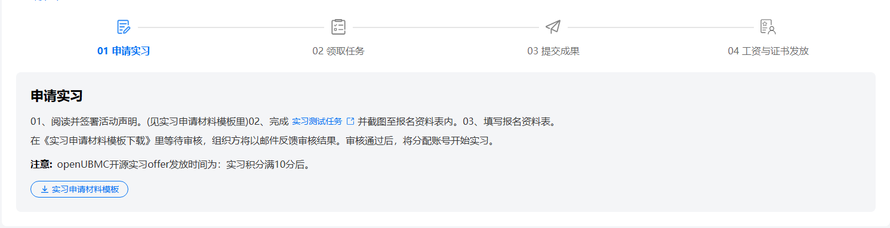
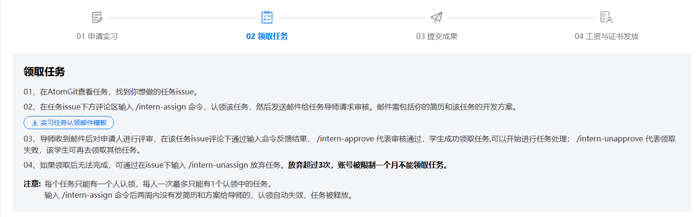

# #111 openUBMC 新增开源实习页面

## 1. 基础信息

- **需求链接**: <https://github.com/opensourceways/backlog/issues/111>
- **需求名称**: openUBMC 新增开源实习页面
- **开发责任人**: sky-winter

***

## 2. 需求场景说明

> 描述“在什么情况下，为了解决什么问题，用户需要做什么”。

**场景说明:**

- 用户访问开源实习页面，了解实习项目背景和活动介绍
- 用户通过四步流程申请实习：申请实习 → 领取任务 → 提交成果 → 工资与证书发放
- 用户浏览各SIG组（Interface SIG组、Hardware SIG组、CICD SIG组）的实习任务
- 用户查看积分与激励规则，了解实习工资、实习证明、优秀实习生证书的获取条件
- 用户查看FAQ，了解实习相关常见问题解答

## 3 需求验收标准

> 明确需求完成的标志，必须是可量化、可测试的。

**验收标准:**

- 页面头部banner区域展示"开源实习"标题和描述信息
- 活动介绍模块展示完整的实习项目介绍和联系方式
- 申请流程模块展示四步流程：申请实习 → 领取任务 → 提交成果 → 工资与证书发放
- 实习任务模块展示三个SIG组卡片：Interface SIG组、Hardware SIG组、CICD SIG组
- 积分与激励规则模块展示三个卡片：实习工资、实习证明、优秀实习生证书及获取条件
- FAQ模块展示至少3个常见问题及解答
- 页面支持不同分辨率适配，移动端友好
- 头部导航与官网保持一致，学习模块，增加开源实习导航项

***

## 4. 需求设计与分解

> 说明：基于初步方案，将需求拆解为可实施的原子 Task。后续的流程判定将严格依据这些 Task 的影响范围进行。

### 4.1 核心逻辑方案

> 简述实现逻辑（如：数据流向、模块改动、新增配置项等），作为任务拆解的理论依据。图片文字形式不限。

**逻辑方案:**

- 页面采用模块化设计，包含以下核心模块：
  1. Banner区域：展示开源实习标题和简介
  2. 活动介绍模块：展示实习项目背景和参与方式
  3. 申请流程模块：展示四步流程（申请实习→领取任务→提交成果→工资与证书发放）
  4. 实习任务模块：展示各SIG组任务卡片
  5. 积分与激励规则模块：展示实习工资、实习证明、优秀实习生证书获取条件
  6. FAQ模块：展示常见问题解答
  7. 导航栏：展示页面导航链接，与官网保持一致,学习模块，增加开源实习导航项  
     ubmc开源实习页面高保真如下：  
       
     申请实习步骤如下：  
     1、申请实习，点击链接可以查看实习任务，点击下载实习申请材料模板，可进行模板下载  
       
     2、领取任务，点击实习任务模板领取邮件模板按钮，下载实习任务邮件模板  
     
     3、点击提交成果，可查看成果信息
     
     4、工资与证书发放，点击实习生证明材料和邮件模板，可下载对应文件
     
     移动端，整体页面如下：  
     

### 4.2 任务清单

**任务清单:**

| 任务 ID    | 任务描述 (Task Description) | 预期产出 (Deliverables) | 预期工作量（人天） |
| -------- | ----------------------- | ------------------- | --------- |
| **task** | openubmc 增加开源实习页面       | openubmc 增加开源实习页面代码 | 7         |

***

## 5. 需求相关性分析

> **操作说明**：根据上述拆解出的 Task，识别其变更行为。任何一项勾选为“是”：打上对应issue标签，必须执行对应的流程门禁。全部未勾选：该需求自动判定为轻量化特性，打上need\_light标签。

### A. 安全相关性分析

> \*若涉及以下任一项，打标 `need_security`标签，PR 必须关联特性issue的架构设计文档（含安全设计部分）**如勾选需要给出原因**。

- [ ] **边界变更**：新增公网端口、修改防火墙规则、变更网关配置。
- [ ] **凭证处理**：涉及密钥（Secret/Key）、Token、证书的存储或分发。
- [ ] **权限调整**：修改权限模型、服务账号（SA）权限或鉴权逻辑。  
- [ ] **供应链**：引入新的第三方二进制文件、SDK 或重大版本依赖升级。
- [ ] **隐私风险评估**：涉及用户个人数据（Email、手机号、IP、邮箱 等）的处理。
- [ ] **AI使用**：涉及AIGC能力应用，并提供服务。

### B. 架构设计相关性分析

> \*若涉及以下任一项，打标 `need_design`标签，PR 必须关联特性issue的架构设计文档。 **如勾选需要给出原因**。

- [ ] A环节判定需要完成安全设计
- [ ] 改变了现有系统的物理/逻辑拓扑
- [ ] 新增或大幅修改对外暴露的 API/CLI 接口
- [ ] 引入了新的中间件、数据库或三方核心组件

### C. 系统集成测试相关性分析

> \*若涉及以下任一项，打标 `need_itest`标签，PR必须关联特性issue的测试策略和测试报告文档。 **如勾选需要给出原因**。

- [ ] 上述环节判定需要执行安全设计或架构设计。
- [ ] **跨组件影响**：变更会触发下游服务或关联系统的连锁反应（级联效应）。
- [ ] **核心组件管控**：含项目定级为 Core 的核心逻辑变更。
- [ ] **环境强依赖**：功能高度依赖内核参数、网络拓扑或特定的物理挂载。
- [ ] **端到端流程**：涉及从用户输入到持久化存储的全链路逻辑。

### D. 用户体验相关性分析

> \*若涉及以下任一项，打标 `need_ux`标签，PR必须关联特性issue的用户体验设计文档。 **如勾选需要给出原因**。

- [ ] **交互逻辑变更**：涉及 Web 门户、控制台（Dashboard）或命令行工具（CLI）的交互流程调整。
- [ ] **感知性能变动**：变更可能显著影响页面的加载时间、同步请求的响应时延或异步任务的进度反馈。
- [ ] **文档与辅助能力**：涉及报错提示语、帮助中心链接、FAQ 或新功能的 Runbook 说明。
- [x] **无障碍与多语种**：涉及国际化（i18n）支持、辅助功能或不同终端（移动端/桌面端）的适配。  
  原因： 新增开源实习功能，支持多分辨率适配，页面布局需要考虑不同终端的显示效果。

### 5.1 需求相关性分析汇总结果

- [ ] need_security (需架构设计（含安全威胁分析和安全设计）)
- [ ] need_design (需架构设计)
- [ ] need_itest (需执行测试策略设计和全链路集成测试)
- [x] need_ux (需架构设计（含UX设计)）
- [ ] need_light (上述均未勾选，走快速合入通道)

***

## 6. 价值识别与业务评估

> **判定准则**：基础设施接纳需求必须具备明确的 ROI（投资回报比）或合规必要性。

| 维度        | 评估问题                            | 结论/说明    |
| --------- | ------------------------------- | -------- |
| **范围判定**  | 该需求是否属于基础设施范围内？                 | 是        |
| **规划一致性** | 该需求是否是否在年度技术规划中？                | 是        |
| **优先级**   | 该需求优先级评估（高/中/低）？                | 高        |
| **通用性**   | 该需求是否解决 3 个以上业务方的共性痛点？          | 是        |
| **必要性**   | 现有组件通过配置变更是否无法实现目标或没有不用开发的替代方案？ | 是        |
| **工作量**   | 预计总工作量xx 人天？                    | 7 人天     |
| **价值评估**  | 实现后能减少多少手动操作或提升多少系统稳定性？         | 增加开源实习功能 |

> **状态定义：** **Accept (准入)** | **Reject (驳回)** |  **Pending (待议)**

**建议结论**： Accepted

**原因描述:**  增加开源实习功能

***

