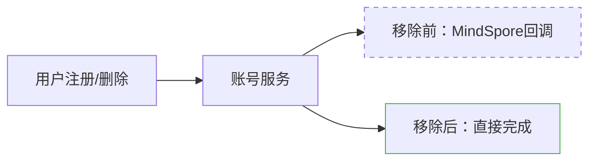

# #114 MinsdSpore-移除MindSpore用户名回调 需求分析说明书

## 1. 基础信息

* **需求链接**: https://github.com/opensourceways/backlog/issues/114
* **需求名称**: MinsdSpore-移除MindSpore用户名回调
* **开发责任人**: Zherphy

---

## 2. 需求场景说明

> 描述"在什么情况下，为了解决什么问题，用户需要做什么"。

**场景说明:** 当前账号系统在用户注册或删除账号时，会向 MindSpore 服务发送回调通知。由于 MindSpore 服务已不再需要该集成，继续保留回调代码会引入不必要的外部依赖和维护成本。本次任务需移除账号生命周期（注册/删除）中对 MindSpore 服务的全部回调逻辑及相关配置。

**范围边界:**
- **在范围内**：移除账号注册、删除事件触发的 MindSpore 回调代码及配置
- **不在范围内**：MindSpore 服务侧的数据清理、其他服务的 MindSpore 集成

## 3 需求验收标准

> 明确需求完成的标志，必须是可量化、可测试的。

**验收标准:**

- 账号注册流程完成后，不再产生对 MindSpore 服务的回调请求（通过网络抓包或日志确认）
- 账号删除流程完成后，不再产生对 MindSpore 服务的回调请求（通过网络抓包或日志确认）
- 相关 MindSpore 配置项（服务端点、认证信息等）已从配置文件中清除
- 移除后账号注册、删除功能无回归缺陷（现有功能测试通过）

---

## 4. 需求设计与分解

> 说明：基于初步方案，将需求拆解为可实施的原子 Task。后续的流程判定将严格依据这些 Task 的影响范围进行。

### 4.1 核心逻辑方案

> 简述实现逻辑（如：数据流向、模块改动、新增配置项等），作为任务拆解的理论依据。推荐使用Mermaid图表展示流程，支持GitHub原生渲染。

**逻辑方案:** 在账号服务（account service）中定位用户注册和删除事件触发 MindSpore 回调的代码路径，删除对应的回调调用及相关业务逻辑。同步清理配置文件中 MindSpore 服务的端点地址和认证配置。移除后验证注册/删除端到端流程正常，无外部调用残留。

### 4.2 任务清单

**任务清单:**

| 任务 ID | 任务描述 (Task Description) | 预期产出 (Deliverables) | 预期工作量（人天） |
|---------|---------------------------|----------------------|----------------|
| **TASK1** | 移除账号注册/删除流程中对 MindSpore 服务的回调调用代码（含单元测试回归） | 清理后的代码、测试通过截图 | 1.5 |
| **TASK2** | 清理 MindSpore 服务相关配置项（端点地址、认证凭据等） | 清理后的配置文件 | 0.5 |

**预计总工作量**: 2 人天

---

## 5. 需求相关性分析

> **操作说明**：根据上述拆解出的 Task，识别其变更行为。任何一项勾选为"是"：打上对应issue标签，必须执行对应的流程门禁。全部未勾选：该需求自动判定为轻量化特性，打上need_light标签。

### A. 安全相关性分析

> 若涉及以下任一项，打标 `need_security`标签，PR 必须关联特性issue的架构设计文档（含安全设计部分）**如勾选需要给出原因**。

* [ ] **边界变更**：新增公网端口、修改防火墙规则、变更网关配置。
* [ ] **凭证处理**：涉及密钥（Secret/Key）、Token、证书的存储或分发。
* [ ] **权限调整**：修改权限模型、服务账号（SA）权限或鉴权逻辑。
* [ ] **供应链**：引入新的第三方二进制文件、SDK 或重大版本依赖升级。
* [ ] **隐私风险评估**：涉及用户个人数据（Email、手机号、IP、邮箱 等）的处理。
* [ ] **AI使用**：涉及AIGC能力应用，并提供服务。

### B. 架构设计相关性分析

> 若涉及以下任一项，打标 `need_design`标签，PR 必须关联特性issue的架构设计文档。 **如勾选需要给出原因**。

* [ ] A环节判定需要完成安全设计
* [ ] 改变了现有系统的物理/逻辑拓扑
* [ ] 新增或大幅修改对外暴露的 API/CLI 接口
* [ ] 引入了新的中间件、数据库或三方核心组件

### C. 系统集成测试相关性分析

> *若涉及以下任一项，打标 `need_itest`标签，PR必须关联特性issue的测试策略和测试报告文档。 **如勾选需要给出原因**。

* [ ] 上述环节判定需要执行安全设计或架构设计。
* [ ] **跨组件影响**：变更会触发下游服务或关联系统的连锁反应（级联效应）。
* [ ] **核心组件管控**：含项目定级为 Core 的核心逻辑变更。
* [ ] **环境强依赖**：功能高度依赖内核参数、网络拓扑或特定的物理挂载。
* [ ] **端到端流程**：涉及从用户输入到持久化存储的全链路逻辑。

### D. 用户体验相关性分析

> 若涉及以下任一项，打标 `need_ux`标签，PR必须关联特性issue的用户体验设计文档。 **如勾选需要给出原因**。

* [ ] **交互逻辑变更**：涉及 Web 门户、控制台（Dashboard）或命令行工具（CLI）的交互流程调整。
* [ ] **感知性能变动**：变更可能显著影响页面的加载时间、同步请求的响应时延或异步任务的进度反馈。
* [ ] **文档与辅助能力**：涉及报错提示语、帮助中心链接、FAQ 或新功能的 Runbook 说明。
* [ ] **无障碍与多语种**：涉及国际化（i18n）支持、辅助功能或不同终端（移动端/桌面端）的适配。

### 5.1 需求相关性分析汇总结果

* [ ] need_security (需架构设计（含安全威胁分析和安全设计）)
* [ ] need_design (需架构设计)
* [ ] need_itest (需执行测试策略设计和全链路集成测试)
* [ ] need_ux (需架构设计（含UX设计)）
* [x] need_light (上述均未勾选，走快速合入通道)

---

## 6. 价值识别与业务评估

> **判定准则**：基础设施接纳需求必须具备明确的 ROI（投资回报比）或合规必要性。

| 维度        | 评估问题                            | 结论/说明 |
|-----------|---------------------------------|-------|
| **范围判定**  | 该需求是否属于基础设施范围内？                 | 是，账号管理服务是基础设施核心组件 |
| **规划一致性** | 该需求是否是否在年度技术规划中？                | 是，MindSpore 集成下线属于技术债务清理 |
| **优先级**   | 该需求优先级评估（高/中/低）？                | 中（与 Issue 标注一致） |
| **通用性**   | 该需求是否解决 3 个以上业务方的共性痛点？          | 否，特定于 MindSpore 集成清理 |
| **必要性**   | 现有组件通过配置变更是否无法实现目标或没有不用开发的替代方案？ | 是，需要修改代码才能移除回调逻辑 |
| **工作量**   | 预计总工作量？        | 2 人天 |
| **价值评估**  | 实现后能减少多少手动操作或提升多少系统稳定性？         | 移除废弃集成，消除对 MindSpore 服务的外部依赖，降低故障传播风险 |

> **状态定义：** **Accept (准入)** | **Reject (驳回)** |  **Pending (待议)**

**建议结论**： **Accept**

**原因描述:** 清理废弃的 MindSpore 回调集成，消除不必要的外部服务依赖，减少系统冗余代码，降低因 MindSpore 服务不可用导致账号流程受阻的潜在风险。

---
