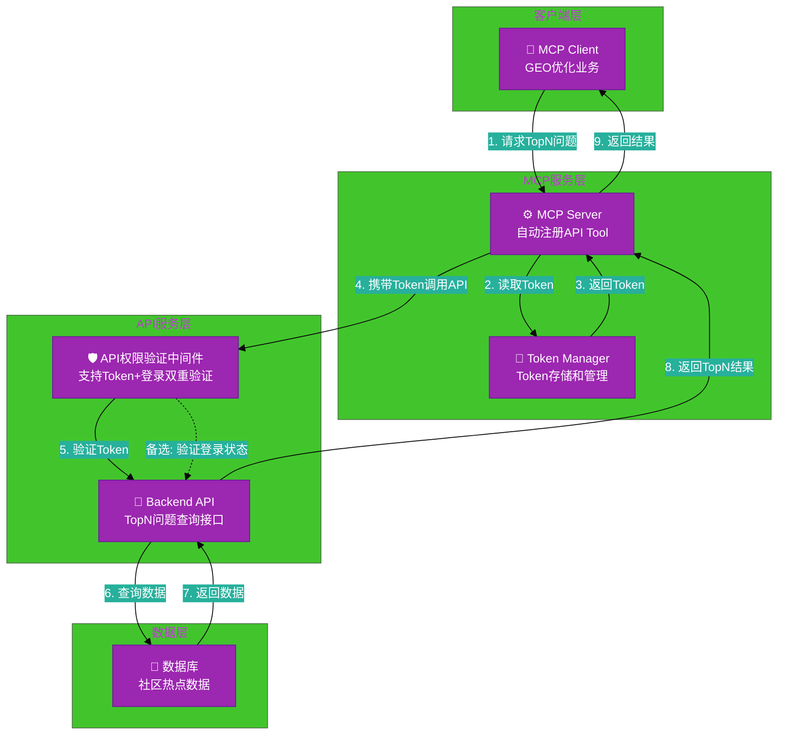
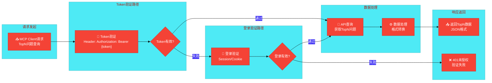
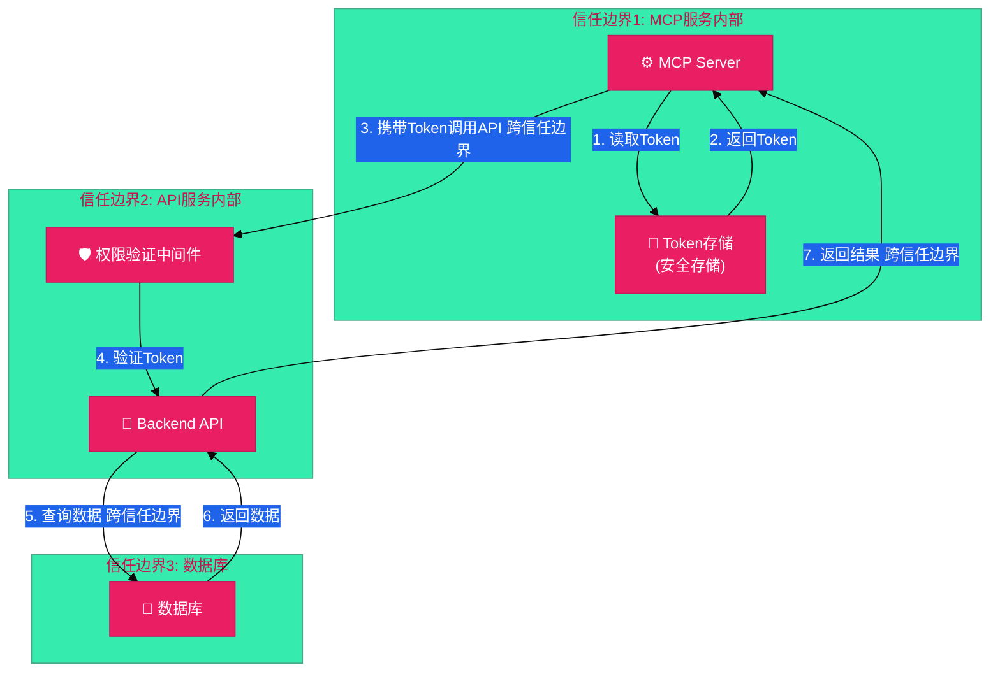

# #133 社区热点管理MCP集成 架构设计说明书 (Architecture Design Document)
---

## 1. 基础信息

* **需求链接**: https://github.com/opensourceways/backlog/issues/133
* **需求名称**: 社区热点管理MCP集成_支持GEO优化获取TopN热点问题
* **开发责任人**: Kaede10
* **设计目标**: 通过修改API权限验证中间件支持Token和登录双重验证，配置MCP服务携带Token调用API，实现MCP自动获取TopN热点问题数据。

---

## 2. 功能设计

> **说明**：描述系统的组件构成、职责划分及交互逻辑。

### 2.1 架构图

> 此处建议插入架构拓扑系统组件图或时序图，描述组件间的交互关系。推荐使用Mermaid实现，可代码化，GitHub可渲染。
> **不涉及需要说明原因**

**设计说明/归档:** 本架构图展示了MCP集成后的系统组件关系，包括MCP Client、MCP Server、API权限验证中间件和后端服务之间的交互。

**架构图示例（使用Mermaid）：**



**说明：**
- 推荐使用Graph展示系统组件和依赖关系
- 使用subgraph分组相关组件
- 使用emoji增强可读性
- 标注通信协议和数据流向

### 2.2 数据流图

> 此处建议插入数据流图，描述核心业务数据的生命周期，即威胁建模的基础。推荐使用Mermaid实现，可代码化，GitHub可渲染。
> **不涉及需要说明原因**

**设计说明/归档:** 本数据流图展示了从MCP Client请求到返回TopN问题数据的完整数据流，包括Token验证和登录验证两个路径。

**数据流图示例（使用Mermaid）：**



**说明：**
- 推荐使用DFD展示数据流向和处理步骤
- 标注数据在各阶段的转换和处理
- 识别数据的来源、处理、存储和输出
- 为威胁建模和安全设计提供基础

### 2.3 组件职责与接口

> 列出新增/修改的组件及其定义的 API 规范。**不涉及需要说明原因**

**设计说明/归档:** 本需求主要修改API权限验证中间件和新增MCP Token管理逻辑。

**组件职责表：**

| 组件名称 | 职责 | 输入 | 输出 | 接口/方法 |
|---------|------|------|------|----------|
| **API权限验证中间件** | 支持Token和登录双重验证，任一通过即放行 | HTTP请求（Header/Session） | 验证结果（通过/拒绝） | `verifyAuth(request)` |
| **Token Manager** | 管理MCP调用API所需的Token，支持读取 | Token标识 | Token值 | `getToken()` |
| **MCP Server** | 自动注册API Tool，调用API时携带Token | API文档、Token | API响应 | `registerTool(apiDoc)`, `callAPI(api, token)` |

**关键接口设计：**

1. **Token管理接口**
    ```python
    def get_mcp_token():
        # 从安全存储读取MCP Token
        return secure_store.get('MCP_API_TOKEN')
    ```

### 2.4 UX设计

> 设计目标：确保功能不仅"可用"，而且"好用"，降低开发者的认知负担和运维人员的误操作风险。 **不涉及需要说明原因**

**设计说明/归档:** 不涉及，本需求为后端API和MCP集成，无用户界面交互。

### 2.5 SOD设计

> 设计目标：通过维护SOD权限设计文档，确保权限设计可审计、可复用、可跨服务重用。 SOD权限设计参考[XX SOD权限设计.md](XX%20SOD%E6%9D%83%E9%99%90%E8%AE%BE%E8%AE%A1.md)
> 
>**不涉及需要说明原因**
>
>**需要说明文档位置**

**设计说明/归档:** 不涉及，本需求不涉及职责分离（SOD）场景。

### 2.6 功能设计分解TASK清单

**设计说明/归档:** 基于需求分析，将功能拆解为2个主要任务。

**任务清单:**

| 任务 ID             | 功能任务描述                                    | 责任人    |
|-------------------|---------------------------------------------|--------|
| **TASK1** | **修改API权限验证中间件，支持Token和登录双重验证（OR逻辑）** | Kaede10 |
| **TASK2** | **实现MCP Token管理逻辑，配置MCP服务调用API时携带Token** | Kaede10 |

---

## 3. 非功能设计

### 3.1 安全与隐私设计评估和设计

> **注意**：仅当需求判定为 **`need_security`** 时，本章节为必填项。 **无该标签可删除了本章节。**

> 关注点：防御能力与合规边界。

### 3.1.1 威胁分析 (Threat Modeling)

> 基于 **STRIDE** 或类似模型，识别本项目可能面临的安全威胁。推荐使用Mermaid绘制DFD数据流图和信任边界，展示系统的安全边界和数据流向。
> **建议归档服务模块设计图，后续需要可增量复用（导入设计文件到工具中即可复用增量设计）。**

**设计说明/归档:** 本威胁分析基于STRIDE模型，识别Token验证、权限控制、数据传输等环节的安全威胁。

**威胁建模图示例（使用Mermaid DFD）：**



**说明：**
- 使用subgraph标注信任边界
- 标注跨越信任边界的数据流
- 识别高风险的数据流向
- 为STRIDE威胁分析提供基础

**威胁分析表：**

| 威胁类别      | 攻击场景描述 (Scenario)                     | 风险等级/评分 | 对应减缓措施 (Mitigation)     |
|-----------|---------------------------------------|---------|-------------------------|
| **信息泄露**  | Token在传输过程中被窃听，攻击者获取API访问权限 | 高       | 使用HTTPS/TLS 1.2+加密传输，Token不记录在日志中 |
| **信息泄露**  | Token存储在明文配置文件中，被未授权访问者读取 | 高       | Token存储在安全存储（Secret/Vault）中，设置严格权限 |
| **篡改/伪造**  | 攻击者伪造Token绕过验证，非法访问API | 高       | Token由API服务端管理，仅MCP服务持有，防止泄露 |
| **权限提升**  | Token权限过高，可访问超出MCP需要的API | 中       | 实施最小权限原则，Token仅授权访问TopN问题查询接口 |
| **拒绝服务**  | 攻击者大量发送无效Token请求，耗尽API资源 | 中       | 实施Token验证缓存，设置请求限流 |
| **隐私泄露**  | 日志中记录了完整的Token或敏感数据 | 中       | 实现日志脱敏，Token和敏感字段不记录或仅记录部分掩码 |

**参考资料：**
- 详见《架构设计说明书编写经验》第8章：威胁建模中的信任边界设计
- 详见《架构设计说明书编写经验》第16-20章：Mermaid图表应用指南

### 3.1.2 安全设计实现 (Security Mechanisms)

**安全设计实现：**

* **凭证管理**：
  - Token存储在安全存储（Kubernetes Secret/Vault）中，严禁硬编码
  - Token设置过期时间，建议定期轮转（如每90天）
  - MCP服务启动时从安全存储读取Token，运行时驻留在内存中

* **身份认证与授权**：
  - API权限验证中间件支持Token和登录双重验证（OR逻辑）
  - Token由API服务端管理，仅MCP服务持有，防止泄露
  - 实施最小权限原则，Token仅授权访问TopN问题查询接口
  - 验证失败返回401未授权，不泄露具体错误信息

* **数据安全**：
  - MCP调用API时使用HTTPS/TLS 1.2+加密传输
  - Token在HTTP Header中传输（Authorization: Bearer {token}）
  - API响应数据不包含敏感信息，仅返回TopN问题元数据

* **运行时隔离**：
  - MCP服务以非Root用户运行
  - Token存储在安全存储中，容器内仅可读
  - 限制MCP服务的网络访问权限，仅允许访问目标API

* **日志审计**：
  - 实现日志脱敏，Token不记录在日志中或仅记录部分掩码（如：`sk-****abcd`）
  - 记录API调用审计日志，包含：时间戳、调用方、API端点、结果状态
  - 验证失败事件记录安全日志，便于安全审计

**设计说明/归档:** 本安全设计针对Token管理和API权限验证，实施最小权限原则、加密传输、日志脱敏等安全措施。

### 3.1.3 安全任务分解 (Security Task Breakdown)

> 将安全设计转化为具体的开发任务，需在代码或后续开发流程的安全配置中落实。

**任务清单:**

| 任务 ID              | 安全任务描述 (Security Tasks)                         | 责任人 |
|--------------------|-------------------------------------------------|-----|
| **SEC-TASK1**  | **实现Token安全存储逻辑，从Kubernetes Secret/Vault读取Token** | Kaede10 |
| **SEC-TASK2**  | **修改API权限验证中间件，支持Token和登录双重验证（OR逻辑）** | Kaede10 |
| **SEC-TASK3**  | **实现日志脱敏，Token和敏感字段不记录或仅记录部分掩码** | Kaede10 |
| **SEC-TASK4**  | **配置MCP服务调用API时携带Token，确保HTTPS传输** | Kaede10 |
| **SEC-TASK5**  | **添加API调用审计日志，记录时间戳、调用方、API端点、结果状态** | Kaede10 |

### 3.2 可靠性与韧性设计评估和设计（可选）

> **注意**：根据项目定级决定，含Core、Critical服务变更需要完成

> **关注点**：极端情况下的生存与恢复能力。
> **参考：**
> * 面向失败设计：是否识别了强依赖风险？当游依赖失效时，本服务是否具备降级或熔断能力？
> * 重试与避让：重试逻辑中是否包含指数退避和随机抖动以防止请求风暴？
> * 熔断限流：核心接口是否定义了明确的限流阈值？是否实现了断路器模式以保护下游？
> * 幂等设计：所有涉及写操作的任务是否支持重复调用而无副作用？

**设计说明/归档:** 不涉及，本需求为API权限验证和MCP集成，不涉及高可用或容灾设计。

**任务清单:**

| 任务 ID             | 可靠性与韧性任务描述                         | 责任人 |
|-------------------|------------------------------------|-----|
| - | - | - |

---

### 3.3 可服务性与可观测性评估和设计（可选）

> **关注点**：排障效率与全生命周期管理，确保故障可感知、可定位、可修复。

> **参考：**
>* 排障文档：是否提供了错误码对照表及对应的排障步骤？
>* 健康诊断：是否提供 /health 或 /status 接口，展示系统内部子模块的状态？
>* 平滑变更：升级或配置变更时如何实现灰度发布？是否具备一键回滚的判定指标？
>* 黄金指标覆盖：是否已定义并暴露出延迟、错误、流量和饱和度指标？


**设计说明/归档:** 不涉及，本需求为后端API和MCP集成，不涉及长驻服务的可观测性设计。

**任务清单:**

| 任务 ID             | 可服务性任务描述                                    | 责任人    |
|-------------------|---------------------------------------------|--------|
| - | - | - |

---

### 3.4 性能与伸缩性评估和设计（可选）

> **关注点**：社区生态兼容性与未来扩展。

> **参考：**
> * 并发模型：在高并发场景下，锁竞争、连接池和线程池的配置是否已评估？
> * 水平扩展：服务是否实现了完全无状态化，支持快速扩容？
> * 延迟评估：关键路径的延迟是否业务需求？是否存在明显的 IO 或计算瓶颈？

**设计说明/归档:** 不涉及，本需求为API权限验证和MCP集成，不涉及高并发或性能优化。

**任务清单:**

| 任务 ID             | 性能任务描述                               | 责任人    |
|-------------------|--------------------------------------|--------|
| - | - | - |

---
