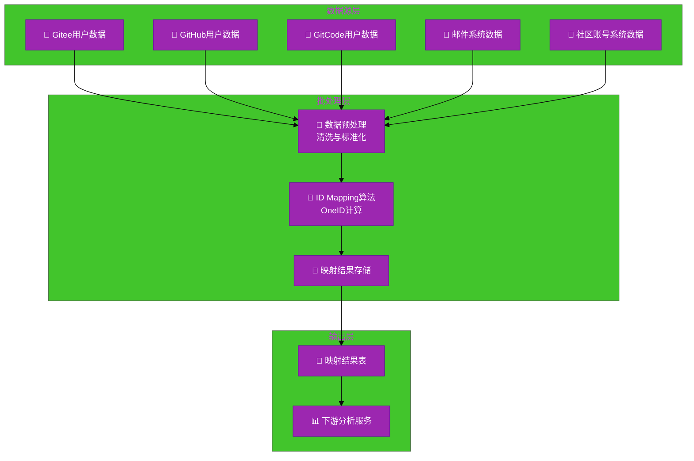
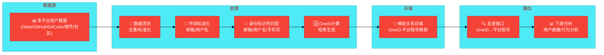
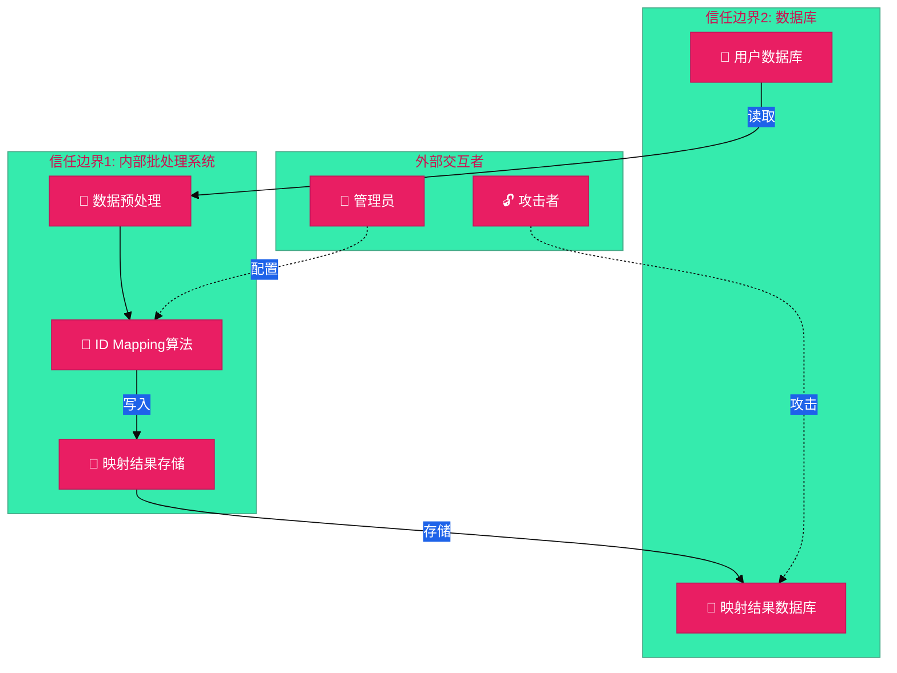

# #135 数据中台用户身份统一映射架构设计说明书 (Architecture Design Document)
---

## 1. 基础信息

* **需求链接**: https://github.com/opensourceways/backlog/issues/135
* **需求名称**: 数据中台用户身份统一映射（OneID Mapping）
* **开发责任人**: Kaede10
* **设计目标**: 基于已接入数据库的多平台用户数据，通过数据预处理清洗和标准化字段，使用 ID Mapping 算法（基于邮箱、用户名等相似度匹配）计算用户唯一标识 OneID，将映射结果存储到数据库供下游分析使用。

---

## 2. 功能设计

> **说明**：描述系统的组件构成、职责划分及交互逻辑。

### 2.1 架构图

> 此处建议插入架构拓扑系统组件图或时序图，描述组件间的交互关系。推荐使用Mermaid实现，可代码化，GitHub可渲染。
> **不涉及需要说明原因**

**设计说明/归档:** 本架构设计采用批处理模式，不对外提供API接口，主要包含数据预处理、ID Mapping算法和映射结果存储三个核心组件。

**系统架构分层图：**

**架构说明：**

- **数据源层**：已接入的5个平台用户数据（Gitee、GitHub、GitCode、邮件系统、社区账号系统）
- **批处理层**：核心处理逻辑，包括数据预处理、ID Mapping算法、映射结果存储
- **输出层**：映射结果存储到数据库，供下游分析服务使用

### 2.2 数据流图

> 此处建议插入数据流图，描述核心业务数据的生命周期，即威胁建模的基础。推荐使用Mermaid实现，可代码化，GitHub可渲染。
> **不涉及需要说明原因**

**设计说明/归档:** 数据流从多平台用户数据源开始，经过预处理、ID Mapping计算、结果存储，最终供下游分析使用。

**数据流图：**

**说明：**

- **数据源**：5个平台的原始用户数据
- **处理**：数据清洗、字段标准化、相似度匹配、OneID计算
- **存储**：映射关系持久化存储
- **输出**：提供反查接口供下游分析使用

### 2.3 组件职责与接口

> 列出新增/修改的组件及其定义的 API 规范。**不涉及需要说明原因**

**设计说明/归档:** 本需求新增三个核心组件，均采用批处理模式，不对外暴露API接口。

**组件职责表：**

| 组件名称 | 职责 | 输入 | 输出 | 接口/方法 |
|---------|------|------|------|----------|
| **数据预处理模块** | 数据清洗、去重、字段标准化 | 多平台原始用户数据 | 标准化用户数据 | `preprocess(data)`, `standardize(data)` |
| **ID Mapping算法** | 基于邮箱/用户名相似度计算OneID | 标准化用户数据 | OneID映射关系 | `matchByEmail(email)`, `matchByUsername(username)`, `generateOneID(user)` |
| **映射结果存储** | 映射关系持久化存储、反查 | OneID映射关系 | 存储结果 | `saveMapping(mapping)`, `queryByOneID(oneID)` |

### 2.4 UX设计

> 设计目标：确保功能不仅"可用"，而且"好用"，降低开发者的认知负担和运维人员的误操作风险。 **不涉及需要说明原因**

**设计说明/归档:** 本需求为批处理算法，不涉及用户界面交互，无UX设计。

### 2.5 SOD设计

> 设计目标：通过维护SOD权限设计文档，确保权限设计可审计、可复用、可跨服务重用。 SOD权限设计参考[XX SOD权限设计.md](XX%20SOD%E6%9D%83%E9%99%90%E8%AE%BE%E8%AE%A1.md)
>
>**不涉及需要说明原因**
>
>**需要说明文档位置**

**设计说明/归档:**本需求为批处理算法，不涉及权限管理，无SOD设计。

### 2.6 功能设计分解TASK清单

**设计说明/归档:**

**任务清单:**

| 任务 ID             | 功能任务描述                                    | 责任人    |
|-------------------|---------------------------------------------|--------|
| **TASK1** | **数据预处理模块开发** *(实现数据清洗、字段标准化、缺失值处理逻辑)* | Kaede10 |
| **TASK2** | **ID Mapping 算法实现** *(基于邮箱/用户名相似度计算 OneID，支持多种匹配策略)* | Kaede10 |
| **TASK3** | **映射结果存储与查询接口** *(实现映射关系持久化存储，提供 OneID 反查接口)* | Kaede10 |

---

## 3. 非功能设计

### 3.1 安全与隐私设计评估和设计

> **注意**：仅当需求判定为 **`need_security`** 时，本章节为必填项。 **无该标签可删除本章节。**

> 关注点：防御能力与合规边界。

### 3.1.1 威胁分析 (Threat Modeling)

> 基于 **STRIDE** 或类似模型，识别本项目可能面临的安全威胁。。推荐使用Mermaid绘制DFD数据流图和信任边界，展示系统的安全边界和数据流向。
> **建议归档服务模块设计图，后续需要可增量复用（导入设计文件到工具中即可复用增量设计）。**

**设计说明/归档:** 基于STRIDE模型识别威胁，重点关注用户隐私数据泄露和映射结果篡改风险。

**威胁建模图（信任边界）：**

**说明：**

- **信任边界1**：内部批处理系统，受信任执行环境
- **信任边界2**：数据库，不完全受信任
- **外部交互者**：管理员和攻击者，不受信任

**威胁分析表：**

| 威胁类别      | 攻击场景描述 (Scenario)                     | 风险等级/评分 | 对应减缓措施 (Mitigation)     |
|-----------|---------------------------------------|---------|-------------------------|
| **信息泄露**  | 攻击者通过数据库访问获取用户邮箱、用户名等个人隐私数据 | 高       | 数据库访问控制、敏感字段加密存储 |
| **篡改/伪造** | 攻击者篡改映射结果，导致用户身份关联错误 | 高       | 映射结果完整性校验、操作审计日志 |
| **隐私泄露**  | 日志中打印了用户邮箱、用户名等明文信息 | 中       | 实现日志脱敏过滤器 (Log Masking) |
| **拒绝服务**  | 恶意构造大量数据导致批处理任务过载 | 中       | 数据量限制、批处理超时控制 |

**参考资料：**
- 详见《架构设计说明书编写经验》第8章：威胁建模中的信任边界设计
- 详见《架构设计说明书编写经验》第16-20章：Mermaid图表应用指南

### 3.1.2 安全设计实现 (Security Mechanisms)

**数据安全**：
- ✅ 敏感数据脱敏
- ✅ 数据库访问权限严格控制（最小权限原则）
- ✅ 数据库连接加密

**访问控制**：
- ✅ API Key权限范围限制（只能查询邮箱，不能修改）
- ✅ API访问频率限制（Rate Limiting：100次/分钟/API Key）
- ✅ API响应数据最小化

**日志审计**：
- ✅ 记录所有API访问日志（请求参数、响应结果、调用方、时间戳）
- ✅ 日志脱敏处理

**设计说明/归档:**

### 3.1.3 安全任务分解 (Security Task Breakdown)

> 将安全设计转化为具体的开发任务，需在代码或后续开发流程的安全配置中落实。

**任务清单:**

| 任务 ID              | 安全任务描述 (Security Tasks)                         | 责任人 |
|--------------------|-------------------------------------------------|-----|
| **SEC-TASK1** | **实现日志脱敏过滤器，过滤敏感信息** | Kaede10 |
| **SEC-TASK2** | **实现映射结果完整性校验机制** | Kaede10 |

### 3.2 可靠性与韧性设计评估和设计（可选）

> **注意**：根据项目定级决定，含Core、Critical服务变更需要完成

> **关注点**：极端情况下的生存与恢复能力。
> **参考：**
> * 面向失败设计：是否识别了强依赖风险？当游依赖失效时，本服务是否具备降级或熔断能力？
> * 重试与避让：重试逻辑中是否包含指数退避和随机抖动以防止请求风暴？
> * 熔断限流：核心接口是否定义了明确的限流阈值？是否实现了断路器模式以保护下游？
> * 幂等设计：所有涉及写操作的任务是否支持重复调用而无副作用？

**设计说明/归档:** 本需求为批处理任务，非长驻服务，不涉及可靠性与韧性设计。

---

### 3.3 可服务性与可观测性评估和设计（可选）

> **关注点**：排障效率与全生命周期管理，确保故障可感知、可定位、可修复。

> **参考：**
>* 排障文档：是否提供了错误码对照表及对应的排障步骤？
>* 健康诊断：是否提供 /health 或 /status 接口，展示系统内部子模块的状态？
>* 平滑变更：升级或配置变更时如何实现灰度发布？是否具备一键回滚的判定指标？
>* 黄金指标覆盖：是否已定义并暴露出延迟、错误、流量和饱和度指标？

**设计说明/归档:** 本需求为批处理任务，非长驻服务，不涉及可服务性与可观测性设计。

---

### 3.4 性能与伸缩性评估和设计（可选）

> **关注点**：社区生态兼容性与未来扩展。

> **参考：**
> * 并发模型：在高并发场景下，锁竞争、连接池和线程池的配置是否已评估？
> * 水平扩展：服务是否实现了完全无状态化，支持快速扩容？
> * 延迟评估：关键路径的延迟是否业务需求？是否存在明显的 IO 或计算瓶颈？

**设计说明/归档:** 本需求为批处理任务，性能要求已在需求分析中明确（单次 ID Mapping 计算耗时 ≤ 100ms，支持百万级用户数据处理），无需额外性能设计。

---
