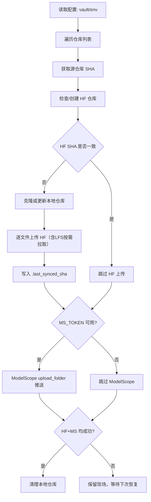

# #1 sync_to_hf_and_modelscope 需求分析说明书

## 1. 基础信息

* **需求链接**: https://github.com/opensourceways/backlog/issues/144
* **需求名称**: **sync_to_hf_and_modelscope 双目标仓库同步服务文档化**
* **开发责任人**: drizzlezyk

---

## 2. 需求场景说明

**场景说明:** 维护者需要将上游模型仓库（AtomGit / GitCode）中的模型文件，稳定同步到 Hugging Face 与 ModelScope 两个公开模型平台。

## 3 需求验收标准

**验收标准:**

- 文档仅覆盖 `sync_to_hf_and_modelscope.py` 的能力边界与流程，不包含 `sync_to_hf.py`、`sync_to_modelscope.py`。
- 需求文档完整填写模板核心章节：场景、验收、逻辑、任务拆解、相关性分析、价值评估。
- 文档中给出可验证的同步完成判据：HF `.last_synced_sha` 与源仓库 SHA 一致；ModelScope 推送成功日志可观测。
- 文档中明确关键配置来源（`/vault/secrets/config.yaml` ）与失败恢复机制（进度文件恢复）。

---

## 4. 需求设计与分解

### 4.1 核心逻辑方案

**逻辑方案:** 服务以仓库为单位串行处理：先获取源仓库最新 SHA，并与 HF 端 `.last_synced_sha` 对比；若有更新，执行增量文件上传并记录进度；HF 完成后再执行 ModelScope 全量目录上传；双端均成功后清理本地仓库，降低磁盘占用并避免脏状态残留。

### 4.2 任务清单

**任务清单:**

| 任务 ID | 任务描述 (Task Description) | 预期产出 (Deliverables) | 预期工作量（人天） |
|---|---|---|---|
| **SYNC-REQ-001** | 形成相关性判定与价值评估结论 | 可评审需求说明书 | **2** |
| **SYNC-REQ-002** | 梳理功能边界（仅本服务），编写代码 | 需求范围定义 | **1** |
| **SYNC-REQ-003** | 固化核心业务流程与异常分支（断点续传、磁盘不足、鉴权缺失） | 需求逻辑与流程图 | **1** |
| **SYNC-REQ-004** | 服务部署、调试 | 服务上线 | **1** |

---

## 5. 需求相关性分析

### A. 安全相关性分析

判定说明：服务依赖 HF/MS/GitCode Token，但不新增认证体系与公网暴露面；本次为文档补齐，不引入新依赖。

* [ ] **边界变更**：新增公网端口、修改防火墙规则、变更网关配置。
* [ ] **凭证处理**：涉及密钥（Secret/Key）、Token、证书的存储或分发。
* [ ] **权限调整**：修改权限模型、服务账号（SA）权限或鉴权逻辑。
* [ ] **供应链**：引入新的第三方二进制文件、SDK 或重大版本依赖升级。
* [ ] **隐私风险评估**：涉及用户个人数据（Email、手机号、IP、邮箱 等）的处理。
* [ ] **AI使用**：涉及AIGC能力应用，并提供服务。

### B. 架构设计相关性分析

判定说明：服务涉及双平台同步流程、恢复机制与外部平台接口交互，需要架构视图支撑评审与维护。

* [ ] A环节判定需要完成安全设计
* [ ] 改变了现有系统的物理/逻辑拓扑
* [ ] 新增或大幅修改对外暴露的 API/CLI 接口
* [x] 引入了新的中间件、数据库或三方核心组件 **原因：服务核心依赖 Hugging Face Hub API 与 ModelScope Hub API 的协同调用。**

### C. 系统集成测试相关性分析

判定说明：本次仅编写文档，不改动实现逻辑，不触发新增集成测试门禁。

* [ ] 上述环节判定需要执行安全设计或架构设计。
* [ ] **跨组件影响**：变更会触发下游服务或关联系统的连锁反应（级联效应）。
* [ ] **核心组件管控**：含项目定级为 Core 的核心逻辑变更。
* [ ] **环境强依赖**：功能高度依赖内核参数、网络拓扑或特定的物理挂载。
* [ ] **端到端流程**：涉及从用户输入到持久化存储的全链路逻辑。

### D. 用户体验相关性分析

判定说明：为脚本型服务，无 Web/交互界面设计需求。

* [ ] **交互逻辑变更**：涉及 Web 门户、控制台（Dashboard）或命令行工具（CLI）的交互流程调整。
* [ ] **感知性能变动**：变更可能显著影响页面的加载时间、同步请求的响应时延或异步任务的进度反馈。
* [x] **文档与辅助能力**：涉及报错提示语、帮助中心链接、FAQ 或新功能的 Runbook 说明。
* [ ] **无障碍与多语种**：涉及国际化（i18n）支持、辅助功能或不同终端（移动端/桌面端）的适配。

### 5.1 需求相关性分析汇总结果

* [ ] need_security (需架构设计（含安全威胁分析和安全设计）)
* [x] need_design (需架构设计)
* [ ] need_itest (需执行测试策略设计和全链路集成测试)
* [ ] need_ux (需架构设计（含UX设计)）
* [ ] need_light (上述均未勾选，走快速合入通道)

---

## 6. 价值识别与业务评估

| 维度 | 评估问题 | 结论/说明 |
|---|---|---|
| **范围判定** | 该需求是否属于基础设施范围内？ | **是**（模型分发自动化基础设施） |
| **规划一致性** | 该需求是否是否在年度技术规划中？ | **是**（模型生态多平台分发） |
| **优先级** | 该需求优先级评估（高/中/低）？ | **中** |
| **通用性** | 该需求是否解决 3 个以上业务方的共性痛点？ | **是**（模型发布、运营、社区分发） |
| **必要性** | 现有组件通过配置变更是否无法实现目标或没有不用开发的替代方案？ | **是** |
| **工作量** | 预计总工作量 xx 人天？ | ** 5 人天** |
| **价值评估** | 实现后能减少多少手动操作或提升多少系统稳定性？ | **明确维护边界和验收口径，降低交接与误操作风险，提升同步服务可维护性。** |

**建议结论**： **Accept**

**原因描述:** 业务价值明确，可行性高。
