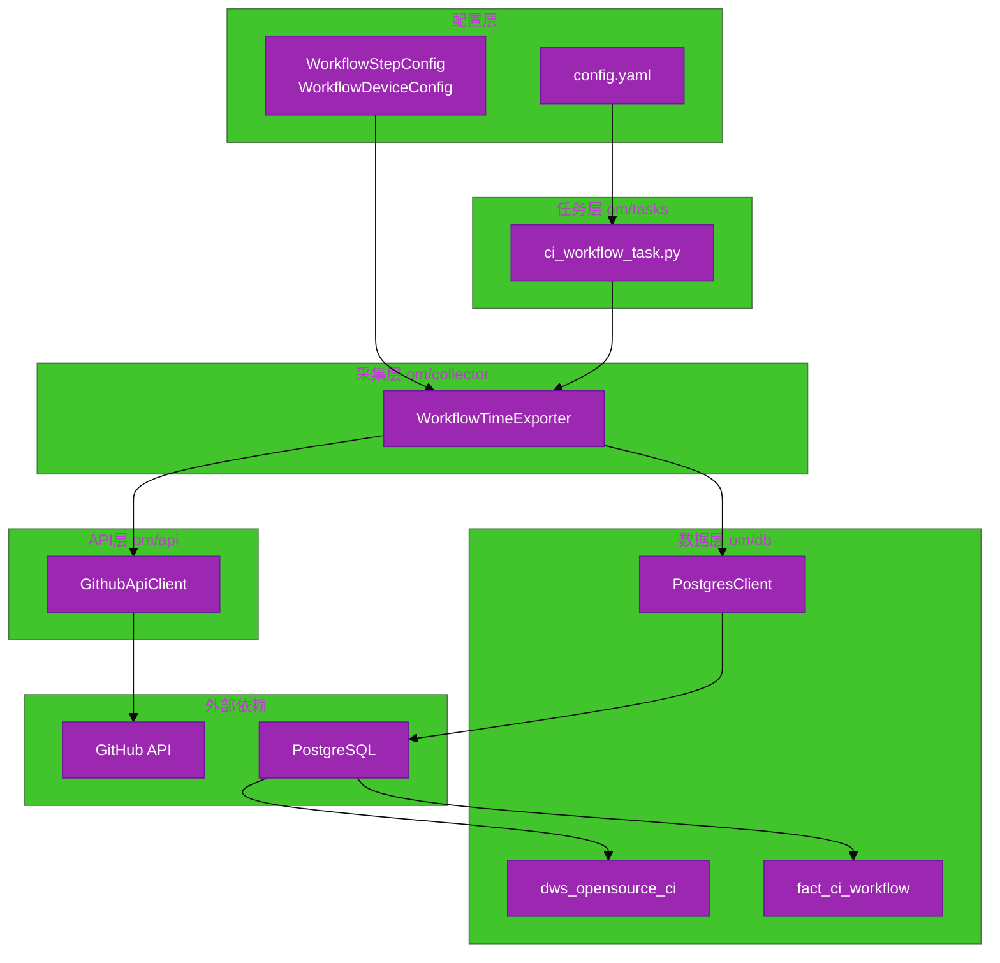
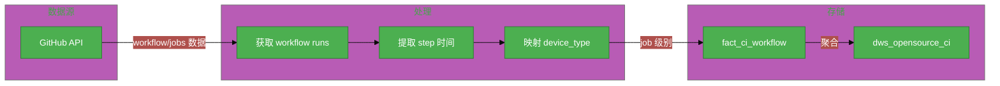

# #148 GitHub CI Workflow 指标采集架构设计说明书 (Architecture Design Document)

---

## 1. 基础信息

* **需求链接**: https://github.com/opensourceways/backlog/issues/148
* **需求名称**: GitHub CI Workflow 指标采集系统
* **开发责任人**: Creyson-peng
* **设计目标**: 实现可配置化的 GitHub Actions CI 数据采集，支持多仓库、step 时间提取、device 类型映射，数据聚合到 dws_opensource_ci 表供分析使用。

---

## 2. 功能设计

> **说明**：描述系统的组件构成、职责划分及交互逻辑。

### 2.1 架构图

> 此处建议插入架构拓扑系统组件图或时序图，描述组件间的交互关系。推荐使用Mermaid实现，可代码化，GitHub可渲染。

**设计说明/归档：** 单进程采集服务，遵循 om-dataarts 分层架构规范（api/collector/task/db），外部依赖为 GitHub API、PostgreSQL。

**架构图示例（使用Mermaid）：**



**说明：**
- 使用Graph展示系统组件和依赖关系
- 使用subgraph分组相关组件
- 标注通信协议和数据流向

### 2.2 数据流图

> 此处建议插入数据流图，描述核心业务数据的生命周期，即威胁建模的基础。推荐使用Mermaid实现，可代码化，GitHub可渲染。

**设计说明/归档：** 数据从 GitHub API 采集，经过 step 时间提取和 device 映射，聚合后写入两张表。

**数据流图示例（使用Mermaid）：**



**说明：**
- 使用DFD展示数据流向和处理步骤
- 标注数据在各阶段的转换和处理
- 为威胁建模和安全设计提供基础

### 2.3 组件职责与接口

> 列出新增/修改的组件及其定义的 API 规范。

**设计说明/归档：**

| 组件/函数 | 职责 | 输入 | 输出 |
|---|---|---|---|
| `WorkflowStepConfig` | Step 配置数据模型 | org, repo, download_steps, prepare_steps, device_configs | 配置对象 |
| `WorkflowDeviceConfig` | Device 映射数据模型 | workflow_name, device_type | 映射对象 |
| `WorkflowTimeExporter.__init__` | 初始化采集器 | 配置参数、db_client | 采集器实例 |
| `_load_step_configs` | 加载仓库级 step 配置 | YAML step_configs 列表 | step_configs_map |
| `_resolve_device_type` | 解析 device 类型 | workflow_name, step_config | NPU/GPU/unknown |
| `_extract_step_time` | 提取匹配 step 的总时长 | job, step_names | 时长秒数 |
| `_calculate_duration_sec` | 计算 ISO 时间差 | start_str, end_str | 秒数 |
| `_build_record` | 构建单条 job 记录 | run, job, step_config | fact 记录 dict |
| `_aggregate_workflow_run` | 聚合 workflow 级别记录 | run, job_records | dws 记录 dict |
| `_process_repo` | 处理单仓库采集逻辑 | org, repo | 无（写入数据库） |
| `_update_incomplete_workflows` | 增量更新未完成 workflow | org, repo, step_config | 无 |
| `init_tables` | 初始化数据库表 | 无 | 表创建完成 |
| `run` | 主执行入口 | 无 | 全量采集完成 |

对外接口形态：`python om/tasks/ci_workflow_task.py --config config.yaml`

### 2.4 UX设计

> 设计目标：确保功能不仅"可用"，而且"好用"，降低开发者的认知负担和运维人员的误操作风险。

**设计说明/归档：** 本服务为命令行脚本，不涉及 GUI 设计。可用性通过以下方式保障：

1. **配置文件驱动**: 所有采集参数通过 YAML 配置，支持环境变量注入
2. **日志可观测**: INFO 级别记录采集进度，WARNING 记录异常
3. **错误恢复**: 增量更新机制自动追踪未完成 workflow

### 2.5 SOD设计

> 设计目标：通过维护SOD权限设计文档，确保权限设计可审计、可复用、可跨服务重用。 SOD权限设计参考[XX SOD权限设计.md](XX%20SOD%E6%9D%83%E9%99%90%E8%AE%BE%E8%AE%A1.md)

**不涉及，原因：** 不涉及新增权限域模型。权限使用 GitHub Token，通过配置文件或环境变量注入，不在代码中硬编码。数据库连接使用 PostgresClient 统一管理。

### 2.6 功能设计分解TASK清单

**设计说明/归档：**

**任务清单:**

| 任务 ID             | 可服务性任务描述                                    | 责任人    |
|-------------------|---------------------------------------------|--------|
| **CI-DES-001** | 设计 WorkflowStepConfig/WorkflowDeviceConfig 数据模型 | Creyson-peng |
| **CI-DES-002** | 设计 _extract_step_time 精确名称匹配逻辑 | Creyson-peng |
| **CI-DES-003** | 设计 _resolve_device_type workflow_name 精确映射 | Creyson-peng |
| **CI-DES-004** | 设计 _aggregate_workflow_run 聚合策略（并行取最大值） | Creyson-peng |
| **CI-DES-005** | 设计增量更新机制（_update_incomplete_workflows） | Creyson-peng |

---

## 3. 非功能设计

### 3.1 安全与隐私设计评估和设计

> **注意**：仅当需求判定为 **`need_security`** 时，本章节为必填项。 **无该标签可删除本章节。**

**不涉及，原因：** 需求分析判定无 `need_security` 标签。仅采集 CI 运行数据，不暴露 API，不含用户隐私，Token 通过环境变量注入。

---

### 3.2 可靠性与韧性设计评估和设计（可选）

> **注意**：根据项目定级决定，含Core、Critical服务变更需要完成

> **关注点**：极端情况下的生存与恢复能力。

**设计说明/归档：**

- **增量更新**: 自动追踪非 completed 状态的 workflow，定期刷新状态
- **异常隔离**: 单仓库采集失败不影响其他仓库继续处理
- **时间解析容错**: created_at 解析失败时记录警告日志，run_date 设为 None
- **配置验证**: 加载 step_configs 时验证 org/repo 必填字段
- **数据库兼容**: _ensure_columns_exist 确保表结构兼容已存在的表

**任务清单:**

| 任务 ID             | 可靠性与韧性任务描述                         | 责任人 |
|-------------------|------------------------------------|-----|
| **CI-NFR-001** | 实现 _update_incomplete_workflows 增量更新机制 | Creyson-peng |
| **CI-NFR-002** | 实现异常捕获与日志警告（G.ERR.05 合规） | Creyson-peng |

---

### 3.3 可服务性与可观测性评估和设计（可选）

> **关注点**：排障效率与全生命周期管理，确保故障可感知、可定位、可修复。

**设计说明/归档：**

- **日志标准**: INFO 级别记录采集进度、Upsert 数量；WARNING 记录解析失败
- **元数据表**: fact_ci_workflow_meta 记录每个仓库的最后同步时间
- **状态可判断**: workflow_status 字段区分 completed/in_progress/queued
- **配置加载日志**: step_configs 加载时输出配置项数量

**任务清单:**

| 任务 ID             | 可服务性任务描述                                    | 责任人    |
|-------------------|---------------------------------------------|--------|
| **CI-OBS-001** | 规范日志输出格式与关键字 | Creyson-peng |
| **CI-OBS-002** | 实现元数据表同步时间追踪 | Creyson-peng |

---

### 3.4 性能与伸缩性评估和设计（可选）

> **关注点**：社区生态兼容性与未来扩展。

**设计说明/归档：**

- **当前策略**: 仓库顺序处理，workflow 并行获取（GitHub API 分页）
- **关键瓶颈**: GitHub API 速率限制、单 workflow 多 jobs 详情请求
- **批量写入**: 使用 bulk_upsert_data 批量写入，减少数据库操作次数
- **扩展方向**: 未来可支持多仓库并行采集，需配套 GitHub Token Pool

**任务清单:**

| 任务 ID             | 性能任务描述                               | 责任人    |
|-------------------|--------------------------------------|--------|
| **CI-PERF-001** | 评估 GitHub API 速率限制对多仓库采集的影响 | Creyson-peng |
| **CI-PERF-002** | 实现 bulk_upsert_data 批量写入优化 | Creyson-peng |

---

## 4. 数据模型设计

### 4.1 fact_ci_workflow 表

**设计说明/归档：** Job 级别明细表，记录每个 job 的运行数据。

| 字段名 | 类型 | 说明 |
|--------|------|------|
| uuid | TEXT PRIMARY KEY | org_repo_workflowId_jobId_createdAt |
| workflow_id | TEXT | GitHub workflow run ID |
| workflow_name | TEXT | workflow 名称 |
| workflow_status | TEXT | completed/in_progress/queued |
| job_id | TEXT | GitHub job ID |
| job_name | TEXT | job 名称 |
| runner_name | TEXT | runner 名称 |
| org | TEXT | 组织名 |
| repo | TEXT | 仓库名 |
| device_type | TEXT | NPU/GPU/unknown |
| conclusion | TEXT | success/failure/cancelled |
| pr_number | INT4 | PR 号 |
| commit_id | TEXT | head_sha |
| npu_type | TEXT | NPU 类型 |
| run_time | INT | job 运行时长（秒） |
| wait_time | INT | job 等待时长（秒） |
| download_time | INT | download step 总时长 |
| prepare_time | INT | prepare step 总时长 |
| created_at | TIMESTAMPTZ | job 创建时间 |
| started_at | TIMESTAMPTZ | job 开始时间 |
| completed_at | TIMESTAMPTZ | job 完成时间 |

### 4.2 dws_opensource_ci 表

**设计说明/归档：** Workflow 级别聚合表，按 commit_id + workflow_id 聚合。

| 字段名 | 类型 | 说明 |
|--------|------|------|
| uuid | VARCHAR(500) PRIMARY KEY | commit_id_workflow_id |
| org | VARCHAR(255) | 组织名 |
| repo | VARCHAR(255) | 仓库名 |
| commit_id | TEXT | head_sha |
| workflow_id | TEXT | GitHub workflow run ID |
| workflow_name | TEXT | workflow 名称 |
| workflow_status | VARCHAR(50) | completed/in_progress/queued |
| device_type | VARCHAR(50) | NPU/GPU |
| pr_number | INT4 | PR 号 |
| pr_url | TEXT | PR URL |
| run_date | DATE | 运行日期 |
| event_type | VARCHAR(50) | pull_request/push/schedule |
| job_count | INT4 | job 总数 |
| success_count | INT4 | 成功 job 数 |
| failure_count | INT4 | 失败 job 数 |
| cancel_count | INT4 | 取消 job 数 |
| success_rate | NUMERIC(5,2) | 成功率百分比 |
| e2e_time | INT8 | 端到端时长（最早started到最晚completed） |
| total_run_time | INT8 | jobs 最大运行时长（并行执行） |
| avg_run_time | INT8 | jobs 平均运行时长 |
| total_wait_time | INT8 | jobs 最大等待时长（并行执行） |
| avg_wait_time | INT8 | jobs 平均等待时长 |
| total_download_time | INT8 | download step 最大时长 |
| avg_download_time | INT8 | download step 平均时长 |
| total_prepare_time | INT8 | prepare step 最大时长 |
| avg_prepare_time | INT8 | prepare step 平均时长 |
| created_at | TIMESTAMPTZ | 最早 job started_at |
| completed_at | TIMESTAMPTZ | 最晚 job completed_at |

---

## 5. 配置模型设计

### 5.1 WorkflowStepConfig

```python
@dataclass
class WorkflowStepConfig:
    org: str
    repo: str
    download_steps: Optional[List[str]] = None
    prepare_steps: Optional[List[str]] = None
    device_configs: Optional[List[WorkflowDeviceConfig]] = None
```

### 5.2 WorkflowDeviceConfig

```python
@dataclass
class WorkflowDeviceConfig:
    workflow_name: str
    device_type: str  # "NPU" or "GPU"
```

---

## 6. 代码规范合规性

| 规范项 | 合规状态 | 说明 |
|--------|----------|------|
| 分层架构 | 合规 | api/collector/task/db 分层清晰 |
| 禁止裸 except | 合规 | 使用 `except (ValueError, TypeError, AttributeError) as e:` |
| 禁止硬编码 Token | 合规 | 通过环境变量注入 |
| 批量写入 | 合规 | 使用 bulk_upsert_data |
| 单元测试覆盖率 | 合规 | ≥ 90% |