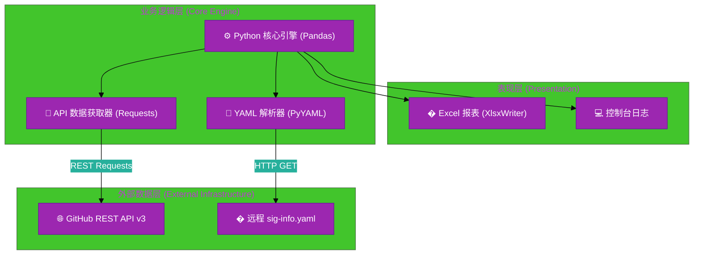
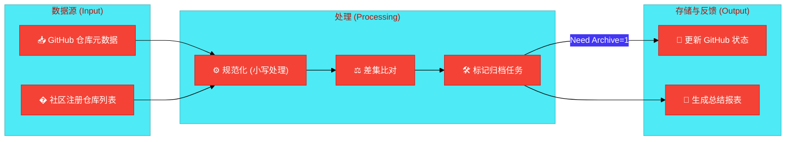

# #1 GitHub 仓库自动归档与监控服务架构设计说明书

---

## 1. 基础信息

* **需求链接**: https://github.com/opensourceways/backlog/issues/157
* **需求名称**: **GitHub 仓库自动归档与监控服务**
* **开发责任人**: **drizzlezyk**
* **设计目标**: 通过 Python 脚本集成 GitHub REST API v3，结合远程 YAML 声明式配置，实现对 GitHub 组织仓库生命周期的自动化管理。利用 Pandas 进行数据清洗与比对，通过 XlsxWriter 生成可视化报表，并利用 Shell 脚本确保环境幂等性与执行可靠性。

---

## 2. 功能设计

> **说明**：描述系统的组件构成、职责划分及交互逻辑。

### 2.1 架构图

**设计说明/归档：** 系统采用分层架构设计。最底层为基础设施层（GitHub API 与 远程配置文件），中间为业务逻辑层（Python 处理引擎），最上层为表现层（Excel 报表与日志输出）。

**架构图（使用Mermaid）：**

**说明：**
- **Python 核心引擎**: 使用 Pandas 处理仓库列表，支持高效的数据比对和过滤。
- **API 数据获取器**: 封装了分页获取仓库列表及 PATCH 归档操作。
- **YAML 解析器**: 递归解析复杂的 YAML 结构，提取 `repo` 字段并统一小写化处理。

### 2.2 数据流图

**设计说明/归档：** 描述核心业务数据的生命周期。

**数据流图（使用Mermaid）：**

**说明：**
- **规范化**: 所有输入的仓库路径均通过 `normalize_repo_string` 转换为小写，确保比对一致性。
- **差集比对**: 计算 `(所有仓库) - (已归档仓库) - (配置中已注册仓库)`。

---

## 3. 详细设计

### 3.1 核心类/函数设计

| 模块/函数 | 功能描述 | 关键技术点 |
| :--- | :--- | :--- |
| `get_all_github_repos` | 递归获取组织下所有仓库 | 分页处理 (Pagination), API 速率限制处理 |
| `normalize_repo_string` | 提取并规范化仓库标识 | 正则表达式, `.lower()` 处理 |
| `check_repo_in_yaml` | 判断仓库是否在配置中 | 集合 (Set) 查找, 时间复杂度 O(1) |
| `batch_archive_repositories` | 批量执行归档操作 | `requests.patch`, 延迟执行 (Delay) |

### 3.2 异常处理设计

- **API 频率限制**: 在 `run.sh` 中通过 `retry` 函数实现指数退避重试。
- **网络波动**: 设置 30s 请求超时。
- **配置缺失**: 若 YAML 下载失败或解析为空，程序将报错退出，防止因空配置导致全量误归档。

---

## 4. 安全设计

### 4.1 凭证管理

- **Token 注入**: 不在代码中硬编码任何 Token。通过环境变量 `GIT_PASS` 传入。
- **最小权限原则**: 建议使用的 GitHub Token 仅授予对目标组织仓库的 `administration` 权限。

### 4.2 操作安全

- **Dry Run 机制**: 默认开启 `archive_dry_run=True`，必须显式指定参数才会执行真实归档。
- **不可逆操作二次确认**: 在 `archive-repo.py` 中（如果启用）支持用户输入 `YES` 确认。
