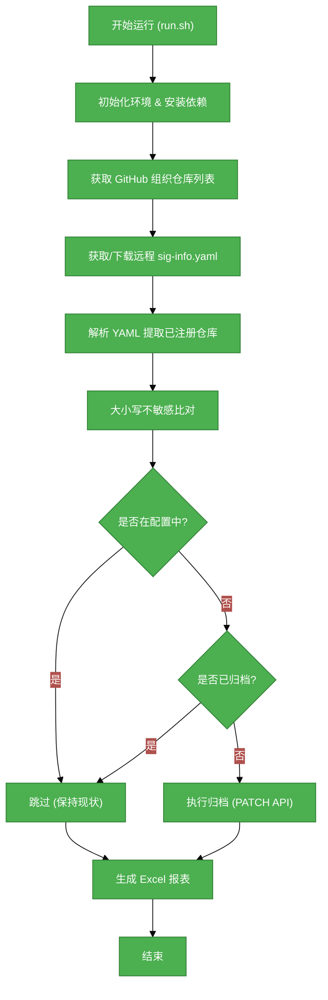

# #1 GitHub 仓库自动归档与监控服务需求分析说明书

## 1. 基础信息

* **需求链接**: https://github.com/opensourceways/backlog/issues/157
* **需求名称**: **GitHub 仓库自动归档与监控服务**
* **开发责任人**: **drizzlezyk**

---

## 2. 需求场景说明

> 描述“在什么情况下，为了解决什么问题，用户需要做什么”。

**场景说明:** 在 OpenSourceWays 组织下，随着时间的推移，会产生大量的 GitHub 仓库。其中一些仓库已不再维护，或者并未在社区的官方配置（如 `sig-info.yaml`）中注册。为了保持组织的整洁，降低管理成本，并确保只有经过授权的项目在活跃状态，SRE 团队需要一个自动化的工具来：
1. 定期扫描指定组织或用户的所有仓库。
2. 将扫描结果与社区官方配置文件进行比对。
3. 自动归档（Archive）那些不在配置文件中且尚未归档的仓库。
4. 生成详细的报表供人工复核。

---

## 3 需求验收标准

> 明确需求完成的标志，必须是可量化、可测试的。

**验收标准:**

- [x] **自动化扫描**: 能够通过 GitHub API 获取指定组织（如 `opensourceways`）的所有仓库列表。
- [x] **配置比对**: 能够下载并解析远程 YAML 配置文件（如 `sig-info.yaml`），并将其中的仓库列表与 API 结果进行比对。
- [x] **大小写不敏感**: 仓库名称的比对必须支持大小写不敏感（Case-insensitive），避免因命名规范不统一导致的误操作。
- [x] **安全归档**: 支持 `dry_run` 模式进行模拟运行；在正式运行时，能够调用 GitHub PATCH API 成功归档仓库。
- [x] **报表产出**: 运行结束后必须生成包含所有仓库状态、比对结果及归档状态的 Excel 报表。
- [x] **异常处理**: 在网络波动或 API 频率限制时，具备重试机制（由 `run.sh` 提供）。

---

## 4. 需求设计与分解

> 说明：基于初步方案，将需求拆解为可实施的原子 Task。后续的流程判定将严格依据这些 Task 的影响范围进行。

### 4.1 核心逻辑方案

**逻辑方案:** 该服务通过 Python 脚本（`archive-repo-arg.py`）实现核心逻辑，通过 Shell 脚本（`run.sh`）进行环境初始化和周期性触发。
1. **环境准备**: `run.sh` 负责创建虚拟环境并安装 `pandas`, `PyYAML`, `requests`, `xlsxwriter` 等依赖。
2. **数据获取**: 脚本调用 GitHub API 获取组织内所有仓库的元数据。
3. **配置解析**: 脚本从指定的远程 URL（如 `opensourceway` 仓库的 `sig-info.yaml`）获取社区配置，并提取所有已注册的仓库名。
4. **比对逻辑**: 遍历 API 返回的仓库列表，通过大小写不敏感的字符串匹配，标记不在配置中的活跃仓库。
5. **执行归档**: 若开启了 `should_archive` 且非 `dry_run` 模式，则对标记的仓库发送 PATCH 请求进行归档。
6. **结果输出**: 将所有中间过程和最终状态保存到 `github_repos_summary.xlsx`。

**流程图示例（使用Mermaid）：**

### 4.2 任务清单

**任务清单:**

| 任务 ID              | 任务描述 (Task Description)            | 预期产出 (Deliverables) | 预期工作量（人天）    |
|--------------------|------------------------------------|---------------------|--------------|
| **task1** | 核心 Python 脚本开发 (API 调用、数据处理) | `archive-repo-arg.py` | 3 |
| **task2** | 自动化运行脚本开发 (重试、环境隔离、CI 集成) | `run.sh` | 1 |
| **task3** | 实现大小写不敏感的配置匹配逻辑 | 代码逻辑更新 | 0.5 |
| **task4** | Excel 报表导出与样式美化 | `.xlsx` 文件输出 | 0.5 |

---

## 5. 需求相关性分析

### A. 安全相关性分析

* [ ] **边界变更**：新增公网端口、修改防火墙规则、变更网关配置。
* [x] **凭证处理**：涉及密钥（Secret/Key）、Token、证书的存储或分发。**（需要使用 GitHub API Token 进行归档操作，需在 Jenkins/CI 中安全注入环境变量）**
* [ ] **权限调整**：修改权限模型、服务账号（SA）权限或鉴权逻辑。
* [ ] **供应链**：引入新的第三方二进制文件、SDK 或重大版本依赖升级。
* [ ] **隐私风险评估**：涉及用户个人数据（Email、手机号、IP、邮箱 等）的处理。
* [ ] **AI使用**：涉及AIGC能力应用，并提供服务。

### B. 架构设计相关性分析

* [x] A环节判定需要完成安全设计 **（凭证管理的安全设计）**
* [ ] 改变了现有系统的物理/逻辑拓扑
