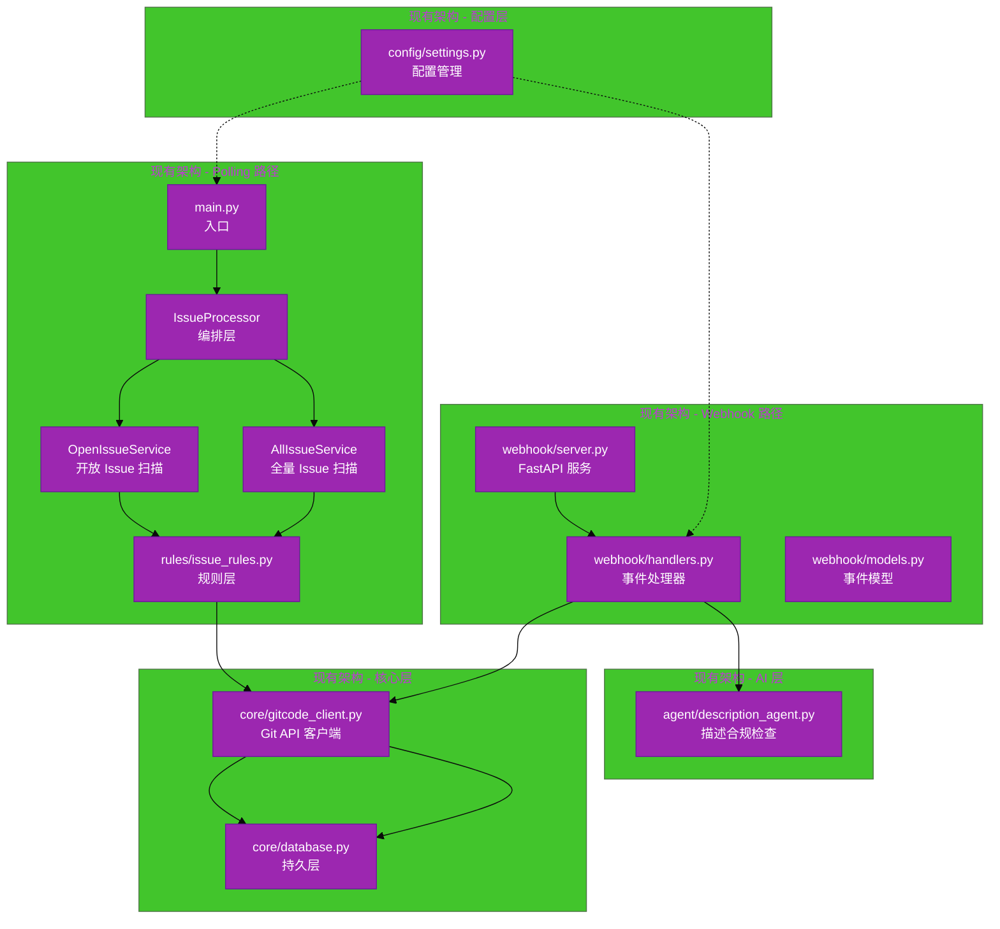
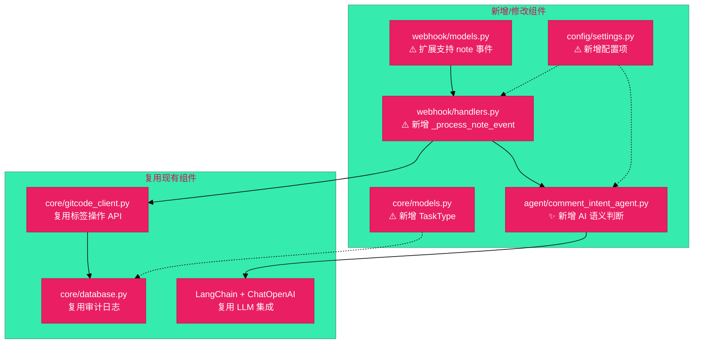
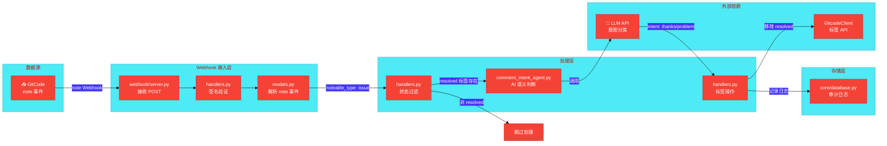
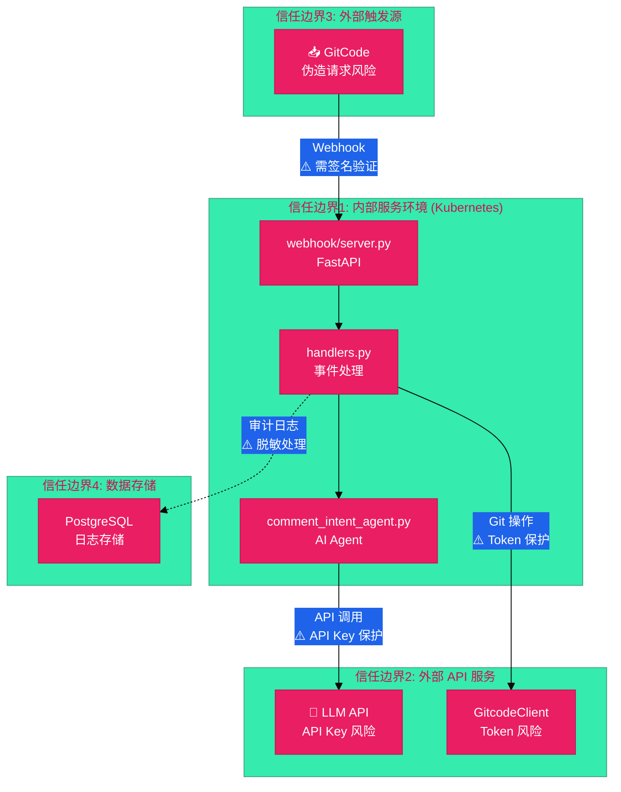

# Issue #169 Ascend-Mind Resolved Issue 自动标签管理架构设计说明书

---

## 1. 基础信息

* **需求链接**: https://github.com/opensourceways/backlog/issues/169
* **需求名称**: Ascend-Mind 系列 resolved issue 用户回复后自动移除 resolved 标签（含 AI 语义判定）
* **开发责任人**: chenqi
* **设计目标**: 在现有 `robot-issue-manage` 项目基础上，扩展 Webhook 事件监听支持 issue 评论事件，新增 AI 语义判断 Agent 判断用户回复意图，实现 resolved 标签智能管理。
* **目标仓库**: `robot-issue-manage`

---

## 2. 功能设计

> **说明**：基于现有 `robot-issue-manage` 项目架构，描述新增/修改的组件。

### 2.1 架构图

**设计说明/归档：**

**现有架构（参考 ARCHITECTURE.md）：**



**新增组件架构（针对 Issue #169）：**



**架构说明：**

- **复用现有架构**：不改变整体架构，在现有 Webhook 路径和 Agent 层上扩展
- **新增 note 事件处理**：扩展 `webhook/models.py` 支持 `object_kind: note` 事件
- **新增 AI Agent**：创建 `agent/comment_intent_agent.py` 进行评论语义判断
- **复用 LLM 集成**：使用现有的 LangChain + ChatOpenAI 模式（同 `description_agent.py`）
- **复用 Git API**：使用现有的 `GitcodeClient` 进行标签操作

### 2.2 数据流图

**设计说明/归档：**

**Issue 评论事件处理流程：**



**数据流说明：**

1. **Webhook 接入**：GitCode 发送 `object_kind: note` 事件到 `/webhook/gitcode`
2. **签名验证**：使用 `X-GitCode-Token` header 验证（复用现有逻辑）
3. **事件解析**：新增 `is_note_event` 和 `noteable_type` 属性判断是否为 issue 评论
4. **状态过滤**：检查目标 issue 是否有 `resolved` 标签，无则跳过
5. **AI 语义判断**：调用 `CommentIntentAgent` 判断用户意图（感谢类/问题类）
6. **标签操作**：
   - 感谢类：保持 resolved 标签不变
   - 问题类：移除 resolved 标签（仅处理 open 状态的 issue，已关闭的 issue 跳过处理）

### 2.3 组件职责与接口

**设计说明/归档：**

| 组件名称 | 文件路径 | 职责 | 输入 | 输出 | 变更类型 |
|---------|---------|------|------|------|---------|
| **GitcodeWebhookEvent** | `webhook/models.py` | 解析 Webhook 事件模型 | Webhook payload | 事件属性 | **修改** |
| **WebhookHandler** | `webhook/handlers.py` | 处理 Webhook 事件 | GitcodeWebhookEvent | 操作结果 | **修改** |
| **CommentIntentAgent** | `agent/comment_intent_agent.py` | AI 语义判断评论意图 | 评论文本 | IntentResult | **新增** |
| **GitcodeClient** | `core/gitcode_client.py` | Git API 操作 | 标签操作指令 | API 响应 | **复用** |
| **TaskType** | `core/models.py` | 任务类型枚举 | - | 新增枚举值 | **修改** |
| **BotConfig** | `config/settings.py` | 配置管理 | YAML 配置 | 配置属性 | **修改** |

**新增接口定义：**

**webhook/models.py 新增属性：**
```python
@property
def is_note_event(self) -> bool:
    return self.object_kind == 'note'

@property
def noteable_type(self) -> Optional[str]:
    if self.is_note_event:
        return self.object_attributes.get('noteable_type')
    return None

@property
def noteable_id(self) -> Optional[int]:
    if self.is_note_event:
        return self.object_attributes.get('noteable_id')
    return None

@property
def note_content(self) -> Optional[str]:
    if self.is_note_event:
        return self.object_attributes.get('body') or self.object_attributes.get('note')
    return None
```

**agent/comment_intent_agent.py 核心接口：**
```python
class IntentResult(BaseModel):
    intent: str  # "thanks" | "problem" | "uncertain"
    confidence: float  # 0.0 - 1.0
    reasoning: str

class CommentIntentAgent:
    def evaluate(self, comment: str, context: Optional[str] = None) -> IntentResult
```

### 2.4 UX设计

**不涉及，原因：** 本需求为后台自动化服务扩展，无用户交互界面。

### 2.5 SOD设计

**不涉及，原因：** 本需求不涉及多角色权限分离，仅使用服务账号执行自动化操作。

### 2.6 功能设计分解TASK清单

**设计说明/归档：**

| 任务 ID | 功能任务描述 | 责任人 |
|---------|-------------|--------|
| **TASK1** | 扩展 `webhook/models.py`，新增 `is_note_event`、`noteable_type`、`noteable_id`、`note_content` 属性 | **[DONE]** 证据：`webhook/models.py:42-68` |
| **TASK2** | 扩展 `webhook/handlers.py`，新增 `_process_note_event` 方法处理 issue 评论事件 | **[DONE]** 证据：`webhook/handlers.py:286-390` |
| **TASK3** | 创建 `agent/comment_intent_agent.py`，实现 AI 语义判断 Agent（感谢/问题/不确定三类） | **[DONE]** 证据：`agent/comment_intent_agent.py:34-118` |
| **TASK4** | 扩展 `config/settings.py`，新增 `resolved_label_intent_agent_enabled`、`resolved_label_intent_confidence_threshold` 配置项 | **[DONE]** 证据：`config/settings.py:181-186` |
| **TASK5** | 扩展 `core/models.py`，新增 `TaskType.RESOLVED_LABEL_INTENT_CHECK` 任务类型 | **[DONE]** 证据：`core/models.py:17` |
| **TASK6** | 编写单元测试 `tests/test_comment_intent_agent.py` | **[DONE]** 证据：`tests/test_comment_intent_agent.py` |
| **TASK7** | 创建 `rules/issue_rules.py`，实现 `ResolvedLabelIntentCompensationRule` 补偿规则 | **[DONE]** 证据：`rules/issue_rules.py:613-740` |
| **TASK8** | 扩展 `core/gitcode_client.py`，新增 `Issue.label_details` 字段支持 API 时间戳 | **[DONE]** 证据：`core/gitcode_client.py:370-393` |

---

## 3. 非功能设计

### 3.1 安全与隐私设计评估和设计

> **注意**：仅当需求判定为 **`need_security`** 时，本章节为必填项。

### 3.1.1 威胁分析

**设计说明/归档：**

**威胁建模图（信任边界）：**



**威胁分析表：**

| 威胁类别 | 攻击场景描述 | 风险等级/评分 | 对应减缓措施 |
|---------|-------------|--------------|-------------|
| **信息泄露** | LLM API Key 泄露（硬编码或日志记录） | 高 | 复用现有 LLM 配置模式，从 config.yaml 读取，不硬编码 |
| **信息泄露** | Git API Token 泄露 | 高 | 复用现有 GitcodeClient，Token 从配置读取 |
| **信息泄露** | 日志中记录完整评论内容 | 中 | 日志脱敏，仅记录评论前 50 字符 |
| **篡改/伪造** | 攻击者伪造 note Webhook 请求 | 高 | 复用现有签名验证逻辑（X-GitCode-Token） |
| **篡改/伪造** | Prompt 注入攻击影响 AI 分类结果 | 中 | Prompt 安全边界设计，限制输出格式 |
| **拒绝服务** | 大量伪造 Webhook 请求 | 中 | 复用现有 ThreadPoolExecutor 限流（max_workers=5） |
| **隐私泄露** | 用户评论内容发送到第三方 LLM API，存在数据留存和训练风险 | 高 | 评论预处理去除敏感信息（邮箱、手机号、IP地址、URL），明确 LLM 提供商数据保留政策，确认无训练数据使用 |
| **权限提升** | Agent 错误判断导致非预期标签操作 | 中 | 设置置信度阈值，低置信度时跳过操作并记录日志 |

### 3.1.2 安全设计实现

**设计说明/归档：**

**复用现有安全机制：**

* **凭证管理**：复用现有 `config/settings.py` + `config.yaml` 模式，LLM API Key 和 Git Token 从配置文件读取，不硬编码
* **签名验证**：复用现有 `WebhookHandler.verify_signature()` 方法，使用 `X-GitCode-Token` header 验证
* **请求限流**：复用现有 `ThreadPoolExecutor(max_workers=5)` 限制并发处理

**新增安全机制：**

* **置信度阈值**：新增配置 `resolved_label_intent_confidence_threshold`（默认 0.8），低于阈值时跳过操作并记录日志
* **Prompt 安全边界**：参考现有 `agent/security_prompts.py`，新增评论意图判断的安全边界约束
* **日志脱敏**：评论内容日志仅记录前 50 字符，不记录完整内容
* **评论预处理**：发送到 LLM 前去除敏感信息（邮箱、手机号、IPv4/IPv6地址、URL），避免隐私数据外泄到第三方 LLM API
* **签名验证增强**：使用 `secrets.compare_digest()` 防止时序攻击，删除所有 DEBUG 级别的 token 日志输出

**LLM API 数据处理合规说明：**

* **LLM 提供商**：根据 config.yaml 配置（如 Alibaba DashScope、OpenAI 等）
* **数据保留政策**：需确认提供商数据保留期（建议选择"不保留"或"短期保留"选项）
* **训练数据使用**：需确认提供商不使用 API 调用数据训练模型（参考提供商 DPA/Data Processing Agreement）
* **用户通知**：建议在仓库 README 或 Issue 模板中说明"评论内容可能用于 AI 语义分析"
* **凭证管理**：API Key 存储在 config.yaml（开发环境）或 Kubernetes Secret（生产环境），禁止硬编码或日志输出

### 3.1.3 安全任务分解

**任务清单：**

| 任务 ID | 安全任务描述 | 责任人 |
|---------|-------------|--------|
| **SEC-TASK1** | 在 `agent/comment_intent_agent.py` 中复用 `agent/intent_prompts.py` 的安全边界约束（`INTENT_AGENT_SECURITY_BOUNDARY`） | [DONE] |
| **SEC-TASK2** | 实现置信度阈值检查逻辑，低于阈值时跳过标签操作 | **[DONE]** 证据：`webhook/handlers.py:350-361` |
| **SEC-TASK3** | 实现评论预处理模块，去除敏感信息（邮箱、手机号、IP地址、URL） | **[DONE]** 证据：`agent/comment_intent_agent.py:42-63` |
| **SEC-TASK4** | 实现日志脱敏，评论内容仅记录前 50 字符 | **[DONE]** 证据：`webhook/handlers.py:345` |

### 3.2 可靠性与韧性设计评估和设计

**设计说明/归档：**

**Webhook 与 Polling 冲突处理：**

双路径架构（Webhook 实时 + Polling 补偿）存在评论重复处理风险：

- **Webhook 路径**：实时处理评论事件，调用 LLM 判断意图
- **Polling 路径**：补偿扫描，获取 resolved 标签后所有评论并判断意图

若两者同时处理同一评论，会导致：
- ❌ 重复 LLM API 调用（成本浪费）
- ❌ 日志中产生重复记录

**冲突时序分析：**

```
T0: 用户评论 → GitCode 更新 issue.updated_at = T0
T0+0.5s: Polling 启动 → fetch issue → updated_at = T0
T0+1s: Webhook 接收事件 → 开始处理
T0+3s: Webhook 完成处理 → 移除 resolved 标签 → updated_at = T0+3s
T0+5min: 下一次 Polling → 无 resolved 标签 → 跳过
```

**无去重机制时的冲突分析：**

若 Webhook 和 Polling 同时被触发处理同一 issue 评论，会产生以下影响：

| 影响类型 | 具体后果 | 严重程度 |
|---------|---------|---------|
| **重复 LLM 调用** | 同一评论被两次发送到 LLM API，产生双倍 API 成本 | 中（成本浪费） |
| **重复日志记录** | 审计日志中出现两条相同评论的处理记录，影响日志可读性 | 低（运维干扰） |
| **重复标签操作尝试** | 第二次操作时 resolved 标签可能已被移除，API 返回 "label not found" 错误 | 低（API 错误可忽略） |
| **并发竞态** | 若两者几乎同时执行，可能出现标签操作顺序不确定 | 低（结果一致） |

**时序分析：**

```
T0: 用户发表评论 "还是有问题"
T0+1s: Webhook 收到 note 事件 → 调用 LLM → intent=problem → 移除 resolved
T0+30s: Polling 扫描 → 获取评论列表 → 包含该评论 → 调用 LLM → intent=problem → 尝试移除 resolved（已移除，API 返回错误）
```

**实际影响评估：**

1. **功能正确性**：最终结果一致（resolved 标签被移除），无数据损坏
2. **成本影响**：额外 LLM API 调用（按实际评论频率计算，预计每日少量）
3. **运维影响**：日志中出现重复记录和 "label not found" 错误，需人工判断是否异常
4. **性能影响**：无（异步处理，不阻塞主流程）

**结论：**

- 不实现去重机制**不会导致功能错误**
- 主要影响是**成本浪费**（重复 LLM 调用）和**日志噪音**
- 若评论频率低、LLM 成本可控，可接受此状态
- 若需优化，可后续添加去重机制（基于评论 ID 或处理状态标记）

**任务清单：**

| 任务 ID | 韧性任务描述 | 责任人 |
|---------|-------------|--------|
| **RES-TASK1** | 在 `ResolvedLabelIntentCompensationRule.should_trigger()` 中实现 updated_at 去重逻辑（可选优化） | **[SKIPPED]** 已实现 label_details 时间戳源（`rules/issue_rules.py:661-664`），去重机制暂不实现，接受重复处理 |

### 3.3 可服务性与可观测性评估和设计

**设计说明/归档：**

* **复用现有健康检查**：`webhook/server.py` 已有 `GET /` 健康检查接口
* **复用现有审计日志**：`core/database.py` 已有 `WebhookEventLog` 表记录失败事件
* **新增监控指标**：在 `handlers.py` 中新增 Agent 调用成功/失败率、置信度分布统计

**任务清单：**

| 任务 ID | 可服务性任务描述 | 责任人 |
|---------|----------------|--------|
| **OPS-TASK1** | 在 `_process_note_event` 中记录 Agent 调用结果到审计日志 | **[DONE]** 证据：`webhook/handlers.py:387-415` (`_log_intent_result` 方法) |
| **OPS-TASK2** | 新增错误码 `INTENT_CLASSIFICATION_LOW_CONFIDENCE` 用于低置信度场景 | **[DONE]** 证据：`core/constants.py:8-10` (错误码常量定义), `webhook/handlers.py:375` (使用错误码) |

### 3.4 性能与伸缩性评估和设计

**不涉及，原因：** 本需求无高并发场景，复用现有 ThreadPoolExecutor（max_workers=5）可满足需求。评论事件频率预计较低。

---

## 4. Architecture Update (2025-04-29)

### 4.1 CompensationRule Architecture Change

**变更说明：** CompensationRule 时间戳源从数据库迁移到 GitCode API。

**变更原因：**
- 原架构：使用 DB `issue_states.last_resolve_at` 字段记录 resolved 标签添加时间
- 问题：Webhook handler 清除该字段，但 CompensationRule 未清除（数据不一致 bug）
- 解决：使用 GitCode API `labels[].updated_at` 作为唯一时间戳来源

**新架构：**

```python
# core/gitcode_client.py - Issue dataclass 新增字段
class Issue:
    labels: List[str]              # 标签名称列表（向后兼容）
    label_details: Dict[str, datetime]  # NEW: 标签名 -> 添加时间
    
# 从 API 提取时间戳
Issue.from_api_response():
    for lbl in data.get('labels', []):
        if isinstance(lbl, dict) and 'name' in lbl:
            ts_str = lbl.get('updated_at')  # GitCode API 字段
            if ts_str:
                label_details[lbl['name']] = parse_gitcode_time(ts_str)
```

**CompensationRule 变更：**

```python
# BEFORE: 使用数据库字段
resolve_time = state.last_resolve_at  # DB 查询

# AFTER: 使用 API 时间戳
resolve_time = issue.label_details.get(config.bot.label_resolve)
```

**优势：**
- ✓ 单一数据源（GitCode API），无一致性 bug
- ✓ 无需 DB 事务查询时间戳
- ✓ Webhook 无需清除 last_resolve_at
- ✓向后兼容（issue.labels 字段不变）

**影响范围：**

| 文件 | 变更 |
|------|------|
| `core/gitcode_client.py` | 新增 `Issue.label_details` 字段 |
| `rules/issue_rules.py` | CompensationRule 使用 `issue.label_details` |
| `webhook/handlers.py` | 移除 `last_resolve_at=None` 清除逻辑 |
| `tests/*.py` | 更新 mock 数据包含 `label_details` |
| `docs/database.md` | 更新架构文档，标注 `last_resolve_at` 已弃用 |

**DB 字段状态：**
- `issue_states.last_resolve_at` 列保留（向后兼容）
- CompensationRule 不再使用该字段
- ResolveLabelRule 仍设置该字段（可选，未来可移除）