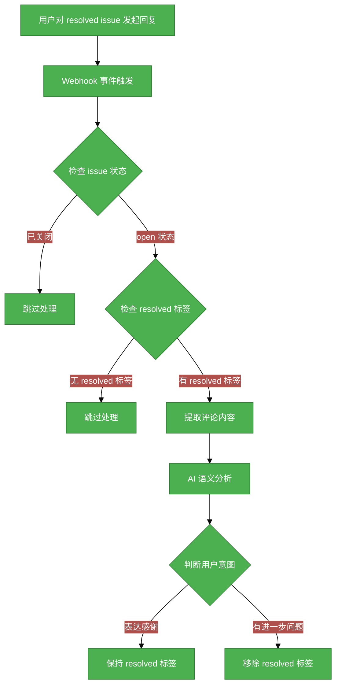

# Issue #169 Ascend-Mind Resolved Issue 自动标签管理需求分析说明书

## 1. 基础信息

* **需求链接**: https://github.com/opensourceways/backlog/issues/169
* **需求名称**: Ascend-Mind 系列 resolved issue 用户回复后自动移除 resolved 标签
* **开发责任人**: chenqi

---

## 2. 需求场景说明

> 描述"在什么情况下，为了解决什么问题，用户需要做什么"。

**场景说明:** 在 Ascend-Mind 系列仓库中，当 issue 被标记为 resolved 后，如果用户继续回复（如表达感谢或提出新问题），当前 resolved 标签不会自动移除。这导致 issue 责任人无法及时发现用户有进一步问题，可能错过回复时机。需要在用户回复后自动判断是否需要移除 resolved 标签，提升 issue 管理效率。

## 3 需求验收标准

> 明确需求完成的标志，必须是可量化、可测试的。

**验收标准:**

- [x] 用户对 resolved issue 发起回复后，系统能在 60 秒内完成语义判断并执行标签操作
- [x] AI 语义判断准确率 >= 90%（针对"表达感谢"与"有进一步问题"两类场景）
- [x] "表达感谢"类回复：resolved 标签保持不变
- [x] "有进一步问题"类回复：resolved 标签自动移除（仅处理 open 状态的 issue，已关闭的 issue 跳过处理）
- [x] 覆盖 Ascend-Mind 系列所有目标仓库

---

## 4. 需求设计与分解

> 说明：基于初步方案，将需求拆解为可实施的原子 Task。后续的流程判定将严格依据这些 Task 的影响范围进行。

### 4.1 核心逻辑方案

**逻辑方案:** 通过监听 GitCode/GitHub Webhook 事件，捕获 resolved issue 的新评论。将评论内容传递给 AI 语义分析服务，判断用户意图（感谢类 / 问题类）。根据判断结果执行相应操作：感谢类保持 resolved 标签，问题类移除 resolved 标签（仅处理 open 状态的 issue，已关闭的 issue 跳过处理）。

**流程图：**

### 4.2 任务清单

**任务清单:**

| 任务 ID | 任务描述 (Task Description) | 预期产出 (Deliverables) | 预期工作量（人天） |
|---------|----------------------------|------------------------|-------------------|
| **task1** | 实现 Webhook 事件监听与评论提取逻辑 | Webhook 处理服务代码、事件过滤配置 | **3** |
| **task2** | 集成 AI 语义判断服务，实现感谢/问题二分类 | 语义分析模块、Prompt 设计、测试用例 | **4** |
| **task3** | 实现标签管理与 Issue 状态更新逻辑 | 标签操作服务、状态机设计、重试机制 | **3** |

---

## 5. 需求相关性分析

> **操作说明**：根据上述拆解出的 Task，识别其变更行为。任何一项勾选为"是"：打上对应issue标签，必须执行对应的流程门禁。全部未勾选：该需求自动判定为轻量化特性，打上need_light标签。

### A. 安全相关性分析

> 若涉及以下任一项，打标 `need_security`标签，PR 必须关联特性issue的架构设计文档（含安全设计部分）**如勾选需要给出原因**。

* [ ] **边界变更**：新增公网端口、修改防火墙规则、变更网关配置。
* [ ] **凭证处理**：涉及密钥（Secret/Key）、Token、证书的存储或分发。
* [ ] **权限调整**：修改权限模型、服务账号（SA）权限或鉴权逻辑。
* [ ] **供应链**：引入新的第三方二进制文件、SDK 或重大版本依赖升级。
* [ ] **隐私风险评估**：涉及用户个人数据（Email、手机号、IP、邮箱 等）的处理。
* [x] **AI使用**：涉及AIGC能力应用，并提供服务。**原因：需要使用 AI 模型判断用户评论语义（感谢类/问题类），属于 AI 能力应用**

### B. 架构设计相关性分析

> 若涉及以下任一项，打标 `need_design`标签，PR 必须关联特性issue的架构设计文档。 **如勾选需要给出原因**。

* [x] A环节判定需要完成安全设计。**原因：A 环节勾选 AI 使用，触发安全设计要求**
* [ ] 改变了现有系统的物理/逻辑拓扑
* [ ] 新增或大幅修改对外暴露的 API/CLI 接口
* [ ] 引入了新的中间件、数据库或三方核心组件

### C. 系统集成测试相关性分析

> *若涉及以下任一项，打标 `need_itest`标签，PR必须关联特性issue的测试策略和测试报告文档。 **如勾选需要给出原因**。

* [x] 上述环节判定需要执行安全设计或架构设计。**原因：A/B 环节已触发 need_security 和 need_design**
* [ ] **跨组件影响**：变更会触发下游服务或关联系统的连锁反应（级联效应）。
* [ ] **核心组件管控**：含项目定级为 Core 的核心逻辑变更。
* [ ] **环境强依赖**：功能高度依赖内核参数、网络拓扑或特定的物理挂载。
* [ ] **端到端流程**：涉及从用户输入到持久化存储的全链路逻辑。

### D. 用户体验相关性分析

> 若涉及以下任一项，打标 `need_ux`标签，PR必须关联特性issue的用户体验设计文档。 **如勾选需要给出原因**。

* [ ] **交互逻辑变更**：涉及 Web 门户、控制台（Dashboard）或命令行工具（CLI）的交互流程调整。
* [ ] **感知性能变动**：变更可能显著影响页面的加载时间、同步请求的响应时延或异步任务的进度反馈。
* [ ] **文档与辅助能力**：涉及报错提示语、帮助中心链接、FAQ 或新功能的 Runbook 说明。
* [ ] **无障碍与多语种**：涉及国际化（i18n）支持、辅助功能或不同终端（移动端/桌面端）的适配。

### 5.1 需求相关性分析汇总结果

* [x] need_security (需架构设计（含安全威胁分析和安全设计）)
* [x] need_design (需架构设计)
* [x] need_itest (需执行测试策略设计和全链路集成测试)
* [ ] need_ux (需架构设计（含UX设计)）
* [ ] need_light (上述均未勾选，走快速合入通道)

---

## 6. 价值识别与业务评估

> **判定准则**：基础设施接纳需求必须具备明确的 ROI（投资回报比）或合规必要性。

| 维度 | 评估问题 | 结论/说明 |
|------|----------|----------|
| **范围判定** | 该需求是否属于基础设施范围内？ | **是**（自动化工具，提升 issue 管理效率） |
| **规划一致性** | 该需求是否在年度技术规划中？ | **否**（新增需求，符合自动化运维方向） |
| **优先级** | 该需求优先级评估（高/中/低）？ | **中**（优化现有流程，非阻塞性问题） |
| **通用性** | 该需求是否解决 3 个以上业务方的共性痛点？ | **是**（Ascend-Mind 系列多个仓库可用） |
| **必要性** | 现有组件通过配置变更是否无法实现目标或没有不用开发的替代方案？ | **是**（需要 AI 语义判断，无法通过配置实现） |
| **工作量** | 预计总工作量 | **10 人天** |
| **价值评估** | 实现后能减少多少手动操作或提升多少系统稳定性？ | 预计减少 issue 责任人 50% 的标签手动检查工作量，提升用户问题响应速度 |

> **状态定义：** **Accept (准入)** | **Reject (驳回)** | **Pending (待议)**

**建议结论**： **Accept**

**原因描述:** 该需求通过 AI 自动化判断用户回复意图，自动管理 resolved 标签，提升 issue 管理效率和用户体验。符合基础设施自动化方向，ROI 明确。