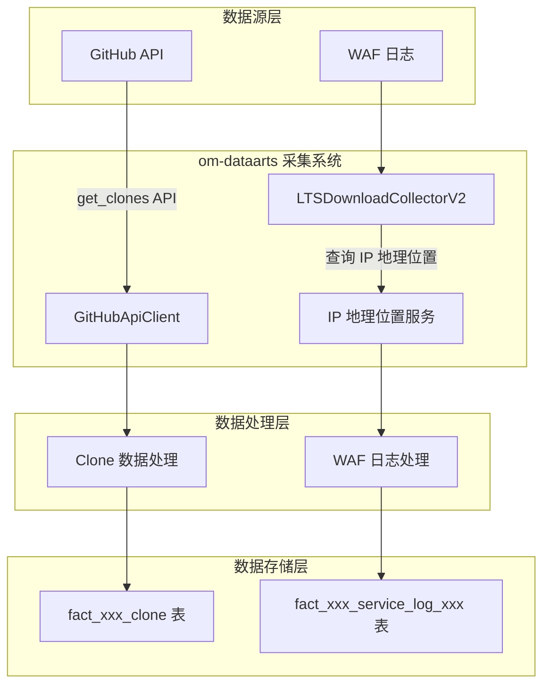
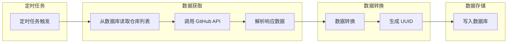
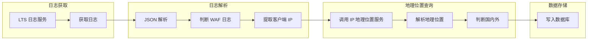
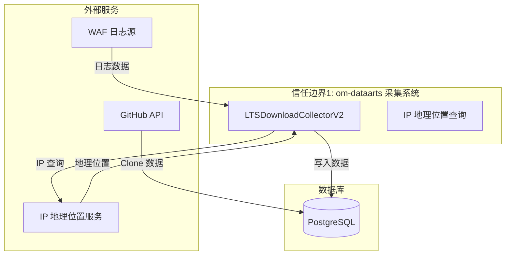

# #176 om-dataarts Data Collection Enhancement Architecture Design Specification

## 1. 基础信息

* **需求链接**: https://github.com/opensourceways/backlog/issues/176
* **需求名称**: om-dataarts数据采集功能增强
* **开发责任人**: ssignik
* **设计目标**: 实现 Clone 数据采集和 WAF 日志解析功能，增强 om-dataarts 数据采集能力

---

## 2. 功能设计

### 2.1 架构图

**设计说明/归档：**

本次需求涉及两个独立的功能模块：

1. **Clone 数据采集模块**：新增 GitHub Clone 数据采集功能
2. **WAF 日志解析模块**：增强 LTS 下载日志采集器的 WAF 日志解析能力

两个模块均为现有 om-dataarts 采集系统的功能增强，不涉及新增外部服务或组件。

**架构图（使用Mermaid）：**



### 2.2 数据流图

**设计说明/归档：**

#### Clone 数据采集流程



#### WAF 日志解析流程



**重要说明：**
- WAF 日志解析会存储**哈希后的客户端 IP**（存储字段：`request_ip`），不可还原原始 IP
- 同时存储解析后的地理位置信息（country、city、region、is_domestic 等）
- 哈希 IP 用于日志去重和活跃用户统计，兼顾业务需求与隐私保护

> **⚠️ 隐私保护设计说明**：考虑到 GDPR 等数据保护法规要求，采用 **IP 哈希化** 方案：
> - **原始 IP 地址**：仅在内存中用于查询地理位置，查询完成后应立即释放
> - **存储策略**：对客户端 IP 进行 SHA256 哈希处理（32位），存储哈希值而非原始 IP
> - **存储字段**：
>   - `request_ip`（哈希值，用于去重和统计）
>   - `country`、`country_iso_code`、`city`、`continent`、`lat`、`long`、`region`、`is_domestic`（共8个地理信息字段）
> - **隐私优势**：哈希值不可还原原始 IP，但相同 IP 仍可产生相同哈希，满足去重和统计需求

### 2.3 组件职责与接口

**设计说明/归档：**

#### 新增组件

| 组件 | 文件路径 | 职责 |
|-----|---------|------|
| `GithubApiClient.get_clones()` | `om/api/github_api.py` | 调用 GitHub API 获取仓库 Clone 数据 |
| `CloneCollector` | `om/collector/clone.py` | 采集器实现，负责数据获取、转换、入库 |
| `LTSDownloadCollectorV2.parse_log_waf()` | `om/collector/lts_download_collector_combine.py` | WAF 日志解析逻辑 |
| `CodeTableConfig.get_clone_config()` | `om/db/table/code_table.py` | Clone 表结构配置 |

#### 接口说明

**GithubApiClient.get_clones()**
```python
def get_clones(self, namespace: str, repo_path: str) -> Optional[Dict]:
    """获取仓库的 Clone 数据（最近14天）"""
    return self.get_one_data(f"/repos/{namespace}/{repo_path}/traffic/clones")
```

**IP 地理位置服务**
```python
def get_ip_geo(ip: str) -> Dict:
    """调用外部服务获取 IP 地理位置"""
    response = requests.get(f"{BASE_URL}/ip/{ip}", timeout=0.1)
    return response.json()
```

### 2.4 UX设计

**设计说明/归档：** 不涉及用户界面变更。

### 2.5 SOD设计

**设计说明/归档：** 不涉及权限变更。

### 2.6 功能设计分解TASK清单

**任务清单:**

| 任务 ID | 可服务性任务描述 | 责任人 |
|---------|----------------|--------|
| TASK1 | Clone 数据采集功能开发：新增 GithubApiClient.get_clones() 方法 | ssignik |
| TASK2 | CloneCollector 采集器开发：实现数据获取、转换、入库逻辑 | ssignik |
| TASK3 | 数据库表配置：新增 clone 表配置 | ssignik |
| TASK4 | WAF 日志解析开发：新增 parse_log_waf() 方法 | ssignik |
| TASK5 | 单元测试补充：新增测试用例，覆盖率 >= 80% | ssignik |

---

## 3. 非功能设计

### 3.1 安全与隐私设计评估和设计

> **注意**：本需求涉及客户端 IP 处理，需要进行隐私风险评估。

#### 3.1.1 威胁分析 (Threat Modeling)

**设计说明/归档：**

**数据流图与信任边界：**



**威胁分析表：**

| 威胁类别 | 攻击场景描述 | 风险等级 | 对应减缓措施 |
|---------|-------------|---------|-------------|
| **隐私泄露** | WAF 日志中的客户端 IP 被持久化存储到数据库 | 高 → 中 | **缓解措施（IP 哈希化方案）**：<br>1. 原始 IP 仅用于内存中查询地理位置，查询完成后立即释放<br>2. 对客户端 IP 进行 SHA256 哈希（32位）后存储<br>3. 存储字段：request_ip（哈希值）+ 8个地理信息字段<br>4. 哈希值不可还原原始 IP，但相同 IP 仍可去重和统计<br>5. 遵循 GDPR 等数据保护法规要求 |
| **信息泄露** | IP 地理位置服务返回敏感信息被滥用 | 低 | **已缓解**：仅存储必要的地理位置字段，不包含可追溯个人的信息 |
| **篡改/伪造** | 恶意构造 WAF 日志注入虚假数据 | 低 | **已缓解**：依赖 WAF 自身的日志完整性校验 |
| **拒绝服务** | IP 地理位置服务调用超时导致采集失败 | 中 | **已缓解**：设置超时时间（0.1秒），超时后跳过地理位置解析 |

#### 3.1.2 安全设计实现 (Security Mechanisms)

**设计说明/归档：**

* **数据安全**：
  - **IP 哈希化处理**：对客户端 IP 进行 SHA256 哈希（32位），存储哈希值而非原始 IP
  - **存储字段**：
    - `request_ip`（哈希值，用于去重和活跃用户统计）
    - 地理信息字段（8个）：`country`、`country_iso_code`、`city`、`continent`、`lat`、`long`、`region`、`is_domestic`
  - **原始 IP 处理**：仅在内存中使用，用于查询地理位置，查询完成后立即释放
  - 不写入日志或调试输出

* **传输安全**：
  - IP 地理位置服务调用使用 HTTPS（生产环境）
  - GitHub API 调用使用 HTTPS

* **边界防御**：
  - IP 地理位置查询设置超时（0.1秒），防止调用阻塞
  - 使用 request_id 去重，防止重复数据入库

#### 3.1.3 安全任务分解 (Security Task Breakdown)

**任务清单:**

| 任务 ID | 安全任务描述 | 责任人 |
|---------|-------------|-------|
| TASK-S1 | 实现 IP 哈希化函数：`hash_ip(ip) = md5(ip)` | ssignik |
| TASK-S2 | 修改数据写入逻辑，将原始 IP 替换为哈希值存储 | ssignik |
| TASK-S3 | 确保原始 IP 查询完地理位置后立即释放，不写入日志 | ssignik |
| TASK-S4 | 验证 get_ip_geo 超时配置正确（0.1秒） | ssignik |

---

### 3.2 可靠性与韧性设计评估和设计

**设计说明/归档：**

* **面向失败设计**：
  - IP 地理位置服务调用超时（0.1秒）后跳过该字段解析，不阻塞整体流程
  - GitHub API 调用失败时记录错误日志，继续处理其他仓库

* **重试与避让**：
  - 采集任务按配置的时间间隔执行，支持自动重试

---

### 3.3 可服务性与可观测性评估和设计

**设计说明/归档：**

* **日志记录**：
  - 采集异常时记录详细错误日志
  - WAF 日志解析失败时输出 `Failed to parse WAF log` 日志

* **错误处理**：
  - IP 地理位置查询异常时返回空字典，不影响主流程

---

### 3.4 性能与伸缩性评估和设计

**设计说明/归档：**

* **并发模型**：
  - IP 地理位置查询设置超时，避免长连接
  - GitHub API 调用受速率限制控制

* **水平扩展**：
  - 采集任务支持分布式部署

---