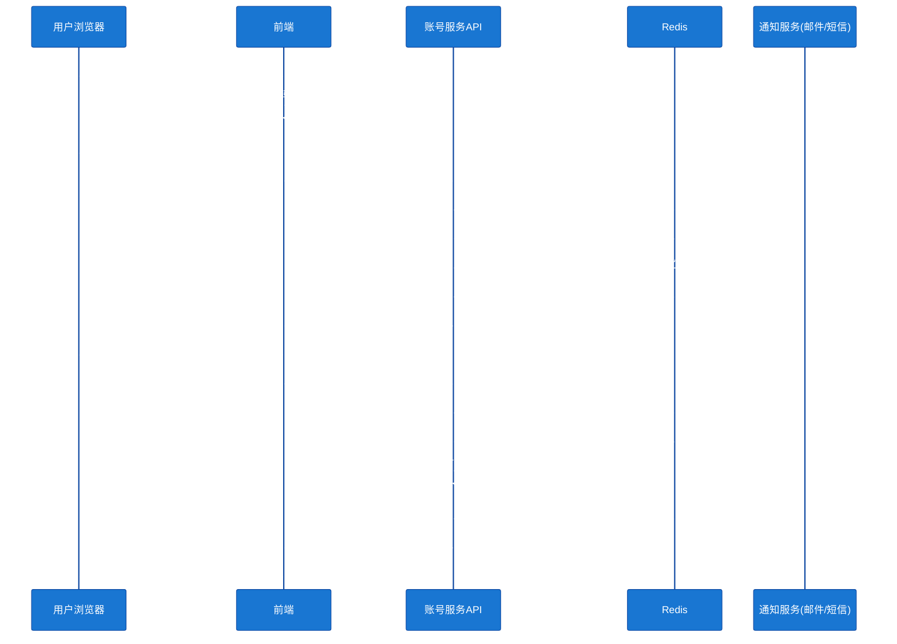
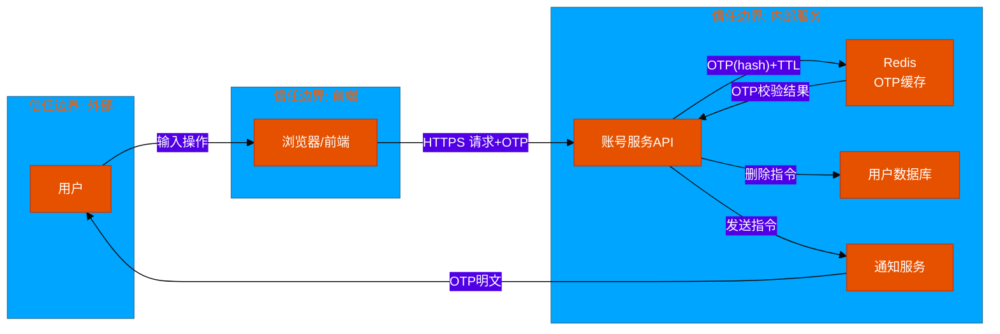
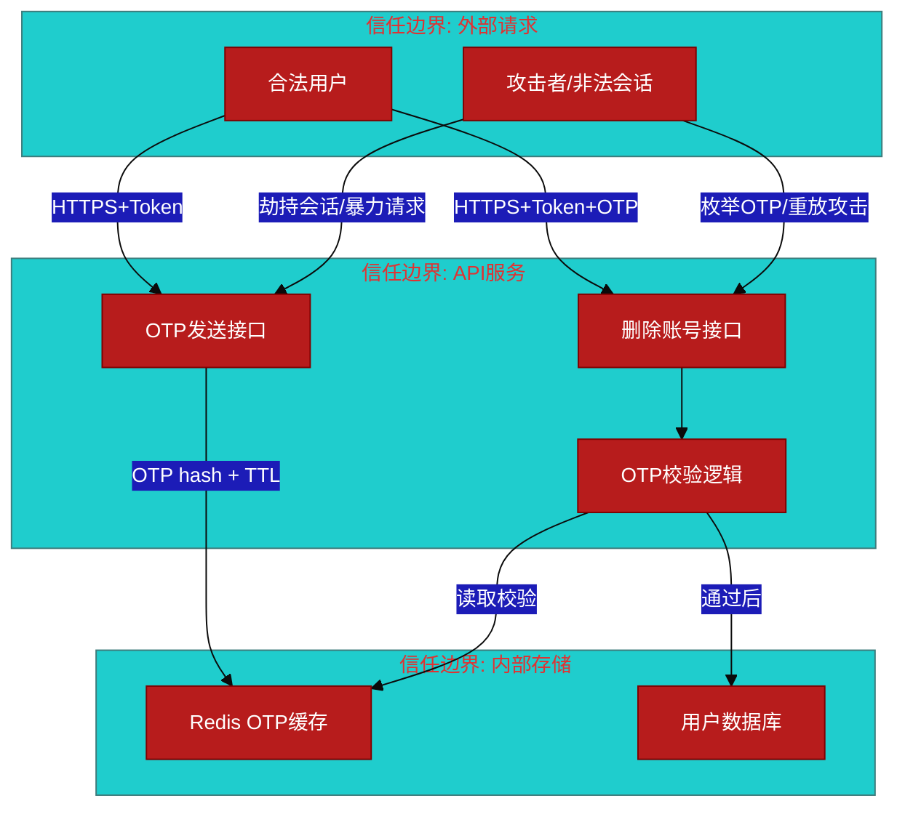

# #178 统一账号服务删除账号验证码验证 架构设计说明书 (Architecture Design Document)

---

## 1. 基础信息

* **需求链接**: [#178 统一账号服务需要在删除账号时通过邮箱/手机验证码进行验证](https://github.com/opensourceways/backlog/issues/178)
* **需求名称**: 统一账号服务删除账号增加邮箱/手机验证码验证
* **开发责任人**: Zherphy
* **设计目标**: 在账号删除流程中插入 OTP 验证环节，通过向已绑定邮箱或手机号发送一次性验证码确认操作者身份，后端校验通过后方可执行删除，防止会话劫持导致的账号非法删除。

---

## 2. 功能设计

> **说明**：描述系统的组件构成、职责划分及交互逻辑。

### 2.1 架构图

> 此处建议插入架构拓扑系统组件图或时序图，描述组件间的交互关系。推荐使用Mermaid实现，可代码化，GitHub可渲染。
> **不涉及需要说明原因**

**设计说明/归档：** 本次变更在现有统一账号服务架构基础上，新增 OTP 发送和校验两个接口，引入 Redis 缓存存储 OTP 状态（若服务已有 Redis 则复用）。不改变现有服务部署拓扑。



### 2.2 数据流图

> 此处建议插入数据流图，描述核心业务数据的生命周期，即威胁建模的基础。推荐使用Mermaid实现，可代码化，GitHub可渲染。
> **不涉及需要说明原因**

**设计说明/归档：** 核心数据流为 OTP 的生成 → 存储 → 验证 → 销毁全生命周期，以及用户账号数据的删除路径。



### 2.3 组件职责与接口

> 列出新增/修改的组件及其定义的 API 规范。**不涉及需要说明原因**

**设计说明/归档：**

#### 组件职责

| 组件 | 变更类型 | 职责描述 |
|------|---------|---------|
| 前端 DeleteAccount 模块 | 修改 | 新增验证码发送按钮、OTP 输入框，调整删除确认流程为两步（发送→验证） |
| 账号服务 API | 修改 | 新增 OTP 发送接口；修改删除账号接口，增加 OTP 参数校验前置步骤 |
| Redis | 复用/新增 | 存储 OTP 状态（hash 值、TTL、错误次数），Key 格式：`account:delete:otp:{userId}` |
| 通知服务 | 复用 | 调用已有邮件/短信发送能力，发送 OTP 内容 |

#### 接口定义

**新增接口：POST `/api/v1/account/delete/send-otp`**

```
Request:
  Header: Authorization: Bearer <token>
  Body: { "channel": "email" | "phone" }

Response 200:
  { "message": "OTP sent successfully", "expires_in": 300 }

Response 429:
  { "error": "rate_limit_exceeded", "retry_after": 60 }
```

**修改接口：DELETE `/api/v1/account`**

```
Request:
  Header: Authorization: Bearer <token>
  Body: { "otp": "string(6位数字)" }

Response 200:
  { "message": "Account deleted successfully" }

Response 400:
  { "error": "invalid_otp", "remaining_attempts": 2 }

Response 423:
  { "error": "otp_locked", "message": "Too many failed attempts" }
```

### 2.4 UX设计

> 设计目标：确保功能不仅"可用"，而且"好用"，降低开发者的认知负担和运维人员的误操作风险。 **不涉及需要说明原因**

**设计说明/归档：**

删除账号交互流程（两步验证模式）：

```
[原流程]
点击"删除账号" → 确认弹窗 → 删除

[新流程]
点击"删除账号"
  → 验证码弹窗
      ├── 展示已绑定的邮箱(脱敏，如 z***@example.com)和手机号(脱敏，如 138****8888)
      ├── 用户选择接收渠道
      ├── 点击"发送验证码"（60秒冷却倒计时）
      ├── 输入6位验证码
      └── 点击"确认删除"
           ├── OTP正确 → 执行删除 → 跳转注销完成页
           └── OTP错误 → 提示"验证码错误，还剩 N 次机会"（3次后锁定）
```

**交互细节要求：**
- 邮箱/手机号展示时必须脱敏，不暴露完整信息
- 发送后按钮进入 60 秒冷却，防止频繁发送
- 错误提示明确剩余尝试次数，锁定后提示需重新操作
- UX 设计说明已归档：[#178 UX Design.md](../Docs/%23178%20UX%20Design.md)

### 2.5 SOD设计

> 设计目标：通过维护SOD权限设计文档，确保权限设计可审计、可复用、可跨服务重用。
>
> **不涉及需要说明原因**
>
> **需要说明文档位置**

**设计说明/归档：** 不涉及，原因：账号删除为用户自助操作，仅涉及当前已登录用户对自身账号的操作权限，无跨角色或跨服务的权限分离需求，无需独立 SOD 设计。

### 2.6 功能设计分解TASK清单

**设计说明/归档：**

**任务清单:**

| 任务 ID  | 功能任务描述                                                           | 责任人    |
|--------|------------------------------------------------------------------|--------|
| TASK1  | 后端实现 OTP 发送接口（频率限制、通知服务对接）及修改删除账号接口（OTP 校验、错误次数限制、Redis 操作） | Zherphy |
| TASK2  | 前端调整删除账号弹窗为两步验证流程（发送验证码 + 输入验证码），脱敏展示已绑联系方式，接入新 API         | Zherphy |

---

## 3. 非功能设计

### 3.1 安全与隐私设计评估和设计

> **注意**：仅当需求判定为 **`need_security`** 时，本章节为必填项。

> 关注点：防御能力与合规边界。

### 3.1.1 威胁分析 (Threat Modeling)

> 基于 **STRIDE** 模型，识别本项目可能面临的安全威胁。

**设计说明/归档：**



**威胁分析表：**

| 威胁类别 | 攻击场景描述 | 风险等级 | 对应减缓措施 |
|---------|------------|---------|------------|
| **权限提升** | 攻击者获取有效会话 Token 后，绕过 OTP 校验直接调用删除接口 | 高 | 删除接口强制校验 OTP 参数，OTP 缺失或不合法时直接拒绝 |
| **信息泄露** | OTP 明文出现在服务端日志中，攻击者通过日志获取有效 OTP | 高 | 日志中禁止打印 OTP 原文，存储使用 HMAC-SHA256 哈希 |
| **拒绝服务** | 攻击者批量调用 OTP 发送接口，耗尽通知服务配额或锁定受害者账号 | 中 | 同一用户 60 秒内仅允许发送 1 次；全局接口限流 |
| **暴力破解** | 攻击者持续枚举 6 位数字 OTP（最多 1,000,000 种）进行破解 | 中 | 错误超过 3 次后锁定本次操作，需重新发起流程；OTP TTL 5 分钟 |
| **重放攻击** | 攻击者截获已使用的 OTP 再次提交 | 中 | OTP 验证通过后立即从 Redis 删除，实现一次性使用 |
| **隐私泄露** | 接口响应中返回完整邮箱或手机号，暴露用户隐私数据 | 中 | 前后端均对邮箱/手机号脱敏展示，API 响应中不返回完整联系方式 |

### 3.1.2 安全设计实现 (Security Mechanisms)

> **参考：**
> 威胁模型评估：
> * 是否已根据业务逻辑绘制 Data Flow Diagram 并识别单点风险？
>
> 软件供应链：
>* 是否扫描并修补了已知漏洞（CVE）？
>* 是否限制了第三方二进制包的直接引入？
>*
>凭证管理：
>* 严禁硬编码。
>* 密钥是否定期自动轮转（Rotation）？
>
>身份认证：
>* 是否具备多因素认证支持或联邦认证（OIDC）对接能力？
>* 内部微服务调用是否执行了身份校验（Identity-based Auth）？
>
>数据安全：
>* 传输加密（TLS 1.2+）与静态加密（AES-128）是否全覆盖？
>* 是否对高敏感字段（如手机号、秘钥）执行了哈希/加盐或差分隐私处理？
>
>运行时隔离：
>* 容器是否以非 Root 用户运行（Non-root Enforcement）？
>* 是否配置了 Read-only Root Filesystem 防止二进制篡改？
>
>日志审计：
>* 关键操作日志是否具备防篡改性？
>* 是否包含了足够用于追溯的 4W 信息（Who, When, Where, What）？

**设计说明/归档：**

* **凭证管理（OTP 存储安全）**：OTP 以 `HMAC-SHA256(otp, user_id)` 形式存储于 Redis，禁止存储明文。Redis Key 格式 `account:delete:otp:{userId}`，设置 TTL=300s。验证时服务端重新计算 Hash 对比，不将 OTP 原文传递给 Redis。

* **传输安全**：OTP 发送和验证接口全程仅通过 HTTPS（TLS 1.2+）访问，禁止 HTTP 降级。

* **访问控制**：所有接口要求有效的用户 Token（Bearer Auth），确保操作者为本人账号，禁止跨用户操作。

* **频率限制**：
  - OTP 发送：同一用户 60 秒内仅允许发送 1 次（Redis 计数），超限返回 429 并告知剩余等待时间。
  - OTP 校验：同一用户连续错误 3 次后，删除 Redis 中 OTP 记录并锁定本次操作（需用户重新发起），防止暴力破解。

* **一次性使用**：OTP 校验成功后立即执行 `DEL account:delete:otp:{userId}`，确保 OTP 不可重复使用。

* **日志审计**：账号删除操作（包括 OTP 发送、校验成功/失败、删除成功）记录审计日志，含 `userId`、`IP`、`timestamp`、`action`、`result`；日志中 OTP 字段脱敏（记录 `***` 而非明文）。

* **隐私保护**：前端展示已绑定联系方式时强制脱敏（邮箱 `z***@example.com`，手机 `138****8888`）；API 响应中不返回完整联系方式。

### 3.1.3 安全任务分解 (Security Task Breakdown)

> 将安全设计转化为具体的开发任务，需在代码或后续开发流程的安全配置中落实。

**任务清单:**

| 任务 ID   | 安全任务描述                                                         | 责任人    |
|---------|----------------------------------------------------------------|--------|
| SEC-T1  | OTP 存储改为 HMAC-SHA256 哈希，禁止明文存储；Redis Key 设计与 TTL 配置              | Zherphy |
| SEC-T2  | OTP 发送接口实现频率限制（60s/次/用户）及全局限流中间件                                | Zherphy |
| SEC-T3  | OTP 校验失败计数（3次锁定）+ 校验成功后立即销毁 OTP 记录                             | Zherphy |
| SEC-T4  | 审计日志接入：记录 OTP 发送、校验、删除全流程，OTP 字段脱敏                             | Zherphy |
| SEC-T5  | 前后端联系方式脱敏展示验证（邮箱/手机号均不暴露原文）                                     | Zherphy |

### 3.2 可靠性与韧性设计评估和设计（可选）

> **注意**：根据项目定级决定，含Core、Critical服务变更需要完成

> **关注点**：极端情况下的生存与恢复能力。
> **参考：**
> * 面向失败设计：是否识别了强依赖风险？当游依赖失效时，本服务是否具备降级或熔断能力？
> * 重试与避让：重试逻辑中是否包含指数退避和随机抖动以防止请求风暴？
> * 熔断限流：核心接口是否定义了明确的限流阈值？是否实现了断路器模式以保护下游？
> * 幂等设计：所有涉及写操作的任务是否支持重复调用而无副作用？

**设计说明/归档：** 不涉及，原因：账号删除为低频用户自助操作，非 Core/Critical 服务变更，无需高可用或熔断设计。Redis 不可用时应返回明确错误提示用户稍后重试，不做降级删除（安全优先）。

**任务清单:** 不涉及。

---

### 3.3 可服务性与可观测性评估和设计（可选）

> **关注点**：排障效率与全生命周期管理，确保故障可感知、可定位、可修复。

> **参考：**
>* 排障文档：是否提供了错误码对照表及对应的排障步骤？
>* 健康诊断：是否提供 /health 或 /status 接口，展示系统内部子模块的状态？
>* 平滑变更：升级或配置变更时如何实现灰度发布？是否具备一键回滚的判定指标？
>* 黄金指标覆盖：是否已定义并暴露出延迟、错误、流量和饱和度指标？

**设计说明/归档：** 不涉及，原因：本次变更为已有账号服务新增接口，复用现有服务的可观测性体系（日志、监控告警均已覆盖）。新接口接入现有错误码体系即可，无需单独建设。

**任务清单:** 不涉及。

---

### 3.4 性能与伸缩性评估和设计（可选）

> **关注点**：社区生态兼容性与未来扩展。

> **参考：**
> * 并发模型：在高并发场景下，锁竞争、连接池和线程池的配置是否已评估？
> * 水平扩展：服务是否实现了完全无状态化，支持快速扩容？
> * 延迟评估：关键路径的延迟是否业务需求？是否存在明显的 IO 或计算瓶颈？

**设计说明/归档：** 不涉及，原因：账号删除为极低频操作（用户主动行为），无高并发场景，OTP 操作时延可接受。Redis 和通知服务均为现有基础设施，容量充足。

**任务清单:** 不涉及。

---
