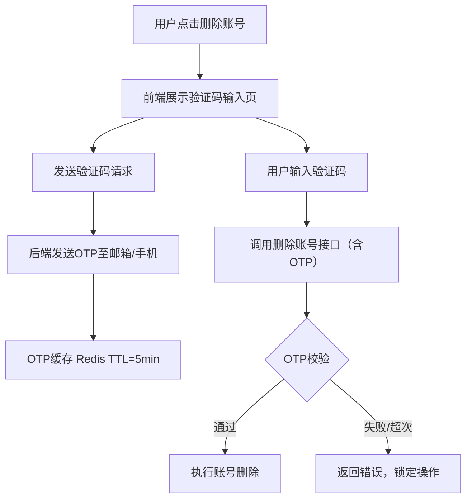

# #178 统一账号服务删除账号验证码验证需求分析说明书

## 1. 基础信息

* **需求链接**: [#178 统一账号服务需要在删除账号时通过邮箱/手机验证码进行验证](https://github.com/opensourceways/backlog/issues/178)
* **需求名称**: 统一账号服务删除账号增加邮箱/手机验证码验证
* **开发责任人**: Zherphy

---

## 2. 需求场景说明

> 描述"在什么情况下，为了解决什么问题，用户需要做什么"。

**场景说明:** 当前统一账号服务删除用户账号时，仅通过二次确认弹窗即可完成，缺乏身份验证环节。攻击者若获取用户会话后，可直接删除账号造成不可逆损失。本需求通过在删除账号流程中强制要求邮箱或手机验证码验证，确认操作人为账号真实持有者，从而提升账号删除操作的安全性。

**范围边界:**
- **在范围内**: 用户发起删除账号时，向已绑定邮箱或手机号发送 OTP 验证码，用户需输入正确验证码后方可完成删除。
- **不在范围内**: 修改账号注销的业务逻辑（数据清理、第三方解绑等）、新增邮箱/手机号绑定功能。

---

## 3. 需求验收标准

> 明确需求完成的标志，必须是可量化、可测试的。

**验收标准:**

1. 删除账号操作必须经过验证码校验，验证码正确后账号方可删除，跳过验证步骤直接调用删除接口应被拦截。
2. 用户可选择向已绑定邮箱或手机号发送验证码，两种渠道均可正常触发并收到验证码。
3. 验证码有效期为 5 分钟，过期后输入旧验证码应返回失败；同一验证码仅可使用一次，使用后立即失效。
4. 连续输入错误验证码超过 3 次后，本次删除操作被锁定，需用户重新发起流程。
5. 前端删除账号页面展示验证码发送和输入交互，交互流程符合 UX 规范。

---

## 4. 需求设计与分解

> 说明：基于初步方案，将需求拆解为可实施的原子 Task。后续的流程判定将严格依据这些 Task 的影响范围进行。

### 4.1 核心逻辑方案

> 简述实现逻辑（如：数据流向、模块改动、新增配置项等），作为任务拆解的理论依据。推荐使用Mermaid图表展示流程，支持GitHub原生渲染。

**逻辑方案:** 在现有账号删除接口前增加 OTP 验证环节。用户点击删除账号时，前端调用"发送验证码"接口，后端向已绑定邮箱或手机号发送 OTP 并缓存（Redis，TTL 5 分钟）。用户输入验证码后，前端携带验证码调用删除账号接口，后端先校验 OTP 有效性（含错误次数限制），校验通过后执行原有删除逻辑。

**流程图：**

### 4.2 任务清单

**任务清单:**

| 任务 ID   | 任务描述 (Task Description)                                         | 预期产出 (Deliverables)         | 预期工作量（人天） |
|---------|-------------------------------------------------------------------|-----------------------------|-----------|
| task1   | 后端新增发送验证码接口，修改删除账号接口增加 OTP 校验逻辑（含错误次数限制、Redis 缓存、单测）             | 接口代码、单测用例                   | 3         |
| task2   | 前端调整删除账号交互流程，增加验证码发送按钮和输入框，对接后端新接口                                 | 前端页面代码                      | 2         |

---

## 5. 需求相关性分析

> **操作说明**：根据上述拆解出的 Task，识别其变更行为。任何一项勾选为"是"：打上对应issue标签，必须执行对应的流程门禁。全部未勾选：该需求自动判定为轻量化特性，打上need_light标签。

### A. 安全相关性分析

> 若涉及以下任一项，打标 `need_security`标签，PR 必须关联特性issue的架构设计文档（含安全设计部分）**如勾选需要给出原因**。

**分析结论：触发 need_security**

* [ ] **边界变更**：新增公网端口、修改防火墙规则、变更网关配置。
* [x] **凭证处理**：涉及密钥（Secret/Key）、Token、证书的存储或分发。_OTP 验证码为一次性凭证，需通过 Redis 安全存储并设置有效期和使用次数限制。_
* [ ] **权限调整**：修改权限模型、服务账号（SA）权限或鉴权逻辑。
* [ ] **供应链**：引入新的第三方二进制文件、SDK 或重大版本依赖升级。
* [x] **隐私风险评估**：涉及用户个人数据（Email、手机号、IP、邮箱 等）的处理。_OTP 发送场景明确使用用户已绑定的邮箱和手机号，属于个人隐私数据处理。_
* [ ] **AI使用**：涉及AIGC能力应用，并提供服务。

### B. 架构设计相关性分析

> 若涉及以下任一项，打标 `need_design`标签，PR 必须关联特性issue的架构设计文档。 **如勾选需要给出原因**。

**分析结论：触发 need_design**

* [x] A环节判定需要完成安全设计。_A 环节勾选凭证处理和隐私风险，触发 need_security，自动联动 need_design。_
* [ ] 改变了现有系统的物理/逻辑拓扑。
* [x] 新增或大幅修改对外暴露的 API/CLI 接口。_新增"发送验证码"接口，修改"删除账号"接口以增加 OTP 参数，属于对外 API 变更。_
* [ ] 引入了新的中间件、数据库或三方核心组件。

### C. 系统集成测试相关性分析

> *若涉及以下任一项，打标 `need_itest`标签，PR必须关联特性issue的测试策略和测试报告文档。 **如勾选需要给出原因**。

**分析结论：触发 need_itest**

* [x] 上述环节判定需要执行安全设计或架构设计。_A/B 环节已触发 need_security 和 need_design。_
* [ ] **跨组件影响**：变更会触发下游服务或关联系统的连锁反应（级联效应）。
* [ ] **核心组件管控**：含项目定级为 Core 的核心逻辑变更。
* [ ] **环境强依赖**：功能高度依赖内核参数、网络拓扑或特定的物理挂载。
* [x] **端到端流程**：涉及从用户输入到持久化存储的全链路逻辑。_验证码发送 → 用户输入 → 后端校验 → 账号删除，是完整的端到端用户操作链路。_

### D. 用户体验相关性分析

> 若涉及以下任一项，打标 `need_ux`标签，PR必须关联特性issue的用户体验设计文档。 **如勾选需要给出原因**。

**分析结论：触发 need_ux**

* [x] **交互逻辑变更**：涉及 Web 门户、控制台（Dashboard）或命令行工具（CLI）的交互流程调整。_删除账号的前端交互流程新增验证码输入步骤，属于明显的交互逻辑变更。_
* [ ] **感知性能变动**：变更可能显著影响页面的加载时间、同步请求的响应时延或异步任务的进度反馈。
* [ ] **文档与辅助能力**：涉及报错提示语、帮助中心链接、FAQ 或新功能的 Runbook 说明。
* [ ] **无障碍与多语种**：涉及国际化（i18n）支持、辅助功能或不同终端（移动端/桌面端）的适配。

### 5.1 需求相关性分析汇总结果

**汇总结论：**

* [x] need_security (需架构设计（含安全威胁分析和安全设计）)
* [x] need_design (需架构设计)
* [x] need_itest (需执行测试策略设计和全链路集成测试)
* [x] need_ux (需架构设计（含UX设计）)
* [ ] need_light (上述均未勾选，走快速合入通道)

---

## 6. 价值识别与业务评估

> **判定准则**：基础设施接纳需求必须具备明确的 ROI（投资回报比）或合规必要性。

| 维度        | 评估问题                            | 结论/说明                                              |
|-----------|---------------------------------|----------------------------------------------------|
| **范围判定**  | 该需求是否属于基础设施范围内？                 | 是，统一账号服务属于基础设施安全能力范围。                              |
| **规划一致性** | 该需求是否是否在年度技术规划中？                | 是，在年度技术规划内。                                        |
| **优先级**   | 该需求优先级评估（高/中/低）？                | 高，账号删除为不可逆操作，安全加固优先级高。                             |
| **通用性**   | 该需求是否解决 3 个以上业务方的共性痛点？          | 是，统一账号服务覆盖所有使用该服务的业务方。                             |
| **必要性**   | 现有组件通过配置变更是否无法实现目标或没有不用开发的替代方案？ | 是，需在删除流程中新增 OTP 验证逻辑，无现成配置可实现。                     |
| **工作量**   | 预计总工作量                        | 约 5 人天。实际完成日期：2026-04-15（Zherphy）。              |
| **价值评估**  | 实现后能减少多少手动操作或提升多少系统稳定性？         | 降低账号被非法删除风险，满足账号安全操作二次认证的基线要求，提升用户数据保护水平。 |

> **状态定义：** **Accept (准入)** | **Reject (驳回)** |  **Pending (待议)**

**建议结论**：Accept

**原因描述:** 账号删除为不可逆高风险操作，缺乏身份二次认证存在明确安全漏洞。本需求通过 OTP 验证实现操作者身份确认，符合账号安全基线要求，工作量可控（约 5 人天），建议准入。

---
