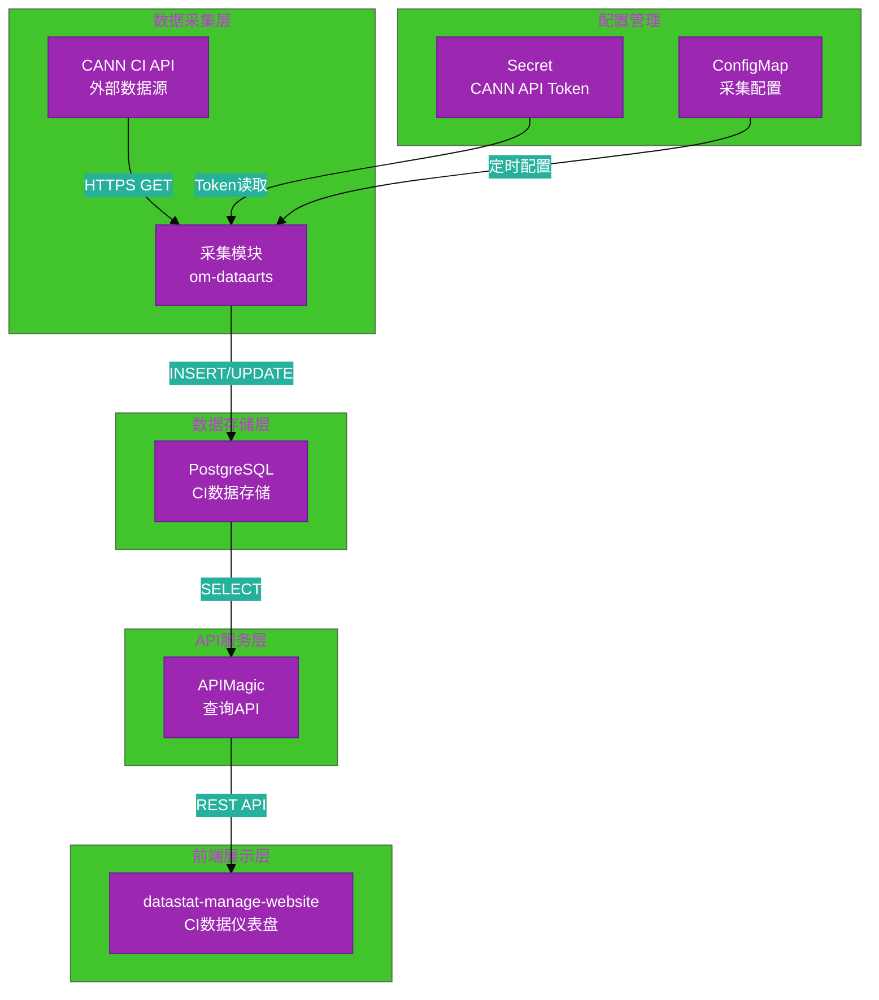
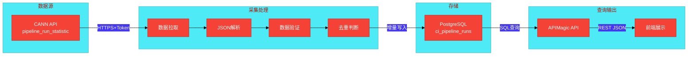
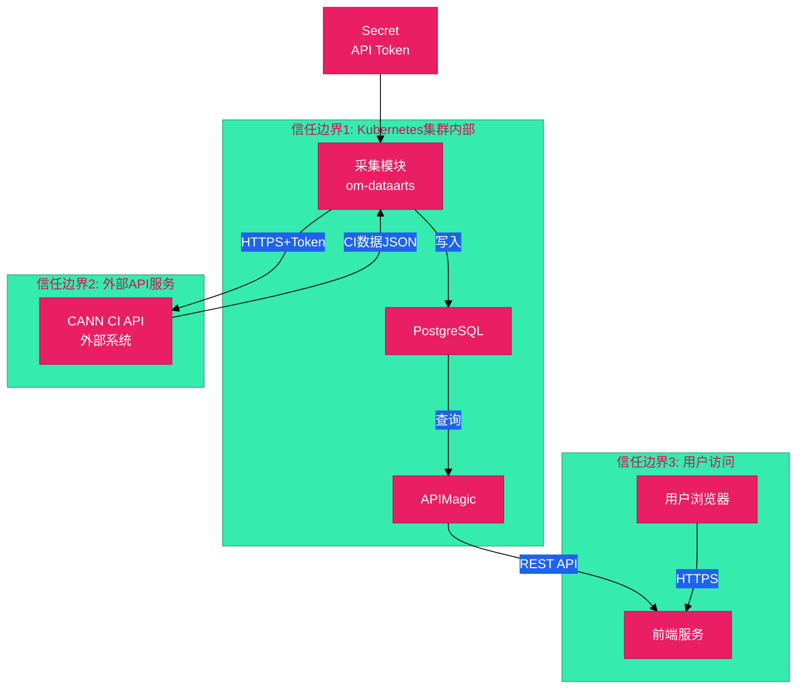

# #183 CANN社区CI数据采集与展示 架构设计说明书

---

## 1. 基础信息

* **需求链接**: https://github.com/opensourceways/backlog/issues/183
* **需求名称**: CANN社区CI数据采集与展示
* **开发责任人**: Kaede10
* **设计目标**: 在om-dataarts服务中新增CANN CI数据采集模块，通过定时任务增量采集CI流水线数据，存储至PostgreSQL；APIMagic通过SQL视图提供查询API，前端datastat-manage-website展示CI数据仪表盘。

---

## 2. 功能设计

> **说明**：描述系统的组件构成、职责划分及交互逻辑。

### 2.1 架构图

**设计说明/归档：**

**架构说明：**

- **数据采集层**：om-dataarts服务内部新增采集模块，定时调用CANN CI API获取数据
- **数据存储层**：PostgreSQL存储CI流水线运行记录，支持增量更新
- **API服务层**：APIMagic通过SQL视图封装查询逻辑，提供REST API
- **前端展示层**：datastat-manage-website新增CI数据展示页面
- **配置管理**：CANN API Token存储在Secret，采集参数存储在ConfigMap

### 2.2 数据流图

**设计说明/归档：**

**数据流说明：**

1. **数据拉取**：采集模块通过HTTPS + Token认证调用CANN API
2. **JSON解析**：解析API响应，提取pipeline_runs数据
3. **数据验证**：校验必填字段（run_number、status、start_time等）
4. **去重判断**：基于run_number判断是否已存在，避免重复写入
5. **增量写入**：仅写入新增或更新的记录
6. **查询输出**：前端通过API查询并展示

### 2.3 组件职责与接口

**设计说明/归档：**

| 组件 | 职责 | 输入 | 输出 |
|------|------|------|------|
| **采集模块** | 定时调用CANN API，增量同步CI数据 | API Token、时间范围参数 | CI数据记录 |
| **PostgreSQL** | 存储CI流水线运行记录 | INSERT/UPDATE语句 | 查询结果 |
| **APIMagic** | 封装SQL查询，提供REST API | 查询参数（时间、状态、分页） | JSON响应 |
| **前端页面** | 展示CI数据仪表盘 | API响应 | 可视化图表 |

### 2.4 UX设计

**设计说明/归档：**

**页面布局：**

1. **CI数据列表页**
   - 筛选器：时间范围、状态（success/failed/running）、分支
   - 表格列：run_number、merge_id、status、duration、start_time、stages概览
   - 分页：默认每页20条

2. **统计仪表盘**
   - 成功率统计（饼图）：success/failed/running占比
   - 耗时趋势（折线图）：近7天/30天平均duration变化
   - 阶段耗时分布（柱状图）：compile/smoke/llt/code_check等阶段耗时对比

**交互设计：**
- 点击run_number可跳转到CANN原始CI详情页
- 支持导出数据为CSV

### 2.5 SOD设计

> 不涉及，原因：本需求不涉及权限模型变更或用户角色调整，使用现有服务的权限体系。

**设计说明/归档：** 不涉及

### 2.6 功能设计分解TASK清单

**设计说明/归档：**

| 任务 ID | 功能任务描述 | 责任人 |
|---------|-------------|--------|
| **TASK1** | om-dataarts采集模块开发：实现API调用、增量同步、错误重试 | Kaede10 |
| **TASK2** | PostgreSQL表结构设计与数据写入逻辑实现 | Kaede10 |
| **TASK3** | APIMagic查询API开发：SQL视图 + REST接口 | maxueling |
| **TASK4** | 前端CI数据展示页面开发：列表页 + 统计仪表盘 | Kaede10 |

---

## 3. 非功能设计

### 3.1 安全与隐私设计评估和设计

> **注意**：本需求已打标 `need_security`，本章节为必填项。

### 3.1.1 威胁分析 (Threat Modeling)

**设计说明/归档：**

**信任边界图：**

**威胁分析表：**

| 娕胁类别 | 攻击场景描述 | 风险等级 | 对应减缓措施 |
|----------|-------------|----------|-------------|
| **信息泄露** | CI数据通过API被未授权用户访问 | 中 | APIMagic API添加认证鉴权，仅允许授权用户访问 |
| **篡改/伪造** | 攻击者伪造CANN API响应，注入虚假CI数据 | 中 | HTTPS通信验证证书；响应数据校验必填字段格式 |
| **拒绝服务** | CANN API不可用导致采集失败 | 低 | 采集失败自动重试（指数退避）；监控告警通知 |
| **拒绝服务** | 大量查询请求导致数据库过载 | 低 | API添加限流机制；SQL查询添加分页限制 |

### 3.1.2 安全设计实现 (Security Mechanisms)

**设计说明/归档：**

* **数据安全**：
  - 与CANN API通信使用HTTPS (TLS 1.2+)
  - PostgreSQL数据静态存储，访问需数据库账号认证
  - CI数据不含敏感个人信息（executor_detail仅含用户名，非隐私字段）

* **边界防御**：
  - API请求参数校验：时间范围、状态枚举值、分页参数
  - SQL查询防注入：使用参数化查询，不拼接SQL字符串

* **运行时隔离**：
  - om-dataarts容器以非Root用户运行
  - PostgreSQL访问权限限制，采集模块仅授予INSERT/UPDATE权限

* **日志审计**：
  - 采集日志记录4W信息：Who(服务名)、When(时间戳)、Where(采集模块)、What(采集结果统计)
  - 日志脱敏：不记录API Token完整内容，仅记录"Token已使用"

### 3.1.3 安全任务分解 (Security Task Breakdown)

**任务清单：**

| 任务 ID | 安全任务描述 | 责任人 |
|---------|-------------|--------|
| **SEC-TASK1** | 配置CANN API Token Secret，设置定期轮转流程 | Kaede10 |
| **SEC-TASK2** | 实现日志脱敏，过滤Token等敏感信息 | Kaede10 |
| **SEC-TASK3** | APIMagic API添加认证鉴权中间件 | Kaede10 |
| **SEC-TASK4** | SQL查询参数化，防止注入攻击 | Kaede10 |

### 3.2 可靠性与韧性设计评估和设计（可选）

> 不涉及
**设计说明/归档：** 不涉及

### 3.3 可服务性与可观测性评估和设计（可选）

> 不涉及

**设计说明/归档：** 不涉及

### 3.4 性能与伸缩性评估和设计（可选）

> 不涉及

**设计说明/归档：** 不涉及