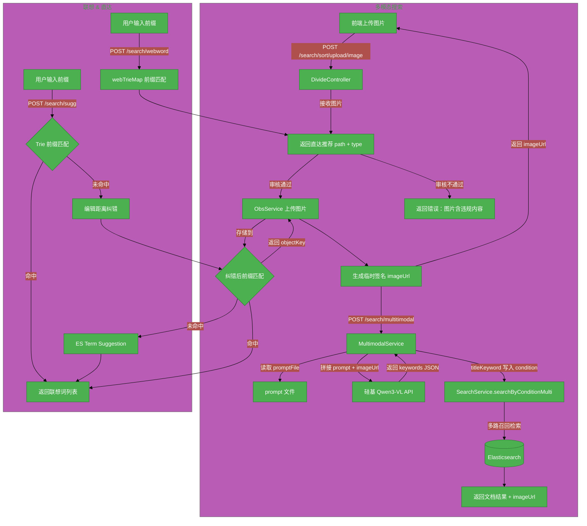

# #195 euler多模态搜索以及联想功能优化

## 1. 基础信息

* **需求链接**: https://github.com/opensourceways/backlog/issues/195
* **需求名称**: euler多模态搜索以及联想功能优化
* **开发责任人**: 谢承志

---

## 2. 需求场景说明

> 描述"在什么情况下，为了解决什么问题，用户需要做什么"。

**场景说明:** 开发者在使用 openEuler 过程中遇到报错时，往往只有错误截图，无法有效通过文字搜索找到对应解决方案，即使该问题为社区已知问题。同时，现有联想词功能在前缀匹配精度和直达推荐能力上存在明显不足，影响用户搜索体验。

**本次需求范围:**
- 新增多模态搜索能力（图搜文）：用户上传错误截图，后端调用大模型分析图片提取关键词，再执行文档检索并返回结果
- 新增图片上传接口：接收前端上传的图片，**先调用第三方内容安全审核 API 进行图片审核，仅审核通过才存储到华为云 OBS**，生成临时访问 URL 供大模型调用
- 新增搜索直达推荐接口：基于 Trie 前缀树，针对官网特定入口（如功能页、文档目录）提供跳转链接推荐
- 优化联想词功能：使用 Trie 前缀匹配替代原有纯 ES Suggest 实现，提升前缀命中率，并在前缀无结果时回退至编辑距离纠错
- 优化 word 接口匹配能力：`POST /search/word` 在 Trie 前缀匹配无结果时新增 ES wildcard 兜底查询（`*keyword*`），支持关键词出现在标题中间位置的场景，之前仅支持前缀匹配

**不在本次需求范围内:**
- 多模态搜索对视频、音频类内容的支持
- 多模态搜索结果的用户反馈与评分机制
- OBS 图片的长期存储与清理策略

---

## 3. 需求验收标准

> 明确需求完成的标志，必须是可量化、可测试的。

**验收标准:**

- [x] **图片上传**：`POST /search/sort/upload/image` 接口可接收图片文件（≤10MB，仅 image/* 类型），**先审核后上传**，审核通过才存储到 OBS 并返回临时访问 URL；审核不通过直接返回错误
- [x] **图片审核**：支持配置第三方内容安全审核服务（如华为云 Content Moderation），对违规图片（涉政、色情、暴力等）进行拦截；审核不通过不存储到 OBS，节省存储资源
- [x] **多模态搜索**：`POST /search/multitimodal` 接口接收图片 URL 和查询条件，调用 Qwen3-VL 大模型分析后提取关键词，完成文档检索，响应时间满足 P90 < 15s
- [x] **关键词提取**：大模型返回结构化 keywords JSON，包含 titleKeyword（用于检索标题）和 contentKeyword（用于检索正文），两者均不为空时判定为有效响应
- [x] **用户补充关键词**：当用户同时提供 keyword 字段时，大模型 prompt 中融合用户关键词优化提取结果
- [x] **联想词优化**：`POST /search/sugg` 接口优先使用 Trie 前缀匹配返回联想词，前缀无结果时触发编辑距离纠错，纠错后再次前缀匹配，最终仍无结果才回退 ES Suggest
- [x] **word 接口 wildcard 兜底**：`POST /search/word` 在 Trie 前缀匹配无结果时，自动触发 ES wildcard 查询（`*keyword*`，大小写不敏感），能匹配关键词位于标题中间位置的文档，之前仅支持前缀匹配
- [x] **搜索直达**：`POST /search/webword` 接口基于独立的 webTrieMap 前缀匹配，返回含 path 和 type 的直达跳转推荐，支持快速定位官网功能入口

---

## 4. 需求设计与分解

> 说明：基于初步方案，将需求拆解为可实施的原子 Task。后续的流程判定将严格依据这些 Task 的影响范围进行。

### 4.1 核心逻辑方案

> 简述实现逻辑（如：数据流向、模块改动、新增配置项等），作为任务拆解的理论依据。

**逻辑方案：**

**多模态搜索流程：**
1. 前端调用 `POST /search/sort/upload/image`，上传图片文件到服务端
2. 服务端接收图片后**先调用内容安全图片审核 API**：
   - 审核通过：将图片上传至华为云 OBS，生成临时签名 URL 返回给前端
   - 审核不通过：直接返回"图片包含违规内容"错误，不存储到 OBS
3. 前端携带 imageUrl 调用 `POST /search/multitimodal`，`MultimodalService` 从配置文件读取 prompt，拼接图片 URL 构造多模态请求体，调用硅基 Qwen3-VL-32B-Instruct API
4. 解析大模型返回的 JSON，提取 `keywords[0]`（titleKeyword）和 `keywords[1]`（contentKeyword），写入 `SearchCondition`
5. 以 titleKeyword 作为关键词调用多路召回检索 `searchByConditionMulti`，返回文档列表及 imageUrl

**联想词 / 搜索直达流程：**
- `getSuggestion`：优先 Trie 前缀匹配（支持逐步截断最多3个字符后重试），无结果时 `suggestCorrection` 编辑距离纠错后再匹配，最终回退 ES Term Suggestion
- `findWebWord`：基于 `webTrieMap`（初始化时载入官网直达词条，含 path 和 type）前缀匹配，返回直达推荐列表

**流程图：**

### 4.2 任务清单

**任务清单:**

| 任务 ID | 任务描述 (Task Description) | 预期产出 (Deliverables) | 预期工作量（人天） |
|---------|---------------------------|-----------------------|-----------------|
| **TASK1** | **OBS 服务集成** - 新增 `ObsConfig`、`ObsService`，实现图片上传和临时签名 URL 生成；引入华为云 OBS SDK 依赖 | `ObsConfig.java`、`ObsService.java`、`pom.xml` 更新 | **1** |
| **TASK2** | **图片内容安全审核集成** - 新增 `ContentAuditService`，调用第三方内容审核 API（如华为云 Content Moderation），对上传图片进行违规内容检测；支持配置开关，默认开启审核 | `ContentAuditService.java`、`ContentAuditConfig.java`、`pom.xml` 更新 | **1** |
| **TASK3** | **图片上传接口** - 在 `DivideController` 新增 `POST /search/sort/upload/image`，含文件类型和大小校验（≤10MB）；**先审核后上传**，审核通过才存储到 OBS，审核不通过直接返回错误 | `DivideController.java`、`Constants.java` | **0.5** |
| **TASK4** | **多模态服务开发** - 实现 `MultimodalService` / `MultimodalServiceImpl`，含 prompt 文件读取、Qwen3-VL API 调用、响应解析及关键词提取 | `MultimodalService.java`、`MultimodalServiceImpl.java`、prompt 配置文件 | **2** |
| **TASK5** | **多模态搜索接口** - 在 `SearchController` 新增 `POST /search/multitimodal`，组合调用 MultimodalService 和 SearchService.searchByConditionMulti | `SearchController.java`、`SearchCondition.java`（新增 MultimodalGroup 校验组） | **0.5** |
| **TASK6** | **Trie 前缀树优化 & word wildcard 兜底** - 增强 `Trie` 支持 `insert(word, path, type)` 和 `searchTopKWithPrefix`，`TrieNode` 增加 path/type 字段；`getSuggestion` 改造为前缀优先 + 编辑距离纠错回退；`findWord` 在 Trie 无结果时新增 ES wildcard（`*keyword*`）兜底，支持关键词中间位置匹配 | `Trie.java`、`TrieNode.java`、`SearchServiceImpl.java` | **1** |
| **TASK7** | **搜索直达接口** - 实现 `findWebWord`，初始化 `webTrieMap` 载入官网直达词条，新增 `POST /search/webword` 接口 | `SearchService.java`、`SearchServiceImpl.java`、`SearchController.java` | **1** |
| **TASK8** | **单元测试** - 覆盖 `MultimodalServiceImpl`、`ObsService` 和 `ContentAuditService` 关键路径（正常、API 异常、格式异常、违规图片等） | `MultimodalServiceImplTest.java`、`ObsServiceTest.java`、`ContentAuditServiceTest.java` | **1** |

---

## 5. 需求相关性分析

> **操作说明**：根据上述拆解出的 Task，识别其变更行为。任何一项勾选为"是"：打上对应 issue 标签，必须执行对应的流程门禁。全部未勾选：该需求自动判定为轻量化特性，打上 need_light 标签。

### A. 安全相关性分析

> 若涉及以下任一项，打标 `need_security` 标签，PR 必须关联特性 issue 的架构设计文档（含安全设计部分）。**如勾选需要给出原因**。

* [ ] **边界变更**：新增公网端口、修改防火墙规则、变更网关配置。
* [x] **凭证处理**：涉及密钥（Secret/Key）、Token、证书的存储或分发。
  * **原因**：TASK1 华为云 OBS AK/SK、TASK2 内容安全审核 AK/SK、TASK4 硅基大模型 Token 的配置与使用，需要安全存储凭证，防止泄露。
* [ ] **权限调整**：修改权限模型、服务账号（SA）权限或鉴权逻辑。
* [x] **供应链**：引入新的第三方二进制文件、SDK 或重大版本依赖升级。
  * **原因**：TASK1 引入华为云 OBS Java SDK、TASK2 引入华为云内容审核 SDK，均为新增三方依赖，需评估供应链安全。
* [ ] **隐私风险评估**：涉及用户个人数据（Email、手机号、IP、邮箱等）的处理。
* [x] **AI 使用**：涉及 AIGC 能力应用，并提供服务。
  * **原因**：TASK4 集成硅基 Qwen3-VL-32B-Instruct 多模态大模型，属于 AIGC 能力对外提供服务。
* [x] **内容安全**：用户上传用户生成内容（UGC）需要内容审核。
  * **原因**：新增用户上传图片功能，必须进行内容安全审核以拦截违规内容（涉政、色情、暴力等），符合安全相关性要求。

### B. 架构设计相关性分析

> 若涉及以下任一项，打标 `need_design` 标签，PR 必须关联特性 issue 的架构设计文档。**如勾选需要给出原因**。

* [x] A 环节判定需要完成安全设计。
* [ ] 改变了现有系统的物理/逻辑拓扑。
* [x] **新增或大幅修改对外暴露的 API/CLI 接口**。
  * **原因**：TASK3 新增 `POST /search/sort/upload/image`，TASK5 新增 `POST /search/multitimodal`，TASK7 新增 `POST /search/webword`，共3个新对外接口。
* [x] **引入了新的中间件、数据库或三方核心组件**。
  * **原因**：TASK1 引入华为云 OBS 对象存储；TASK2 引入华为云内容安全审核服务；TASK4 集成第三方大模型推理服务（硅基/SiliconFlow），均为新引入的核心外部依赖。

### C. 系统集成测试相关性分析

> 若涉及以下任一项，打标 `need_itest` 标签，PR 必须关联特性 issue 的测试策略和测试报告文档。**如勾选需要给出原因**。

* [x] 上述环节判定需要执行安全设计或架构设计。
* [x] **跨组件影响**：变更会触发下游服务或关联系统的连锁反应（级联效应）。
  * **原因**：多模态搜索链路涉及 EasySearch 服务、华为云 OBS、硅基大模型 API、Elasticsearch 四个系统的串行调用，任一节点异常均影响整体搜索结果。
* [ ] **核心组件管控**：含项目定级为 Core 的核心逻辑变更。
* [ ] **环境强依赖**：功能高度依赖内核参数、网络拓扑或特定的物理挂载。
* [x] **端到端流程**：涉及从用户输入到持久化存储的全链路逻辑。
  * **原因**：图片从前端上传 → OBS 持久化 → 大模型分析 → 关键词提取 → ES 检索 → 结果返回，为完整的端到端链路。

### D. 用户体验相关性分析

> 若涉及以下任一项，打标 `need_ux` 标签，PR 必须关联特性 issue 的用户体验设计文档。**如勾选需要给出原因**。

* [x] **交互逻辑变更**：涉及 Web 门户、控制台（Dashboard）或命令行工具（CLI）的交互流程调整。
  * **原因**：openEuler 官网搜索新增图片上传入口和多模态搜索结果展示，以及搜索直达推荐跳转，涉及前端交互流程变更。
* [x] **感知性能变动**：变更可能显著影响页面的加载时间、同步请求的响应时延或异步任务的进度反馈。
  * **原因**：多模态搜索链路新增大模型推理耗时（预计 P90 约 8~12s），相比纯文字搜索响应时延显著增加，需要前端提供进度反馈（如 loading 状态）。
* [ ] **文档与辅助能力**：涉及报错提示语、帮助中心链接、FAQ 或新功能的 Runbook 说明。
* [ ] **无障碍与多语种**：涉及国际化（i18n）支持、辅助功能或不同终端（移动端/桌面端）的适配。

### 5.1 需求相关性分析汇总结果

* [x] need_security（需架构设计（含安全威胁分析和安全设计））
* [x] need_design（需架构设计）
* [x] need_itest（需执行测试策略设计和全链路集成测试）
* [x] need_ux（需架构设计（含 UX 设计））
* [ ] need_light（上述均未勾选，走快速合入通道）

---

## 6. 价值识别与业务评估

> **判定准则**：基础设施接纳需求必须具备明确的 ROI（投资回报比）或合规必要性。

| 维度 | 评估问题 | 结论/说明 |
|------|---------|---------|
| **范围判定** | 该需求是否属于基础设施范围内？ | **是** - EasySearch 为 openEuler 官网搜索基础设施，本次多模态与联想优化均为搜索能力增强 |
| **规划一致性** | 该需求是否在年度技术规划中？ | **是** - 多模态搜索和搜索体验提升是官网能力建设的规划方向 |
| **优先级** | 该需求优先级评估（高/中/低）？ | **中** - 图搜文解决了开发者截图报错无法搜索的痛点，联想优化属于体验提升，整体优先级中等 |
| **通用性** | 该需求是否解决 3 个以上业务方的共性痛点？ | **是** - openEuler 社区所有通过官网搜索寻找文档、报错解决方案的开发者均受益 |
| **必要性** | 现有组件通过配置变更是否无法实现目标或没有不用开发的替代方案？ | **是** - 多模态图搜文需要新增大模型调用和 OBS 集成，联想优化需要 Trie 结构重构，均无法通过简单配置实现 |
| **工作量** | 预计总工作量 | **8 人天** |
| **价值评估** | 实现后能减少多少手动操作或提升多少系统稳定性？ | 开发者遇到报错截图时无需手动提取关键词，直接上图即可找到解决方案；联想词前缀命中率提升，减少用户无效查询次数 |

> **状态定义：** **Accept (准入)** | **Reject (驳回)** | **Pending (待议)**

**建议结论**：**Accept**

**原因描述：** 该需求通过引入多模态大模型能力，填补了 openEuler 搜索对图片类报错场景的覆盖空白，同时增加内容安全审核保证用户上传图片合规性，Trie 前缀优化和搜索直达功能显著提升联想推荐的精度和实用性。技术方案依托已有 EasySearch 服务扩展，主要新增 OBS 集成、内容审核、大模型调用三个外部依赖，工作量可控（8 人天），建议准入。
