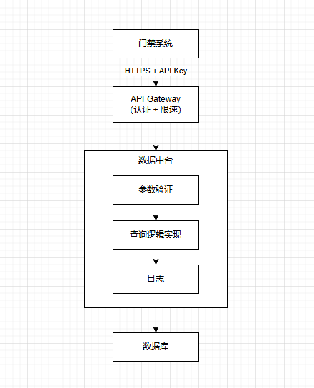
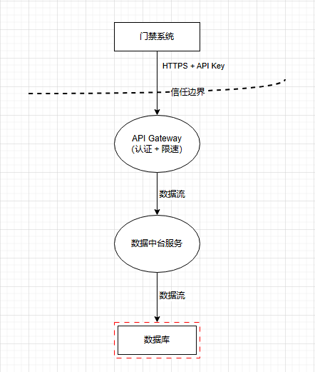

# #20 数据中台提供API获取社区人员邮箱架构设计说明书 (Architecture Design Document)
---

## 1. 基础信息

* **需求链接**: https://github.com/opensourceways/backlog/issues/20
* **需求名称**: 数据中台提供API获取社区基础设施人员邮箱用于门禁结果通知
* **开发责任人**: Kaede10
* **设计目标**: 为门禁系统及其他系统提供统一的用户邮箱查询API，支持通过github id或gitcode id查询用户邮箱地址

---

## 2. 功能设计

> **说明**：描述系统的组件构成、职责划分及交互逻辑。

### 2.1 架构图

> 此处建议插入架构拓扑系统组件图或时序图，描述组件间的交互关系。



**设计说明/归档：** 简单的API查询架构，通过API Gateway实现认证和限流，数据中台API Service负责业务逻辑。[获取社区人员邮箱API.drawio.html](../Docs/获取社区人员邮箱API.drawio.html)

### 2.2 数据流图

> 此处建议插入数据流图，描述核心业务数据的生命周期，即威胁建模。



**数据流说明**：

1. **数据存储**：用户邮箱数据存储在数据中台的用户数据库中（github_id、gitcode_id、email映射关系）
2. **数据访问**：调用方通过API Key认证后，通过API查询邮箱数据
3. **数据传输**：API响应中包含用户邮箱地址（加密传输）
4. **数据使用**：调用方使用邮箱数据发送通知（如门禁结果）
5. **数据审计**：所有API访问记录日志（脱敏处理），用于审计

**威胁建模关注点**：
- 数据传输过程中的窃听风险（中间人攻击）
- 未授权访问风险（API Key泄露）
- 数据泄露风险（日志中包含明文邮箱）
- 数据滥用风险（调用方过度访问或用于非授权用途）

**设计说明/归档：** [威胁分析](../Docs/获取社区人员邮箱API威胁分析.drawio.html)

### 2.3 组件职责与接口

> 列出新增/修改的组件及其定义的 API 规范。

#### 2.3.1 API接口规范

**接口路径**：`GET /api/v1/users/email`

**请求参数**：

| 参数名 | 类型 | 必填 | 说明 |
|--------|------|------|------|
| github_id | string | 否 | GitHub用户ID（github_id和gitcode_id二选一） |
| gitcode_id | string | 否 | GitCode用户ID（github_id和gitcode_id二选一） |

**请求头**：

| 参数名 | 类型 | 必填 | 说明 |
|--------|------|------|------|
| X-API-Key | string | 是 | API访问密钥 |

**请求示例**：

```bash
curl -X GET "https://datacenter.example.com/api/v1/users/email?github_id=johndoe" \
  -H "X-API-Key: your-api-key-here"
```

**响应格式（成功）**：

```json
{
  "code": 200,
  "message": "success",
  "data": {
    "email": "johndoe@example.com",
    "github_id": "johndoe",
    "gitcode_id": "johndoe"
  }
}
```

**响应格式（失败）**：

| 错误码 | 说明 | 响应示例 |
|--------|------|----------|
| 400 | 参数错误 | `{"code": 400, "message": "Missing required parameter: github_id or gitcode_id", "data": null}` |
| 401 | 认证失败 | `{"code": 401, "message": "Invalid API Key", "data": null}` |
| 404 | 用户不存在 | `{"code": 404, "message": "User not found", "data": null}` |
| 429 | 访问频率超限 | `{"code": 429, "message": "Rate limit exceeded", "data": null}` |
| 500 | 服务器错误 | `{"code": 500, "message": "Internal server error", "data": null}` |

#### 2.3.2 组件职责

| 组件 | 职责 |
|------|------|
| API Gateway | API Key认证、访问频率限制、请求路由 |
| API Service | 参数验证、业务逻辑处理、数据查询、日志记录 |
| 用户数据库 | 存储用户邮箱映射数据 |
| 监控告警系统 | 收集API指标、触发告警 |

**设计说明/归档：** 标准RESTful API设计，支持通过github_id或gitcode_id查询邮箱

### 2.4 UX设计

> 设计目标：确保功能不仅"可用"，而且"好用"，降低开发者的认知负担和运维人员的误操作风险。

**设计说明/归档：** 本需求为后端API，不涉及用户交互界面。但需要提供清晰的API文档和错误提示，方便调用方集成使用。

**文档要求**：
- 提供完整的API使用文档（包含接口路径、请求参数、响应格式、错误码说明、使用示例）
- 提供API Key管理手册（如何申请、如何使用、如何续期、如何撤销）
- 错误码需要清晰明确，便于调用方快速定位问题

### 2.5 SOD设计

> 设计目标：通过维护SOD权限设计文档，确保权限设计可审计、可复用、可跨服务重用。

**设计说明/归档：**

涉及API Key的权限管理，需要明确以下权限设计：

| 角色 | 权限 | 说明 |
|------|------|------|
| 数据中台管理员 | API Key生成、撤销、续期、查看访问日志 | 负责API Key的全生命周期管理 |
| API调用方（如门禁系统） | 使用API Key查询用户邮箱 | 仅具备查询权限，受访问频率限制 |

**API Key权限控制**：
- 每个API Key绑定特定的调用方（如门禁系统）
- API Key具备访问频率限制（如：100次/分钟）
- API Key具备有效期（如：1年），到期需要续期
- API Key支持撤销操作（泄露时立即撤销）

**审计要求**：
- 记录API Key的生成、使用、续期、撤销操作
- 记录所有API访问日志（包含API Key标识、请求参数、响应结果、时间戳）

### 2.6 功能设计分解TASK清单

**任务清单:**

| 任务 ID | 可服务性任务描述 | 责任人 |
|---------|-----------------|--------|
| **TASK1** | 设计和实现数据中台 API 接口逻辑（查询用户数据、返回邮箱、错误处理） | Kaede10 |
| **TASK2** | 配置 API 访问认证机制（API Key 生成、验证逻辑、权限控制） | Kaede10 |
| **TASK3** | 实现 API 访问日志记录（含日志脱敏） | Kaede10 |
| **TASK4** | 配置监控指标和告警规则 | Kaede10 |
| **TASK5** | 编写单元测试和接口测试用例 | Kaede10 |
| **TASK6** | 编写 API 使用文档和 API Key 管理手册 | Kaede10 |

---

## 3. 非功能设计

### 3.1 安全与隐私设计评估和设计

> **注意**：本需求判定为 **`need_security`**，本章节为必填项。

> 关注点：防御能力与合规边界。

### 3.1.1 威胁分析 (Threat Modeling)

> 基于 **STRIDE** 模型，识别本项目可能面临的安全威胁。

| 威胁类别 | 攻击场景描述 (Scenario) | 风险等级/评分 | 对应减缓措施 (Mitigation) |
|----------|------------------------|--------------|--------------------------|
| **欺骗 (Spoofing)** | 攻击者伪造API Key进行请求 | 高 | API Key采用强随机生成算法；API Key验证逻辑严格；记录访问日志便于追溯 |
| **否认 (Repudiation)** | 调用方否认曾访问过API | 中 | 完整的访问日志记录（包含API Key标识、时间戳、请求参数、响应结果） |
| **信息泄露 (Information Disclosure)** | API Key泄露导致未授权访问 | 高 | API Key加密存储；支持API Key撤销；API Key具备有效期；访问频率限制 |
| **信息泄露 (Information Disclosure)** | 日志中包含明文邮箱导致数据泄露 | 高 | 访问日志中对邮箱进行脱敏处理（如：j****e@example.com） |
| **信息泄露 (Information Disclosure)** | 数据库泄露导致用户邮箱泄露 | 高 | 数据库访问权限严格控制；数据库连接加密；定期安全审计 |
| **拒绝服务 (Denial of Service)** | 大量请求导致API服务不可用 | 中 | API访问频率限制（Rate Limiting）；API Gateway层面的防护 |
| **权限提升 (Elevation of Privilege)** | 调用方获取超出权限范围的数据 | 中 | API只返回查询的用户邮箱，不返回额外数据；API Key权限范围严格限制 |

**威胁建模图**：


```
威胁点：
1. API Key泄露 (信息泄露)
2. 中间人攻击 (篡改)
3. 日志泄露 (信息泄露) 
4. 数据库泄露 (信息泄露)
5. 拒绝服务攻击 (DoS)
```

### 3.1.2 安全设计实现 (Security Mechanisms)

> **参考检查清单**：

**凭证管理**：
- ✅ API Key采用强随机生成算法（至少256位熵）
- ✅ API Key在数据库中加密存储（AES-256）
- ✅ API Key支持定期自动轮转（有效期1年）
- ✅ API Key支持手动撤销
- ❌ 本需求不涉及硬编码风险（API Key由系统生成）

**身份认证**：
- ✅ API Key验证逻辑严格（请求头中携带X-API-Key）
- ✅ API Key与调用方绑定（记录API Key的所有者）
- ❌ 本需求不涉及多因素认证（内部系统间调用）
- ✅ API访问日志记录完整（Who, When, Where, What）

**数据安全**：
- ✅ 敏感数据脱敏（日志中邮箱脱敏：j****e@example.com）
- ✅ 数据库访问权限严格控制（最小权限原则）
- ✅ 数据库连接加密
- ❌ 邮箱数据不涉及静态加密（业务需要明文查询）

**访问控制**：
- ✅ API Key权限范围限制（只能查询邮箱，不能修改）
- ✅ API访问频率限制（Rate Limiting：100次/分钟/API Key）
- ✅ API响应数据最小化（只返回查询的邮箱，不返回额外信息）

**日志审计**：
- ✅ 记录所有API访问日志（请求参数、响应结果、调用方、时间戳）
- ✅ 日志中邮箱脱敏处理
- ✅ 日志具备防篡改性（集中式日志系统）
- ✅ 日志包含4W信息（Who: API Key标识, When: 时间戳, Where: 调用方IP, What: 查询的github_id/gitcode_id）

**运行时隔离**：
- ✅ API Service容器以非Root用户运行
- ✅ 配置Read-only Root Filesystem
- ✅ 最小权限原则（API Service只具备数据库查询权限，无写权限）

**设计说明/归档：**

1. **API Key管理**：
   - API Key生成：采用`crypto.randomBytes(32)`生成256位随机密钥
   - API Key存储：使用AES-256加密后存储在数据库中
   - API Key验证：请求头中携带`X-API-Key`，API Gateway验证有效性

2. **日志脱敏**：
   - 邮箱脱敏规则：保留第一个字符和`@`后的域名，中间部分替换为`****`
   - 示例：`johndoe@example.com` → `j****e@example.com`

3. **访问频率限制**：
   - 基于API Key的访问频率限制：600次/分钟
   - 超出限制返回429错误码
   - 使用Redis实现分布式限流

### 3.1.3 安全任务分解 (Security Task Breakdown)

> 将安全设计转化为具体的开发任务，需在代码或后续开发流程的安全配置中落实。

**任务清单:**

| 任务 ID | 安全任务描述 | 责任人 |
|---------|-------------|--------|
| **SEC-1** | 实现API Key强随机生成算法（256位熵） | Kaede10 |
| **SEC-2** | 实现API Key加密存储（AES-256） | Kaede10 |
| **SEC-3** | 实现API Key验证逻辑（请求头X-API-Key验证） | Kaede10 |
| **SEC-4** | 实现API访问频率限制（100次/分钟/API Key） | Kaede10 |
| **SEC-5** | 实现日志脱敏逻辑（邮箱脱敏） | Kaede10 |

