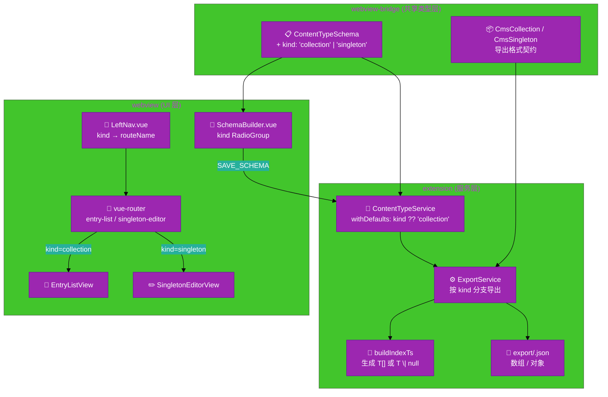

# Collection vs Singleton 架构设计说明书

---

## 1. 基础信息

- **需求链接**：[GitHub Issue #213](https://github.com/opensourceways/backlog/issues/213)
- **需求名称**：Collection 与 Singleton 内容类型区分支持
- **开发责任人**：gzbang
- **设计目标**：在 `ContentTypeSchema` 中引入 `kind: 'collection' | 'singleton'` 区分字段，使导出 JSON、TypeScript 类型生成、前端路由分发三处依据 `kind` 走差异化分支，从而消除 Singleton 类型的“伪数组”语义,提升类型安全性与开发者体验，并通过内存补全保持向后兼容。

---

## 2. 功能设计

### 2.1 架构图

**设计说明/归档：**

`kind` 字段贯穿数据模型、导出服务、前端路由三层，作为“分发开关”：schema 中携带类型标记，导出层据其生成不同产物，UI 层据其决定路由走向。



**说明：**

- 共享类型层：`kind` 字段定义在 `webview-bridge`，确保 extension 和 webview 类型一致
- 服务层：`ContentTypeService.withDefaults` 在读取时为旧 schema 内存补全 `kind: 'collection'`；`ExportService` 在 `exportContentType` 中按 `kind` 切换 `buildSingletonExport` / `buildStrapiCollection`
- UI 层：`LeftNav` 决定 `router.push` 目标路由名，`SingletonEditorView` 在 mounted 时若无条目则自动创建空 entry

### 2.2 数据流图

**设计说明/归档：**

`kind` 在三个关键节点产生数据流分叉：存储读取、导出生成、UI 路由。两条路径除“分叉点判定”外，共用同一份 `Entry` 存储模型（`content/<slug>/data.json`），因此持久化层无需差异化改造。

```mermaid
%%{init: {
  'theme': 'base',
  'themeVariables': {
    'primaryColor': '#f44336',
    'primaryBorderColor': '#c62828',
    'primaryTextColor': '#ffffff',
    'fontSize': '14px'
  }
}}%%
graph LR
    subgraph "用户输入"
        Create["📝 SchemaBuilder<br/>选择 kind"]
    end
    subgraph "持久化 (.cms/)"
        SchemaJson["💾 schemas/<slug>.json<br/>含 kind"]
        DataJson["💾 content/<slug>/data.json<br/>Entry[]"]
    end
    subgraph "Collection 路径"
        ColList["📑 EntryListView<br/>列表 + 新建/删除"]
        ColExport["📤 { data: CmsDocument[],<br/>meta.pagination }"]
        ColTs["📜 export const articles:<br/>Article[] = _load(...)"]
    end
    subgraph "Singleton 路径"
        SingEdit["✏️ SingletonEditorView<br/>无列表 / 无删除"]
        AutoCreate["🆕 首次进入<br/>自动创建空 Entry"]
        SingExport["📤 { data: CmsDocument }"]
        SingTs["📜 export const siteSettings:<br/>SiteSettings \| null = _loadSingleton(...)"]
    end
    Create -->|SAVE_SCHEMA| SchemaJson
    SchemaJson -->|kind=collection| ColList
    SchemaJson -->|kind=singleton| SingEdit
    SingEdit --> AutoCreate
    AutoCreate --> DataJson
    ColList --> DataJson
    DataJson -->|kind=collection<br/>published[]| ColExport
    DataJson -->|kind=singleton<br/>published[0] ?? null| SingExport
    ColExport --> ColTs
    SingExport --> SingTs
```

**说明：**

- 分叉发生在 `kind` 判定处，而 `Entry` 写入路径完全一致（均经 `EntryService.save`）
- 仅已发布（`publishedAt !== null`）的条目进入导出文件，Singleton 取首条已发布条目；若不存在则导出 `{ data: null }`
- TypeScript 声明差异：`_load<T>` 返回 `T[]`，`_loadSingleton<T>` 返回 `T | null`

### 2.3 组件职责与接口

**设计说明/归档：**

| 组件 | 改动类型 | 职责描述 |
| --- | --- | --- |
| `packages/webview-bridge/src/types.ts` | 修改 | `ContentTypeSchema` 新增必填 `kind` 字段；新增 `CmsSingleton<T>` 接口 |
| `packages/extension/src/services/service-content-type.ts` | 修改 | 新增 `withDefaults` 私有方法，`list()`/`get()` 出口处补全 `kind ?? 'collection'`（只补内存，不回写文件） |
| `packages/extension/src/services/service-export.ts` | 修改 | `exportContentType()` 按 `kind` 走 `buildSingletonExport` / `buildStrapiCollection`；`buildIndexTs()` 据 `kind` 生成单数变量（camelCase） + `T \| null` 或复数变量（pluralize） + `T[]`，并预置 `_loadSingleton<T>` 辅助函数 |
| `packages/webview/src/router/index.ts` | 修改 | 新增路由 `{ path: '/:slug/singleton', name: 'singleton-editor', component: SingletonEditorView }` |
| `packages/webview/src/views/SingletonEditorView.vue` | 新增 | 仅渲染 `EntryEditor`，首次挂载时若 `entries` 为空则调用 `setEntry(null)` 创建空草稿，保存后留在当前页 |
| `packages/webview/src/views/EntryListView.vue` | 修改 | 加载 schema 后若 `kind === 'singleton'`，通过 `router.replace` 重定向至 `singleton-editor` |
| `packages/webview/src/components/schema-builder/SchemaBuilder.vue` | 修改 | 新建表单接入 `RadioGroup`（Collection / Singleton）；编辑模式下隐藏选择器或以只读标签展示 |
| `packages/webview/src/components/LeftNav.vue` | 修改 | 点击 schema 时根据 `kind` 选择目标路由名：`entry-list` 或 `singleton-editor` |

**核心类型契约（`webview-bridge/src/types.ts`）：**

```typescript
export interface ContentTypeSchema {
  uid: string;
  name: string;
  slug: string;
  description?: string;
  kind: 'collection' | 'singleton'; // 新增，创建后只读
  fields: FieldDefinition[];
  createdAt: string;
  updatedAt: string;
}

export interface CmsSingleton<T extends Record<string, unknown> = Record<string, unknown>> {
  data: CmsDocument<T> | null;
}
```

**导出产物示例：**

```jsonc
// .cms/export/site-settings.json (singleton)
{ "data": { "id": 1, "documentId": "abc", "siteName": "My Blog", ... } }

// .cms/export/articles.json (collection)
{ "data": [ {...}, {...} ], "meta": { "pagination": { ... } } }
```

```typescript
// .cms/export/index.ts (生成片段)
export const siteSettings: SiteSettings | null = _loadSingleton<SiteSettings>('site-settings');
export const articles: Article[] = _load<Article>('articles');
```

### 2.4 UX设计

**设计说明/归档：**

#### 2.4.1 新建内容类型 — kind 选择器

`SchemaBuilder.vue` 在新建模式下渲染 RadioGroup，默认选中 `Collection`；编辑模式下隐藏（`kind` 创建后锁定）。

```text
┌─────────────────────────────────────────────────────┐
│  创建内容类型                                       │
│                                                     │
│  名称：  [________________]                         │
│  Slug： [________________]                          │
│                                                     │
│  内容类型 *                                         │
│   ● Collection — 可包含多条数据（文章、产品等）     │
│   ○ Singleton  — 只有一份数据（网站设置、关于页）   │
│                                                     │
│                              [取消]  [保存]         │
└─────────────────────────────────────────────────────┘
```

#### 2.4.2 Singleton 编辑视图

无列表页、无新建/删除按钮，顶部直接展示字段表单；保存后留在当前页给出 toast 提示。

```text
┌─────────────────────────────────────────────────────┐
│  网站设置                              [保存]       │
│                                                     │
│  网站名称：  [My Blog__________________]            │
│  联系邮箱：  [hello@example.com________]            │
│  ...                                                │
└─────────────────────────────────────────────────────┘
```

#### 2.4.3 交互差异对比

| 交互场景 | Collection | Singleton |
| --- | --- | --- |
| 侧边栏点击 | `router.push` → `entry-list` | `router.push` → `singleton-editor` |
| 列表/新建 | 显示列表与“新建”按钮 | 不存在 |
| 首次无数据 | 显示空列表占位 | 自动创建空草稿并进入编辑 |
| 删除按钮 | 存在 | 不存在（避免删除后重建带来的状态歧义） |
| 保存后跳转 | 返回列表页 | 留在当前页 |
| 页面标题 | “新建 xxx” / “编辑 xxx” | 始终为 `schema.name` |

### 2.5 SOD设计

**不涉及**：本需求为单机 VSCode 扩展内的数据模型与 UI 改造，不引入用户角色、权限或跨服务调用。

### 2.6 功能设计分解TASK清单

| 任务 ID | 任务描述 | 责任人 |
| --- | --- | --- |
| TASK1 | `ContentTypeSchema` 新增 `kind`；新增 `CmsSingleton` 类型 | gzbang |
| TASK2 | `service-export.ts` 按 `kind` 分支导出 JSON 与 `index.ts`（含 `_loadSingleton`） | gzbang |
| TASK3 | `service-content-type.ts` 新增 `withDefaults`，`list/get` 内存补全 `kind` | gzbang |
| TASK4 | `SchemaBuilder.vue` 新建表单接入 `kind` RadioGroup；编辑模式锁定 | gzbang |
| TASK5 | 新增路由 `singleton-editor`（`/:slug/singleton`） | gzbang |
| TASK6 | `EntryListView.vue` 加载后检测 `kind`，Singleton 走 `router.replace` 重定向 | gzbang |
| TASK7 | 新增 `SingletonEditorView.vue`，首次进入自动创建空草稿 | gzbang |
| TASK8 | `LeftNav.vue` 点击根据 `kind` 选择目标路由名 | gzbang |

---

## 3. 非功能设计

### 3.1 安全与隐私设计评估和设计

> 本需求未判定为 `need_security`，无安全相关性。

**不涉及安全设计**：仅改动数据模型与 UI 交互，不涉及公网端口/防火墙、凭证密钥、权限模型、第三方依赖、用户个人数据。

### 3.2 可靠性与韧性设计评估和设计

> 非 Core/Critical 服务，本节仅做关键风险点声明。

**设计说明/归档：**

- **向后兼容**：旧版 schema（无 `kind`）读取时由 `withDefaults` 在内存补全为 `'collection'`，不回写源文件；升级路径无破坏性变更
- **数据一致性**：`kind` 在创建后于 UI 层锁定为只读；切换 `kind` 会导致导出格式发生破坏性变更（数组↔对象、TypeScript 类型签名变化），禁止 in-place 修改
- **空状态退化**：Singleton 无已发布条目时导出 `{ data: null }`，生成的 `_loadSingleton` 返回 `null`，调用方需以 `?.` / `if` 判空，而非崩溃

### 3.3 可服务性与可观测性评估和设计

**设计说明/归档：**

- **错误提示**：用户尝试修改已锁定 `kind` 时，UI 提示“内容类型创建后不可变更，如需切换请删除并重建”
- **排障文档**：补充《Collection vs Singleton 概念说明》，涵盖两种类型的导出说明、TypeScript 用法示例与迁移指南

**任务清单：**

| 任务 ID | 可服务性任务描述 | 责任人 |
| --- | --- | --- |
| TASK1 | 撰写《Collection vs Singleton 概念说明》（导出说明 + 调用示例 + 迁移） | gzbang |

### 3.4 性能与伸缩性评估和设计

**不涉及**：VSCode 扩展本地运行，无并发与水平扩展场景；`kind` 分支判定为 O(1)，不引入额外 IO 或计算成本。

---

## 4. 关键设计决策

| 问题 | 决策 | 理由 |
| --- | --- | --- |
| `kind` 取值 | `'collection' \| 'singleton'` | 与 Strapi v4 命名对齐，降低用户与生态迁移成本 |
| 创建后是否允许修改 `kind` | 否，UI 锁定 | 切换会导致导出 JSON 与 TS 类型签名同时破坏性变更，无法平滑过渡 |
| Singleton 导出格式 | `{ data: {...} }` 对象，非 `{data:[]}` | 符合“唯一一份”的语义，调用方无需 `[0]` 取值 |
| Singleton 首次进入处理 | 自动创建空草稿并进入编辑 | 避免用户面对空列表无操作入口，与“始终有一份”语义一致 |
| Singleton 是否提供删除 | 否 | 删除后再次进入会自动重建，行为不可预期；如需清空，在编辑页清空字段保存 |
| `_load` vs `_loadSingleton` | 拆分两个生成函数 | 返回类型不同（`T[]` vs `T \| null`），拆分后类型推导更安全、调用更清晰 |
| 旧 schema 兼容策略 | 内存补全，不回写源文件 | 避免 CMS 读操作意外修改用户工作区文件，保持最小侵入 |

---
