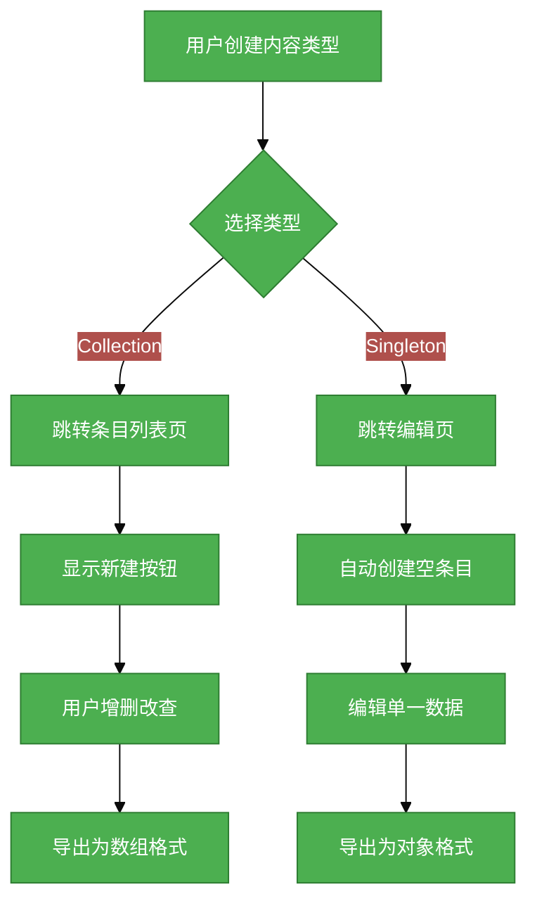

# Collection vs Singleton 需求分析说明书

## 1. 基础信息

- **需求链接**: [GitHub Issue #213](https://github.com/opensourceways/backlog/issues/213)
- **需求名称**: Collection 与 Singleton 内容类型区分支持
- **开发责任人**: [gzbang]

---

## 2. 需求场景说明

**场景说明:**

在 CMS 内容管理系统中，存在两种截然不同的内容类型场景：

1. **Collection 场景**：用户需要管理多条同类数据，如文章、产品、团队成员等。用户期望能够增删改查多条记录，并在前端通过数组迭代方式消费数据。

2. **Singleton 场景**：用户只需要维护单份数据，如网站设置、关于页面、联系信息、首页配置等。用户期望直接访问单一数据对象，而非通过数组索引获取。

**当前痛点：**

现有系统将所有内容类型统一导出为数组格式（`CmsCollection`），导致 Singleton 类型存在以下问题：

- 调用方必须写 `data[0]` 才能拿到数据，语义不自然
- 系统渲染了无意义的条目列表页、"新建"按钮等 UI 元素
- TypeScript 类型声明为数组，但业务上永远只有一个元素，类型欺骗性强

---

## 3. 需求验收标准

**验收标准:**

- [x] 新建内容类型时可选择 Collection 或 Singleton 类型
- [x] Collection 类型导出格式为 `{ data: [...], meta: {...} }`
- [x] Singleton 类型导出格式为 `{ data: {...} }`
- [x] Collection 类型生成 TypeScript 声明为 `export const articles: Article[]`
- [x] Singleton 类型生成 TypeScript 声明为 `export const siteSettings: SiteSettings | null`
- [x] 侧边栏导航点击 Collection 类型跳转至条目列表页
- [x] 侧边栏导航点击 Singleton 类型直接跳转至编辑页
- [x] Singleton 类型首次进入时自动创建空条目，无需手动新建
- [x] Singleton 类型不显示删除按钮
- [x] Singleton 类型保存后留在当前页，不跳转
- [x] 旧版 schema 文件（无 kind 字段）默认作为 Collection 处理，向后兼容

---

## 4. 需求设计与分解

### 4.1 核心逻辑方案

**逻辑方案:**

1. 在 `ContentTypeSchema` 中新增 `kind` 字段，取值为 `'collection' | 'singleton'`
2. 导出服务根据 `kind` 生成不同的 JSON 格式和 TypeScript 类型声明
3. 前端路由系统根据 `kind` 进行路由分发：Collection 走列表页，Singleton 走编辑页
4. 读取旧版 schema 时在内存中补全 `kind: 'collection'`，保持向后兼容

**流程图：**

### 4.2 任务清单

**任务清单:**

| 任务 ID | 任务描述                                         | 预期产出                       | 预期工作量（人天） |
| ------- | ------------------------------------------------ | ------------------------------ | ------------------ |
| task1   | 类型定义扩展：`ContentTypeSchema` 加 `kind` 字段 | 类型定义文件更新               | 0.5                |
| task2   | 导出服务改造：按 `kind` 分支生成不同格式         | `service-export.ts` 改造       | 1                  |
| task3   | 兼容性处理：旧 schema 读取时补全默认值           | `service-content-type.ts` 改造 | 0.5                |
| task4   | 前端表单：新建内容类型时增加 kind 选择器         | `SchemaBuilder.vue` 改造       | 0.5                |
| task5   | 路由系统：新增 singleton-editor 路由             | 路由配置更新                   | 0.5                |
| task6   | 列表页重定向：Singleton 类型自动跳转编辑页       | `EntryListView.vue` 改造       | 0.5                |
| task7   | Singleton 编辑页：首次进入自动创建空条目         | `SingletonEditorView.vue` 新增 | 1                  |
| task8   | 侧边栏导航：根据 kind 决定目标路由               | `LeftNav.vue` 改造             | 0.5                |

**总计：5 人天**

---

## 5. 需求相关性分析

### A. 安全相关性分析

- [ ] **边界变更**：新增公网端口、修改防火墙规则、变更网关配置。
- [ ] **凭证处理**：涉及密钥（Secret/Key）、Token、证书的存储或分发。
- [ ] **权限调整**：修改权限模型、服务账号（SA）权限或鉴权逻辑。
- [ ] **供应链**：引入新的第三方二进制文件、SDK 或重大版本依赖升级。
- [ ] **隐私风险评估**：涉及用户个人数据的处理。
- [ ] **AI使用**：涉及AIGC能力应用。

**结论**：无安全相关性。

### B. 架构设计相关性分析

- [ ] A环节判定需要完成安全设计
- [ ] 改变了现有系统的物理/逻辑拓扑
- [x] 新增或大幅修改对外暴露的 API/CLI 接口
- [ ] 引入了新的中间件、数据库或三方核心组件

**原因**：TypeScript 类型生成接口发生变更，导出格式新增 Singleton 类型。

**结论**：需更新 API 文档，但不涉及系统架构变更。

### C. 系统集成测试相关性分析

- [ ] 上述环节判定需要执行安全设计或架构设计。
- [ ] **跨组件影响**：变更会触发下游服务或关联系统的连锁反应。
- [ ] **核心组件管控**：含项目定级为 Core 的核心逻辑变更。
- [ ] **环境强依赖**：功能高度依赖内核参数、网络拓扑或特定的物理挂载。
- [ ] **端到端流程**：涉及从用户输入到持久化存储的全链路逻辑。

**结论**：无系统集成测试相关性。

### D. 用户体验相关性分析

- [x] **交互逻辑变更**：涉及 Web 门户、控制台或命令行工具的交互流程调整。
- [ ] **感知性能变动**：变更可能显著影响页面的加载时间、同步请求的响应时延或异步任务的进度反馈。
- [ ] **文档与辅助能力**：涉及报错提示语、帮助中心链接、FAQ 或新功能的 Runbook 说明。
- [ ] **无障碍与多语种**：涉及国际化支持、辅助功能或不同终端的适配。

**原因**：

- 交互逻辑变更：新建内容类型表单增加类型选择器；Singleton 类型隐藏新建/删除按钮

### 5.1 需求相关性分析汇总结果

- [ ] need_security (需架构设计（含安全威胁分析和安全设计）)
- [x] need_design (需架构设计)
- [ ] need_itest (需执行测试策略设计和全链路集成测试)
- [x] need_ux (需架构设计（含UX设计）)
- [ ] need_light (上述均未勾选，走快速合入通道)

---

## 6. 价值识别与业务评估

| 维度           | 评估问题                                       | 结论/说明                                               |
| -------------- | ---------------------------------------------- | ------------------------------------------------------- |
| **范围判定**   | 该需求是否属于基础设施范围内？                 | 是，属于 CMS 核心功能                                   |
| **规划一致性** | 该需求是否在年度技术规划中？                   | 是，符合产品路线图                                      |
| **优先级**     | 该需求优先级评估？                             | 中                                                      |
| **通用性**     | 该需求是否解决 3 个以上业务方的共性痛点？      | 是，所有 Singleton 类型内容均受益                       |
| **必要性**     | 现有组件通过配置变更是否无法实现目标？         | 是，需核心改造                                          |
| **工作量**     | 预计总工作量                                   | 5 人天                                                  |
| **价值评估**   | 实现后能减少多少手动操作或提升多少系统稳定性？ | 消除 Singleton 类型的语义歧义，提升开发体验和类型安全性 |

**建议结论**：Accept

**原因描述**：该需求解决了 Singleton 类型数据导出格式语义不自然的问题，提升了 TypeScript 类型安全性，改善了用户体验，工作量适中，收益明确。
