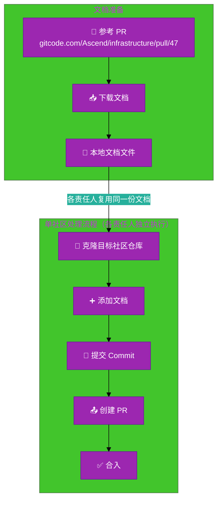
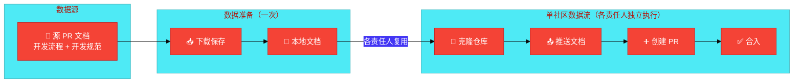

# #231 社区开发流程及其规范发布到各社区架构设计说明书 (Architecture Design Document)
---

## 1. 基础信息

* **需求链接**: [GitHub Issue #231](https://github.com/opensourceways/backlog/issues/231)
* **需求名称**: 社区开发流程及其规范发布
* **开发责任人**: [各社区对应责任人]
* **设计目标**: 通过手动 PR 操作方式，将开发流程和规范文档传播到各目标社区仓库保存。

---

## 2. 功能设计

> **说明**：描述系统的组件构成、职责划分及交互逻辑。

### 2.1 架构图

> 文档传播流程的架构拓扑。

**设计说明/归档：**

本需求为文档传播类任务，不涉及系统架构变更，仅为手动操作流程。下图描述单个社区的文档传播操作流程。

**关键说明**：每个目标社区由对应责任人独立执行，流程相同。一个社区 → 一个仓库克隆 → 一个 PR → 一个责任人。

### 2.2 数据流图

> 核心业务数据的生命周期。

**设计说明/归档：**

文档从源 PR 下载后保存到本地，各社区责任人复用同一份文档执行推送流程。

**关键说明**：同一份文档内容被各社区责任人复用，每个责任人独立完成其负责社区的数据推送。

### 2.3 组件职责与接口

> 列出新增/修改的组件及其定义的 API 规范。

**不涉及**：本需求为文档传播类任务，无代码开发，不涉及组件变更或 API 接口定义。

**设计说明/归档：** 手动操作流程，无自动化组件或接口。

### 2.4 UX设计

> 设计目标：确保功能不仅"可用"，而且"好用"，降低开发者的认知负担和运维人员的误操作风险。

**不涉及**：本需求为文档传播类任务，无 UI/UX 变更。

### 2.5 SOD设计

> 设计目标：通过维护SOD权限设计文档，确保权限设计可审计、可复用、可跨服务重用。

**不涉及**：本需求为文档传播类任务，不涉及权限模型或 SOD 设计变更。

### 2.6 功能设计分解TASK清单

**设计说明/归档：**

**任务清单:**

| 任务 ID             | 可服务性任务描述                                    | 责任人    |
|-------------------|---------------------------------------------|--------|
| **TASK1** | 下载源文档内容并保存到本地（含格式验证） | 文档准备责任人 |
| **TASK2** | 克隆目标社区仓库、添加文档、提交 PR | 各社区对应责任人 |

---

## 3. 非功能设计

### 3.1 安全与隐私设计评估和设计

> **注意**：本需求判定为 `need_light`，不涉及安全设计。

**不涉及**：原因如下：
- 无边界变更：不新增公网端口、防火墙规则或网关配置
- 无凭证处理：不涉及密钥、Token、证书的存储或分发
- 无权限调整：不修改权限模型或鉴权逻辑
- 无供应链变更：不引入新的第三方组件
- 无隐私风险：不涉及用户个人数据处理
- 无 AI 使用：不涉及 AIGC 能力应用

### 3.1.1 威胁分析 (Threat Modeling)

**不涉及**：无系统变更，不存在安全威胁。

### 3.1.2 安全设计实现 (Security Mechanisms)

**不涉及**：无系统变更，无需安全设计实现。

### 3.1.3 安全任务分解 (Security Task Breakdown)

**不涉及**：无安全相关任务。

### 3.2 可靠性与韧性设计评估和设计（可选）

> **注意**：本需求为文档传播类任务，不涉及系统可靠性设计。

**不涉及**：手动操作流程，无自动化系统，不存在可靠性或韧性需求。

### 3.3 可服务性与可观测性评估和设计（可选）

> **关注点**：排障效率与全生命周期管理，确保故障可感知、可定位、可修复。

**不涉及**：手动操作流程，无自动化系统，不存在可服务性或可观测性需求。

### 3.4 性能与伸缩性评估和设计（可选）

> **关注点**：社区生态兼容性与未来扩展。

**不涉及**：手动操作流程，无性能或伸缩性需求。

**未来扩展建议**：若后续需自动化文档传播，可考虑开发自动化脚本工具，批量向社区提交 PR。