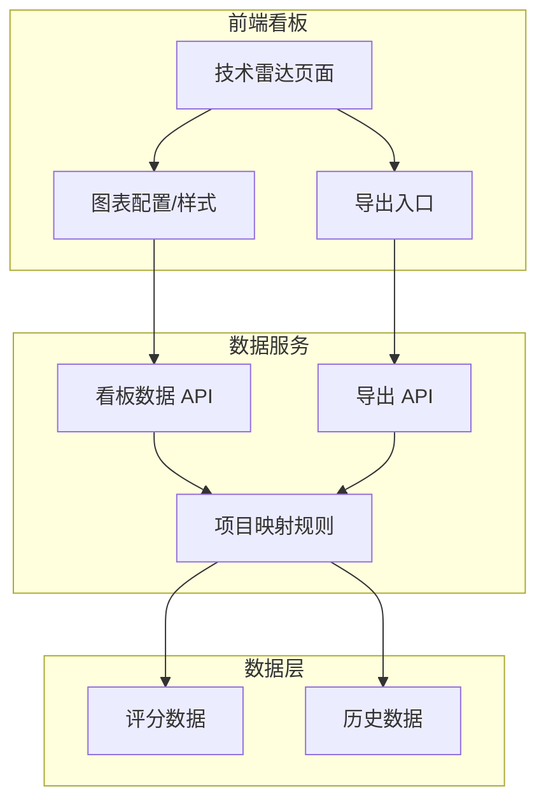
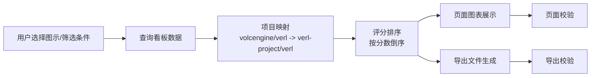

# #259 技术雷达看板 430 架构设计说明书 (Architecture Design Document)

---

## 1. 基础信息

* **需求链接**: [#259 [需求]: 技术雷达看板 430需求](https://github.com/opensourceways/backlog/issues/259)
* **需求名称**: 技术雷达看板 430 优化
* **开发责任人**: zhongjun2
* **设计目标**: 在不改变现有部署拓扑的前提下，对齐技术雷达看板的视觉样式、时间口径、排序规则、项目名称展示、仓库更名历史数据口径和数据导出能力，保证页面展示与导出结果一致。

---

## 2. 功能设计

> **说明**：描述系统的组件构成、职责划分及交互逻辑。

### 2.1 架构图

> 此处建议插入架构拓扑系统组件图或时序图，描述组件间的交互关系。推荐使用Mermaid实现，可代码化，GitHub可渲染。

**设计说明/归档：** 本次优化复用现有技术雷达看板架构，不新增中间件。前端负责样式、图示选择、排序展示、时间刷新和导出入口；后端/数据服务负责项目更名映射、评分数据查询和导出数据生成。



### 2.2 数据流图

> 此处建议插入数据流图，描述核心业务数据的生命周期，即威胁建模的基础。推荐使用Mermaid实现，可代码化，GitHub可渲染。

**设计说明/归档：** 核心数据流包括筛选条件、项目映射、评分排序、页面展示和导出文件生成。页面展示与导出必须使用一致的数据查询条件和字段口径。



### 2.3 组件职责与接口

> 列出新增/修改的组件及其定义的 API 规范。

**设计说明/归档：**

| 组件 | 变更类型 | 职责描述 |
|------|----------|----------|
| 技术雷达前端页面 | 修改 | 对齐图示样式、配色、线条、图示选择方式、项目名称展示、排序和横轴配置。 |
| 时间刷新模块 | 修改 | 页面自动获取最新月份数据，时间戳统一展示为 `YYYY-MM`。 |
| 项目映射模块 | 修改 | 将历史数据中的 `volcengine/verl` 映射到 `verl-project/verl`，保证历史趋势连续。 |
| 看板数据 API | 修改 | 返回按分数排序后的数据，支持项目名展示字段和最新月份数据。 |
| 数据导出 API | 新增/修改 | 按当前筛选条件导出看板数据，字段口径与页面一致。 |

**接口说明：**

```text
GET /api/tech-radar/data
参数：month、chart_type、filters
返回：项目名、月份、评分、排名、图示所需指标

GET /api/tech-radar/export
参数：month、chart_type、filters、format
返回：当前筛选条件下的导出文件
```

实际接口路径以现有系统路由为准；若已有接口可复用，优先在现有接口上扩展字段和导出能力。

### 2.4 UX设计

> 设计目标：确保功能不仅“可用”，而且“好用”，降低开发者的认知负担和运维人员的误操作风险。

**设计说明/归档：** 本需求触发 `need_ux`，UX 重点是与原系统保持一致并降低数据误读风险。

| 设计项 | 设计要求 |
|--------|----------|
| 视觉样式 | 图示、线条粗细、配色与原系统一致。 |
| 图示选择 | 选择方式与原系统一致，切换后图表数据和标题同步刷新。 |
| 时间展示 | 自动刷新到最新月份，时间戳展示为 `YYYY-MM`。 |
| 排序展示 | 所有图示按分数倒序展示，Top 项目在上方。 |
| 项目名称 | 雷达数据只展示项目名，不展示组织名。 |
| 导出反馈 | 导出成功、导出失败、空数据均需给出明确反馈。 |

### 2.5 SOD设计

> 设计目标：通过维护SOD权限设计文档，确保权限设计可审计、可复用、可跨服务重用。
>
>**需要说明文档位置**

**设计说明/归档：** 不涉及。原因：本需求不新增角色、审批流或权限分离模型；数据导出遵循现有看板访问权限。

### 2.6 功能设计分解TASK清单

**设计说明/归档：**

**任务清单:**

| 任务 ID | 可服务性任务描述 | 责任人 |
|---------|------------------|--------|
| TASK1 | 前端图表样式、配色、图示选择方式、项目名称展示和横轴起点调整。 | zhongjun2 |
| TASK2 | 时间自动刷新、`YYYY-MM` 展示和按分数倒序排序规则实现。 | zhongjun2 |
| TASK3 | 项目更名映射与历史数据核对，保证 `verl-project/verl` 数据连续。 | zhongjun2 |
| TASK4 | 数据导出入口和导出 API 对接，保证导出字段和页面数据一致。 | zhongjun2 |

---

## 3. 非功能设计

### 3.1 安全与隐私设计评估和设计

> **注意**：仅当需求判定为 **`need_security`** 时，本章节为必填项。 **无该标签可删除本章节。**

> 关注点：防御能力与合规边界。

**设计说明/归档：** 本需求未触发 `need_security`。数据导出仍需遵循现有看板权限边界，不在文档或导出文件中新增敏感字段。

### 3.2 可靠性与韧性设计评估和设计（可选）

> **注意**：根据项目定级决定，含Core、Critical服务变更需要完成

> **关注点**：极端情况下的生存与恢复能力。

**设计说明/归档：** 自动刷新和导出能力不能影响看板基础浏览。导出失败时页面应保持可用，并展示失败提示。

**任务清单:**

| 任务 ID | 可靠性与韧性任务描述 | 责任人 |
|---------|----------------------|--------|
| TASK1 | 导出请求失败时返回明确错误信息，页面不阻塞其他图表浏览。 | zhongjun2 |
| TASK2 | 自动刷新失败时保留当前已加载数据，并提示最新数据获取失败。 | zhongjun2 |

---

### 3.3 可服务性与可观测性评估和设计（可选）

> **关注点**：排障效率与全生命周期管理，确保故障可感知、可定位、可修复。

**设计说明/归档：** 需要能定位数据不一致、导出失败和项目映射异常问题。

**任务清单:**

| 任务 ID | 可服务性任务描述 | 责任人 |
|---------|------------------|--------|
| TASK1 | 记录导出请求的筛选条件、记录数和失败原因，不记录敏感信息。 | zhongjun2 |
| TASK2 | 为项目映射核对保留验证记录，说明历史数据是否连续。 | zhongjun2 |

---

### 3.4 性能与伸缩性评估和设计（可选）

> **关注点**：社区生态兼容性与未来扩展。

**设计说明/归档：** 排序和导出可能增加查询与前端渲染成本，应避免页面加载明显变慢。

**任务清单:**

| 任务 ID | 性能任务描述 | 责任人 |
|---------|--------------|--------|
| TASK1 | 页面首次加载和图示切换保持在可接受范围内，避免因排序和映射引入明显卡顿。 | zhongjun2 |
| TASK2 | 导出使用当前筛选条件生成文件，避免一次性导出无关全量数据。 | zhongjun2 |

---
