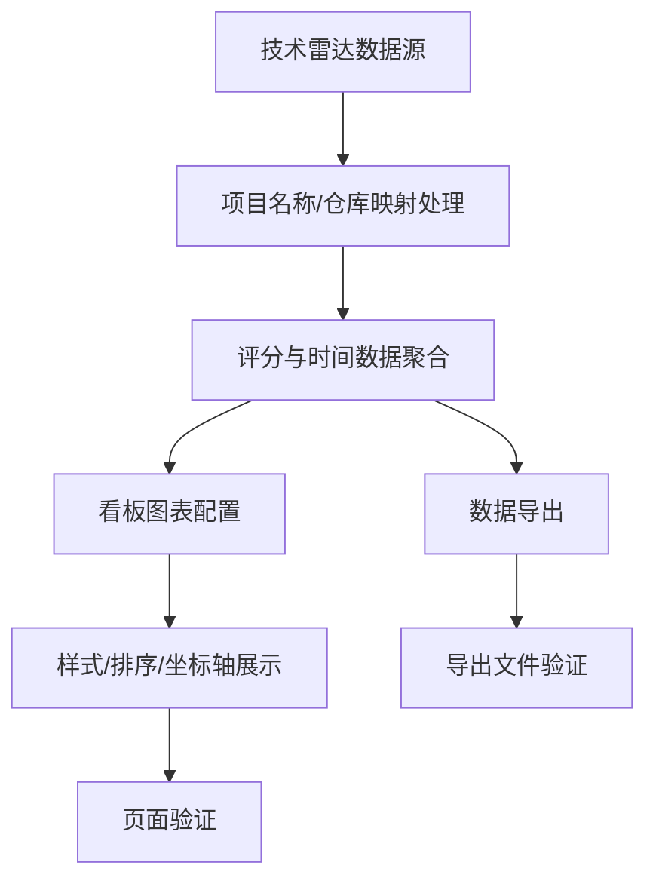

# #259 技术雷达看板 430需求分析说明书

## 1. 基础信息

* **需求链接**: [#259 [需求]: 技术雷达看板 430需求](https://github.com/opensourceways/backlog/issues/259)
* **需求名称**: 技术雷达看板 430 优化
* **开发责任人**: zhongjun2

---

## 2. 需求场景说明

> 描述"在什么情况下，为了解决什么问题，用户需要做什么"。

**场景说明:** 当前技术雷达看板在视觉样式、时间展示、排序规则、项目名称展示和数据导出能力上与原系统存在差异，影响用户对技术项目评分和趋势信息的识别效率。本次 430 需求需要完成高优先级与中优先级优化，使看板展示口径、交互方式和数据校验结果与原系统保持一致。

**范围边界:**
- **在范围内**: 样式对齐、配色对齐、时间自动刷新、时间戳格式调整为年份-月份、图示按分数倒序排序、仓库更名后的历史数据核对、综合评分横轴从 0 开始、雷达项目名仅展示项目名、图示选择方式对齐、数据导出。
- **不在范围内**: 低优先级能力，包括编辑所见即所得、zoom in/out、时间快捷索引。

---

## 3. 需求验收标准

> 明确需求完成的标志，必须是可量化、可测试的。

**验收标准:**

1. 看板图示样式、线条粗细、配色与原系统视觉规范对齐，至少覆盖雷达图、综合评分排名图和项目列表 3 类展示区域。
2. 看板时间自动刷新生效，页面展示月份不再固定为 2025.12；时间戳统一展示为 `YYYY-MM` 格式。
3. 所有图示排序统一按分数倒序展示，Top 项目排在上方；综合评分排名图横轴从 0 开始。
4. `volcengine/verl` 更名为 `verl-project/verl` 后，历史数据完成核对并保证同一项目的历史评分连续展示，不重复、不丢失。
5. 雷达数据项目名称仅展示项目名，不展示组织名；图示选择方式与原系统交互保持一致。
6. 数据导出功能可导出当前筛选条件下的看板数据，导出文件字段完整，导出记录数与页面当前数据源一致。

---

## 4. 需求设计与分解

> 说明：基于初步方案，将需求拆解为可实施的原子 Task。后续的流程判定将严格依据这些 Task 的影响范围进行。

### 4.1 核心逻辑方案

> 简述实现逻辑（如：数据流向、模块改动、新增配置项等），作为任务拆解的理论依据。推荐使用Mermaid图表展示流程，支持GitHub原生渲染。

**逻辑方案:** 在现有技术雷达看板基础上调整前端图表配置、视觉样式、时间格式与刷新逻辑；后端或数据层补充项目更名映射和历史数据核对规则；导出接口复用当前筛选条件生成结构化文件。变更完成后通过页面展示、数据一致性和导出结果三类验证闭环。

### 4.2 任务清单

**任务清单:**

| 任务 ID | 任务描述 (Task Description) | 预期产出 (Deliverables) | 预期工作量（人天） |
|---------|---------------------------|----------------------|----------------|
| **TASK1** | 调整看板视觉样式、配色、图示选择方式、项目名称展示和综合评分横轴配置。 | 前端图表配置和样式代码 | 3 |
| **TASK2** | 实现时间自动刷新、`YYYY-MM` 时间戳展示、所有图示按分数倒序排序。 | 前端逻辑和排序规则代码 | 2 |
| **TASK3** | 处理 `volcengine/verl` 到 `verl-project/verl` 的项目映射并核对历史数据连续性。 | 数据映射规则、核对记录 | 2 |
| **TASK4** | 支持当前筛选条件下的数据导出并完成页面/导出一致性验证。 | 导出接口/前端入口、验证记录 | 2 |

**预计总工作量**: 9 人天

---

## 5. 需求相关性分析

> **操作说明**：根据上述拆解出的 Task，识别其变更行为。任何一项勾选为"是"：打上对应issue标签，必须执行对应的流程门禁。全部未勾选：该需求自动判定为轻量化特性，打上need_light标签。

### A. 安全相关性分析

> 若涉及以下任一项，打标 `need_security`标签，PR 必须关联特性issue的架构设计文档（含安全设计部分）**如勾选需要给出原因**。

**分析结论：不触发 need_security**

* [ ] **边界变更**：新增公网端口、修改防火墙规则、变更网关配置。
* [ ] **凭证处理**：涉及密钥（Secret/Key）、Token、证书的存储或分发。
* [ ] **权限调整**：修改权限模型、服务账号（SA）权限或鉴权逻辑。
* [ ] **供应链**：引入新的第三方二进制文件、SDK 或重大版本依赖升级。
* [ ] **隐私风险评估**：涉及用户个人数据（Email、手机号、IP、邮箱 等）的处理。
* [ ] **AI使用**：涉及AIGC能力应用，并提供服务。

### B. 架构设计相关性分析

> 若涉及以下任一项，打标 `need_design`标签，PR 必须关联特性issue的架构设计文档。 **如勾选需要给出原因**。

**分析结论：触发 need_design**

* [ ] A环节判定需要完成安全设计。
* [ ] 改变了现有系统的物理/逻辑拓扑。
* [x] 新增或大幅修改对外暴露的 API/CLI 接口。_新增或调整数据导出能力，需要明确导出接口、筛选参数和字段口径。_
* [ ] 引入了新的中间件、数据库或三方核心组件。

### C. 系统集成测试相关性分析

> *若涉及以下任一项，打标 `need_itest`标签，PR必须关联特性issue的测试策略和测试报告文档。 **如勾选需要给出原因**。

**分析结论：触发 need_itest**

* [x] 上述环节判定需要执行安全设计或架构设计。_B 环节已触发 need_design。_
* [x] **跨组件影响**：变更会触发下游服务或关联系统的连锁反应（级联效应）。_看板展示、数据映射、排序聚合和导出链路需要前后端及数据源一致。_
* [ ] **核心组件管控**：含项目定级为 Core 的核心逻辑变更。
* [ ] **环境强依赖**：功能高度依赖内核参数、网络拓扑或特定的物理挂载。
* [x] **端到端流程**：涉及从用户输入到持久化存储的全链路逻辑。_筛选条件、图示展示、项目映射和导出文件需要端到端验证。_

### D. 用户体验相关性分析

> 若涉及以下任一项，打标 `need_ux`标签，PR必须关联特性issue的用户体验设计文档。 **如勾选需要给出原因**。

**分析结论：触发 need_ux**

* [x] **交互逻辑变更**：涉及 Web 门户、控制台（Dashboard）或命令行工具（CLI）的交互流程调整。_图示选择方式、项目名称展示和数据导出入口均属于看板交互变更。_
* [x] **感知性能变动**：变更可能显著影响页面的加载时间、同步请求的响应时延或异步任务的进度反馈。_时间自动刷新和数据导出可能影响用户感知响应，需要控制加载和导出反馈。_
* [x] **文档与辅助能力**：涉及报错提示语、帮助中心链接、FAQ 或新功能的 Runbook 说明。_数据导出能力需要明确导出失败、空数据等提示语。_
* [ ] **无障碍与多语种**：涉及国际化（i18n）支持、辅助功能或不同终端（移动端/桌面端）的适配。

### 5.1 需求相关性分析汇总结果

**汇总结论：**

* [ ] need_security (需架构设计（含安全威胁分析和安全设计）)
* [x] need_design (需架构设计)
* [x] need_itest (需执行测试策略设计和全链路集成测试)
* [x] need_ux (需架构设计（含UX设计)）
* [ ] need_light (上述均未勾选，走快速合入通道)

---

## 6. 价值识别与业务评估

> **判定准则**：基础设施接纳需求必须具备明确的 ROI（投资回报比）或合规必要性。

| 维度        | 评估问题                            | 结论/说明 |
|-----------|---------------------------------|-------|
| **范围判定**  | 该需求是否属于基础设施范围内？                 | 是，技术雷达看板属于社区基础设施数据展示与运营分析能力。 |
| **规划一致性** | 该需求是否是否在年度技术规划中？                | 是，属于既有看板能力对齐和 430 节点优化。 |
| **优先级**   | 该需求优先级评估（高/中/低）？                | 高，Issue 中高优先级项占主要交付范围，且标记 accepted。 |
| **通用性**   | 该需求是否解决 3 个以上业务方的共性痛点？          | 是，看板结果面向技术项目评估、运营分析和管理决策场景。 |
| **必要性**   | 现有组件通过配置变更是否无法实现目标或没有不用开发的替代方案？ | 是，涉及前端展示、数据映射、排序规则和导出能力开发。 |
| **工作量**   | 预计总工作量？        | 9 人天 |
| **价值评估**  | 实现后能减少多少手动操作或提升多少系统稳定性？         | 统一看板展示口径和导出能力，减少人工核对与手工导出成本，提升评分数据可信度。 |

> **状态定义：** **Accept (准入)** | **Reject (驳回)** |  **Pending (待议)**

**建议结论**： **Accept**

**原因描述:** 该需求已被标记 accepted，且围绕技术雷达看板的展示一致性、数据准确性和导出能力补齐，能直接提升 430 节点交付质量和运营分析效率，建议准入。

---
