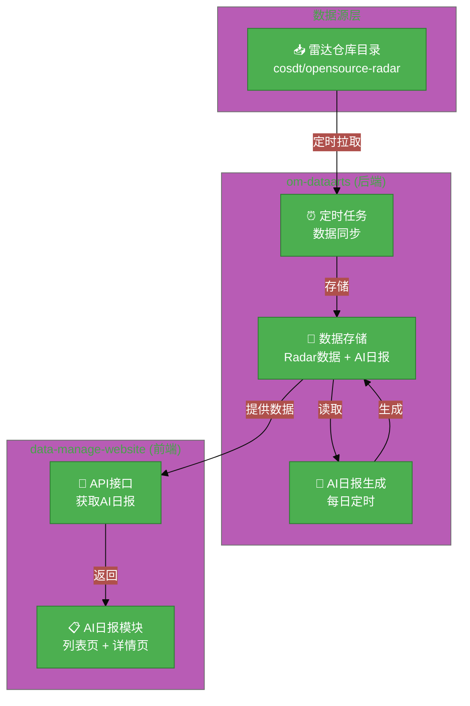
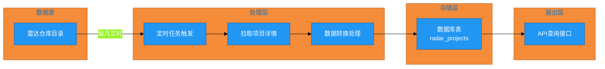
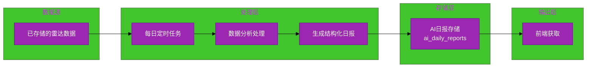
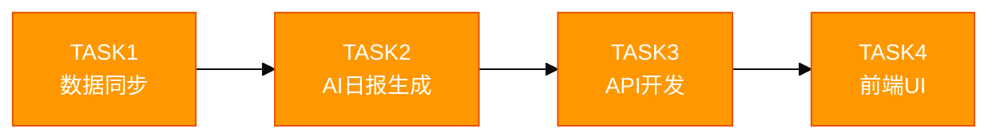

# #299 技术雷达看板及数据自动化需求 架构设计说明书

---

## 1. 基础信息

* **需求链接**: https://github.com/opensourceways/backlog/issues/299
* **需求名称**: 技术雷达看板及数据自动化需求
* **开发责任人**: maxueling
* **设计目标**: 实现看板数据月级自动更新和 AI 日报自动生成功能，在 `om-dataarts` 和 `data-manage-website` 两个仓库完成开发。

---

## 2. 功能设计

> **说明**：描述系统的组件构成、职责划分及交互逻辑。

### 2.1 架构图

**设计说明/归档：**

**系统架构图：**



**架构说明：**

- **数据源层**：雷达仓库（`cosdt/opensource-radar`）提供原始数据
- **om-dataarts**：后端服务，包含定时任务（数据同步 + AI日报生成）和数据存储
  - **数据同步定时任务**：每月从雷达仓库拉取项目详情数据
  - **AI日报生成定时任务**：每日从已存储的雷达数据生成结构化日报摘要
- **data-manage-website**：前端服务，提供AI日报模块UI

### 2.2 数据流图

**设计说明/归档：**

**任务一（数据同步）数据流：**



**任务二+三（AI日报）数据流：**



### 2.3 组件职责与接口

**设计说明/归档：**

| 组件名称 | 文件路径 | 职责 | 输入 | 输出 | 变更类型 |
|---------|---------|------|------|------|---------|
| **SyncTask** | `om-dataarts/tasks/radar_detail_task.py` | 每月定时从雷达仓库拉取项目详情数据 | 雷达仓库地址 | 数据文件 | **新增** |
| **DataCollector** | `om-dataarts/Collector/radar_detail_collector.py` | 解析处理从雷达仓库获取的数据 | 数据文件 | 结构化数据列表 | **新增** |
| **RadarTable** | `om-dataarts/db/table/radar_table.py` | 建立雷达数据表 | - | - | **新增** |
| **AIDailyReportAPI** | `data-manage-website/src/api/ai_daily_report.ts` | 提供AI日报查询接口 | 前端请求 | 日报详情 | **新增** |
| **AIDailyReportUI** | `data-manage-website/src/views/insight/AIDaily/` | AI日报模块UI组件 | - | - | **新增** |

**新增接口定义：**

**om-dataarts API 接口：**

```python
# AI日报详情接口
GET /api/radar/ai-daily-reports
Query: { page: int, page_size: int, start_date?: string, end_date?: string }
Response: {
  "code": 0,
  "data": {
    "list": [{"id": str, "date": str, "summary": str, "created_at": str}],
    "total": int
  }
}
```

### 2.4 UX设计

**设计说明/归档：**

**AI日报模块 UX 设计目标：**

1. **信息架构**
   - 独立的菜单入口（雷达看板 → AI日报）
   - 层级清晰，避免影响现有雷达看板功能

2. **列表页设计**
   - 日报卡片形式展示（日期 + 摘要预览 + 生成时间）
   - 支持按日期筛选（默认展示最近15天）
   - 卡片点击进入详情页

3. **详情页设计**
   - 顶部：日期、生成时间
   - 中部：关键信息列表（今日头条、热门、Github趋势等）
   - 底部：关键指标摘要

4. **空状态设计**
   - 列表页空状态：提示"暂无AI日报数据"
   - 详情页空状态：提示"该日期暂无日报"

5. **加载状态设计**
   - 骨架屏（Skeleton）加载
   - 避免空白页面闪烁

6. **异常处理**
   - 网络错误：提示"数据加载失败，点击重试"
   - AI生成失败：显示"AI日报生成中，稍后再试"

**UX 验收标准：**
- [x] 新用户能在 3 次点击内找到 AI 日报模块
- [x] 列表页加载时间 ≤ 2 秒
- [x] 详情页加载时间 ≤ 1.5 秒
- [x] 空状态有明确引导提示

### 2.5 SOD设计

**不涉及，原因：** 本需求不涉及多角色权限分离，属于单一功能模块开发。

### 2.6 功能设计分解TASK清单

**设计说明/归档：**

| 任务 ID | 功能任务描述 | 责任人 |
|---------|-------------|--------|
| **TASK1** | `om-dataarts` 侧数据同步：新增每月定时任务从雷达仓库目录拉取项目详情数据 | maxueling |
| **TASK2** | `om-dataarts` 侧AI日报生成：新增每日定时任务，从已存储的雷达数据聚合关键动态，生成结构化日报摘要并存储 | maxueling |
| **TASK3** | `om-dataarts` 侧API开发：提供AI日报列表和详情查询接口 | maxueling |
| **TASK4** | `data-manage-website` 侧AI日报模块：新增AI日报页面（列表页 + 详情页），从后端获取数据并展示 | maxueling |

---

## 3. 非功能设计

### 3.1 安全与隐私设计评估和设计

**不涉及，原因：** 需求分析阶段判定无安全相关性（未勾选 need_security）。

### 3.2 可靠性与韧性设计评估和设计

**不涉及，原因：** 本需求为定时批处理任务，无高可用要求，不涉及 Core 服务变更。

### 3.3 可服务性与可观测性评估和设计

**设计说明/归档：**

* **定时任务可观测**：记录任务执行日志（开始时间、结束时间、执行结果）
* **AI日报生成状态**：生成失败时记录错误日志，保留重试能力

**任务清单：**

| 任务 ID | 可服务性任务描述 | 责任人 |
|---------|-----------------|--------|
| **OPS-TASK1** | 定时任务执行日志记录（开始/结束/结果） | maxueling |
| **OPS-TASK2** | AI日报生成失败时的错误日志和重试机制 | maxueling |
| **OPS-TASK3** | 提供任务健康检查接口 | maxueling |

### 3.4 性能与伸缩性评估和设计

**不涉及，原因：** 定时任务低频执行（每月/每日），无高并发需求。

---

## 4. 任务依赖关系



**依赖说明：**
- TASK2 依赖 TASK1（AI日报数据来源于雷达数据）
- TASK4 依赖 TASK3（前端调用后端 API）
- TASK1、TASK2在 `om-dataarts` 仓库，TASK3通过`magic-api`实现，TASK4 在 `data-manage-website` 仓库

---

## 5. 风险与缓解措施

| 风险 | 描述 | 缓解措施 |
|------|------|---------|
| **雷达仓库访问失败** | 定时任务无法访问雷达仓库 | 任务失败时记录日志，下次重试 |
| **AI模型调用失败** | AI日报生成失败 | 降级方案：生成失败时保留空数组，标记生成失败状态 |
| **数据不一致** | 雷达数据与AI日报数据不同步 | AI日报基于已存储数据生成，确保数据一致性 |