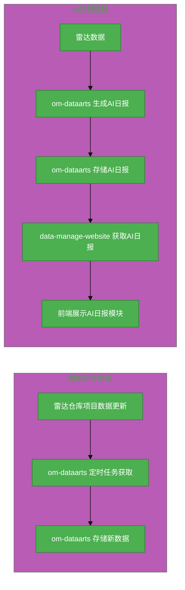

# #299 技术雷达看板及数据自动化需求分析说明书

## 1. 基础信息

* **需求链接**: https://github.com/opensourceways/backlog/issues/299
* **需求名称**: 技术雷达看板及数据自动化需求
* **开发责任人**: Mjennie

---

## 2. 需求场景说明

> 描述"在什么情况下，为了解决什么问题，用户需要做什么"。

**场景说明:**

技术雷达项目从旧看板迁移至新看板后，原有的手动数据更新方式不再适用。为实现"每月看板数据自动更新"目标，需要：1）雷达仓库发生变更时自动触发更新通知；2）看板仓库接收通知后自动化获取最新雷达数据；3）看板新增 AI 日报模块，自动生成每日雷达动态摘要。

## 3 需求验收标准

> 明确需求完成的标志，必须是可量化、可测试的。

**验收标准:**

- [x] 雷达仓库发生删改操作时，同步该雷达仓库数据（已实现）
- [x] 看板每月自动获取雷达项目最新数据（名称、标签、更新时间等）
- [x] 看板界面可见 AI 日报模块，展示每日雷达动态摘要，支持查看历史日报
- [x] 数据更新链路可追溯（触发源 → 检测 → 同步 → 生成 → 展示全链路可观测）
- [x] 新增关联 PR 已合并：https://github.com/cosdt/opensource-radar/pull/152

---

## 4. 需求设计与分解

> 说明：基于初步方案，将需求拆解为可实施的原子 Task。后续的流程判定将严格依据这些 Task 的影响范围进行。

### 4.1 核心逻辑方案

**技术栈：**
- 数据仓库/处理层：`opensourceways/om-dataarts`（定时任务从雷达仓库取数据并存储）
- 前端展示层：`opensourceways/data-manage-website`

**逻辑方案：**

本需求包含两个主要任务：

**链路一：数据同步（Task1）**
- `om-dataarts` 新增每月定时任务从雷达仓库目录拉取数据，需要获取雷达相关项目详情、社区动态、相关总结报告等，将数据存储在数据表，供前端使用
- 触发方式：定时任务

**链路二：AI日报（Task2 + Task3）**
- Task2（后端）：`om-dataarts` 新增独立的每日定时任务，从已存储的雷达数据中聚合关键动态，调用AI模型生成结构化日报摘要，存储到指定位置
- Task3（前端）：`data-manage-website` 新增AI日报模块，从后端获取日报数据，以列表+详情页形式展示，支持查看最近15天历史日报

**说明**：两条链路独立，链路一的增量同步结果为链路二提供数据源，但执行时机、触发条件均独立。

### 4.2 任务清单

**任务清单:**

| 任务 ID | 任务描述 (Task Description) | 预期产出 (Deliverables) | 预期工作量（人天） |
|---------|------------------------------|-------------------------|-----------------|
| **task1** | `om-dataarts` 侧获取雷达项目详情数据：新增每月定时任务从雷达仓库目录拉取数据，需要获取雷达相关项目详情、关总结报告等，将数据存储在数据表 | `om-dataarts` 数据处理逻辑 + 定时调度机制 | 2 |
| **task2** | `om-dataarts` 侧AI日报生成：每日定时从已存储的雷达数据聚合关键动态，通过每日定时任务生成结构化日报摘要并存储 | AI日报数据处理模块 | 2 |
| **task3** | `data-manage-website` 前端AI日报模块：新增AI日报页面，从后端获取日报数据并展示，支持查看历史日报 | AI日报UI组件（列表页 + 详情页） | 1 |

**任务依赖说明**：task1 与 task2/task3 独立，无依赖关系。task1和task2的数据都来源于radar仓库中已有的数据，需要`om-dataarts`进行数据处理及存储。

---

## 5. 需求相关性分析

> **操作说明**：根据上述拆解出的 Task，识别其变更行为。任何一项勾选为"是"：打上对应issue标签，必须执行对应的流程门禁。全部未勾选：该需求自动判定为轻量化特性，打上need_light标签。

### A. 安全相关性分析

> 若涉及以下任一项，打标 `need_security`标签，PR 必须关联特性issue的架构设计文档（含安全设计部分）**如勾选需要给出原因**。

无勾选项

* [ ] **边界变更**：新增公网端口、修改防火墙规则、变更网关配置。
* [ ] **凭证处理**：涉及密钥（Secret/Key）、Token、证书的存储或分发。
* [ ] **权限调整**：修改权限模型、服务账号（SA）权限或鉴权逻辑。
* [ ] **供应链**：引入新的第三方二进制文件、SDK 或重大版本依赖升级。
* [ ] **隐私风险评估**：涉及用户个人数据（Email、手机号、IP、邮箱 等）的处理。
* [ ] **AI使用**：涉及AIGC能力应用，并提供服务。

### B. 架构设计相关性分析

> 若涉及以下任一项，打标 `need_design`标签，PR 必须关联特性issue的架构设计文档。 **如勾选需要给出原因**。

无勾选项

* [ ] A环节判定需要完成安全设计
* [ ] 改变了现有系统的物理/逻辑拓扑
* [ ] 新增或大幅修改对外暴露的 API/CLI 接口
* [ ] 引入了新的中间件、数据库或三方核心组件

### C. 系统集成测试相关性分析

> *若涉及以下任一项，打标 `need_itest`标签，PR必须关联特性issue的测试策略和测试报告文档。 **如勾选需要给出原因**。

无勾选项

* [ ] 上述环节判定需要执行安全设计或架构设计。
* [x] **跨组件影响**：变更会触发下游服务或关联系统的连锁反应（级联效应）。
* [ ] **核心组件管控**：含项目定级为 Core 的核心逻辑变更。
* [ ] **环境强依赖**：功能高度依赖内核参数、网络拓扑或特定的物理挂载。
* [ ] **端到端流程**：涉及从用户输入到持久化存储的全链路逻辑。

### D. 用户体验相关性分析

> 若涉及以下任一项，打标 `need_ux`标签，PR必须关联特性issue的用户体验设计文档。 **如勾选需要给出原因**。

无勾选项

* [x] **交互逻辑变更**：涉及 Web 门户、控制台（Dashboard）或命令行工具（CLI）的交互流程调整。
* [x] **感知性能变动**：变更可能显著影响页面的加载时间、同步请求的响应时延或异步任务的进度反馈。
* [x] **文档与辅助能力**：涉及报错提示语、帮助中心链接、FAQ 或新功能的 Runbook 说明。
* [ ] **无障碍与多语种**：涉及国际化（i18n）支持、辅助功能或不同终端（移动端/桌面端）的适配。

### 5.1 需求相关性分析汇总结果

* [ ] need_security (需架构设计（含安全威胁分析和安全设计）)
* [ ] need_design (需架构设计)
* [x] need_itest (需执行测试策略设计和全链路集成测试)
* [x] need_ux (需架构设计（含UX设计)）
* [ ] need_light (上述均未勾选，走快速合入通道)

---

## 6. 价值识别与业务评估

> **判定准则**：基础设施接纳需求必须具备明确的 ROI（投资回报比）或合规必要性。

| 维度 | 评估问题 | 结论/说明 |
|------|---------|----------|
| **范围判定** | 该需求是否属于基础设施范围内？ | 是，看板数据自动化属于基础设施效率提升 |
| **规划一致性** | 该需求是否在年度技术规划中？ | 是，技术雷达迁移新看板的配套需求 |
| **优先级** | 该需求优先级评估（高/中/低）？ | 高 |
| **通用性** | 该需求是否解决 3 个以上业务方的共性痛点？ | 是，AI 日报功能可服务多个业务方 |
| **必要性** | 现有组件通过配置变更是否无法实现目标或没有不用开发的替代方案？ | 是，需开发增量同步逻辑和AI日报模块|
| **工作量** | 预计总工作量 5 人天？ | 5 人天 |
| **价值评估** | 实现后能减少多少手动操作或提升多少系统稳定性？ | 实现后看板数据每月自动更新，减少100%手动更新操作；AI日报自动生成，减少人工汇总时间 |

> **状态定义：** **Accept (准入)** | **Reject (驳回)** | **Pending (待议)**

**建议结论**： Accept

**原因描述:** 该需求适配技术雷达新看板的自动化数据获取流程，实现看板数据月级自动更新和AI日报自动生成，预计可减少100%手动更新操作，符合雷达看板迁移目标。

---

## 7. 附录

### 7.1 关联 PR

- 技术雷达仓库 PR（雷达侧变更触发机制）：https://github.com/cosdt/opensource-radar/pull/152

### 7.2 范围边界

**在本次需求范围内：**
- `om-dataarts` 侧（task1）：新增每月定时任务从雷达仓库目录拉取数据，需要获取雷达相关项目详请等数据
- `om-dataarts` 侧（task2）：每日定时生成AI日报摘要，调用AI模型，存储15天历史
- `data-manage-website` 侧（task3）：AI日报模块UI，列表页+详情页，支持查看15天内历史日报

**不在本次需求范围内：**
- 雷达数据模型变更（由 cosdt/opensource-radar 仓库自行管理）
- `data-manage-website` 看板整体 UI 改版
- 多雷达源聚合
- 雷达数据全量重新同步（只做增量同步）
