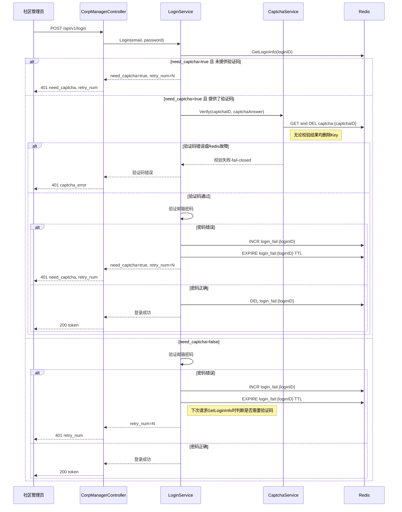
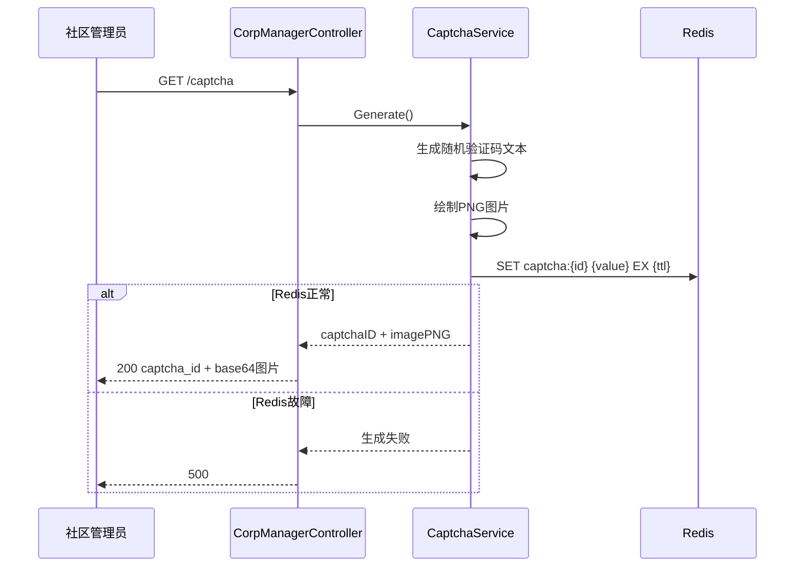
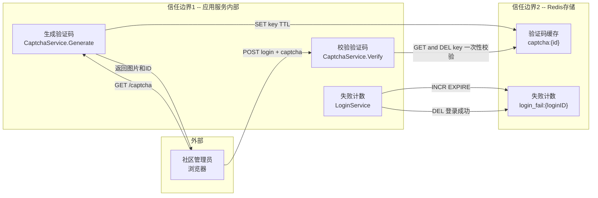
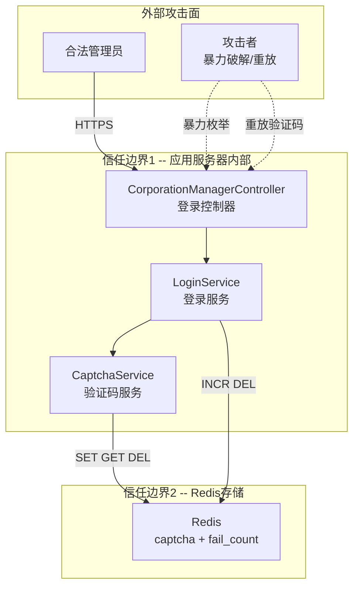

# #45 社区管理员登录图形验证码 架构设计说明书 (Architecture Design Document)

---

## 1. 基础信息

* **需求链接**: https://github.com/opensourceways/backlog/issues/45
* **需求名称**: 社区管理员登录增加图形验证码功能
* **开发责任人**: 张扬
* **设计目标**: 通过新增图形验证码领域服务（captchaservice + captchaimpl），在登录流程中嵌入验证码校验环节，基于 Redis 存储验证码、fail-closed 安全策略，实现防暴力破解的登录加固。

---

## 2. 功能设计

> **说明**：描述系统的组件构成、职责划分及交互逻辑。

### 2.1 架构图

> 此处建议插入架构拓扑系统组件图或时序图，描述组件间的交互关系。推荐使用Mermaid实现，可代码化，GitHub可渲染。
> **不涉及需要说明原因**

**设计说明/归档：** 本次需求在现有 signing 模块内新增验证码子域，不改变系统整体拓扑。以下为登录验证码流程的时序图。

**登录验证码流程时序图：**

**验证码获取流程时序图：**

**说明：**
- **验证码优先校验**：当 need_captcha=true 时，先校验验证码再校验密码，避免攻击者通过密码哈希计算耗时进行侧信道攻击或 CPU DoS
- 验证码校验采用 **fail-closed** 策略：Redis 不可用时验证码校验直接返回失败，防止绕过
- **防重放**：Verify 调用时先 GET 再 DEL Key（无论校验结果），每个验证码只能校验一次，杜绝暴力枚举
- 登录失败计数存储在 Redis 中，Key 使用 loginID（非明文邮箱），带 TTL 自动过期
- 登录成功后清除失败计数

### 2.2 数据流图

> 此处建议插入数据流图，描述核心业务数据的生命周期，即威胁建模的基础。推荐使用Mermaid实现，可代码化，GitHub可渲染。
> **不涉及需要说明原因**

**设计说明/归档：** 验证码数据流涉及生成、存储、校验、销毁全生命周期。

**说明：**
- 验证码 ID 由服务端生成，客户端只持有 ID 引用
- 验证码值仅在 Redis 中存储，不经过前端日志
- 验证码使用后立即删除（一次性使用）

### 2.3 组件职责与接口

> 列出新增/修改的组件及其定义的 API 规范。**不涉及需要说明原因**

**设计说明/归档：** 新增和修改的组件如下：

| 组件 | 路径 | 职责 | 输入 | 输出 |
|------|------|------|------|------|
| CaptchaService (接口) | signing/domain/captchaservice/service.go | 定义验证码生成和校验的领域接口 | — | — |
| CaptchaImpl | signing/infrastructure/captchaimpl/impl.go | 验证码图片生成（数字型 DriverDigit）与 Redis 存储 | — | captchaID, imageBase64 |
| CaptchaConfig | signing/infrastructure/captchaimpl/config.go | 验证码配置结构体（阈值、TTL、图片参数） | — | — |
| RedisCaptchaDB | signing/infrastructure/captchaimpl/redisdb.go | 验证码 Redis 存储操作 | captchaID, value | — |
| Login (domain) | signing/domain/login.go | 登录领域实体，增加 Captcha 校验字段 | — | — |
| LoginService | signing/domain/loginservice/service.go | 登录服务，增加失败计数和验证码触发逻辑 | LoginDTO | LoginResult |
| CorporationManagerController | controllers/auth_on_corp_manager.go | 社区管理员控制器，增加 GetCaptcha 方法和 Login 验证码参数解析 | HTTP Request | HTTP Response |
| Params | controllers/params.go | 新增控制器常量定义（路由参数名） | — | — |
| Config | config/config.go | 全局配置增加 Captcha 配置项 | — | — |

**新增 API 接口：**

| 方法 | 路径 | 说明 | 请求参数 | 响应 |
|------|------|------|---------|------|
| GET | /captcha | 获取图形验证码（无需认证） | 无 | `{captcha_id, captcha_image}` — captcha_image 为 base64 编码 PNG |

**修改 API 接口：**

| 方法 | 路径 | 变更说明 |
|------|------|---------|
| POST | /api/v1/login | 请求新增 `captcha_id` 和 `captcha_answer` 字段；响应新增 `need_captcha` (bool) 字段 |

### 2.4 UX设计

> 设计目标：确保功能不仅"可用"，而且"好用"，降低开发者的认知负担和运维人员的误操作风险。 **不涉及需要说明原因**

**设计说明/归档：** 不涉及，原因：本需求聚焦后端验证码服务能力，前端 UX 由客户端侧自行实现，不在本次需求范围内。

### 2.5 SOD设计

> 设计目标：通过维护SOD权限设计文档，确保权限设计可审计、可复用、可跨服务重用。 SOD权限设计参考[XX SOD权限设计.md](XX%20SOD%E6%9D%83%E9%99%90%E8%AE%BE%E8%AE%A1.md)
>
>**不涉及需要说明原因**
>
>**需要说明文档位置**

**设计说明/归档：** 不涉及，原因：本次需求不涉及新增角色或权限变更，验证码获取接口为公开接口，校验过程复用现有登录权限体系。

### 2.6 功能设计分解TASK清单

**设计说明/归档：**

**任务清单:**

| 任务 ID | 功能任务描述 | 责任人 |
|---------|---------------|--------|
| **TASK1** | 新增验证码领域服务接口（captchaservice）与基础设施实现（captchaimpl）：图片生成、Redis 存储、fail-closed 策略 | 张扬 |
| **TASK2** | 登录服务改造：失败计数、need_captcha 判断、登录成功后清除、Login DTO 扩展 | 张扬 |
| **TASK3** | 控制器层改造：captcha 接口路由注册、login 接口参数扩展、响应字段新增、硬编码路由参数替换为常量 | 张扬 |
| **TASK4** | 配置与安全加固：captcha 配置项（阈值/TTL/图片参数）、安全相关问题修复（错误吞掉、圈复杂度降低） | 张扬 |

---

## 3. 非功能设计

### 3.1 安全与隐私设计评估和设计

> **注意**：仅当需求判定为 **`need_security`** 时，本章节为必填项。 **无该标签可删除本章节。**

> 关注点：防御能力与合规边界。

### 3.1.1 威胁分析 (Threat Modeling)

> 基于 **STRIDE** 或类似模型，识别本项目可能面临的安全威胁。推荐使用Mermaid绘制DFD数据流图和信任边界，展示系统的安全边界和数据流向。
> **建议归档服务模块设计图，后续需要可增量复用（导入设计文件到工具中即可复用增量设计）。**

**设计说明/归档：** 基于登录验证码数据流，识别跨越信任边界的威胁。

**威胁建模信任边界图：**

**威胁分析表：**

| 威胁类别 | 攻击场景描述 (Scenario) | 风险等级/评分 | 对应减缓措施 (Mitigation) |
|-----------|-----------------------|---------|-------------------------|
| **暴力破解 (Spoofing)** | 攻击者自动化尝试大量密码组合，绕过无验证码保护的登录接口 | 高 | 登录失败达到阈值后强制验证码校验；可配置失败阈值参数 |
| **重放攻击 (Tampering)** | 攻击者截获有效验证码 ID 和值，重复提交登录请求 | 中 | 验证码一次性使用（校验通过后立即 DEL）；设置短 TTL 过期 |
| **验证码绕过 (Elevation of Privilege)** | Redis 故障时验证码校验被跳过，攻击者可在无验证码保护下暴力破解 | 高 | **fail-closed 策略**：Redis 不可用时验证码校验返回失败，拒绝登录 |
| **信息泄露 (Information Disclosure)** | 验证码明文出现在日志或 API 响应中；登录失败计数泄露有效邮箱 | 中 | 日志脱敏不记录验证码值；失败计数 Key 使用 loginID（非明文邮箱） |
| **拒绝服务 (Denial of Service)** | 攻击者高频调用 GET /captcha 耗尽 Redis 内存或服务器资源 | 中 | 验证码生成接口增加限流；Redis Key 设置 TTL 自动清理 |
| **验证码识别 (Information Disclosure)** | 攻击者使用 OCR 自动识别简单验证码图片 | 低 | 使用数字型验证码（DriverDigit），大小写不敏感比对（EqualFold），增加噪点和背景干扰圆 |

**参考资料：**
- 详见《架构设计说明书编写经验》第8章：威胁建模中的信任边界设计
- 详见《架构设计说明书编写经验》第16-20章：Mermaid图表应用指南

### 3.1.2 安全设计实现 (Security Mechanisms)

> **参考：**
> 威胁模型评估：
> * 是否已根据业务逻辑绘制 Data Flow Diagram 并识别单点风险？
>
> 软件供应链：
> * 是否扫描并修补了已知漏洞（CVE）？
> * 是否限制了第三方二进制包的直接引入？
>
> 凭证管理：
> * 严禁硬编码。
> * 密钥是否定期自动轮转（Rotation）？
>
> 身份认证：
> * 是否具备多因素认证支持或联邦认证（OIDC）对接能力？
> * 内部微服务调用是否执行了身份校验（Identity-based Auth）？
>
> 数据安全：
> * 传输加密（TLS 1.2+）与静态加密（AES-128）是否全覆盖？
> * 是否对高敏感字段（如手机号、秘钥）执行了哈希/加盐或差分隐私处理？
>
> 运行时隔离：
> * 容器是否以非 Root 用户运行（Non-root Enforcement）？
> * 是否配置了 Read-only Root Filesystem 防止二进制篡改？
>
> 日志审计：
> * 关键操作日志是否具备防篡改性？
> * 是否包含了足够用于追溯的 4W 信息（Who, When, Where, What）？

**设计说明/归档：**

* **身份认证与授权**：验证码获取接口为公开接口（无需认证）；验证码校验嵌入登录流程，复用现有 JWT 认证体系。登录失败信息按 loginID 维度隔离，不同账号间互不影响。
* **数据安全**：
  - 传输加密：所有 API 通信基于 HTTPS/TLS 1.2+
  - 验证码值在 Redis 中明文存储（TTL 短，校验后立即删除），不落磁盘
  - 验证码 ID 为随机生成的唯一标识，不可预测
  - 登录失败计数 Key 不含密码明文，仅记录失败次数
* **边界防御**：
  - 验证码参数强校验：captcha_id 格式校验、captcha_answer 长度限制
  - fail-closed 策略：Redis 故障时 Verify() 返回 error，调用方据此拒绝登录
  - 配置参数校验：config.CheckConfig() 检查 Captcha 配置合法性
* **运行时隔离**：复用现有容器安全配置，无新增特权要求。
* **日志审计**：登录失败/成功事件记录审计日志（含时间、loginID、IP），验证码值不在日志中出现。

### 3.1.3 安全任务分解 (Security Task Breakdown)

> 将安全设计转化为具体的开发任务，需在代码或后续开发流程的安全配置中落实。

**任务清单:**

| 任务 ID | 安全任务描述 (Security Tasks) | 责任人 |
|---------|---------------------------|-----|
| **SEC-TASK1** | 实现 fail-closed 策略：Redis 故障时 Verify() 返回 error，LoginService 据此拒绝登录，不 fallback 到无验证码模式 | 张扬 |
| **SEC-TASK2** | 验证码一次性使用：校验通过后立即 DEL Key；设置 TTL 防止未使用验证码长期残留 | 张扬 |
| **SEC-TASK3** | 提取硬编码字符串为常量：控制器中所有路由参数名（ParamLinkID、ParamSigningID、ParamEmail 等）替换为定义的常量 | 张扬 |
| **SEC-TASK4** | 修复错误吞没问题：fillLoginResult 中隐私协议校验和角色获取错误独立返回；checkCorpSummary 中数据库错误正确传播 | 张扬 |
| **SEC-TASK5** | 降低圈复杂度：login 方法拆分，抽取校验逻辑为独立函数 | 张扬 |
| **SEC-TASK6** | 验证码生成接口限流：对 GET /captcha 增加频率限制，防止攻击者高频调用耗尽 Redis 内存或服务器资源 | 张扬 |

### 3.2 可靠性与韧性设计评估和设计（可选）

> **注意**：根据项目定级决定，含Core、Critical服务变更需要完成

> **关注点**：极端情况下的生存与恢复能力。
> **参考：**
> * 面向失败设计：是否识别了强依赖风险？当游依赖失效时，本服务是否具备降级或熔断能力？
> * 重试与避让：重试逻辑中是否包含指数退避和随机抖动以防止请求风暴？
> * 熔断限流：核心接口是否定义了明确的限流阈值？是否实现了断路器模式以保护下游？
> * 幂等设计：所有涉及写操作的任务是否支持重复调用而无副作用？

**设计说明/归档：** 不涉及，原因：验证码服务作为登录流程的辅助校验环节，不影响核心业务链路。Redis 故障时采用 fail-closed 策略拒绝请求，不会导致数据不一致。

**任务清单:**

| 任务 ID | 可靠性与韧性任务描述 | 责任人 |
|---------|-------------------|-----|
| （无） | — | — |

---

### 3.3 可服务性与可观测性评估和设计（可选）

> **关注点**：排障效率与全生命周期管理，确保故障可感知、可定位、可修复。

> **参考：**
> * 排障文档：是否提供了错误码对照表及对应的排障步骤？
> * 健康诊断：是否提供 /health 或 /status 接口，展示系统内部子模块的状态？
> * 平滑变更：升级或配置变更时如何实现灰度发布？是否具备一键回滚的判定指标？
> * 黄金指标覆盖：是否已定义并暴露出延迟、错误、流量和饱和度指标？

**设计说明/归档：** 不涉及，原因：验证码服务复用现有监控和健康检查体系，不新增独立观测面。Redis 连接状态已由现有 /health 接口覆盖。

**任务清单:**

| 任务 ID | 可服务性任务描述 | 责任人 |
|---------|---------------|--------|
| （无） | — | — |

---

### 3.4 性能与伸缩性评估和设计（可选）

> **关注点**：社区生态兼容性与未来扩展。

> **参考：**
> * 并发模型：在高并发场景下，锁竞争、连接池和线程池的配置是否已评估？
> * 水平扩展：服务是否实现了完全无状态化，支持快速扩容？
> * 延迟评估：关键路径的延迟是否业务需求？是否存在明显的 IO 或计算瓶颈？

**设计说明/归档：** 不涉及，原因：管理员登录为低频操作（QPS < 1），验证码生成和校验对性能无特殊要求。Redis 操作为 O(1) 复杂度，图片生成使用内存 Buffer 不落盘。

**任务清单:**

| 任务 ID | 性能任务描述 | 责任人 |
|---------|------------|--------|
| （无） | — | — |

---
