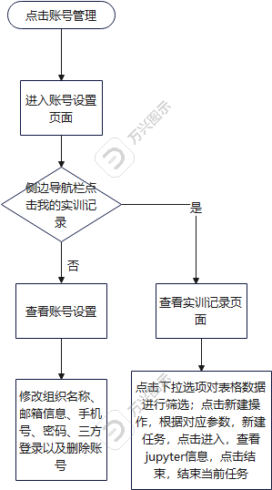
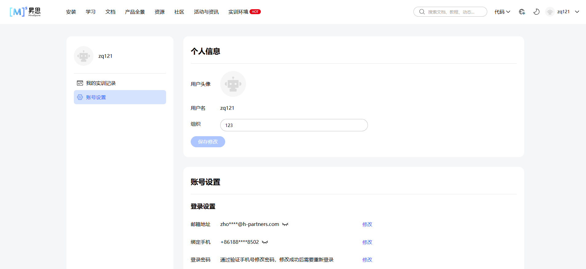
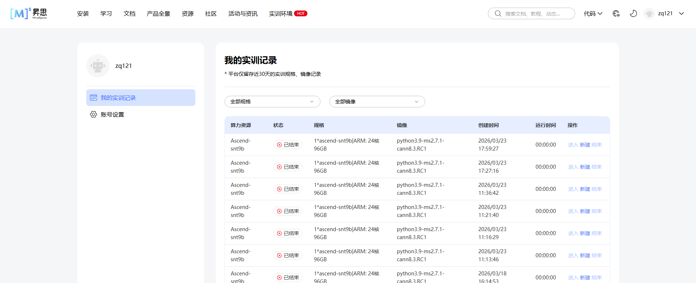
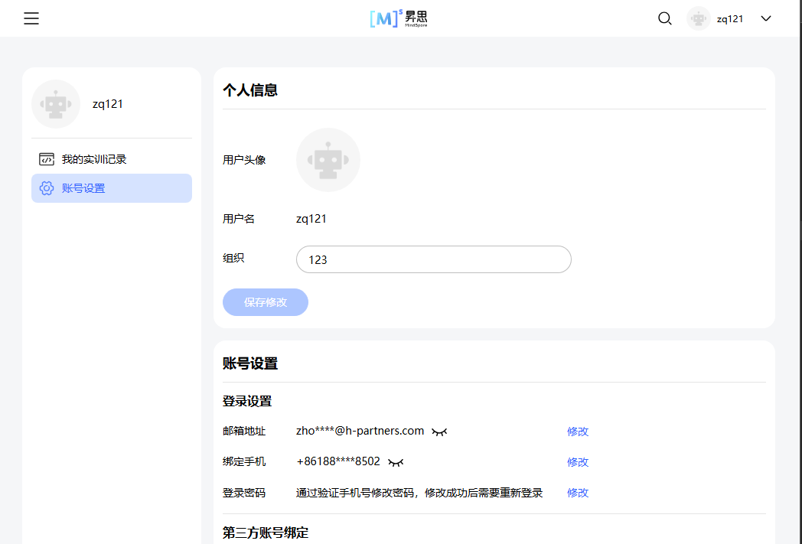
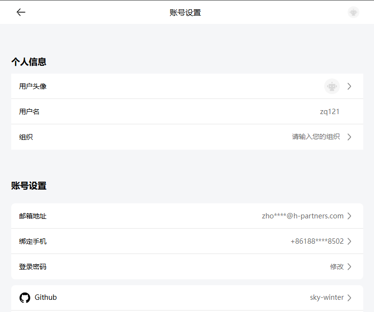

# #63 昇思大模型平台部分功能合并至MindSpore官网架构设计说明书 (Architecture Design Document)
---

## 1. 基础信息

* **需求链接**: https://github.com/opensourceways/backlog/issues/63
* **需求名称**: 昇思大模型平台部分功能合并至MindSpore官网
* **开发责任人**: sky-winter
* **设计目标**: 无

---

## 2. 功能设计

> **说明**：描述系统的组件构成、职责划分及交互逻辑。

### 2.1 架构图
* 昇思个人中心流程图
* 

**设计说明/归档：** 
不涉及

### 2.2 数据流图
不涉及

### 2.3 组件职责与接口

**设计说明/归档：**
* 接口信息
1. 获取实训记录  
url: /api-jupyter/server/cloud/pod/history  
params: {  
  page_num: number, // 当前页  
  page_size: number, // 总页数  
  cards_num: number, // 规格数  
  image: string, // 镜像  
}  
response:   
```js
{
  "code": "",
  "msg": "",
  "data": {
      "data": [
          {
              "id": "2a793baf-d76c-4ce0-9865-ddacd6bd7a46",
              "cloud_id": "ascend_002",
              "status": "terminated",
              "access_url": "https://cloud-2a793baf-d76c-4ce0-9865-ddacd6bd7a46.snt9b.xihe2.test.osinfra.cn/",
              "spec": {
                  "desc": "1*ascend-snt9b|ARM: 24核 96GB",
                  "cards_num": 1
              },
              "image": "python3.9-ms2.7.1-cann8.3.RC1",
              "create_time": 1774259967,
              "running_time": "00:16:33",
              "processor": "Ascend-snt9b"
          },
      ],
      "page_num": 1,
      "page_size": 10,
      "total": 12,
      "has_holding": false
  }
}
```

2. 获取镜像以及规格数据  
url: /api-jupyter/server/cloud  
params: /
response:  
```js
{
    "code": "",
    "msg": "",
    "data": [
        {
            "id": "ascend_002",
            "specs": [
                {
                    "desc": "1*ascend-snt9b|ARM: 24核 96GB",
                    "cards_num": 1
                },
                {
                    "desc": "2*ascend-snt9b|ARM: 48核 192GB",
                    "cards_num": 2
                },
                {
                    "desc": "4*ascend-snt9b|ARM: 96核 384GB",
                    "cards_num": 4
                }
            ],
            "name": "ascend_002",
            "images": [
                "python3.9-ms2.7.1-cann8.3.RC1",
                "python3.10-ms2.7.1-cann8.2.RC1",
                "python3.9-ms2.6.0-cann8.1.RC1.beta1",
                "python3.9-ms2.5.0-cann8.0.0.beta1",
                "python3.9-ms2.4.10-cann8.0.0.beta1"
            ],
            "feature": "预装mindspore、numpy、pandas等依赖",
            "processor": "Ascend-snt9b",
            "credit": 0,
            "survival": 3,
            "is_idle": true,
            "has_holding": false
        }
    ]
}
```
### 2.4 UX设计

> 设计目标：确保功能不仅“可用”，而且“好用”，降低开发者的认知负担和运维人员的误操作风险。

**设计说明/归档：** 不涉及用户交互
* 点击账号管理，查看页面

* 输入组织信息，失焦，输入框内容有变化，保存修改按钮解除禁用，点击保存，弹出修改成功提示框

* 其余账号设置与之前保持一致
* 点击我的实训记录，查看记录信息，点击新建，重启任务；点击进入，查看对应jupter信息，点击结束，结束当前运行的任务；点击下拉选项，可进行表格数据的筛选

* 不同分辨率适配

分辨率小于等于840
导航页面

账号设置页面

我的实训记录页面


### 2.5 SOD设计

> 设计目标：通过维护SOD权限设计文档，确保权限设计可审计、可复用、可跨服务重用。
**不涉及需要说明原因** 不涉及SOD权限涉及

**设计说明/归档：** 不涉及权限设计

### 2.6 功能设计分解TASK清单

**任务清单:**

| 任务 ID     | 可服务性任务描述   | 责任人                      |
|-----------|------------|--------------------------|
| **TASK1** | 账号管理核心逻辑开发 | sky-winter                  |

---
