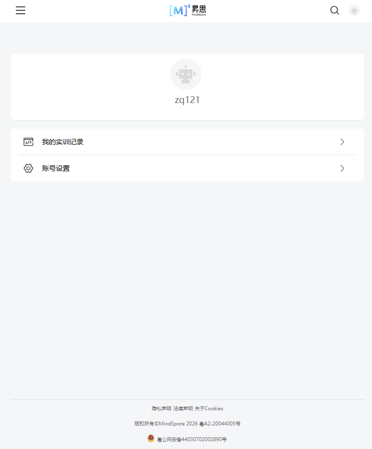
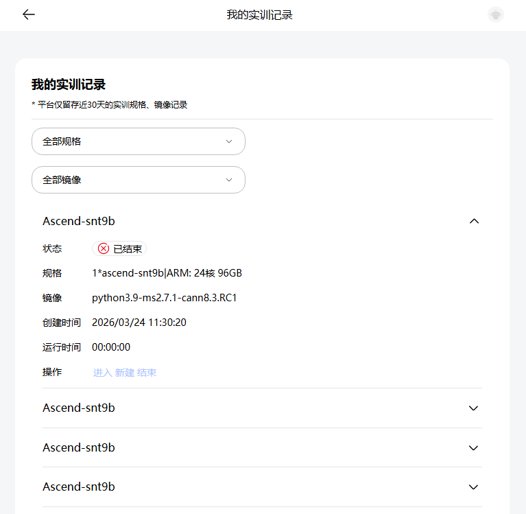

# #63 昇思大模型平台部分功能合并至MindSpore官网

## 1. 基础信息

* **需求链接**: https://github.com/opensourceways/backlog/issues/63
* **需求名称**: 昇思大模型平台部分功能合并至MindSpore官网
* **开发责任人**: sky-winter

---

## 2. 需求场景说明

> 描述“在什么情况下，为了解决什么问题，用户需要做什么”。

**场景说明:**
* 用户点击账号管理，跳转查看账号设置以及我的实训记录
* 用户可查看个人信息以及账号相关的修改设置
* 用户可查看实训记录，新建，进入、结束当前任务

## 3 需求验收标准

> 明确需求完成的标志，必须是可量化、可测试的。

**验收标准:**
* 账号管理模块可进行多分辨率下功能适配
* 头部导航与官网保持一致
* 侧边导航栏包含我的实训记录和账号设置模块
* 点击账号设置，查看账号设置模块个人信息并可进行账号相关的修改以及设置操作
* 点击我的实训记录，查看实训记录，点击新建，重启任务；点击进入，查看对应jupter信息，点击结束，结束当前运行的任务；当页面小于1200时，实训记录的操作按钮都禁用

---

## 4. 需求设计与分解

> 说明：基于初步方案，将需求拆解为可实施的原子 Task。后续的流程判定将严格依据这些 Task 的影响范围进行。

### 4.1 核心逻辑方案

> 简述实现逻辑（如：数据流向、模块改动、新增配置项等），作为任务拆解的理论依据。图片文字形式不限。

**逻辑方案:**
* 点击账号管理，查看页面

* 输入组织信息，失焦，输入框内容有变化，保存修改按钮解除禁用，点击保存，弹出修改成功提示框

* 其余账号设置与之前保持一致
* 点击我的实训记录，查看记录信息，点击新建，重启任务；点击进入，查看对应jupter信息，点击结束，结束当前运行的任务；点击下拉选项，可进行表格数据的筛选

* 不同分辨率适配

分辨率小于等于840
导航页面  

账号设置页面  

我的实训记录页面  

### 4.2 任务清单

**任务清单:**

| 任务 ID     | 任务描述 (Task Description) | 预期产出 (Deliverables) | 预期工作量（人天） |
|-----------|-------------------------|---------------------|-----------|
| **task1** | 个人中心页面开发       | 核心代码逻辑以及需求对齐讨论             | 16         |

---

## 5. 需求相关性分析

> **操作说明**：根据上述拆解出的 Task，识别其变更行为。任何一项勾选为“是”：打上对应issue标签，必须执行对应的流程门禁。全部未勾选：该需求自动判定为轻量化特性，打上need_light标签。

### A. 安全相关性分析

> *若涉及以下任一项，打标 `need_security`标签，PR 必须关联特性issue的架构设计文档（含安全设计部分）**如勾选需要给出原因**。

* [ ] **边界变更**：新增公网端口、修改防火墙规则、变更网关配置。
* [X] **凭证处理**：涉及密钥（Secret/Key）、Token、证书的存储或分发。
* [X] **权限调整**：修改权限模型、服务账号（SA）权限或鉴权逻辑。
* [ ] **供应链**：引入新的第三方二进制文件、SDK 或重大版本依赖升级。
* [ ] **隐私风险评估**：涉及用户个人数据（Email、手机号、IP、邮箱 等）的处理。
* [ ] **AI使用**：涉及AIGC能力应用，并提供服务。

### B. 架构设计相关性分析

> *若涉及以下任一项，打标 `need_design`标签，PR 必须关联特性issue的架构设计文档。 **如勾选需要给出原因**。

* [X] A环节判定需要完成安全设计
* [ ] 改变了现有系统的物理/逻辑拓扑
* [ ] 新增或大幅修改对外暴露的 API/CLI 接口
* [ ] 引入了新的中间件、数据库或三方核心组原因：如：引入了新的中间件、数据库或三方核心组件

### C. 系统集成测试相关性分析

> *若涉及以下任一项，打标 `need_itest`标签，PR必须关联特性issue的测试策略和测试报告文档。 **如勾选需要给出原因**。

* [ ] 上述环节判定需要执行安全设计或架构设计。
* [ ] **跨组件影响**：变更会触发下游服务或关联系统的连锁反应（级联效应）。
* [ ] **核心组件管控**：含项目定级为 Core 的核心逻辑变更。
* [ ] **环境强依赖**：功能高度依赖内核参数、网络拓扑或特定的物理挂载。
* [ ] **端到端流程**：涉及从用户输入到持久化存储的全链路逻辑。

### D. 用户体验相关性分析

> *若涉及以下任一项，打标 `need_ux`标签，PR必须关联特性issue的用户体验设计文档。 **如勾选需要给出原因**。

* [ ] **交互逻辑变更**：涉及 Web 门户、控制台（Dashboard）或命令行工具（CLI）的交互流程调整。
* [ ] **感知性能变动**：变更可能显著影响页面的加载时间、同步请求的响应时延或异步任务的进度反馈。
* [ ] **文档与辅助能力**：涉及报错提示语、帮助中心链接、FAQ 或新功能的 Runbook 说明。
* [ ] **无障碍与多语种**：涉及国际化（i18n）支持、辅助功能或不同终端（移动端/桌面端）的适配。

### 5.1 需求相关性分析汇总结果

* [ ] need_security (需架构设计（含安全威胁分析和安全设计）)
* [ ] need_design (需架构设计)
* [ ] need_itest (需执行测试策略设计和全链路集成测试)
* [√] need_ux (需架构设计（含UX设计)）
* [ ] need_light (上述均未勾选，走快速合入通道)

---

## 6. 价值识别与业务评估

> **判定准则**：基础设施接纳需求必须具备明确的 ROI（投资回报比）或合规必要性。

| 维度        | 评估问题                            | 结论/说明 |
|-----------|---------------------------------|-------|
| **范围判定**  | 该需求是否属于基础设施范围内？                 | 是     |
| **规划一致性** | 该需求是否是否在年度技术规划中？                | 是     | 
| **优先级**   | 该需求优先级评估（高/中/低）？                | 高     | 
| **通用性**   | 该需求是否解决 3 个以上业务方的共性痛点？          | 是     |
| **必要性**   | 现有组件通过配置变更是否无法实现目标或没有不用开发的替代方案？ | 是     | 
| **工作量**   | 预计总工作量xx 人天？                    | 3 人天  | 
| **价值评估**  | 实现后能减少多少手动操作或提升多少系统稳定性？         | xx    |

> **状态定义：** **Accept (准入)** | **Reject (驳回)** |  **Pending (待议)**

**建议结论**： Accepted

**原因描述:**   该需求通过自动化配置同步，预计可减少 SRE 团队每周 4
小时的重复性手动核对工作，且符合“配置即代码”的演进目标。

---
