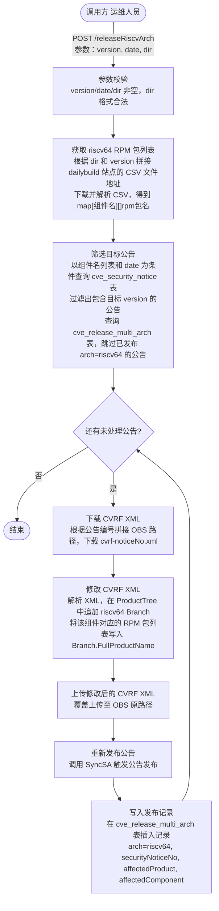

# #66 cve-manager支持riscv架构update发布需求分析说明书

## 1. 基础信息

* **需求链接**: https://github.com/opensourceways/backlog/issues/66
* **需求名称**: cve-manager支持riscv架构update发布
* **开发责任人**: yangwei999

---

## 2. 需求场景说明

> 描述"在什么情况下，为了解决什么问题，用户需要做什么"。

**场景说明:**

openEuler 社区在修复软件包 CVE 后，会针对不同 CPU 架构分别构建 RPM 包，并将修复结果以安全公告（Security Advisory，SA）的形式对外发布。当前 cve-manager 已支持 aarch64 和 x86_64 两种架构的多架构发布，但 riscv64 架构的转测周期与现有架构不同、发布版本也与常规每周公告不一致，导致 riscv64 架构已修复的 RPM 包无法随每周公告一起发布，需要运维人员手动完成公告补全与重新发布，存在效率低、易遗漏的问题。

为实现 riscv64 架构 update 包的自动化发布，需在 cve-sa-backend 的 manage 接口中新增一个专用 API，完成以下完整流程：

1. **筛选公告**：根据版本、日期等入参，从数据库中查询需要补充 riscv64 包的安全公告。
2. **下载公告文件**：从 OBS 下载对应的 CVRF XML 文件。
3. **修改公告文件**：解析 CVRF XML，在 `ProductTree` 中添加 riscv64 架构的 RPM 包信息。
4. **重新上传公告文件**：将修改后的 CVRF XML 文件上传回 OBS，覆盖原文件。
5. **重新发布公告**：触发公告重新发布，使修改生效。

---

## 3. 需求验收标准

> 明确需求完成的标志，必须是可量化、可测试的。

**验收标准:**

- 新增 API 可正常接收 `version`、`date`、`dir` 等参数，参数缺失或格式非法时返回明确错误信息，不触发后续流程。
- 给定合法入参后，API 能根据版本与日期从数据库筛选出目标安全公告，并从 OBS 下载对应的 CVRF XML 文件。
- CVRF XML 解析后，能在 `ProductTree` 中正确追加 riscv64 架构的 RPM 包条目，修改结果与预期一致（可通过对比修改前后 XML 内容验证）。
- 修改后的 CVRF XML 文件能成功上传回 OBS，原文件被覆盖。
- 上传成功后，公告重新发布被正确触发，发布结果记录写入数据库，可查询到对应的 `arch='riscv64'` 记录。
- 对同一公告重复调用时，系统能识别已发布记录并跳过，避免重复发布。
- 单元测试 statement 覆盖率 ≥ 80%，覆盖参数校验、正常发布流程、OBS 下载失败、OBS 上传失败、重复发布跳过等主要分支。

---

## 4. 需求设计与分解

> 说明：基于初步方案，将需求拆解为可实施的原子 Task。后续的流程判定将严格依据这些 Task 的影响范围进行。

### 4.1 核心逻辑方案

**逻辑方案:**

新增专用 API，由运维人员在 riscv64 转测完成后手动触发，完整数据流如下：

**关键模块说明：**

- **controller 层**（`controllers/manage/`）：负责 HTTP 参数解析与合法性校验，将结构化参数传递给 handle 层。
- **handle 层**（`handles/manage/`）：封装完整的 riscv64 发布业务逻辑，包括 CSV 下载解析、公告筛选、CVRF XML 修改、OBS 上传、SyncSA 调用及数据库写入。
- **dao 层**：复用 `cve_security_notice` 表查询和 `cve_release_multi_arch` 表的增删查能力。
- **路由**（`routers/manage/router.go`）：注册新接口，沿用现有的 `managerAuth` 和 `managerLimit` 中间件保护。

### 4.2 任务清单

**任务清单:**

| 任务 ID     | 任务描述 (Task Description)                                                               | 预期产出 (Deliverables)               | 预期工作量（人天） |
|-----------|-----------------------------------------------------------------------------------------|-------------------------------------|------------|
| **TASK1** | 调研 dailybuild 站点 riscv64 CSV 文件的目录结构与 URL 规则，确认包名、组件名字段格式                              | 调研结论，明确 URL 模板与字段映射关系              | 0.5        |
| **TASK2** | handle 层实现 riscv64 发布核心逻辑：CSV 下载解析、公告筛选（含重复发布检查）、CVRF XML 下载/修改/上传、SyncSA 调用、发布记录写入 | `handles/manage/` 新增核心逻辑代码 + 单元测试  | 3          |
| **TASK3** | controller 层新增 `ReleaseRiscvArch`，完成参数解析与校验，调用 handle 层接口                             | `controllers/manage/` 新增代码 + 单元测试  | 0.5        |
| **TASK4** | 路由层注册 `POST /releaseRiscvArch`，沿用现有鉴权与限流中间件                                           | `routers/manage/router.go` 路由注册代码   | 0.1        |
| **TASK5** | 端到端联调：使用真实 riscv64 转测数据验证完整流程，排查 CSV 解析、CVRF 修改、OBS 上传、SyncSA 各环节问题                   | 联调记录、问题修复（如有）                      | 1          |

---

## 5. 需求相关性分析

> **操作说明**：根据上述拆解出的 Task，识别其变更行为。任何一项勾选为"是"：打上对应issue标签，必须执行对应的流程门禁。全部未勾选：该需求自动判定为轻量化特性，打上need_light标签。

### A. 安全相关性分析

> 若涉及以下任一项，打标 `need_security`标签，PR 必须关联特性issue的架构设计文档（含安全设计部分）**如勾选需要给出原因**。

* [x] **边界变更**：新增公网端口、修改防火墙规则、变更网关配置。
* [ ] **凭证处理**：涉及密钥（Secret/Key）、Token、证书的存储或分发。
* [ ] **权限调整**：修改权限模型、服务账号（SA）权限或鉴权逻辑。
* [ ] **供应链**：引入新的第三方二进制文件、SDK 或重大版本依赖升级。
* [ ] **隐私风险评估**：涉及用户个人数据（Email、手机号、IP、邮箱 等）的处理。
* [ ] **AI使用**：涉及AIGC能力应用，并提供服务。

### B. 架构设计相关性分析

> 若涉及以下任一项，打标 `need_design`标签，PR 必须关联特性issue的架构设计文档。 **如勾选需要给出原因**。

* [ ] A环节判定需要完成安全设计
* [ ] 改变了现有系统的物理/逻辑拓扑
* [x] **新增或大幅修改对外暴露的 API/CLI 接口**
  > TASK3、TASK4 新增 `POST /releaseRiscvArch` 管理接口，属于对外暴露的 API 新增，触发本项。
* [ ] 引入了新的中间件、数据库或三方核心组件

### C. 系统集成测试相关性分析

> 若涉及以下任一项，打标 `need_itest`标签，PR必须关联特性issue的测试策略和测试报告文档。 **如勾选需要给出原因**。

* [x] 上述环节判定需要执行安全设计或架构设计。
* [ ] **跨组件影响**：变更会触发下游服务或关联系统的连锁反应（级联效应）。
* [ ] **核心组件管控**：含项目定级为 Core 的核心逻辑变更。
* [ ] **环境强依赖**：功能高度依赖内核参数、网络拓扑或特定的物理挂载。
* [ ] **端到端流程**：涉及从用户输入到持久化存储的全链路逻辑。
  > 完整链路为：接口入参 → dailybuild CSV 下载解析 → 数据库公告筛选 → OBS CVRF XML 下载/修改/上传 → SyncSA 发布 → 数据库发布记录写入，覆盖从用户触发到持久化的全链路，触发本项。

### D. 用户体验相关性分析

> 若涉及以下任一项，打标 `need_ux`标签，PR必须关联特性issue的用户体验设计文档。 **如勾选需要给出原因**。

* [ ] **交互逻辑变更**：涉及 Web 门户、控制台（Dashboard）或命令行工具（CLI）的交互流程调整。
* [ ] **感知性能变动**：变更可能显著影响页面的加载时间、同步请求的响应时延或异步任务的进度反馈。
* [ ] **文档与辅助能力**：涉及报错提示语、帮助中心链接、FAQ 或新功能的 Runbook 说明。
* [ ] **无障碍与多语种**：涉及国际化（i18n）支持、辅助功能或不同终端（移动端/桌面端）的适配。

### 5.1 需求相关性分析汇总结果

* [x] need_security（需架构设计（含安全威胁分析和安全设计））
* [x] **need_design**（需架构设计）
* [x] **need_itest**（需执行测试策略设计和全链路集成测试）
* [ ] need_ux（需架构设计（含UX设计））
* [ ] need_light（上述均未勾选，走快速合入通道）

---

## 6. 价值识别与业务评估

> **判定准则**：基础设施接纳需求必须具备明确的 ROI（投资回报比）或合规必要性。

| 维度        | 评估问题                                        | 结论/说明                                                                                         |
|-----------|---------------------------------------------|-----------------------------------------------------------------------------------------------|
| **范围判定**  | 该需求是否属于基础设施范围内？                             | 是，cve-sa-backend 属于 openEuler 安全公告发布基础设施，riscv64 架构支持属于平台能力扩展                              |
| **规划一致性** | 该需求是否在年度技术规划中？                              | 是，openEuler update 支持多架构（含 riscv64）是社区多架构生态建设的核心目标                                          |
| **优先级**   | 该需求优先级评估（高/中/低）？                            | 中，riscv64 作为 openEuler 重点支持的新兴架构，CVE 修复包的及时发布对社区安全合规具备明确价值                                 |
| **通用性**   | 该需求是否解决 3 个以上业务方的共性痛点？                      | 否，专项支持 riscv64 架构；但实现模式可为后续新增架构提供参考                                                         |
| **必要性**   | 现有组件通过配置变更是否无法实现目标或没有不用开发的替代方案？             | 是，当前系统不支持 riscv64 架构 update 发布，运维团队只能手动操作，无法通过配置变更实现自动化                                    |
| **工作量**   | 预计总工作量                                      | 5.1 人天（TASK1: 0.5天，TASK2: 3天，TASK3: 0.5天，TASK4: 0.1天，TASK5: 1天）                           |
| **价值评估**  | 实现后能减少多少手动操作或提升多少系统稳定性？                     | 实现后 riscv64 CVE 修复包发布全自动化，消除运维团队每次转测后手动补全公告、上传 OBS、触发同步的重复性工作（预计每次发布节省 1～2 小时），降低遗漏风险 |

> **状态定义：** **Accept (准入)** | **Reject (驳回)** | **Pending (待议)**

**建议结论**：Accept

**原因描述:** riscv64 架构 update 发布是 openEuler 多架构生态建设的必要组成部分，当前完全依赖人工操作，效率低且存在遗漏风险。新增专用 API 后可实现全流程自动化，预计每次发布节省 1～2 小时人工操作，且不引入新的中间件或架构复杂度，整体实现成本可控（5.1 人天），建议准入。

---
