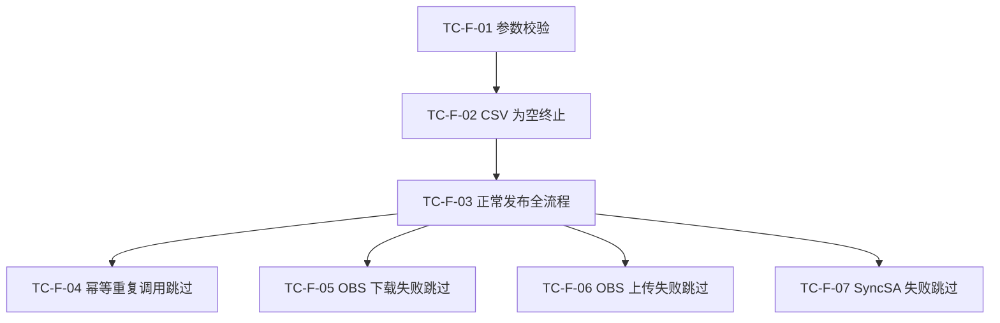
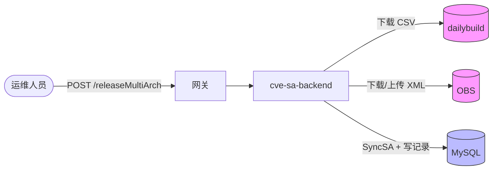
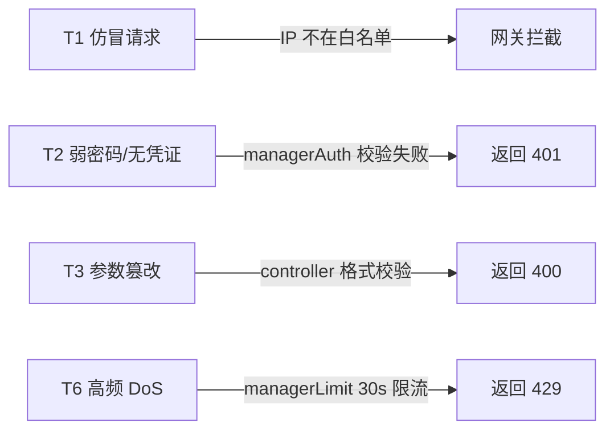

# #66 cve-manager支持riscv架构update发布 测试策略设计说明书

## 1. 基本信息

* **需求链接**: https://github.com/opensourceways/backlog/issues/66
* **需求名称**: cve-manager支持riscv架构update发布
* **核心目标**: 验证 `POST /releaseMultiArch` 接口的功能正确性，以及安全、集成等非功能专项的闭环验收。
* **开发责任人**: yangwei999
* **测试责任人**: yangwei999

---

## 2. 测试维度确认

> **操作指南**：依据需求分析阶段标签勾选，勾选后必须在"第 3 节"提供对应的测试用例或方案。

* [x] **功能自检测试**

> * **测试重点：** API 契约验证、业务逻辑分支覆盖、边界值测试。
> * **目的：** 确保功能实现符合设计预期。
> * **触发条件：** 强制执行，可委托开发测试完成，测试完成验收。

* [x] **集成测试**

> * **测试重点：** 跨服务调用链路验证（dailybuild CSV → OBS → SyncSA → MySQL）、数据最终一致性。
> * **目的：** 消除组件间级联影响风险。
> * **触发条件：** 需求标签含 `need_itest`。

* [x] **安全与隐私测试**

> * **测试重点：** 鉴权绕过、IP 白名单有效性、参数注入、限流有效性。
> * **目的：** 验证威胁建模中 T1～T6 的消减措施是否生效。
> * **触发条件：** 需求标签含 `need_security`。

---

## 3. 专项验证设计和执行详情

> 测试自检
> * [ ] **Task 闭环**: 架构设计说明书中定义的 TASK 是否均有对应的测试结果？
> * [ ] **证据留存**: 关键测试（如安全扫描）是否附带了截图或报告链接？

### 3.1 功能测试专项

> * API 语义验证：验证 HTTP 状态码与响应体格式是否符合接口规范。
> * 边界与非法输入：验证参数缺失、格式非法时的拦截能力。
> * 业务逻辑分支：覆盖正常发布、CSV 为空、重复发布跳过等主要分支。
> * 单元测试 statement 覆盖率须 ≥ 80%。

**TC-F-01 接口参数校验**

* **对应 Task**: TASK3（controller 参数校验）
* **对应 Task 链接**: https://github.com/opensourceways/backlog/issues/66

| 子用例 | 输入 | 预期结果 |
|--------|------|---------|
| version 为空 | `date=2025-03-01&dir=openEuler_24.03_riscv64` | `{"success":false,"msg":"param is empty"}` |
| date 为空 | `version=openEuler-24.03-LTS&dir=openEuler_24.03_riscv64` | `{"success":false,"msg":"param is empty"}` |
| dir 为空 | `version=openEuler-24.03-LTS&date=2025-03-01` | `{"success":false,"msg":"param is empty"}` |
| dir 格式非法（不含下划线） | `dir=riscv64` | `{"success":false,"msg":"..."}` 且不触发后续流程 |

**TC-F-02 CSV 为空时终止**

* **对应 Task**: TASK2（getRpms 空 map 返回 error）
* **对应 Task 链接**: https://github.com/opensourceways/backlog/issues/66
* **操作**: 模拟 dailybuild 返回空 CSV，调用接口。
* **预期结果**: 接口返回 `{"success":false}`，不触发 OBS 下载，不写数据库记录。

**TC-F-03 正常发布全流程**

* **对应 Task**: TASK2、TASK5（核心发布逻辑 + 联调）
* **对应 Task 链接**: https://github.com/opensourceways/backlog/issues/66
* **操作**: 传入合法 `version`、`date`、`dir`，使用真实 riscv64 转测数据触发接口。
* **预期结果**:
  * 响应 `{"success":true,"data":["2025/cvrf-openEuler-SA-2025-xxxx.xml",...]}`
  * OBS 中对应 CVRF XML 的 `ProductTree` 新增 riscv64 Branch
  * `cve_release_multi_arch` 表写入 `arch=riscv64` 的发布记录

**TC-F-04 幂等性：重复调用跳过**

* **对应 Task**: TASK2（checkWhetherReleased 幂等检查）
* **对应 Task 链接**: https://github.com/opensourceways/backlog/issues/66
* **操作**: 对同一参数连续调用接口两次。
* **预期结果**: 第二次调用时该公告被跳过，`cve_release_multi_arch` 表中无重复记录，接口仍返回 `success:true`，`data` 为空列表。

**TC-F-05 OBS 下载失败时跳过该公告**

* **对应 Task**: TASK2（DownloadFile 失败容错）
* **对应 Task 链接**: https://github.com/opensourceways/backlog/issues/66
* **操作**: 模拟 OBS 下载接口返回错误，队列中包含多条公告。
* **预期结果**: 失败公告被跳过（不计入 `data`），其余公告正常发布，接口不返回 500。

**TC-F-06 OBS 上传失败时不触发 SyncSA**

* **对应 Task**: TASK2（UploadFile 失败不触发 SyncSA）
* **对应 Task 链接**: https://github.com/opensourceways/backlog/issues/66
* **操作**: 模拟 OBS 上传接口返回错误。
* **预期结果**: SyncSA 未被调用，`cve_release_multi_arch` 表无对应记录，错误写入日志。

**TC-F-07 SyncSA 失败时不写发布记录**

* **对应 Task**: TASK2（SyncSA 失败不写记录）
* **对应 Task 链接**: https://github.com/opensourceways/backlog/issues/66
* **操作**: 模拟 SyncSA 调用返回错误。
* **预期结果**: `cve_release_multi_arch` 表无对应记录，错误写入日志，其余公告不受影响。

---

### 3.3 集成测试专项

> * 全链路追踪：验证从接口入参到数据库持久化的完整链路数据一致性。
> * 外部依赖隔离：验证各外部依赖（dailybuild / OBS / MySQL）失效时的隔离效果。

**TC-I-01 全链路数据一致性验证**

* **对应 Task**: TASK5（端到端联调）
* **对应 Task 链接**: https://github.com/opensourceways/backlog/issues/66
* **操作**: 使用真实 riscv64 转测数据，执行完整发布流程后，逐层校验数据。
* **预期结果**:

| 校验点 | 预期 |
|--------|------|
| OBS 中 CVRF XML | ProductTree 新增 Name=riscv64 的 OpenEulerBranch |
| riscv64 Branch 内容 | FullProductName 列表与 CSV 解析结果一致 |
| MySQL cve_release_multi_arch | 写入 arch=riscv64 记录，字段值与请求参数一致 |
| 接口响应 data | 与实际写入的公告编号一一对应 |

**TC-I-02 dailybuild 不可达时接口降级**

* **对应 Task**: TASK2（getRpms 失败返回 error）
* **对应 Task 链接**: https://github.com/opensourceways/backlog/issues/66
* **操作**: 断开 dailybuild 网络，调用接口。
* **预期结果**: 接口返回 `{"success":false}`，OBS 和 MySQL 均无变更。

**TC-I-03 MySQL 写入失败时已发布公告不受影响**

* **对应 Task**: TASK2（发布记录写入失败容错）
* **对应 Task 链接**: https://github.com/opensourceways/backlog/issues/66
* **操作**: 模拟 `cve_release_multi_arch` 表写入失败，其余步骤正常。
* **预期结果**: OBS 中 CVRF XML 和 SyncSA 已执行，错误仅写入日志，不影响已发布结果。

---

### 3.4 安全与隐私测试专项

> 验证威胁建模中 T1～T6 消减措施的有效性。

**TC-S-01 非白名单 IP 请求被拒绝（T1）**

* **对应 Task**: TASK3（路由 managerAuth + 网关白名单）
* **对应 Task 链接**: https://github.com/opensourceways/backlog/issues/66
* **操作**: 使用非白名单 IP 发送合法请求。
* **预期结果**: 网关层直接拒绝，请求不到达应用层，返回 403 或连接拒绝。

**TC-S-02 无凭证/错误凭证被拒绝（T2）**

* **对应 Task**: TASK3（managerAuth 鉴权中间件）
* **对应 Task 链接**: https://github.com/opensourceways/backlog/issues/66

| 子用例 | 输入 | 预期结果 |
|--------|------|---------|
| 不携带 username/password | 合法参数，无凭证字段 | 401 Unauthorized |
| 错误密码 | username 正确，password 错误 | 401 Unauthorized |
| 空密码 | username 正确，password="" | 401 Unauthorized |

**TC-S-03 非法参数被拦截（T3）**

* **对应 Task**: TASK3（controller 参数格式校验）
* **对应 Task 链接**: https://github.com/opensourceways/backlog/issues/66
* **操作**: 传入包含路径穿越（`../`）或特殊字符的 `dir` 参数。
* **预期结果**: controller 返回 400，不触发后续业务逻辑，OBS 路径不被污染。

**TC-S-04 高频请求被限流（T6）**

* **对应 Task**: TASK3（managerLimit 中间件）
* **对应 Task 链接**: https://github.com/opensourceways/backlog/issues/66
* **操作**: 同一 IP 在 30 秒内连续发送 2 次合法请求。
* **预期结果**: 第 1 次正常响应；第 2 次返回 429 Too Many Requests，不触发业务逻辑。

---
