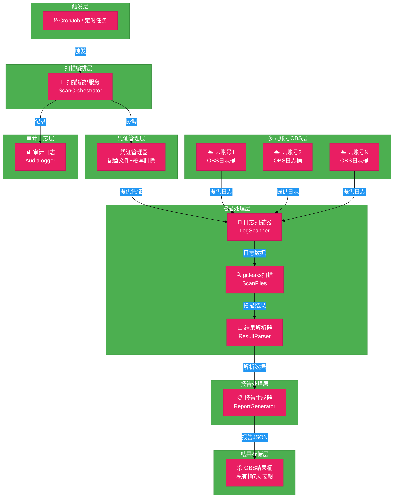
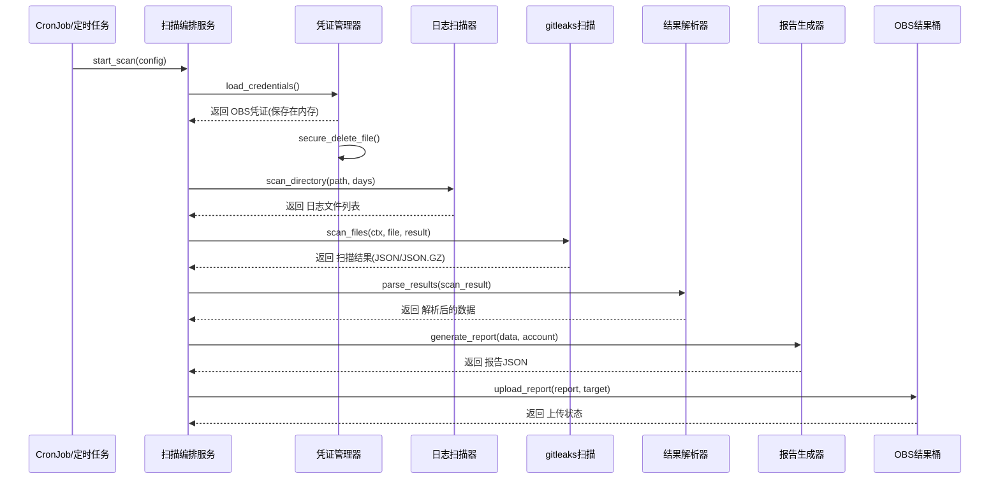
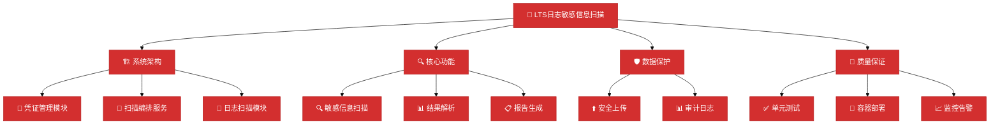
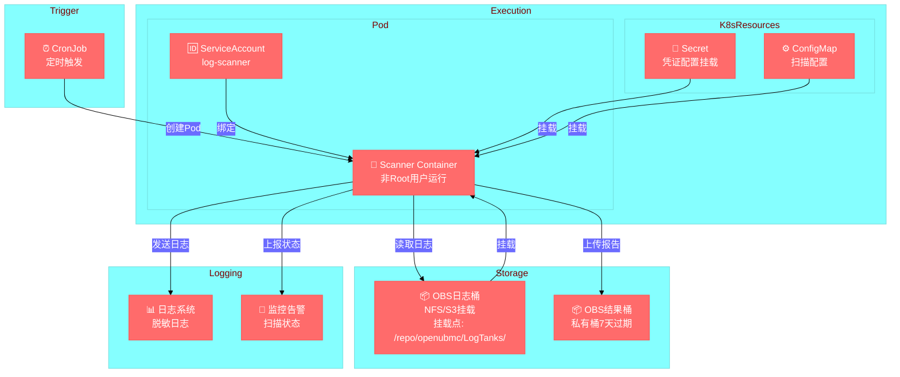
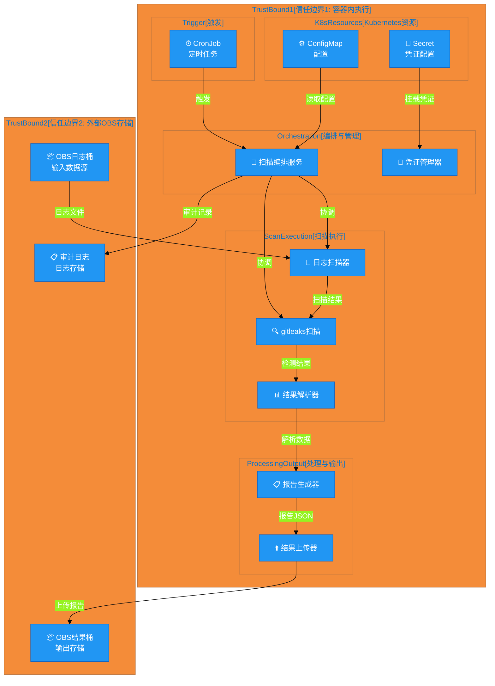
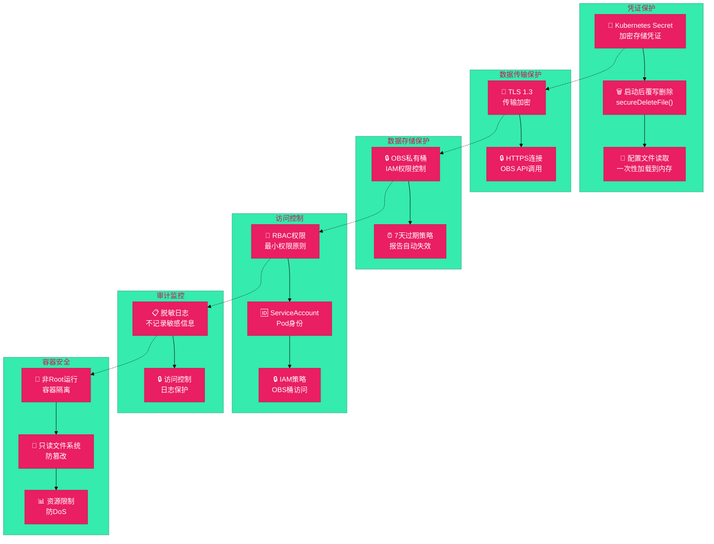

# #67 LTS日志敏感信息扫描 架构设计说明书 (Architecture Design Document)

---

## 1. 基础信息

* **需求链接**: **[#67 支持扫描各个云账号LTS服务运行日志敏感信息](https://github.com/opensourceways/backlog/issues/67)**
* **需求名称**: **支持扫描各个云账号LTS服务运行日志敏感信息**
* **开发责任人**: **zkhzkhz**
* **设计目标**: **通过定期自动化扫描挂载的OBS日志目录，使用gitleaks工具检测敏感信息，生成结构化报告定位问题namespace和pod。凭证通过配置文件注入，启动后覆写删除配置文件。**

---

## 2. 功能设计

> **说明**：描述系统的组件构成、职责划分及交互逻辑。

### 2.1 架构图

> 此处建议插入架构拓扑系统组件图或时序图,描述组件间的交互关系。

**设计说明/归档：**

**系统架构分层图**：



**架构说明：**

- **触发层**：支持Kubernetes CronJob或系统定时任务（crontab）定期触发扫描任务
- **扫描编排层**：主控制器（ScanOrchestrator），协调各个模块的执行流程，处理错误和重试
- **凭证管理层**：从配置文件读取OBS凭证，启动后覆写删除配置文件，避免硬编码
- **多云账号OBS层**：各云账号的OBS桶通过NFS/S3挂载到Pod，存储LTS归档的日志文件
- **扫描处理层**：
  - 日志扫描器（LogScanner）：直接扫描挂载目录中最近N天的日志文件（默认3天）
  - gitleaks扫描（ScanFiles）：集成gitleaks工具，检测密钥、Token、凭证等
  - 结果解析器（ResultParser）：从扫描结果中提取namespace和pod信息
- **报告生成层**：生成JSON格式的结构化报告，设置7天过期
- **结果存储层**：将报告上传到OBS结果桶（私有桶，设置7天过期）
- **审计日志层**：记录扫描过程（脱敏），便于事后审计和问题追踪

### 2.2 数据流图

> 此处建议插入数据流图，描述核心业务数据的生命周期，即威胁建模。

**设计说明/归档：**

**数据流程图**：


**数据流说明：**

1. **输入阶段**：读取扫描配置（云账号、时间范围）和OBS凭证（从配置文件）
2. **凭证清理**：读取完成后立即覆写删除凭证配置文件，凭证保存在内存中供后续使用
3. **处理阶段**：
   - 扫描：直接扫描挂载目录中最近N天的日志文件（默认3天）
   - 检测：使用gitleaks检测敏感信息
   - 解析：从扫描结果中提取namespace和pod
   - 富化：添加时间戳、日志来源等元数据
4. **输出阶段**：
   - 生成JSON格式报告
   - 上传到OBS结果桶（私有桶，设置7天过期）
5. **审计阶段**：记录所有操作的脱敏日志，不记录完整的敏感信息

### 2.3 组件职责与接口

> 列出新增/修改的组件及其定义的 API 规范。

**设计说明/归档：**

**组件交互时序图**：



**组件接口定义表**：

| 组件名称 | 功能描述 | 输入 | 输出 | 接口方法 |
|---------|------|------|------|---------|
| **扫描编排服务** | 协调整个扫描流程，管理生命周期 | 扫描配置(Config) | 扫描状态、错误信息 | `StartScan()`, `scanAccount(account)` |
| **凭证管理器** | 从配置文件读取凭证，启动后覆写删除配置文件 | 配置文件路径 | OBS凭证(AK/SK) | `secureDeleteFile(filePath)` |
| **日志扫描器** | 扫描挂载目录中的日志文件，过滤最近N天 | 挂载目录路径、时间范围 | 日志文件列表 | `ScanDirectory(path)` |
| **gitleaks扫描** | 调用gitleaks进行敏感信息检测 | 日志文件路径 | 扫描结果(JSON/JSON.GZ) | `ScanFiles(ctx, filePath, resultFile)` |
| **结果解析器** | 从扫描结果中提取namespace和pod信息 | 扫描结果(JSON/JSON.GZ) | 结构化报告(JSON) | `ParseScanResult(data)`, `extractMetadataFromGz()` |
| **报告生成器** | 生成最终的结构化报告 | 解析后的数据 | 报告JSON | `GenerateReport(data, account)` |
| **结果上传器** | 将报告上传到OBS结果桶 | 报告JSON、目标路径 | 上传状态 | `UploadReport(data, accountName, scanDate)` |
| **审计日志记录器** | 记录扫描过程的脱敏日志 | 操作事件 | 审计日志 | `LogEvent(eventType, details)` |

**ObsUploader接口（用于测试Mock）**：
```go
type ObsUploader interface {
    PutObject(input *obs.PutObjectInput) (output *obs.PutObjectOutput, err error)
}
```

### 2.4 UX设计

> 设计目标：确保功能不仅"可用"，而且"好用"，降低开发者的认知负担和运维人员的误操作风险。

**设计说明/归档：**

不涉及。原因：本需求是后台定时扫描任务，无用户交互界面。运维人员通过查看OBS中的扫描报告了解结果，通过配置文件或环境变量配置扫描参数。

### 2.5 SOD设计

> 设计目标：通过维护SOD权限设计文档，确保权限设计可审计、可复用、可跨服务重用。

**设计说明/归档：**

不涉及。原因：本需求是自动化扫描任务，无复杂的权限分离需求。扫描任务以服务账号运行，具有OBS读权限和结果桶写权限。

### 2.6 功能设计分解TASK清单

**设计说明/归档：**

**工作分解结构（WBS）**：



**任务清单:**

| 任务 ID | 功能任务描述 | 责任人 |
|--------|-----------|------|
| **TASK1** | 实现扫描编排服务框架(ScanOrchestrator)，支持定时触发和手动触发，包含错误处理 | zkhzkhz |
| **TASK2** | 实现凭证管理模块，从配置文件读取OBS凭证，启动后覆写删除配置文件(secureDeleteFile) | zkhzkhz |
| **TASK3** | 实现日志扫描器(LogScanner)，扫描挂载目录中最近N天的日志文件，支持多云账号 | zkhzkhz |
| **TASK4** | 集成gitleaks工具，实现敏感信息扫描(ScanFiles)和结果解析 | zkhzkhz |
| **TASK5** | 实现结果解析器(ResultParser)，从扫描结果中提取namespace和pod信息，生成结构化报告 | zkhzkhz |
| **TASK6** | 实现报告上传功能(ResultUploader)，上传到OBS结果桶，设置7天过期 | zkhzkhz |

### 2.7 部署架构

**设计说明/归档：**

**部署架构图**：



**部署说明：**

- **CronJob**：Kubernetes原生定时任务，按月度或按需触发扫描
- **Pod**：扫描容器，以非Root用户运行，资源限制已设置
- **Secret**：存储凭证配置文件路径，由Kubernetes加密存储
- **ConfigMap**：存储扫描配置（云账号列表、时间范围等）
- **OBS挂载**：通过NFS或S3挂载各云账号的OBS日志目录到Pod（`/repo/openubmc/LogTanks/`）
- **凭证配置文件**：启动时从Secret挂载读取，启动后立即覆写删除
- **日志收集**：脱敏处理后发送到日志系统
- **监控告警**：实时监控扫描状态，异常时告警
- **OBS结果桶**：私有桶，报告上传时设置7天过期

---

## 3. 非功能设计

### 3.1 安全与隐私设计评估和设计

> **注意**：仅当需求判定为 **`need_security`** 时，本章节为必填项。

> 关注点：防御能力与合规边界。

**设计说明/归档：**

本需求为安全扫描工具类需求，涉及凭证管理，需重点关注凭证安全和数据泄露风险。

#### 3.1.1 威胁建模与数据流分析 (Threat Modeling)

> 基于 **STRIDE** 方法，通过DFD数据流图识别系统中的关键数据流和风险点。

**设计说明/归档：**

**DFD数据流图 - 信任边界与关键数据流**：



**数据流说明：**

**信任边界1 (容器执行环境 - 受信任)：**
- 所有扫描逻辑和数据处理都在容器内执行
- 完整的处理流水线：读凭证 → 编排 → 扫描 → 上传

**信任边界2 (外部OBS存储 - 不完全受信任)：**
- OBS日志桶：输入数据源（NFS/S3挂载的日志文件）
- OBS结果桶：报告输出存储

**关键数据流（跨越信任边界的高风险点）：**

| 序号 | 数据流 | 来源 → 目标 | 内容 | 风险 | 缓解措施 |
|------|--------|-----------|------|------|---------|
| 1️⃣ | 日志读取 | OBSLogs → LogScanner | 原始日志文件 | 网络嗅探、篡改 | TLS 1.3、IAM权限 |
| 2️⃣ | 报告上传 | Uploader → OBSResults | 私有桶7天过期 | 中间人攻击、泄露 | HTTPS传输、IAM控制 |
| 3️⃣ | 凭证读取 | Secret → CredMgr | OBS访问凭证 | 凭证泄露 | 启动后覆写删除 |
| 4️⃣ | 审计记录 | Orchestrator → AuditLogs | 脱敏操作日志 | 日志篡改 | 访问控制 |

---

**威胁分析详情** (STRIDE方法，12个威胁)：

| 威胁ID | 威胁名称 | STRIDE类别 | 风险等级 | 关联数据流 | 风险场景 | 缓解措施 |
|--------|---------|-----------|---------|----------|---------|---------|
| S-001 | 伪造扫描任务身份 | Spoofing | 🔴 高 | CronJob触发 | 定时任务被篡改 | Kubernetes RBAC + 不可变CronJob |
| S-002 | 伪造OBS凭证 | Spoofing | 🔴 高 | 凭证读取(Secret) | 凭证被复制冒用 | Secret加密 + 覆写后删除 |
| T-001 | 篡改配置文件 | Tampering | 🟠 中 | 配置读取(ConfigMap) | ConfigMap被修改 | RBAC + 不可变ConfigMap |
| T-002 | 篡改审计日志 | Tampering | 🟠 中 | 审计记录 | 审计日志被删除修改 | 访问控制 |
| R-001 | 否认扫描操作 | Repudiation | 🟠 中 | 审计记录 | 无法证明执行过 | Kubernetes审计日志 |
| I-001 | 凭证泄露 | Information | 🔴 高 | 凭证读取 | OBS凭证泄露 | 启动后立即覆写删除 |
| I-002 | 扫描结果泄露 | Information | 🔴 高 | 报告上传 | 报告被未授权访问 | 私有桶 + IAM控制 |
| I-003 | 日志内容泄露 | Information | 🔴 高 | 日志读取 | 日志被窃听 | IAM策略 + 日志桶加密 |
| I-004 | 审计日志泄露 | Information | 🟠 中 | 审计记录 | 审计日志被访问 | 访问控制 |
| D-001 | 资源耗尽 | Denial | 🟠 中 | Orchestrator协调 | 扫描过度消耗资源 | 并发限制 + 超时机制 |
| D-002 | 扫描任务阻塞 | Denial | 🟠 中 | SecretScanner执行 | 大文件导致阻塞 | 超时机制 |
| E-001 | 容器逃逸 | Elevation | 🔴 高 | 容器执行 | 容器漏洞被利用 | Pod安全策略 + 只读文件系统 |

**威胁汇总**：
- **总威胁数**: 12个
- **高风险(P1)**: 6个
- **中风险(P2)**: 6个

#### 3.1.2 安全设计实现 (Security Mechanisms)

> **参考**：威胁模型评估与安全设计实现

**设计说明/归档：**

**安全防御机制全景**：



**凭证管理：**
- ✅ 严禁硬编码：所有OBS凭证(AK/SK)通过配置文件注入，不硬编码在代码中
- ✅ 密钥轮转：支持配置文件更新实现凭证轮转
- ✅ 最小权限：OBS凭证仅授予特定桶的读权限和结果桶的写权限

**凭证注入与清理机制：**

1. **启动前准备**：
   - 配置文件（config.json）包含OBS凭证
   - 或通过Secret挂载配置文件到Pod

2. **启动时加载**：
   - 读取配置文件，加载到内存
   - 配置文件路径通过命令行参数指定

3. **启动后清理**（关键安全机制）：
   ```go
   // secureDeleteFile 安全删除文件（覆写后删除）
   func secureDeleteFile(filePath string) error {
       fileInfo, err := os.Stat(filePath)
       if err != nil {
           if os.IsNotExist(err) {
               return nil
           }
           return err
       }

       // 打开文件准备覆写
       file, err := os.OpenFile(filePath, os.O_WRONLY, 0600)
       if err != nil {
           return err
       }
       defer file.Close()

       // 用随机数据覆写
       randomData := make([]byte, fileInfo.Size())
       if _, err := rand.Read(randomData); err != nil {
           return err
       }

       if _, err := file.Write(randomData); err != nil {
           return err
       }

       // 删除文件
       if err := os.Remove(filePath); err != nil {
           return err
       }

       return nil
   }
   ```

4. **内存中的凭证管理**：
   - 凭证加载到内存后，不再从磁盘读取
   - 应用关闭时，内存中的凭证自动释放

**数据传输保护：**
- ✅ TLS加密：所有与OBS的通信使用HTTPS

**数据存储保护：**
- ✅ OBS私有桶：报告存储在私有桶，仅授权用户可访问
- ✅ 7天过期：上传报告时设置7天过期策略

**运行时隔离：**
- ✅ 非Root运行：扫描容器以非Root用户运行
- ✅ 只读文件系统：容器根文件系统设置为只读，仅允许写入临时目录
- ✅ 资源限制：设置CPU和内存限制，防止资源耗尽

**日志审计：**
- ✅ 脱敏日志：审计日志不记录完整的敏感信息，仅记录操作类型、时间戳、云账号ID

**访问控制：**
- ✅ OBS结果桶权限：仅授予特定的IAM角色读权限

#### 3.1.3 安全任务分解

**任务清单:**

| 任务 ID | 安全任务描述 | 责任人 |
|--------|-----------|------|
| **SEC-TASK1** | 设计和实现凭证管理模块，从配置文件加载OBS凭证，启动后覆写删除配置文件 | zkhzkhz |
| **SEC-TASK2** | 配置OBS结果桶的访问权限和过期策略，确保只有授权用户可访问 | zkhzkhz |
| **SEC-TASK3** | 实现审计日志脱敏机制，确保日志中不记录完整的敏感信息 | zkhzkhz |
| **SEC-TASK4** | 配置容器安全策略，包括非Root运行、只读文件系统、资源限制 | zkhzkhz |
| **SEC-TASK5** | 进行安全测试，验证凭证管理、访问控制的有效性 | zkhzkhz |

### 3.2 可靠性设计评估和设计（可选）

> **关注点**：系统的容错能力与故障恢复。

**设计说明/归档：**

不涉及。原因：本需求是定期批处理任务，非关键路径服务。扫描失败可在下一个周期重试，无需高可用设计。

### 3.3 可服务性设计评估和设计（可选）

> **关注点**：系统的可观测性、可维护性与故障排查能力。

**设计说明/归档：**

不涉及。原因：本需求是批处理任务，无长驻服务。通过审计日志和扫描报告进行故障排查即可。

### 3.4 性能与伸缩性评估和设计（可选）

> **关注点**：社区生态兼容性与未来扩展。

**设计说明/归档：**

不涉及。原因：本需求是定期扫描任务，无高并发要求。日志下载和扫描可通过并发控制实现，无需特殊的性能优化。

---

## 4. 实现细节

### 4.1 配置文件格式

```json
{
  "scan_region": "cn-north-4",
  "result_dir": "/tmp/scan-results",
  "obs_bucket": "log-scan-results",
  "obs_url": "https://obs.cn-north-4.myhuaweicloud.com",
  "obs_access_key": "${OBS_ACCESS_KEY}",
  "obs_secret_key": "${OBS_SECRET_KEY}",
  "scan_timeout_secs": 3600,
  "gitleaks_config_path": "/path/to/gitleaks.toml",
  "cloud_account": {
    "account_name": "account-1",
    "obs_log_path": "/repo/openubmc/LogTanks",
    "scan_lookback_days": 3
  },
  "scan_blacklist": ["*/test/*", "*/debug/*"]
}
```

### 4.2 目录结构

```
lts-log-scanner/
├── main.go              # 主程序入口
├── main_test.go         # 单元测试（覆盖率83.6%）
├── Dockerfile           # 容器镜像构建
├── config.json.example  # 配置示例
└── gitleaks.toml       # gitleaks配置
```

### 4.3 OBS接口Mock

为支持单元测试，定义了ObsUploader接口：

```go
type ObsUploader interface {
    PutObject(input *obs.PutObjectInput) (output *obs.PutObjectOutput, err error)
}
```

测试时可通过Mock实现该接口进行无OBS依赖的测试。

### 4.4 单元测试覆盖率

| 模块 | 覆盖率 | 目标 | 状态 |
|-----|-------|------|------|
| lts-log-scanner | **83.6%** | ≥80% | ✅ 通过 |
