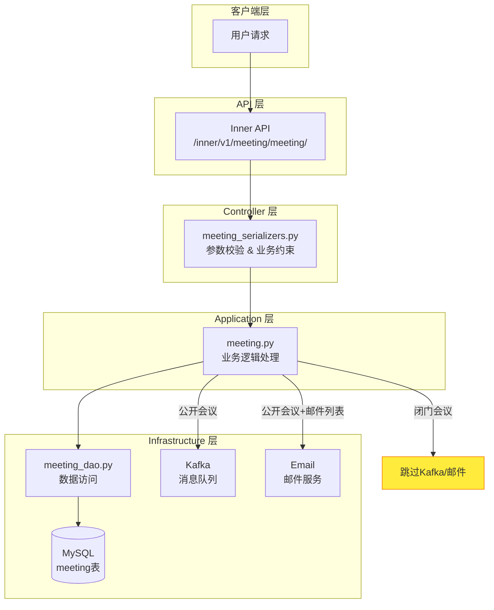
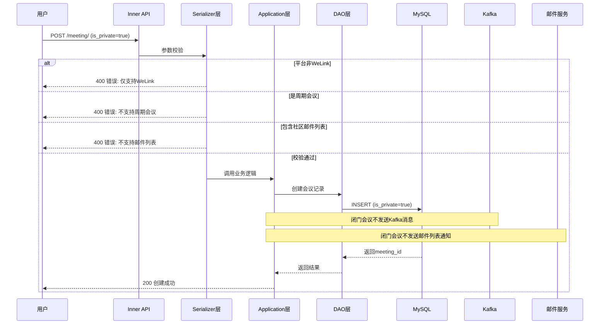
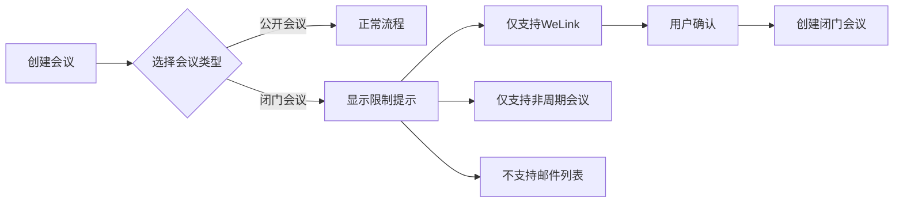

# #80 openEuler社区支持闭门会议架构设计说明书 (Architecture Design Document)
---

## 1. 基础信息

* **需求链接**: https://github.com/opensourceways/backlog/issues/80
* **需求名称**: openEuler社区支持闭门会议
* **开发责任人**: Tom_zc
* **设计目标**: 在 meeting-platform 中新增 `is_private` 字段及业务约束校验，实现闭门会议的创建、查询过滤功能，确保闭门会议信息不对外公开。

---

## 2. 功能设计

> **说明**：描述系统的组件构成、职责划分及交互逻辑。

### 2.1 架构图

> 描述闭门会议功能的系统组件交互关系。

**设计说明/归档：**



**关键设计说明：**
- 闭门会议在 Serializer 层完成业务约束校验（平台、周期、邮件列表）
- 业务层根据 `is_private` 字段决定是否发送 Kafka 消息和邮件通知
- DAO 层在查询公开会议时自动过滤闭门会议

### 2.2 数据流图

> 描述闭门会议创建流程的数据生命周期。

**设计说明/归档：**



### 2.3 组件职责与接口

> 列出新增/修改的组件及其定义的 API 规范。

**设计说明/归档：**

#### 2.3.1 模型层变更 (models.py)

**新增字段：**

| 字段名 | 类型 | 默认值 | 说明 |
|-------|------|-------|------|
| `is_private` | BooleanField | False | 会议是否为闭门会议 |

```python
# meeting_platform/apps/meeting/models.py
class Meeting(models.Model):
    # ... 现有字段 ...
    is_private = models.BooleanField(default=False, verbose_name="是否闭门会议")
```

#### 2.3.2 Serializer 层变更 (meeting_serializers.py)

**新增校验方法：**

| 方法名 | 功能 | 校验逻辑 |
|-------|------|---------|
| `validate_is_private` | 参数类型校验 | 确保 `is_private` 为布尔类型 |
| `validate` | 业务约束校验 | 校验平台限制、周期限制、邮件列表限制 |

**校验逻辑伪代码：**

```python
def validate(self, attrs):
    is_private = attrs.get('is_private', False)

    if is_private:
        # 1. 平台限制：仅支持 WeLink
        if attrs.get('platform', '').lower() != 'welink':
            raise ValidationError(RetCode.STATUS_MEETING_PRIVATE_SUPPORT_TYPE)

        # 2. 周期限制：不支持周期性会议
        if attrs.get('cycle_type') is not None:
            raise ValidationError(RetCode.STATUS_MEETING_PRIVATE_SUPPORT_CYCLE)

        # 3. 邮件列表限制：不支持社区邮件列表
        email_list = attrs.get('email_list', '')
        if email_list:
            check_email_in_list(email_list, settings.COMMUNITY_ETHERPAD.get(community))

    return attrs
```

#### 2.3.3 工具层变更 (check_params.py)

**新增函数：**

```python
def check_email_in_list(email_list_str, email_list_format):
    """
    检查邮件列表中是否包含社区邮件列表地址

    Args:
        email_list_str: 用户输入的邮件列表字符串（分号分隔）
        email_list_format: 社区邮件列表前缀（如 dev@openeuler.org）

    Raises:
        MyValidationError: 如果包含社区邮件列表地址
    """
    if email_list_format is None or email_list_str is None:
        return
    email_list = email_list_str.split(";")
    for email in email_list:
        if email and email.startswith(email_list_format):
            raise MyValidationError(RetCode.STATUS_MEETING_PRIVATE_SUPPORT_EMAIL_LIST)
```

#### 2.3.4 错误码定义 (ret_code.py)

**新增错误码：**

| 错误码常量 | 错误码值 | 中文描述 | 英文描述 |
|-----------|---------|---------|---------|
| `STATUS_MEETING_PRIVATE_SUPPORT_TYPE` | STATUS_FACILITY_MEETING + 15 | 闭门会议只支持WeLink会议 | Closed-door meetings only support WeLink meetings. |
| `STATUS_MEETING_PRIVATE_SUPPORT_CYCLE` | STATUS_FACILITY_MEETING + 16 | 闭门会议只支持非周期性会议 | Closed-door meetings only support non-periodic meetings. |
| `STATUS_MEETING_PRIVATE_SUPPORT_EMAIL_LIST` | STATUS_FACILITY_MEETING + 17 | 闭门会议不支持通过邮件列表通知会议 | Closed-door meetings do not support notifications via mailing lists. |

#### 2.3.5 DAO 层变更 (meeting_dao.py)

**查询方法变更：**

| 方法名 | 变更内容 |
|-------|---------|
| `get_meeting_group_name` | 新增 `is_private=False` 过滤条件 |
| `get_meeting_date` | 新增 `is_private=False` 过滤条件 |

```python
# get_meeting_group_name 变更
@classmethod
def get_meeting_group_name(cls, community):
    return cls.dao.objects.filter(
        community=community,
        is_delete=0,
        is_private=False  # 新增：过滤闭门会议
    ).order_by("group_name").values_list("group_name", flat=True).distinct()
```

#### 2.3.6 数据库迁移 (migrations/0007_meeting_is_private.py)

```python
from django.db import migrations, models

class Migration(migrations.Migration):
    dependencies = [
        ('meeting', '0006_previous_migration'),
    ]

    operations = [
        migrations.AddField(
            model_name='meeting',
            name='is_private',
            field=models.BooleanField(default=False, verbose_name='是否闭门会议'),
        ),
    ]
```

### 2.4 UX设计

> 设计目标：确保功能不仅"可用"，而且"好用"，降低开发者的认知负担和运维人员的误操作风险。

**设计说明/归档：**

#### 2.4.1 交互流程



#### 2.4.2 前端交互设计要点

| 交互元素 | 设计说明 |
|---------|---------|
| **会议类型选择** | 提供"公开会议"和"闭门会议"单选按钮，默认选中"公开会议" |
| **限制提示** | 选择闭门会议时，显示信息提示框说明限制条件 |
| **平台联动** | 选择闭门会议后，平台选择仅显示 WeLink，其他平台置灰不可选 |
| **周期联动** | 选择闭门会议后，周期设置区域置灰不可选 |
| **邮件列表联动** | 选择闭门会议后，邮件列表输入框禁用，显示提示"闭门会议不支持邮件列表通知" |
| **错误反馈** | 当用户尝试绕过限制时，显示明确的错误提示（中英文双语） |

#### 2.4.3 错误提示文案

| 错误场景 | 中文提示 | 英文提示 |
|---------|---------|---------|
| 非WeLink平台 | 闭门会议只支持WeLink会议 | Closed-door meetings only support WeLink meetings. |
| 周期性会议 | 闭门会议只支持非周期性会议 | Closed-door meetings only support non-periodic meetings. |
| 社区邮件列表 | 闭门会议不支持通过邮件列表通知会议 | Closed-door meetings do not support notifications via mailing lists. |

### 2.5 SOD设计

> 设计目标：通过维护SOD权限设计文档，确保权限设计可审计、可复用、可跨服务重用。

**不涉及**：本需求为会议模型的字段扩展和业务逻辑增强，不涉及权限模型变更。闭门会议的创建权限与公开会议一致，依赖现有的身份认证和授权机制。

### 2.6 功能设计分解TASK清单

**设计说明/归档：**

**任务清单:**

| 任务 ID      | 功能任务描述                              | 责任人   |
|-------------|---------------------------------------|-------|
| **TASK1** | 模型层新增 `is_private` 字段，编写数据库迁移文件       | Tom_zc |
| **TASK2** | Serializer 层新增闭门会议校验逻辑               | Tom_zc |
| **TASK3** | 业务层和 DAO 层增加闭门会议查询过滤；新增错误码和校验函数      | Tom_zc |
| **TASK4** | 编写闭门会议功能单元测试                         | Tom_zc |

---

## 3. 非功能设计

### 3.1 安全与隐私设计评估和设计

> **注意**：仅当需求判定为 **`need_security`** 时，本章节为必填项。本需求未打标 `need_security`，本章节为可选内容。

> 关注点：防御能力与合规边界。

### 3.1.1 威胁分析 (Threat Modeling)

**设计说明/归档：**

闭门会议功能主要涉及会议信息的隐私保护，以下是潜在威胁分析：

| 威胁类别 | 攻击场景描述 (Scenario) | 风险等级/评分 | 对应减缓措施 (Mitigation) |
|---------|---------------------|------------|----------------------|
| **信息泄露** | 攻击者通过公开会议列表API查询到闭门会议信息 | 高 | DAO层查询自动过滤 `is_private=false` |
| **信息泄露** | 攻击者通过Kafka消息获取闭门会议信息 | 中 | 闭门会议不发送Kafka消息 |
| **信息泄露** | 攻击者通过邮件列表获取闭门会议信息 | 中 | 闭门会议不支持邮件列表通知 |
| **篡改** | 攻击者修改他人会议的 `is_private` 字段 | 中 | 复用现有权限校验机制，仅会议创建者可修改 |

### 3.1.2 安全设计实现 (Security Mechanisms)

**设计说明/归档：**

* **数据隔离**：闭门会议通过 `is_private` 字段标记，在查询层面实现数据隔离，确保闭门会议不出现在公开列表中。
* **消息隔离**：闭门会议不发送Kafka消息，避免消息队列泄露会议信息。
* **通知隔离**：闭门会议不支持社区邮件列表通知，避免邮件广播泄露会议信息。
* **权限控制**：复用现有会议管理权限机制，确保仅授权用户可创建/修改会议。

### 3.1.3 安全任务分解 (Security Task Breakdown)

**任务清单:**

| 任务 ID      | 安全任务描述                                    | 责任人   |
|-------------|--------------------------------------------|-------|
| **TASK1** | 验证查询接口过滤逻辑，确保闭门会议不被公开查询返回                   | Tom_zc |
| **TASK2** | 验证Kafka消息发送逻辑，确保闭门会议不触发消息发送                 | Tom_zc |
| **TASK3** | 验证邮件通知逻辑，确保闭门会议不发送邮件列表通知                    | Tom_zc |

### 3.2 可靠性与韧性设计评估和设计（可选）

> **关注点**：极端情况下的生存与恢复能力。

**设计说明/归档：**

* **数据一致性**：`is_private` 字段默认值为 False，确保新建会议默认为公开会议，避免误标记为闭门会议。
* **向后兼容**：数据库迁移对现有记录无影响，现有会议自动继承 `is_private=False`。

### 3.3 可服务性与可观测性评估和设计（可选）

> **关注点**：排障效率与全生命周期管理，确保故障可感知、可定位、可修复。

**设计说明/归档：**

* **错误码覆盖**：新增3个闭门会议相关错误码，便于快速定位问题。
* **日志记录**：闭门会议校验失败时记录详细错误日志，包含具体失败原因。

**任务清单:**

| 任务 ID      | 可服务性任务描述                                   | 责任人   |
|-------------|--------------------------------------------|-------|
| **TASK1** | 完善错误码文档，新增闭门会议相关错误码说明                       | Tom_zc |

### 3.4 性能与伸缩性评估和设计（可选）

> **关注点**：社区生态兼容性与未来扩展。

**设计说明/归档：**

* **查询性能**：`is_private` 字段建议添加数据库索引，优化查询性能（视数据量决定）。
* **扩展性**：闭门会议功能通过字段标记实现，未来可扩展支持更多隐私级别（如仅内部可见、仅特定SIG可见等）。

**任务清单:**

| 任务 ID      | 性能任务描述                                     | 责任人   |
|-------------|--------------------------------------------|-------|
| **TASK1** | 根据数据量评估是否需要为 `is_private` 字段添加索引             | Tom_zc |

---