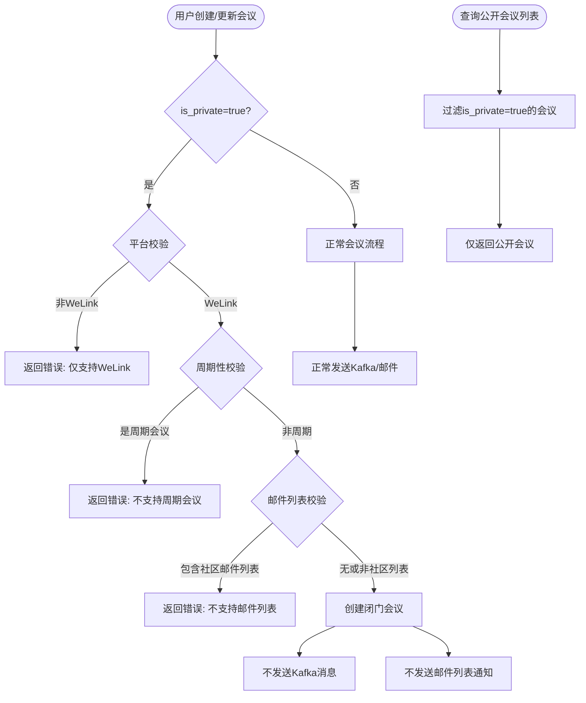

# #80 openEuler社区支持闭门会议需求分析说明书

## 1. 基础信息

* **需求链接**: https://github.com/opensourceways/backlog/issues/80
* **需求名称**: openEuler社区支持闭门会议
* **开发责任人**: Tom_zc

---

## 2. 需求场景说明

> 描述"在什么情况下，为了解决什么问题，用户需要做什么"。

**场景说明:**

openEuler 社区的会议平台当前支持公开会议的创建和管理，会议信息会通过 Kafka 消息广播、邮件列表通知等方式对外发布，并可在公开会议列表中查询。然而，部分会议场景需要限定参与人员范围，如技术评审会、敏感议题讨论、内部协调会等，这些会议不应对外公开，也不应通过社区邮件列表广播。

为满足此类闭门会议需求，需在 meeting-platform 中新增闭门会议支持功能，允许用户创建标记为"闭门"的会议，此类会议具有以下特征：
1. 仅支持 WeLink 会议平台
2. 仅支持非周期性单次会议
3. 不支持通过社区邮件列表发送会议通知
4. 不向 Kafka 发送会议创建/更新消息（避免公开广播）
5. 在公开会议列表查询中被自动过滤，不对外展示

---

## 3. 需求验收标准

> 明确需求完成的标志，必须是可量化、可测试的。

**验收标准:**

- 用户可通过 `is_private=true` 参数创建闭门会议，创建成功后数据库记录中 `is_private` 字段值为 True。
- 闭门会议仅支持 WeLink 平台，在 Zoom/Tencent 平台创建闭门会议时返回错误码 `STATUS_MEETING_PRIVATE_SUPPORT_TYPE`（错误信息：闭门会议只支持WeLink会议）。
- 闭门会议不支持周期性会议，创建时若 `is_cycle=true` 且 `is_private=true`，返回错误码 `STATUS_MEETING_PRIVATE_SUPPORT_CYCLE`（错误信息：闭门会议只支持非周期性会议）。
- 闭门会议不支持社区邮件列表通知，若 `email_list` 包含社区邮件列表地址（如 `dev@openeuler.org`），返回错误码 `STATUS_MEETING_PRIVATE_SUPPORT_EMAIL_LIST`（错误信息：闭门会议不支持通过邮件列表通知会议）。
- 闭门会议在公开会议列表查询接口（`get_meeting_date`、`get_meeting_group_name`）中不返回，查询结果仅包含 `is_private=false` 的会议。
- 更新现有会议为闭门会议时，平台验证逻辑与创建时一致。
- 单元测试 statement 覆盖率 ≥ 80%，覆盖闭门会议创建成功、平台限制、周期限制、邮件列表限制、查询过滤等主要分支。

---

## 4. 需求设计与分解

> 说明：基于初步方案，将需求拆解为可实施的原子 Task。后续的流程判定将严格依据这些 Task 的影响范围进行。

### 4.1 核心逻辑方案

**逻辑方案:**

在现有会议模型中新增 `is_private` 字段，在 Serializer 层增加闭门会议的业务约束验证，在业务层和 DAO 层增加查询过滤逻辑。

**关键模块说明：**

- **模型层**（`models.py`）：新增 `is_private` BooleanField 字段，默认值为 False。
- **数据库迁移**（`migrations/0007_meeting_is_private.py`）：执行数据库结构变更。
- **Serializer 层**（`meeting_serializers.py`）：新增 `validate_is_private` 方法校验参数类型；在 `validate` 方法中增加闭门会议的业务约束验证（平台、周期、邮件列表）。
- **业务层**（`meeting.py`）：更新会议时增加平台校验；查询接口增加 `is_private=False` 过滤条件。
- **DAO 层**（`meeting_dao.py`）：`get_meeting_group_name` 方法增加过滤条件。
- **工具层**（`check_params.py`）：新增 `check_email_in_list` 函数，校验邮件是否属于社区邮件列表。
- **错误码**（`ret_code.py`）：新增 3 个闭门会议相关错误码。

### 4.2 任务清单

**任务清单:**

| 任务 ID     | 任务描述 (Task Description)                                           | 预期产出 (Deliverables)                                | 预期工作量（人天） |
|-----------|---------------------------------------------------------------------|------------------------------------------------------|------------|
| **TASK1** | 模型层新增 `is_private` 字段，编写数据库迁移文件                            | `models.py` 字段定义 + `0007_meeting_is_private.py` 迁移文件 | 0.5        |
| **TASK2** | Serializer 层新增闭门会议校验逻辑：参数类型校验、平台限制、周期限制、邮件列表限制         | `meeting_serializers.py` 验证逻辑代码                    | 1          |
| **TASK3** | 业务层和 DAO 层增加闭门会议查询过滤；新增 `check_email_in_list` 校验函数；新增错误码 | `meeting.py` + `meeting_dao.py` + `check_params.py` + `ret_code.py` | 1          |
| **TASK4** | 编写闭门会议功能单元测试，覆盖创建、更新、查询、边界条件等场景                      | `test_private_meeting.py` 测试文件                      | 1          |

---

## 5. 需求相关性分析

> **操作说明**：根据上述拆解出的 Task，识别其变更行为。任何一项勾选为"是"：打上对应issue标签，必须执行对应的流程门禁。全部未勾选：该需求自动判定为轻量化特性，打上need_light标签。

### A. 安全相关性分析

> 若涉及以下任一项，打标 `need_security`标签，PR 必须关联特性issue的架构设计文档（含安全设计部分）**如勾选需要给出原因**。

* [ ] **边界变更**：新增公网端口、修改防火墙规则、变更网关配置。
* [ ] **凭证处理**：涉及密钥（Secret/Key）、Token、证书的存储或分发。
* [x] **权限调整**：修改权限模型、服务账号（SA）权限或鉴权逻辑。
* [ ] **供应链**：引入新的第三方二进制文件、SDK 或重大版本依赖升级。
* [ ] **隐私风险评估**：涉及用户个人数据（Email、手机号、IP、邮箱 等）的处理。
  
  > 闭门会议涉及会议信息的隐私保护，但本质是通过标记字段实现数据过滤，不涉及个人敏感数据的存储或处理方式变更。
* [ ] **AI使用**：涉及AIGC能力应用，并提供服务。

### B. 架构设计相关性分析

> 若涉及以下任一项，打标 `need_design`标签，PR 必须关联特性issue的架构设计文档。 **如勾选需要给出原因**。

* [ ] A环节判定需要完成安全设计
* [ ] 改变了现有系统的物理/逻辑拓扑
* [x] **新增或大幅修改对外暴露的 API/CLI 接口**
  
  > TASK1、TASK2 新增 `is_private` 字段到会议创建/更新/查询 API，属于对外暴露接口的修改，触发本项。
* [ ] 引入了新的中间件、数据库或三方核心组件

### C. 系统集成测试相关性分析

> 若涉及以下任一项，打标 `need_itest`标签，PR必须关联特性issue的测试策略和测试报告文档。 **如勾选需要给出原因**。

* [x] 上述环节判定需要执行安全设计或架构设计。
* [ ] **跨组件影响**：变更会触发下游服务或关联系统的连锁反应（级联效应）。
* [ ] **核心组件管控**：含项目定级为 Core 的核心逻辑变更。
* [ ] **环境强依赖**：功能高度依赖内核参数、网络拓扑或特定的物理挂载。
* [x] **端到端流程**：涉及从用户输入到持久化存储的全链路逻辑。
  
  > 完整链路为：API 入参校验 → 业务逻辑处理 → 数据库存储/查询，覆盖从用户触发到持久化的全链路，触发本项。

### D. 用户体验相关性分析

> 若涉及以下任一项，打标 `need_ux`标签，PR必须关联特性issue的用户体验设计文档。 **如勾选需要给出原因**。

* [x] **交互逻辑变更**：涉及 Web 门户、控制台（Dashboard）或命令行工具（CLI）的交互流程调整。
  
  > 新增 `is_private` 参数，用户在创建会议时需选择是否为闭门会议，涉及前端交互变更，触发本项。
* [ ] **感知性能变动**：变更可能显著影响页面的加载时间、同步请求的响应时延或异步任务的进度反馈。
* [ ] **文档与辅助能力**：涉及报错提示语、帮助中心链接、FAQ 或新功能的 Runbook 说明。
  
  > 新增 3 个错误提示语（闭门会议相关错误），属于文档与辅助能力变更。
* [ ] **无障碍与多语种**：涉及国际化（i18n）支持、辅助功能或不同终端（移动端/桌面端）的适配。

### 5.1 需求相关性分析汇总结果

* [x] need_security（需架构设计（含安全威胁分析和安全设计））
* [x] **need_design**（需架构设计）
* [x] **need_itest**（需执行测试策略设计和全链路集成测试）
* [x] **need_ux**（需架构设计（含UX设计））
* [ ] need_light（上述均未勾选，走快速合入通道）

---

## 6. 价值识别与业务评估

> **判定准则**：基础设施接纳需求必须具备明确的 ROI（投资回报比）或合规必要性。

| 维度        | 评估问题                                        | 结论/说明                                                                                         |
|-----------|---------------------------------------------|-----------------------------------------------------------------------------------------------|
| **范围判定**  | 该需求是否属于基础设施范围内？                             | 是，meeting-platform 属于 openEuler 社区会议管理基础设施，闭门会议支持属于平台能力扩展                              |
| **规划一致性** | 该需求是否在年度技术规划中？                              | 是，openEuler 社区会议平台需要支持多样化会议场景，闭门会议是社区治理的必要能力                                             |
| **优先级**   | 该需求优先级评估（高/中/低）？                            | 中，闭门会议功能可满足社区技术评审、敏感议题讨论等场景，提升社区治理效率                                                     |
| **通用性**   | 该需求是否解决 3 个以上业务方的共性痛点？                      | 是，多个 SIG 组均有闭门会议需求，如 TC 例会、安全评审等                                                         |
| **必要性**   | 现有组件通过配置变更是否无法实现目标或没有不用开发的替代方案？             | 是，当前系统不支持会议隐私标记，闭门会议无法与公开会议区分管理，无法通过配置变更实现                                             |
| **工作量**   | 预计总工作量                                      | 3.5 人天（TASK1: 0.5天，TASK2: 1天，TASK3: 1天，TASK4: 1天）                                        |
| **价值评估**  | 实现后能减少多少手动操作或提升多少系统稳定性？                     | 实现后社区可直接在平台创建闭门会议，无需另行沟通协调；闭门会议信息不会对外泄露，提升社区治理的隐私保护能力                              |

> **状态定义：** **Accept (准入)** | **Reject (驳回)** | **Pending (待议)**

**建议结论**：Accept

**原因描述:** 闭门会议是 openEuler 社区治理的必要能力，当前系统不支持会议隐私标记，导致敏感议题讨论需要临时协调或使用外部工具。新增闭门会议支持后，社区可直接在平台内管理闭门会议，实现与公开会议的隔离，提升社区治理效率和隐私保护能力。整体实现成本可控（3.5 人天），建议准入。

---