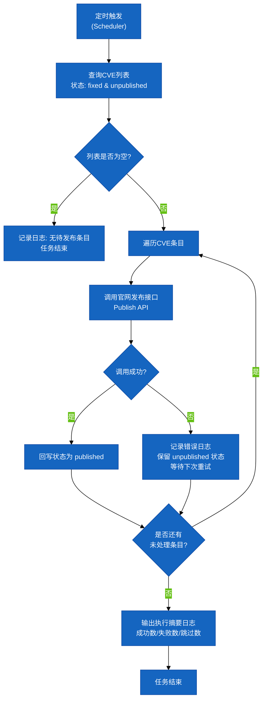
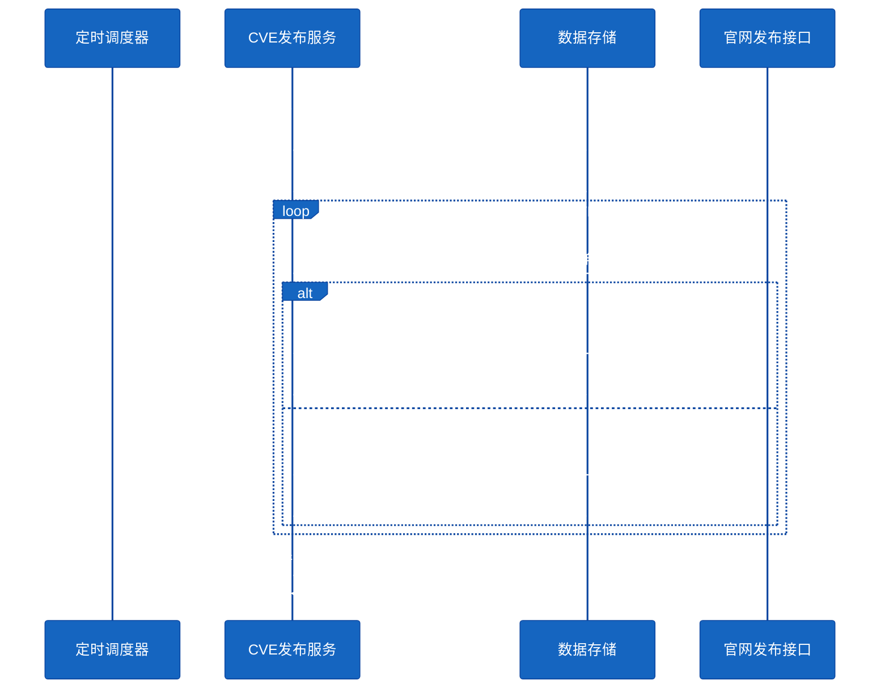

# #95 安全公告自动发布需求分析说明书

## 1. 基础信息

* **需求链接**: https://github.com/opensourceways/backlog/issues/95
* **需求名称**: 安全公告定时自动发布至官网
* **开发责任人**: **yangwei999**

---

## 2. 需求场景说明

> 描述"在什么情况下，为了解决什么问题，用户需要做什么"。

**场景说明:**

当前 openUBMC 社区的 CVE 安全公告发布流程依赖人工介入：在新版本发布前，运营/维护人员需手动调用接口将已修复的 CVE 漏洞信息发布至官网。该流程存在以下问题：

1. **效率低下**：每次发版均需人工触发，操作步骤繁琐，容易遗漏。
2. **信息滞后**：官网安全公告无法在 CVE 修复完成后及时同步，影响社区用户的安全感知。
3. **风险暴露**：延迟发布可能导致用户在不知情的情况下持续使用含漏洞版本。

**目标用户**：openUBMC 社区运营/SRE 团队、关注 CVE 安全公告的社区用户。

**期望行为**：系统通过定时任务自动扫描已修复但尚未发布至官网的 CVE 漏洞，并将其自动发布到官网，实现安全公告的及时同步，无需人工干预。

---

## 3. 需求验收标准

> 明确需求完成的标志，必须是可量化、可测试的。

**验收标准:**

- [ ] 定时任务按配置周期（默认每天一次）自动运行，无需人工触发。
- [ ] 每次执行时，正确识别所有"已修复（fixed）且未发布至官网（unpublished）"的 CVE 条目。
- [ ] 成功调用官网发布接口，将识别到的 CVE 公告发布至官网。
- [ ] 发布成功后，CVE 条目状态更新为"已发布（published）"，不会重复发布。
- [ ] 发布失败时，记录错误日志并支持下次定时任务重试，不影响其他条目的发布。
- [ ] 任务执行结果（成功/失败/跳过条目数）写入可观测日志，支持告警接入。
- [ ] 经测试，SRE 团队每次版本发布的手动公告发布操作耗时减少 100%（完全自动化）。

---

## 4. 需求设计与分解

> 基于初步方案，将需求拆解为可实施的原子 Task。

### 4.1 核心逻辑方案

**逻辑方案:**

新增一个定时任务服务（Scheduler），按配置周期触发执行。每次触发时：
1. 从数据库/存储中查询状态为"已修复（fixed）且未发布（unpublished）"的 CVE 漏洞列表。
2. 遍历列表，依次调用官网安全公告发布接口（Publish API）。
3. 接口调用成功后，将对应 CVE 条目状态回写为"已发布（published）"。
4. 接口调用失败时，记录错误日志，保留条目为"未发布"状态，等待下次重试。
5. 任务执行完毕后，输出执行摘要日志（成功数、失败数、跳过数）。

**流程图：**

**组件交互时序图：**

### 4.2 任务清单

**任务清单:**

| 任务 ID   | 任务描述 (Task Description) | 预期产出 (Deliverables) | 预期工作量（人天） |
|---------|-------------------------|---------------------|-----------|
| task1   | 设计并实现定时任务自动发布公告         | 代码                  | 1         |

---

## 5. 需求相关性分析

> **操作说明**：根据上述拆解出的 Task，识别其变更行为。任何一项勾选为"是"：打上对应issue标签，必须执行对应的流程门禁。全部未勾选：该需求自动判定为轻量化特性，打上need_light标签。

### A. 安全相关性分析

> 若涉及以下任一项，打标 `need_security`标签，PR 必须关联特性issue的架构设计文档（含安全设计部分）**如勾选需要给出原因**。

* [ ] **边界变更**：新增公网端口、修改防火墙规则、变更网关配置。
* [ ] **凭证处理**：涉及密钥（Secret/Key）、Token、证书的存储或分发。
* [ ] **权限调整**：修改权限模型、服务账号（SA）权限或鉴权逻辑。
* [ ] **供应链**：引入新的第三方二进制文件、SDK 或重大版本依赖升级。
* [ ] **隐私风险评估**：涉及用户个人数据（Email、手机号、IP、邮箱 等）的处理。
* [ ] **AI使用**：涉及AIGC能力应用，并提供服务。

### B. 架构设计相关性分析

> 若涉及以下任一项，打标 `need_design`标签，PR 必须关联特性issue的架构设计文档。 **如勾选需要给出原因**。

* [ ] A环节判定需要完成安全设计
* [ ] 引入了新的中间件、数据库或三方核心组件
* [ ] 改变了现有系统的物理/逻辑拓扑
* [ ] 新增或大幅修改对外暴露的 API/CLI 接口

### C. 系统集成测试相关性分析

> 若涉及以下任一项，打标 `need_itest`标签，PR必须关联特性issue的测试策略和测试报告文档。 **如勾选需要给出原因**。

* [ ] 上述环节判定需要执行安全设计或架构设计。
* [ ] **端到端流程**：涉及从用户输入到持久化存储的全链路逻辑。
* [ ] **跨组件影响**：变更会触发下游服务或关联系统的连锁反应（级联效应）。
* [ ] **核心组件管控**：含项目定级为 Core 的核心逻辑变更。
* [ ] **环境强依赖**：功能高度依赖内核参数、网络拓扑或特定的物理挂载。

### D. 用户体验相关性分析

> 若涉及以下任一项，打标 `need_ux`标签，PR必须关联特性issue的用户体验设计文档。 **如勾选需要给出原因**。

* [ ] **交互逻辑变更**：涉及 Web 门户、控制台（Dashboard）或命令行工具（CLI）的交互流程调整。
* [ ] **感知性能变动**：变更可能显著影响页面的加载时间、同步请求的响应时延或异步任务的进度反馈。
* [ ] **文档与辅助能力**：涉及报错提示语、帮助中心链接、FAQ 或新功能的 Runbook 说明。
* [ ] **无障碍与多语种**：涉及国际化（i18n）支持、辅助功能或不同终端（移动端/桌面端）的适配。

### 5.1 需求相关性分析汇总结果

* [ ] **need_security**（需架构设计，含安全威胁分析和安全设计）
* [ ] **need_design**（需架构设计）
* [ ] **need_itest**（需执行测试策略设计和全链路集成测试）
* [ ] need_ux（需架构设计，含UX设计）
* [x] need_light（上述均未勾选，走快速合入通道）

---

## 6. 价值识别与业务评估

> **判定准则**：基础设施接纳需求必须具备明确的 ROI（投资回报比）或合规必要性。

| 维度        | 评估问题                                        | 结论/说明                                                            |
|-----------|--------------------------------------------|------------------------------------------------------------------|
| **范围判定**  | 该需求是否属于基础设施范围内？                             | 是，属于 openUBMC 社区安全运营基础设施范畴                                      |
| **规划一致性** | 该需求是否在年度技术规划中？                              | 是，符合社区自动化运营方向                                                    |
| **优先级**   | 该需求优先级评估（高/中/低）？                            | 高，安全公告延迟发布存在社区信任风险                                               |
| **通用性**   | 该需求是否解决 3 个以上业务方的共性痛点？                      | 是，涉及社区运营团队、SRE 团队、以及所有关注安全公告的社区用户                                |
| **必要性**   | 现有组件通过配置变更是否无法实现目标或没有不用开发的替代方案？             | 是，当前无自动化发布机制，必须新增定时任务能力                                          |
| **工作量**   | 预计总工作量                                      | 约 12 人天                                                          |
| **价值评估**  | 实现后能减少多少手动操作或提升多少系统稳定性？                     | 消除每次发版的手动公告操作（预计每次 0.5~1 小时），安全公告发布及时性从"发版后人工触发"提升至"修复完成后自动发布" |

> **状态定义：** **Accept (准入)** | **Reject (驳回)** | **Pending (待议)**

**建议结论**：Accept

**原因描述:** 该需求通过定时自动化任务替代手动 API 调用，消除了安全公告发布的人工依赖，预计完全免除 SRE 团队每次版本发布约 0.5~1 小时的重复性手动操作。同时，自动化发布机制使官网安全公告在 CVE 修复完成后即可同步，显著提升社区用户的安全感知时效性，符合社区基础设施自动化演进目标，建议准入。

---
