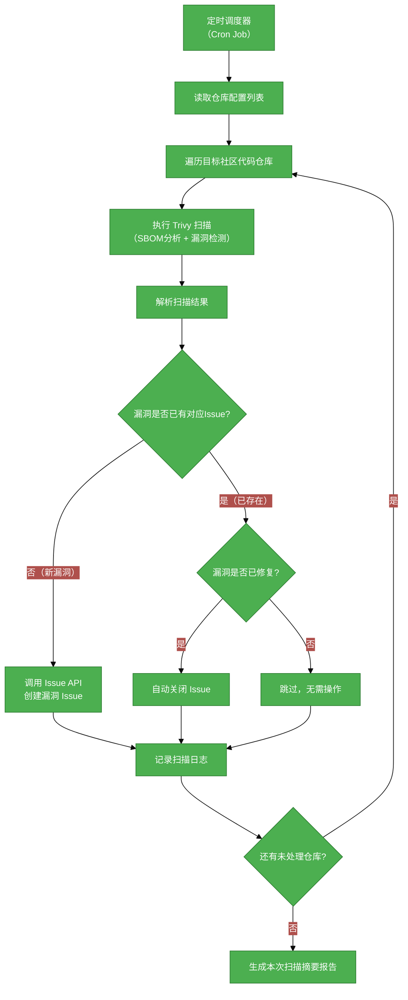

# #1 使用Trivy扫描社区代码仓库并创建漏洞Issue需求分析说明书

## 1. 基础信息

* **需求链接**: https://github.com/opensourceways/backlog/issues/140
* **需求名称**: 使用Trivy工具定时扫描社区代码仓库并自动创建漏洞Issue
* **开发责任人**:  **yangwei999**

---

## 2. 需求场景说明

> 描述"在什么情况下，为了解决什么问题，用户需要做什么"。

**场景说明:**

当前 cve-manager-ng 接入的社区基本沿用 openEuler 漏洞管理流程，复用 openEuler 采购的商用漏洞扫描服务。在实际运营中暴露出以下核心问题：

1. **误报率极高（>90%）**：商用服务与社区实际软件包匹配度差，开发者需要花费大量精力逐条排查误报，严重挤占有效安全响应资源。
2. **无反馈优化通道**：社区无法直接向商用服务提供商反馈误报或优化建议，问题长期积压无法改善。
3. **社区包不匹配**：上报 openEuler 不存在的软件包时，多次被提供商询问缘由。

为解决上述问题，需引入开源工具 **Trivy** 直接对社区代码仓库进行扫描。Trivy 内置 SBOM 分析能力与持续更新的漏洞数据库，对代码仓库有更好的兼容性，可大幅提升漏洞扫描准确率，降低误报，节约开发者分析成本。

---

## 3. 需求验收标准

> 明确需求完成的标志，必须是可量化、可测试的。

**验收标准:**

- [ ] Trivy 扫描任务可按配置的周期（如：每日/每周）自动触发，对目标社区代码仓库完成全量扫描。
- [ ] 扫描完成后，系统根据扫描结果自动在对应仓库/项目中创建漏洞 Issue，Issue 内容包含：CVE 编号、漏洞等级、受影响组件及版本、修复建议。
- [ ] 与原商用服务相比，漏洞误报率显著下降（目标：误报率低于 20%）。
- [ ] 重复漏洞不重复创建 Issue，已修复漏洞对应的 Issue 自动关闭或标记。
- [ ] 扫描日志可查，支持追溯每次扫描的时间、仓库范围及结果摘要。

---

## 4. 需求设计与分解

> 说明：基于初步方案，将需求拆解为可实施的原子 Task。后续的流程判定将严格依据这些 Task 的影响范围进行。

### 4.1 核心逻辑方案

**逻辑方案:**

定时任务调度器周期性触发扫描流程：对配置的社区代码仓库列表逐一执行 Trivy 扫描，获取 SBOM 及漏洞分析结果；对结果进行去重与过滤（排除已有 Issue 的漏洞）；对新发现漏洞调用 Issue 创建接口，自动生成结构化漏洞 Issue；已修复漏洞自动关闭对应 Issue。

### 4.2 任务清单

**任务清单:**

| 任务 ID   | 任务描述 (Task Description)                                              | 预期产出 (Deliverables)          | 预期工作量（人天） |
|---------|----------------------------------------------------------------------|------------------------------|-----------|
| task1   | 调研 Trivy 接入方案，确定扫描模式（仓库直扫/镜像扫/文件系统扫），输出接入设计文档                       | 接入方案设计文档                     | 2         |
| task2   | 实现 Trivy 扫描调度模块：支持按配置周期触发、支持多仓库列表配置                                   | 调度模块代码                       | 3         |
| task3   | 实现 Trivy 扫描执行模块：调用 Trivy CLI/API 完成单仓库扫描，解析 JSON 格式结果              | 扫描执行模块代码                     | 3         |
| task4   | 实现漏洞 Issue 去重逻辑：查询现有 Issue，匹配 CVE 编号，避免重复创建                           | 去重逻辑代码                       | 2         |
| task5   | 实现 Issue 自动创建模块：根据漏洞信息生成结构化 Issue（含CVE编号、等级、组件、修复建议），调用 Issue API 创建 | Issue 创建模块代码及 Issue 模板       | 3         |
| task6   | 实现已修复漏洞 Issue 自动关闭逻辑                                                 | Issue 关闭模块代码                 | 1         |
| task7   | 实现扫描日志记录与摘要报告生成                                                      | 日志模块代码、报告模板                  | 2         |
| task8   | 编写单元测试及集成测试，覆盖率 ≥ 80%                                                | 测试代码、测试报告                    | 3         |
| task9   | 部署验证：在测试环境完成端到端验证，对比误报率改善效果                                          | 测试验证报告（含误报率对比数据）             | 2         |

---

## 5. 需求相关性分析

> **操作说明**：根据上述拆解出的 Task，识别其变更行为。任何一项勾选为"是"：打上对应issue标签，必须执行对应的流程门禁。全部未勾选：该需求自动判定为轻量化特性，打上need_light标签。

### A. 安全相关性分析

> 若涉及以下任一项，打标 `need_security`标签，PR 必须关联特性issue的架构设计文档（含安全设计部分）**如勾选需要给出原因**。

* [ ] **边界变更**：新增公网端口、修改防火墙规则、变更网关配置。
* [ ] **凭证处理**：涉及密钥（Secret/Key）、Token、证书的存储或分发。
  - **原因**：Trivy 扫描需访问代码仓库，涉及仓库访问 Token/凭证的配置与存储；Issue 自动创建需使用平台 API Token，须规范凭证管理方式，避免泄露。
* [ ] **权限调整**：修改权限模型、服务账号（SA）权限或鉴权逻辑。
* [ ] **供应链**：引入新的第三方二进制文件、SDK 或重大版本依赖升级。
  - **原因**：引入 Trivy 作为新的第三方安全扫描工具，需评估其供应链安全风险及漏洞数据库可信度。
* [ ] **隐私风险评估**：涉及用户个人数据（Email、手机号、IP、邮箱等）的处理。
* [ ] **AI使用**：涉及AIGC能力应用，并提供服务。

### B. 架构设计相关性分析

> 若涉及以下任一项，打标 `need_design`标签，PR 必须关联特性issue的架构设计文档。 **如勾选需要给出原因**。

* [ ] A环节判定需要完成安全设计
* [ ] 改变了现有系统的物理/逻辑拓扑
* [ ] 新增或大幅修改对外暴露的 API/CLI 接口
* [x] 引入了新的中间件、数据库或三方核心组件
  - **原因**：引入 Trivy 工具作为核心扫描组件，替代原有商用漏洞扫描服务，属于核心依赖的重大变更。

### C. 系统集成测试相关性分析

> 若涉及以下任一项，打标 `need_itest`标签，PR必须关联特性issue的测试策略和测试报告文档。 **如勾选需要给出原因**。

* [x] 上述环节判定需要执行安全设计或架构设计。
* [ ] **跨组件影响**：变更会触发下游服务或关联系统的连锁反应（级联效应）。
* [ ] **核心组件管控**：含项目定级为 Core 的核心逻辑变更。
* [ ] **环境强依赖**：功能高度依赖内核参数、网络拓扑或特定的物理挂载。
* [ ] **端到端流程**：涉及从用户输入到持久化存储的全链路逻辑。
  - **原因**：本需求涉及从定时触发→仓库扫描→结果解析→Issue创建的完整端到端链路，需要集成测试验证全流程正确性。

### D. 用户体验相关性分析

> 若涉及以下任一项，打标 `need_ux`标签，PR必须关联特性issue的用户体验设计文档。 **如勾选需要给出原因**。

* [ ] **交互逻辑变更**：涉及 Web 门户、控制台（Dashboard）或命令行工具（CLI）的交互流程调整。
* [ ] **感知性能变动**：变更可能显著影响页面的加载时间、同步请求的响应时延或异步任务的进度反馈。
* [ ] **文档与辅助能力**：涉及报错提示语、帮助中心链接、FAQ 或新功能的 Runbook 说明。
* [ ] **无障碍与多语种**：涉及国际化（i18n）支持、辅助功能或不同终端（移动端/桌面端）的适配。

### 5.1 需求相关性分析汇总结果

* [x] need_security（需架构设计（含安全威胁分析和安全设计））
* [x] need_design（需架构设计）
* [ ] need_itest（需执行测试策略设计和全链路集成测试）
* [ ] need_ux（需架构设计（含UX设计））
* [ ] need_light（上述均未勾选，走快速合入通道）

---

## 6. 价值识别与业务评估

> **判定准则**：基础设施接纳需求必须具备明确的 ROI（投资回报比）或合规必要性。

| 维度        | 评估问题                                    | 结论/说明                                                                                                  |
|-----------|-----------------------------------------|--------------------------------------------------------------------------------------------------------|
| **范围判定**  | 该需求是否属于基础设施范围内？                         | 是。属于 cve-manager-ng 漏洞管理基础设施的核心能力建设。                                                                 |
| **规划一致性** | 该需求是否在年度技术规划中？                          | 是。与提升社区安全治理能力、降低运营成本的年度目标一致。                                                                         |
| **优先级**   | 该需求优先级评估（高/中/低）？                        | 高。当前误报率 >90% 已严重影响开发者效率和安全响应质量，需尽快改善。                                                                |
| **通用性**   | 该需求是否解决 3 个以上业务方的共性痛点？                  | 是。所有接入 cve-manager-ng 的社区均面临同等误报问题，通用性强。                                                             |
| **必要性**   | 现有组件通过配置变更是否无法实现目标或没有不用开发的替代方案？         | 是。商用服务无法直接反馈优化，且误报率结构性问题无法通过配置解决，必须引入新的扫描工具。                                                         |
| **工作量**   | 预计总工作量                                  | 约 21 人天。                                                                                              |
| **价值评估**  | 实现后能减少多少手动操作或提升多少系统稳定性？                 | 预计将误报率从 >90% 降低至 <20%，开发者每周用于排查误报的时间预计减少 70% 以上；消除因上报不存在软件包引发的跨团队协作摩擦，提升漏洞响应效率和社区安全治理质量。 |

> **状态定义：** **Accept (准入)** | **Reject (驳回)** | **Pending (待议)**

**建议结论**：Accept

**原因描述:** 当前商用漏洞扫描服务误报率高达 90% 以上，已导致开发者大量精力被误报消耗，且无优化通道，问题持续恶化。引入 Trivy 开源工具直接扫描代码仓库，可从根本上改善准确率，预计误报率降至 20% 以下，节约开发者大量分析成本。该需求通用性强、必要性明确、实现路径清晰，建议准入。

---
