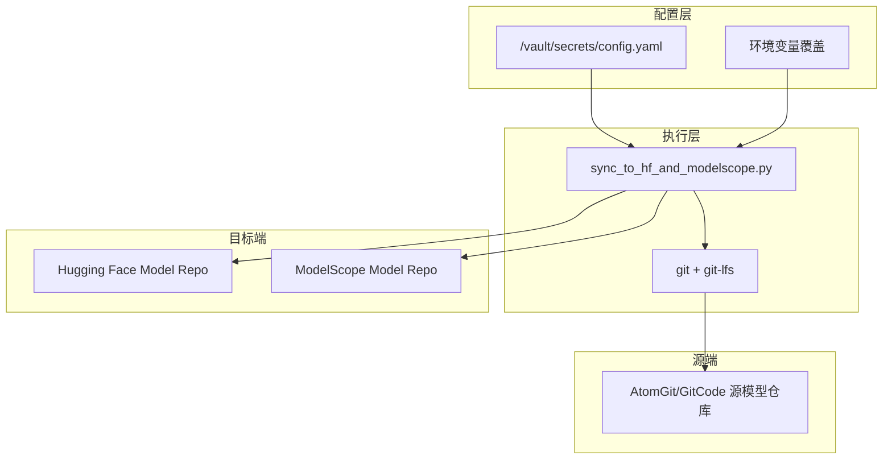
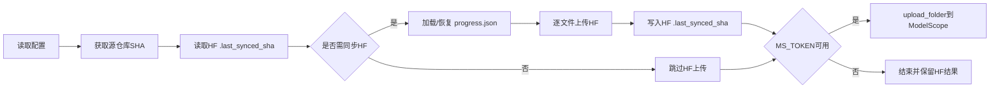

# #1 sync_to_hf_and_modelscope 架构设计说明书 (Architecture Design Document)
---

## 1. 基础信息

* **需求链接**: https://github.com/opensourceways/backlog/issues/144
* **需求名称**: **sync_to_hf_and_modelscope 双目标仓库同步服务**
* **开发责任人**: drizzlezyk
* **设计目标**: 通过单脚本串行流程，将源模型仓库稳定同步到 Hugging Face 与 ModelScope，并支持断点恢复、低磁盘保护与日志可观测。

---

## 2. 功能设计

### 2.1 架构图

**设计说明/归档：** 单进程脚本服务，外部依赖为 Git/ Git-LFS、Hugging Face Hub API、ModelScope SDK、GitCode API（可选）。

### 2.2 数据流图

**设计说明/归档：** 数据以“源仓库文件 + 源 SHA + 同步进度”三类核心对象流转。

### 2.3 组件职责与接口

**设计说明/归档：**

| 组件/函数 | 职责 | 输入 | 输出 |
|---|---|---|---|
| `load_config` | 读取并合并配置 | vault 文件、环境变量 | `HF_ORG/HF_TOKEN/MS_NAMESPACE/MS_TOKEN/...` |
| `sync_all` | 组织仓库列表并串行调度 | 仓库清单 | 逐仓库同步结果 |
| `sync_repo` | 单仓库主流程编排 | `repo_info` | HF/MS 同步状态 |
| `upload_file_with_logs` | 上传单文件到 HF | 本地文件、相对路径、目标 repo id | 上传成功/异常 |
| `push_modelscope_repo` | 上传目录到 ModelScope | 本地仓库目录、source sha | 上传成功/失败 |
| `load_progress/save_progress` | 断点恢复 | progress 文件 | 已同步文件集合 |

对外接口形态：脚本入口 `python sync_to_hf_and_modelscope.py`，无 HTTP API。

### 2.4 UX设计

**设计说明/归档：** 本服务为无界面脚本，不涉及 GUI/控制台交互设计。可用性通过结构化日志保障：每个阶段均打印开始、进度、失败原因与完成状态。

### 2.5 SOD设计

**设计说明/归档：** 不涉及新增权限域模型或角色分离机制。权限使用现有平台 Token（HF/MS/GitCode）并通过配置文件加载，不在代码中硬编码。

### 2.6 功能设计分解TASK清单

**设计说明/归档：**

| 任务 ID | 可服务性任务描述 | 责任人 |
|---|---|---|
| **SYNC-DES-001** | 梳理并固化单仓库同步流程与状态转移（HF检查、HF上传、MS上传、清理） | drizzlezyk |
| **SYNC-DES-002** | 输出配置矩阵与优先级（vault > env > default） | drizzlezyk |
| **SYNC-DES-003** | 输出失败恢复策略（progress 恢复、磁盘阈值保护、跳过逻辑） | drizzlezyk |

---

## 3. 非功能设计

### 3.1 可靠性与韧性设计评估和设计

**设计说明/归档：**

- 断点恢复：按仓库维护 `*_progress.json`，已上传文件可跳过重复上传。
- 低磁盘保护：处理 LFS 文件前检查 `BASE_DIR` 可用空间，小于 20GB 则停止当前仓库处理。
- 长任务可观测：命令执行使用心跳日志（`Still running`）避免无输出假死。
- 失败隔离：`sync_all` 捕获单仓库异常并继续后续仓库，不因单点失败中断全量任务。
- 清理策略：仅在 HF 与 MS 均成功后删除本地仓库，失败时保留现场便于恢复和排障。

**任务清单:**

| 任务 ID | 可靠性与韧性任务描述 | 责任人 |
|---|---|---|
| **SYNC-NFR-001** | 校准 LFS 超大文件场景下的磁盘阈值策略与告警文案 | drizzlezyk |
| **SYNC-NFR-002** | 评估 `git reset --hard origin/main` 对非 main 分支仓库的兼容处理 | drizzlezyk |

---

### 3.2 可服务性与可观测性评估和设计

**设计说明/归档：**

- 日志标准：统一 `timestamp | message` 输出，核心操作均包含仓库名与阶段名。
- 错误可定位：上传失败、API 异常、命令超时均有明确日志分支。
- 状态可判断：HF 完成标识为 `.last_synced_sha` 成功写入；MS 完成标识为 `ModelScope sync success` 日志。

**任务清单:**

| 任务 ID | 可服务性任务描述 | 责任人 |
|---|---|---|
| **SYNC-OBS-001** | 规范关键日志关键字，便于后续日志检索与告警规则配置 | maintainers |

---

### 3.3 性能与伸缩性评估和设计

**设计说明/归档：**

- 当前策略：仓库串行、文件串行，优先保证稳定性与内存可控。
- 关键瓶颈：LFS 拉取和双平台上传耗时与网络带宽强相关。
- 扩展方向：未来可按“仓库级并行 + 文件级限速”演进，但需配套磁盘配额与失败恢复控制。

**任务清单:**

| 任务 ID | 性能任务描述 | 责任人 |
|---|---|---|
| **SYNC-PERF-001** | 同步第一批15个openPangu模型 | drizzlezyk |

---
