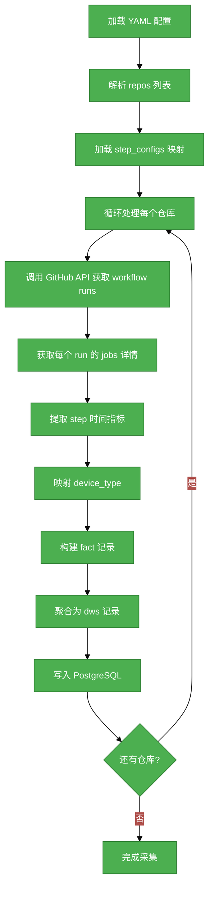

# #148 GitHub CI Workflow 指标采集需求分析说明书

## 1. 基础信息

* **需求链接**: https://github.com/opensourceways/backlog/issues/148
* **需求名称**: GitHub CI Workflow 指标采集系统
* **开发责任人**: Creyson-peng

---

## 2. 需求场景说明

> 描述"在什么情况下，为了解决什么问题，用户需要做什么"。

**场景说明:**

开源社区（如 vllm-project、LLaMA-Factory、sglang 等 AI/ML 项目）在 GitHub 上运行大量 CI Workflow，涉及 NPU 和 GPU 设备的构建测试。当前缺乏对这些 CI 运行的系统性指标采集与分析能力，导致：

1. 无法量化 CI 运行效率（运行时间、等待时间、下载时间、准备时间）
2. 无法区分不同设备类型（NPU/GPU）的构建性能
3. 无法追踪 PR 相关的 Workflow 运行状态与成功率
4. 无法为 CI 优化提供数据支撑

运维需要配置仓库的 step 名称映射和 device 类型映射，系统自动采集 GitHub Actions 数据并聚合到数据仓库，供后续分析使用。

## 3 需求验收标准

> 明确需求完成的标志，必须是可量化、可测试的。

**验收标准:**

- 支持通过 YAML 配置文件指定多个 GitHub 仓库进行 CI 数据采集
- 支持 step 名称配置，自动提取 download_time 和 prepare_time 指标
- 支持 workflow_name 到 device_type（NPU/GPU）的精确匹配映射
- 正确采集并计算 run_time、wait_time、e2e_time 等时间指标
- 正确聚合 job 级别数据到 workflow 级别（按 commit_id + workflow_id）
- 数据写入 fact_ci_workflow 表和 dws_opensource_ci 表
- 支持增量更新：自动追踪非 completed 状态的 workflow 并更新
- 单元测试覆盖率 ≥ 90%

---

## 4. 需求设计与分解

> 说明：基于初步方案，将需求拆解为可实施的原子 Task。后续的流程判定将严格依据这些 Task 的影响范围进行。

### 4.1 核心逻辑方案

> 简述实现逻辑（如：数据流向、模块改动、新增配置项等），作为任务拆解的理论依据。

**逻辑方案:**

1. **配置层**: YAML 配置文件定义仓库列表、step 名称映射、device 类型映射
2. **采集层**: WorkflowTimeExporter 通过 GitHub API 获取 workflow runs 和 jobs 数据
3. **处理层**: 解析 job steps 提取时间指标，根据 workflow_name 映射 device_type
4. **存储层**: 写入 fact_ci_workflow（明细表）和 dws_opensource_ci（聚合表）

**流程图示例（使用Mermaid）：**



### 4.2 任务清单

**任务清单:**

| 任务 ID   | 任务描述 (Task Description)                                                                 | 预期产出 (Deliverables)         | 预期工作量（人天） |
|-----------|---------------------------------------------------------------------------------------------|---------------------------------|------------------|
| **task1** | 实现 WorkflowStepConfig 和 WorkflowDeviceConfig 数据模型 | om/config/models.py | 0.5 |
| **task2** | 实现 WorkflowTimeExporter 核心采集逻辑（API调用、数据解析、时间计算） | om/collector/workflow_metric_collector.py | 2 |
| **task3** | 实现 dws_opensource_ci 表定义 | om/db/table/dws_table.py | 0.5 |
| **task4** | 实现 CI Workflow Task 入口脚本 | om/tasks/ci_workflow_task.py | 0.5 |
| **task5** | 编写单元测试（覆盖率 ≥ 90%） | tests/collector/test_workflow_metric_collector.py | 1 |
| **task6** | 编写配置示例文件 | config_workflow_*.yaml.example | 0.5 |

---

## 5. 需求相关性分析

> **操作说明**：根据上述拆解出的 Task，识别其变更行为。任何一项勾选为"是"：打上对应issue标签，必须执行对应的流程门禁。全部未勾选：该需求自动判定为轻量化特性，打上need_light标签。

### A. 安全相关性分析

| 序号 | 判断项 | 是否涉及 | 说明 |
|------|--------|----------|------|
| A-1 | 是否新增或修改 API 接口？ | 否 | 仅新增数据采集逻辑，不暴露 API |
| A-2 | 是否新增或修改认证/鉴权逻辑？ | 否 | 使用现有 GitHub Token 配置 |
| A-3 | 是否涉及用户隐私数据处理？ | 否 | 仅采集 CI 运行数据，不含用户隐私 |
| A-4 | 是否涉及敏感配置（密码、Token）硬编码？ | 否 | 所有 Token 通过环境变量或配置文件注入 |

**结论**: 无安全相关性

### B. 数据相关性分析

| 序号 | 判断项 | 是否涉及 | 说明 |
|------|--------|----------|------|
| B-1 | 是否新增数据库表？ | 是 | 新增 dws_opensource_ci 表 |
| B-2 | 是否修改现有表结构？ | 是 | 扩展 fact_ci_workflow 表字段 |
| B-3 | 是否涉及数据迁移？ | 否 | 无历史数据迁移需求 |
| B-4 | 是否涉及数据删除操作？ | 否 | 仅写入和更新操作 |

**结论**: 有数据相关性 - 需打上 `need_db` 标签

### C. 架构相关性分析

| 序号 | 判断项 | 是否涉及 | 说明 |
|------|--------|----------|------|
| C-1 | 是否新增模块或组件？ | 是 | 新增 workflow_metric_collector |
| C-2 | 是否修改现有模块架构？ | 否 | 符合现有分层架构规范 |
| C-3 | 是否引入新依赖？ | 否 | 仅使用现有 requests、psycopg2 等 |
| C-4 | 是否涉及接口契约变更？ | 否 | 无对外接口变更 |

**结论**: 有架构相关性 - 需打上 `need_arch` 标签

---

## 6. 风险评估

| 风险类型 | 风险描述 | 影响程度 | 应对措施 |
|----------|----------|----------|----------|
| API 限流 | GitHub API 有速率限制，大量采集可能触发限流 | 中 | 实现 rate_limiter，控制请求频率 |
| 数据一致性 | workflow 状态可能从 in_progress 变为 completed | 低 | 实现增量更新机制，定期刷新非 completed 状态 |
| 配置错误 | step 名称或 device 映射配置错误导致数据缺失 | 低 | 配置加载时验证，日志记录配置加载状态 |

---

## 7. 附录

### 7.1 配置示例

```yaml
workflow:
  table_name: "fact_ci_workflow"
  metadata_table: "fact_ci_workflow_meta"
  github_token: "${GITHUB_TOKEN}"
  github_base_api: "https://api.github.com"
  repos: "vllm-project/vllm,vllm-project/vllm-ascend"
  collect_from: "2026-04-01"
  step_configs:
    - org: "vllm-project"
      repo: "vllm"
      download_steps:
        - "Checkout code"
        - "Download wheels"
      prepare_steps:
        - "Set up Python"
        - "Install dependencies"
      device_configs:
        - workflow_name: "NPU Tests"
          device_type: "NPU"
        - workflow_name: "GPU Tests"
          device_type: "GPU"

database:
  host: "${DB_HOST}"
  port: 5432
  name: "om_dataarts"
  user: "${DB_USER}"
  password: "${DB_PASSWORD}"
```

### 7.2 数据表字段说明

**dws_opensource_ci 表核心字段：**

| 字段名 | 类型 | 说明 |
|--------|------|------|
| uuid | VARCHAR(500) | 主键：commit_id_workflow_id |
| org | VARCHAR(255) | 组织名 |
| repo | VARCHAR(255) | 仓库名 |
| workflow_id | TEXT | GitHub workflow run ID |
| workflow_status | VARCHAR(50) | completed/in_progress/queued |
| device_type | VARCHAR(50) | NPU/GPU |
| e2e_time | INT8 | workflow 端到端时长 |
| total_run_time | INT8 | jobs 最大运行时长 |
| success_rate | NUMERIC(5,2) | 成功 job 占比 |