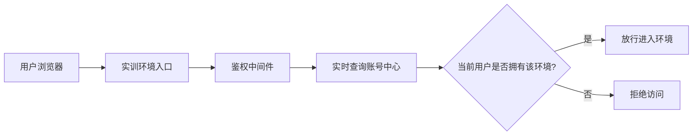
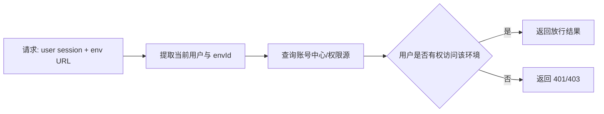
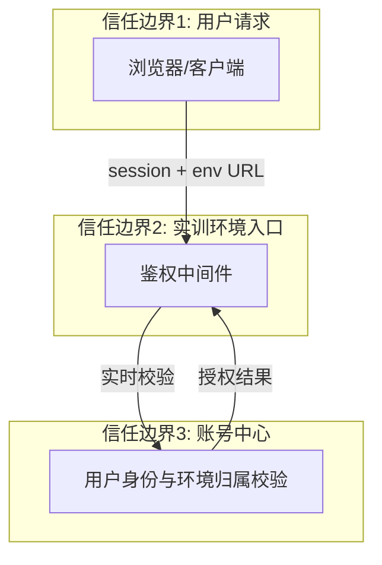

# #151 MindSpore实训沙箱鉴权机制修改 架构设计说明书

---

## 1. 基础信息

* **需求链接**: https://github.com/opensourceways/backlog/issues/151
* **需求名称**: MindSpore实训沙箱鉴权机制修改
* **开发责任人**: chenqi
* **设计目标**: 修正实训环境鉴权结果跨用户复用的问题，移除缓存复用逻辑并改为每次实时鉴权，防止第三方通过复制 URL 无鉴权进入他人环境。

---

## 2. 功能设计

> **说明**：描述系统的组件构成、职责划分及交互逻辑。

### 2.1 架构图

> 此处建议插入架构拓扑系统组件图或时序图，描述组件间的交互关系。推荐使用Mermaid实现，可代码化，GitHub可渲染。
> **不涉及需要说明原因**

**设计说明/归档：** 不涉及新的系统拓扑，沿用现有 MindSpore 实训环境入口和账号中心，仅移除鉴权缓存复用逻辑并改为实时鉴权。

### 2.2 数据流图

> 此处建议插入数据流图，描述核心业务数据的生命周期，即威胁建模的基础。推荐使用Mermaid实现，可代码化，GitHub可渲染。
> **不涉及需要说明原因**

**设计说明/归档：** 访问请求携带的身份上下文和环境标识只用于实时鉴权，不缓存可跨请求复用的授权结果。

### 2.3 组件职责与接口

> 列出新增/修改的组件及其定义的 API 规范。**不涉及需要说明原因**

**设计说明/归档：** 本需求不引入新服务，只调整现有鉴权路径中的职责边界，并删除鉴权缓存组件依赖。

| 组件 | 职责 | 输入 | 输出 |
|------|------|------|------|
| 实训环境入口鉴权中间件 | 读取当前登录用户、环境 ID，执行访问校验 | Cookie/Session、请求 URL、环境标识 | 放行/拒绝结果 |
| 账号中心/权限源 | 提供当前用户对目标环境的真实授权结果 | 用户标识、环境标识 | 授权通过/拒绝 |

**接口约定：**
- 鉴权中间件必须每次完成当前请求主体识别并实时查询账号中心。
- 鉴权失败返回统一错误码，不暴露内部缓存细节。

### 2.4 UX设计

> 设计目标：确保功能不仅“可用”，而且“好用”，降低开发者的认知负担和运维人员的误操作风险。 **不涉及需要说明原因**

**设计说明/归档：** 不涉及前端页面改造，仅补充鉴权失败时的统一提示，避免用户看到空白页或无明确原因的跳转失败。

### 2.5 SOD设计

> 设计目标：通过维护SOD权限设计文档，确保权限设计可审计、可复用、可跨服务重用。 SOD权限设计参考[XX SOD权限设计.md](XX%20SOD%E6%9D%83%E9%99%90%E8%AE%BE%E8%AE%A1.md)
> 
>**不涉及需要说明原因**
>
>**需要说明文档位置**

**设计说明/归档：** 不涉及。该需求只修正实训环境访问鉴权，不新增跨系统职责分离模型。

### 2.6 功能设计分解TASK清单

**设计说明/归档：**

**任务清单:**

| 任务 ID | 可服务性任务描述 | 责任人 |
|---------|------------------|--------|
| **TASK1** | 删除鉴权缓存及其复用逻辑 | chenqi |
| **TASK2** | 改造环境访问链路为实时鉴权，每次访问回源账号中心 | chenqi |
| **TASK3** | 补充越权访问拦截的错误码与回归验证用例 | chenqi |

---

## 3. 非功能设计

### 3.1 安全与隐私设计评估和设计

> **注意**：仅当需求判定为 **`need_security`** 时，本章节为必填项。 **无该标签可删除本章节。**

> 关注点：防御能力与合规边界。

### 3.1.1 威胁分析 (Threat Modeling)

> 基于 **STRIDE** 或类似模型，识别本项目可能面临的安全威胁。推荐使用Mermaid绘制DFD数据流图和信任边界，展示系统的安全边界和数据流向。
> **建议归档服务模块设计图，后续需要可增量复用（导入设计文件到工具中即可复用增量设计）。**

**设计说明/归档：** 本需求的主要风险来自“鉴权结果复用”和“跨用户 URL 访问”，核心信任边界是用户请求、实训环境入口和账号中心。

**威胁分析表：**

| 威胁类别 | 攻击场景描述 (Scenario) | 风险等级/评分 | 对应减缓措施 (Mitigation) |
|-----------|-------------------------|---------------|----------------------------|
| **信息泄露** | 通过共享 URL 进入他人实训环境，读取或修改环境中的数据 | 高 | 每次访问实时校验当前用户是否拥有该环境 |
| **篡改/伪造** | 伪造请求主体或复用旧缓存结果绕过鉴权 | 高 | 移除缓存复用逻辑，所有请求都回源账号中心校验 |
| **权限提升** | B 用户复用 A 用户的短时缓存结果进入 A 的环境 | 高 | 删除鉴权缓存，禁止跨用户复用授权结果 |
| **拒绝服务** | 频繁访问导致账号中心压力上升 | 中 | 保持最小化校验链路，必要时通过账号中心侧限流缓解 |
| **审计缺失** | 越权访问被拦截但无法定位原因 | 中 | 记录最小必要审计信息：user、env、结果、原因码 |

### 3.1.2 安全设计实现 (Security Mechanisms)

> **参考：**
> 威胁模型评估：
> * 是否已根据业务逻辑绘制 Data Flow Diagram 并识别单点风险？
>
> 软件供应链：
> * 是否扫描并修补了已知漏洞（CVE）？
> * 是否限制了第三方二进制包的直接引入？
> *
> 凭证管理：
> * 严禁硬编码。
> * 密钥是否定期自动轮转（Rotation）？
>
> 身份认证：
> * 是否具备多因素认证支持或联邦认证（OIDC）对接能力？
> * 内部微服务调用是否执行了身份校验（Identity-based Auth）？
>
> 数据安全：
> * 传输加密（TLS 1.2+）与静态加密（AES-128）是否全覆盖？
> * 是否对高敏感字段（如手机号、秘钥）执行了哈希/加盐或差分隐私处理？
>
> 运行时隔离：
> * 容器是否以非 Root 用户运行（Non-root Enforcement）？
> * 是否配置了 Read-only Root Filesystem 防止二进制篡改？
>
> 日志审计：
> * 关键操作日志是否具备防篡改性？
> * 是否包含了足够用于追溯的 4W 信息（Who, When, Where, What）？

**设计说明/归档：**

本需求采用“当前用户 + 当前环境”双维度实时校验，移除缓存结果成为跨用户越权入口的可能性。

* **身份认证与授权**：从现有登录态中提取当前用户身份，进入实训环境时必须实时校验该用户是否对目标环境拥有访问权。
* **缓存移除**：删除鉴权缓存数据结构、命中分支和写入逻辑，不再保存可跨请求复用的授权结果。
* **失败处理**：鉴权失败直接返回 401/403，不继续执行环境进入逻辑；不返回内部实现细节。
* **审计日志**：记录 user_id、env_id、命中/未命中、授权结果、原因码；不记录完整 token、cookie 或环境敏感内容。
* **边界防御**：如果请求上下文缺少用户身份或环境标识，默认拒绝访问。

### 3.1.3 安全任务分解 (Security Task Breakdown)

> 将安全设计转化为具体的开发任务，需在代码或后续开发流程的安全配置中落实。

**任务清单:**

| 任务 ID | 安全任务描述 (Security Tasks) | 责任人 |
|---------|-------------------------------|--------|
| **TASK1** | 删除鉴权缓存结构、命中分支和写入逻辑 | chenqi |
| **TASK2** | 改造鉴权链路为每次实时查询账号中心 | chenqi |
| **TASK3** | 补充审计日志和错误码，避免泄露内部实现 | chenqi |
| **TASK4** | 编写越权访问场景测试，验证跨用户 URL 复用被拦截 | chenqi |

### 3.2 可靠性与韧性设计评估和设计（可选）

> **注意**：根据项目定级决定，含Core、Critical服务变更需要完成

> **关注点**：极端情况下的生存与恢复能力。
> **参考：**

**设计说明/归档：** 不涉及独立可靠性机制变更。该需求不引入新组件，也不改变服务可用性架构；实时鉴权会增加对账号中心的调用频率，需要依赖账号中心的基础稳定性。

### 3.3 可服务性设计评估和设计（可选）

> **关注点**：系统的维护性、可观测性、故障排查便利性。

**设计说明/归档：** 不涉及独立可服务性设计变更。仅补充最小审计日志，便于排查越权拦截原因。

### 3.4 性能设计评估和设计（可选）

> **关注点**：吞吐、时延、扩展性。

**设计说明/归档：** 鉴权缓存移除后，每次访问都实时回源账号中心；因此该需求接受一定的鉴权时延增加，但必须保证不引入明显的访问失败或阻塞。

---

## 4. 设计任务总结

| 任务 ID | 任务描述 | 预期产出 | 责任人 |
|---------|----------|---------|--------|
| TASK1 | 删除缓存及其复用逻辑 | 鉴权中间件代码修订 | chenqi |
| TASK2 | 改为实时鉴权并回源账号中心 | 拒绝越权访问的逻辑 | chenqi |
| TASK3 | 补充审计与错误码 | 可追踪的失败路径 | chenqi |
| TASK4 | 回归与越权测试 | 测试用例与验证记录 | chenqi |

---
