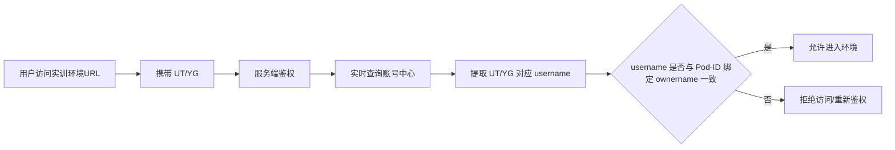

# #151 MindSpore实训沙箱鉴权机制移除缓存修复 需求分析说明书

## 1. 基础信息

* **需求链接**: https://github.com/opensourceways/backlog/issues/151
* **需求名称**: MindSpore实训沙箱鉴权机制移除缓存修复
* **开发责任人**: chenqi

---

## 2. 需求场景说明

> 描述“在什么情况下，为了解决什么问题，用户需要做什么”。

**场景说明:** 当前 MindSpore 实训沙箱会缓存已登录用户的鉴权结果，缓存有效期内不会再次向账号中心校验 `UT/YG` 对应的 username。实训环境访问时，需要根据 `UT/YG` 解析出 username，再与 Pod-ID 绑定的 ownername 比对。若 A 用户已进入实训环境，B 用户可直接复用 A 用户环境 URL，在缓存窗口内无鉴权进入并操作 A 用户的实训环境，造成越权访问风险。本次需求要求移除该缓存复用逻辑，改为每次访问都实时鉴权。

## 3 需求验收标准

> 明确需求完成的标志，必须是可量化、可测试的。

**验收标准:**

- A 用户登录并进入实训环境后，B 用户直接访问同一环境 URL 时，系统必须拒绝访问或要求重新完成鉴权。
- 任意用户访问实训环境时，鉴权结果不得被缓存复用，必须实时校验 `UT/YG` 对应 username，并与 Pod-ID 绑定 ownername 比对。
- 缓存窗口内不得出现第三方通过复制 URL 无鉴权进入他人实训环境的情况。
- 修复后需通过多用户串测验证：A、B 两个账号分别访问各自环境时均正常，交叉访问时均被拦截。

---

## 4. 需求设计与分解

> 说明：基于初步方案，将需求拆解为可实施的原子 Task。后续的流程判定将严格依据这些 Task 的影响范围进行。

### 4.1 核心逻辑方案

> 简述实现逻辑（如：数据流向、模块改动、新增配置项等），作为任务拆解的理论依据。推荐使用Mermaid图表展示流程，支持GitHub原生渲染。

**逻辑方案:** 直接移除 MindSpore 实训沙箱中“同一用户鉴权结果短时缓存后直接复用到环境访问”的逻辑，改为在环境访问链路中对当前请求进行实时校验。每次访问都应携带 `UT/YG`，xihe-server 实时查询账号中心解析出 username，再与 Pod-ID 绑定的 ownername 比对，确保环境 URL 只能被所属用户使用。

### 4.2 任务清单

**任务清单:**

| 任务 ID | 任务描述 (Task Description) | 预期产出 (Deliverables) | 预期工作量（人天） |
|---------|---------------------------|----------------------|----------------|
| **TASK1** | 删除 MindSpore 实训沙箱鉴权缓存及其复用逻辑 | 缓存相关代码清理 | 1 |
| **TASK2** | 改造环境访问链路为实时鉴权，确保每次访问都走账号中心校验并与 Pod-ID ownername 比对 | 实时鉴权逻辑代码 | 1.5 |
| **TASK3** | 完成多用户串测与回归验证，覆盖正常访问和越权访问场景 | 测试记录与验证结果 | 0.5 |

**预计总工作量**: 3 人天

---

## 5. 需求相关性分析

> **操作说明**：根据上述拆解出的 Task，识别其变更行为。任何一项勾选为“是”：打上对应issue标签，必须执行对应的流程门禁。全部未勾选：该需求自动判定为轻量化特性，打上need_light标签。

### A. 安全相关性分析

> 若涉及以下任一项，打标 `need_security`标签，PR 必须关联特性issue的架构设计文档（含安全设计部分）**如勾选需要给出原因**。

* [ ] **边界变更**：新增公网端口、修改防火墙规则、变更网关配置。
* [x] **权限调整**：修改权限模型、服务账号（SA）权限或鉴权逻辑。**原因：本需求的核心是移除鉴权缓存并改为实时鉴权，按 UT/YG 解析 username 后与 Pod-ID ownername 比对，防止越权访问。**
* [ ] **供应链**：引入新的第三方二进制文件、SDK 或重大版本依赖升级。
* [ ] **隐私风险评估**：涉及用户个人数据（Email、手机号、IP、邮箱 等）的处理。
* [ ] **AI使用**：涉及AIGC能力应用，并提供服务。

### B. 架构设计相关性分析

> 若涉及以下任一项，打标 `need_design`标签，PR 必须关联特性issue的架构设计文档。 **如勾选需要给出原因**。

* [x] A环节判定需要完成安全设计**原因：鉴权缓存导致越权访问，必须补充安全设计与边界校验，并移除缓存复用。**
* [ ] 改变了现有系统的物理/逻辑拓扑
* [ ] 新增或大幅修改对外暴露的 API/CLI 接口
* [ ] 引入了新的中间件、数据库或三方核心组件

### C. 系统集成测试相关性分析

> *若涉及以下任一项，打标 `need_itest`标签，PR必须关联特性issue的测试策略和测试报告文档。 **如勾选需要给出原因**。

* [x] 上述环节判定需要执行安全设计或架构设计。**原因：移除缓存后必须做串测验证。**
* [x] **跨组件影响**：变更会触发下游服务或关联系统的连锁反应（级联效应）。**原因：实时鉴权会更频繁访问账号中心并读取 Pod-ID 绑定信息。**
* [x] **核心组件管控**：含项目定级为 Core 的核心逻辑变更。**原因：鉴权是环境访问的核心控制点。**
* [ ] **环境强依赖**：功能高度依赖内核参数、网络拓扑或特定的物理挂载。
* [x] **端到端流程**：涉及从用户输入到持久化存储的全链路逻辑。**原因：从用户访问 URL 到进入环境的完整鉴权链路需验证。**

### 5.1 需求相关性分析汇总结果

* [x] need_security (需架构设计（含安全威胁分析和安全设计）)
* [x] need_design (需架构设计)
* [x] need_itest (需执行测试策略设计和全链路集成测试)
* [ ] need_light (上述均未勾选，走快速合入通道)

---

## 6. 价值识别与业务评估

> **判定准则**：基础设施接纳需求必须具备明确的 ROI（投资回报比）或合规必要性。

| 维度        | 评估问题                            | 结论/说明 |
|-----------|---------------------------------|-------|
| **范围判定**  | 该需求是否属于基础设施范围内？                 | 是，涉及实训环境访问控制与鉴权机制 |
| **规划一致性** | 该需求是否是否在年度技术规划中？                | 是，属于基础安全能力修复与风险治理 |
| **优先级**   | 该需求优先级评估（高/中/低）？                | 高 |
| **通用性**   | 该需求是否解决 3 个以上业务方的共性痛点？          | 否，主要影响 MindSpore 实训环境 |
| **必要性**   | 现有组件通过配置变更是否无法实现目标或没有不用开发的替代方案？ | 是，需要删除缓存复用并改为实时鉴权、UT/YG 解析和 Pod-ID ownername 比对才能消除越权窗口 |
| **工作量**   | 预计总工作量？        | 3 人天 |
| **价值评估**  | 实现后能减少多少手动操作或提升多少系统稳定性？         | 消除实训环境 URL 被第三方无鉴权访问的风险，避免用户环境被越权操作 |

> **状态定义：** **Accept (准入)** | **Reject (驳回)** |  **Pending (待议)**

**建议结论**： **Accept**

**原因描述:** 该需求属于明确的安全修复项，直接解决 MindSpore 实训沙箱的越权访问问题。通过移除鉴权缓存并改为实时鉴权，按 `UT/YG` 解析 username 并与 Pod-ID ownername 比对，可以消除第三方通过共享 URL 无鉴权进入他人环境的风险，具有明确的安全价值与业务必要性。

---
