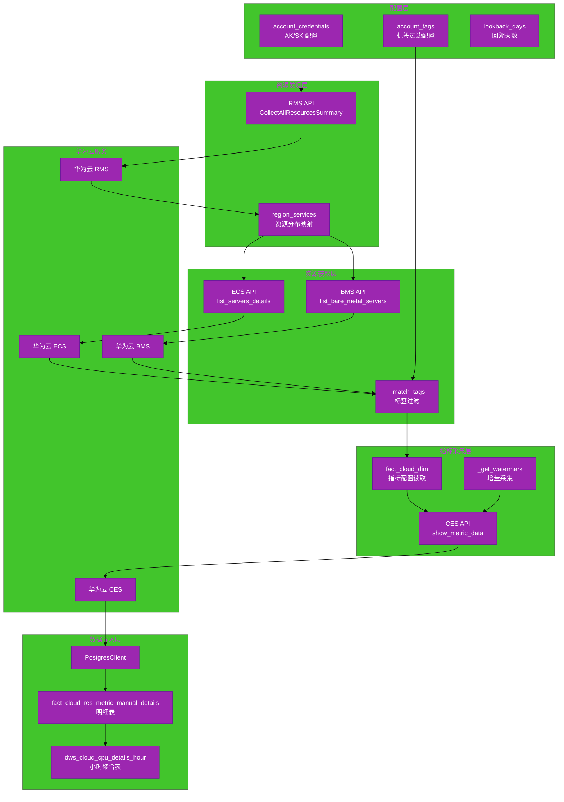
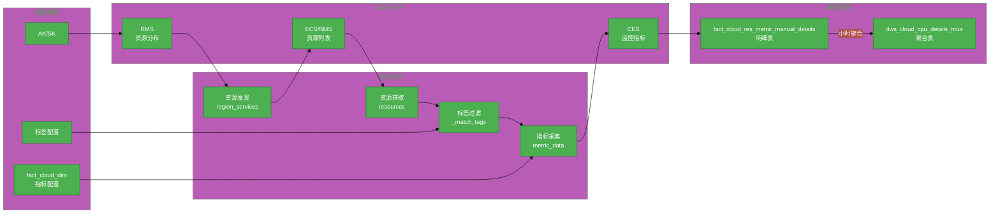
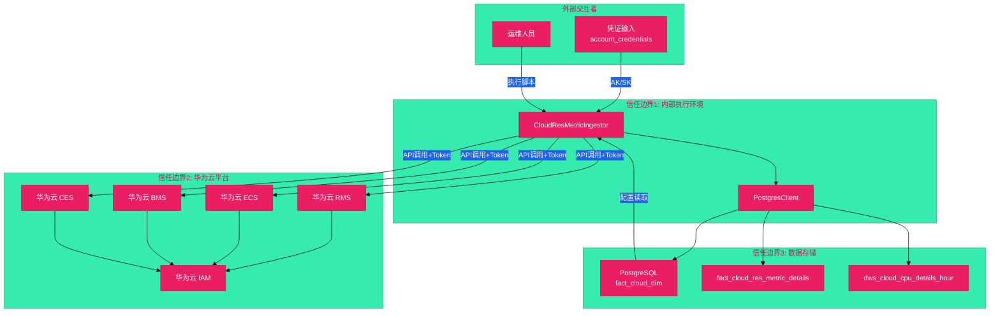

# #165 基础设施统一资源池监控架构设计说明书 (Architecture Design Document)

---

## 1. 基础信息

* **需求链接**: https://github.com/opensourceways/backlog/issues/165
* **需求名称**: 基础设施统一资源池监控
* **开发责任人**: Creyson-peng
* **设计目标**: 实现多账号华为云 ECS/BMS 资源的 CES 监控指标采集，通过 RMS API 自动发现资源分布 region，支持标签过滤和增量采集，数据写入明细表和小时聚合表，为资源优化决策提供量化数据支撑。

---

## 2. 功能设计

> **说明**：描述系统的组件构成、职责划分及交互逻辑。

### 2.1 架构图

> 此处建议插入架构拓扑系统组件图或时序图，描述组件间的交互关系。推荐使用Mermaid实现，可代码化，GitHub可渲染。

**设计说明/归档：** 单进程采集服务，外部依赖华为云 RMS/ECS/BMS/CES API 和 PostgreSQL。

**架构图（使用Mermaid）：**



**说明：**
- 配置层：凭证、标签过滤、回溯天数
- 资源发现层：RMS API 自动发现资源分布 region
- 资源获取层：ECS/BMS API 获取资源列表，标签过滤
- 指标采集层：CES API 采集监控数据，fact_cloud_dim 配置读取
- 数据写入层：明细表 + 小时聚合表

### 2.2 数据流图

> 此处建议插入数据流图，描述核心业务数据的生命周期，即威胁建模的基础。推荐使用Mermaid实现，可代码化，GitHub可渲染。

**设计说明/归档：** 数据从华为云多个 API 采集，经过资源发现、资源获取、标签过滤、指标采集，写入数据库。

**数据流图（使用Mermaid）：**



**说明：**
- RMS API：获取资源分布的 region 列表
- ECS/BMS API：获取资源列表（res_instance_id、resource_name、tags）
- CES API：获取监控指标数据（cpu_util、mem_util）
- fact_cloud_dim：指标配置（namespace、metric_id、dim_field、filter、period）
- 明细表 → 小时聚合表

### 2.3 组件职责与接口

> 列出新增/修改的组件及其定义的 API 规范。

**设计说明/归档：**

| 组件/函数 | 职责 | 输入 | 输出 |
|---|---|---|---|
| `.__init__` | 初始化采集器 | db_client, account_credentials, account_tags, lookback_days | 采集器实例 |
| `init_table` | 初始化数据库表 | 无 | 表创建完成 |
| `_discover_accounts` | 发现账号列表 | 无 | account_name 列表 |
| `_get_watermark` | 获取增量采集起点 | account_name | 上次最大 timestamp |
| `_get_current_month_timestamps` | 获取当月时间范围 | 无 | start_ts, end_ts |
| `process` | 主执行入口 | account_name（可选） | 全量采集完成 |
| `_fetch_target_regions` | 通过 RMS API 发现资源分布 region | ak, sk | region_services 映射 |
| `_fetch_ecs_resources` | 获取 ECS 资源列表 | ak, sk, region | 资源列表（含 id、name、tags） |
| `_fetch_bms_resources` | 获取 BMS 资源列表 | ak, sk, region | 资源列表（含 id、name、tags） |
| `_fetch_resources` | 汇总资源并按 tag 过滤 | account_name | 过滤后的资源列表 |
| `_normalize_tags` | 标准化标签格式 | raw_tags | ['key=value'] 列表 |
| `_match_tags` | 匹配标签过滤条件 | res, required_tags | True/False |
| `_fetch_dim_config` | 读取指标配置 | 无 | dim_config 映射 |
| `collect_metrics` | 采集单个账号的指标 | account_name | 写入数据库 |
| `get_metric_data` | 获取 CES 监控数据 | creds, dim, res, start, end | datapoints 列表 |
| `_flush_metrics` | 批量写入指标数据 | data_list | 写入完成 |
| `_write_cpu_hour_table` | 聚合写入小时表 | account_name | 聚合完成 |

**华为云 API 调用：**

| API | 功能 | SDK |
|---|---|---|
| RMS CollectAllResourcesSummary | 获取资源分布概览 | huaweicloudsdkrms |
| ECS ListServersDetails | 获取 ECS 服务器列表 | huaweicloudsdkecs |
| BMS ListBareMetalServers | 获取 BMS 服务器列表 | huaweicloudsdkbms |
| CES ShowMetricData | 获取监控指标数据 | huaweicloudsdkces |

### 2.4 UX设计

> 设计目标：确保功能不仅"可用"，而且"好用"，降低开发者的认知负担和运维人员的误操作风险。

**不涉及，原因：** 本服务为后台数据采集脚本，不涉及 GUI 设计。可用性通过以下方式保障：

1. **配置文件驱动**: 所有采集参数通过参数传入，支持凭证字典和标签过滤配置
2. **日志可观测**: INFO 级别记录采集进度，WARNING 记录 API 失败
3. **增量恢复**: watermark 机制自动追踪上次采集时间，支持增量采集
4. **批量写入**: 每 500 条数据批量写入，减少数据库压力

### 2.5 SOD设计

> 设计目标：通过维护SOD权限设计文档，确保权限设计可审计、可复用、可跨服务重用。

**不涉及，原因：** 不涉及新增权限域模型。华为云账号权限由云平台 IAM 管理，数据库写入权限沿用现有 PostgresClient 配置。

### 2.6 功能设计分解TASK清单

**设计说明/归档：**

**任务清单:**

| 任务 ID | 功能任务描述 | 责任人 |
|---|---|---|
| **RES-DES-001** | 设计 _fetch_target_regions RMS API 资源发现逻辑 | roosterd |
| **RES-DES-002** | 设计 _fetch_ecs_resources / _fetch_bms_resources 资源获取逻辑 | roosterd |
| **RES-DES-003** | 设计 _match_tags 标签过滤逻辑（支持 key=value 和 key 匹配） | roosterd |
| **RES-DES-004** | 设计 get_metric_data CES API 指标采集逻辑 | roosterd |
| **RES-DES-005** | 设计 _write_cpu_hour_table 小时聚合逻辑 | roosterd |

---

## 3. 非功能设计

### 3.1 安全与隐私设计评估和设计

> **注意**：仅当需求判定为 **`need_security`** 时，本章节为必填项。 **无该标签可删除本章节。**

> 关注点：防御能力与合规边界。

### 3.1.1 威胁分析 (Threat Modeling)

> 基于 **STRIDE** 或类似模型，识别本项目可能面临的安全威胁。推荐使用Mermaid绘制DFD数据流图和信任边界，展示系统的安全边界和数据流向。

**设计说明/归档：**

**信任边界图（使用Mermaid）：**



**说明：**
- 信任边界1：内部执行环境（Ingestor、PostgresClient）
- 信任边界2：华为云平台（RMS/ECS/BMS/CES + IAM 认证），网络通信暴露
- 信任边界3：数据存储（PostgreSQL），集群内部
- 外部交互者：凭证输入、运维人员

**威胁分析表：**

| 威胁类别 | 攻击场景描述 (Scenario) | 风险等级/评分 | 对应减缓措施 (Mitigation) |
|---|---|---|---|
| **信息泄露** | AK/SK 凭证泄露，攻击者获取华为云账号资源访问权限 | 高 | 凭证通过参数传入，不在代码中硬编码；凭证存储在安全配置管理系统 |
| **信息泄露** | 监控数据泄露，攻击者通过数据库获取资源使用情况 | 中 | 数据库访问 RBAC 控制；监控数据不含用户隐私 |
| **篡改/伪造** | 指标数据被篡改，导致资源利用率统计不准确 | 中 | 数据完整性由数据库保障；写入时记录 timestamp；uuid 包含时间戳防冲突 |
| **拒绝服务** | API 调用过载，华为云 API 被限流或服务不可用 | 中 | 分页获取资源（limit=100）；批量写入（每 500 条）；异常捕获后跳过 |
| **权限提升** | 凭证权限过高，采集服务账号权限超出必要范围 | 中 | 最小权限原则；仅授予 RMS/ECS/BMS/CES 读取权限 |
| **欺骗/伪造** | 资源 tag 被伪造，导致标签过滤失效 | 低 | 标签来自华为云 API 返回，不可伪造 |

### 3.1.2 安全设计实现 (Security Mechanisms)

> **参考：**
> 威胁模型评估：
> * 是否已根据业务逻辑绘制 Data Flow Diagram 并识别单点风险？
>
> 软件供应链：
> * 是否扫描并修补了已知漏洞（CVE）？
> * 是否限制了第三方二进制包的直接引入？
>
> 凭证管理：
> * 严禁硬编码。
> * 密钥是否定期自动轮转（Rotation）？
>
> 身份认证：
> * 是否具备多因素认证支持或联邦认证（OIDC）对接能力？
> * 内部微服务调用是否执行了身份校验（Identity-based Auth）？
>
> 数据安全：
> * 传输加密（TLS 1.2+）与静态加密（AES-128）是否全覆盖？
> * 是否对高敏感字段（如手机号、秘钥）执行了哈希/加盐或差分隐私处理？
>
> 运行时隔离：
> * 容器是否以非 Root 用户运行（Non-root Enforcement）？
> * 是否配置了 Read-only Root Filesystem 防止二进制篡改？
>
> 日志审计：
> * 关键操作日志是否具备防篡改性？
> * 是否包含了足够用于追溯的 4W 信息（Who, When, Where, What）？

**设计说明/归档：**

* **凭证管理**：AK/SK 通过 account_credentials 参数传入，不在代码或配置文件中硬编码；凭证应存储在安全配置管理系统（如 Vault 或 Kubernetes Secret）
* **身份认证**：华为云 API 调用使用 BasicCredentials/GlobalCredentials 认证，SDK 自动处理 Token 生成和刷新
* **数据安全**：华为云 API 调用使用 HTTPS（TLS 1.2+）；数据库连接使用 TLS；监控数据不含用户隐私
* **请求控制**：ECS/BMS API 分页获取（limit=100），避免一次性大量请求；CES API 按 period 请求，避免高频调用
* **异常处理**：API 调用失败捕获 ClientRequestException，记录 WARNING 日志并跳过，不影响其他资源采集
* **日志审计**：INFO 级别记录采集进度（账号、region、资源数量）；WARNING 记录 API 失败；日志不含 AK/SK 明文

### 3.1.3 安全任务分解 (Security Task Breakdown)

> 将安全设计转化为具体的开发任务，需在代码或后续开发流程的安全配置中落实。

**任务清单:**

| 任务 ID | 安全任务描述 (Security Tasks) | 责任人 |
|---|---|---|
| **RES-SEC-001** | 凭证管理：通过安全配置管理系统传入 AK/SK，不硬编码 | roosterd |
| **RES-SEC-002** | 异常处理：捕获 ClientRequestException，记录日志并跳过失败资源 | roosterd |
| **RES-SEC-003** | 日志脱敏：确保日志输出不含 AK/SK 明文 | roosterd |
| **RES-SEC-004** | 最小权限：华为云账号仅授予 RMS/ECS/BMS/CES 读取权限 | roosterd |

---

### 3.2 可靠性与韧性设计评估和设计（可选）

> **注意**：根据项目定级决定，含Core、Critical服务变更需要完成

> **关注点**：极端情况下的生存与恢复能力。

**不涉及，原因：** 本需求为数据采集批处理脚本，非 Core/Critical 服务。华为云 API 不可用时任务失败并记录日志，下次执行从 watermark 增量继续；单账号采集失败不影响其他账号。

---

### 3.3 可服务性与可观测性评估和设计（可选）

> **关注点**：排障效率与全生命周期管理，确保故障可感知、可定位、可修复。

**设计说明/归档：**

- **日志标准**: INFO 级别记录采集进度（账号、region、资源数量）；WARNING 记录 API 失败、配置缺失
- **监控指标**: 采集资源数量、写入数据条数、API 调用耗时（可通过日志分析）
- **增量恢复**: watermark 机制自动追踪上次采集时间，支持断点续采
- **排障文档**: 华为云 API 错误码对照表和处理建议

**任务清单:**

| 任务 ID | 可服务性任务描述 | 责任人 |
|---|---|---|
| **RES-OBS-001** | 规范日志输出格式（账号、region、资源数量） | roosterd |
| **RES-OBS-002** | 实现 watermark 增量采集机制 | roosterd |

---

### 3.4 性能与伸缩性评估和设计（可选）

> **关注点**：社区生态兼容性与未来扩展。

**设计说明/归档：**

- **当前策略**: 单账号顺序处理，region 和资源顺序采集
- **分页获取**: ECS/BMS API 使用 offset/limit 分页（limit=100），避免一次性大量请求
- **批量写入**: 每 500 条数据批量写入数据库，减少数据库操作次数
- **聚合优化**: 小时聚合通过 SQL INSERT ... ON CONFLICT DO UPDATE 实现，避免重复计算

**任务清单:**

| 任务 ID | 性能任务描述 | 责任人 |
|---|---|---|
| **RES-PERF-001** | 实现批量写入机制（每 500 条） | roosterd |
| **RES-PERF-002** | 实现小时聚合 SQL 优化 | roosterd |

---

## 4. 数据模型设计

### 4.1 fact_cloud_res_metric_details 表

**设计说明/归档：** 资源监控明细表，记录每次 CES API 调用返回的指标数据。

| 字段名 | 类型 | 说明 |
|---|---|---|
| uuid | TEXT PRIMARY KEY | account_name_res_instance_id_metric_id_timestamp_tag_key |
| community | TEXT | 所属社区（从标签 value 提取） |
| account_name | TEXT | 账号名 |
| service_name | TEXT | 服务名 |
| project | TEXT | 项目 |
| domain | TEXT | 域 |
| functions | TEXT | 功能（标签 key） |
| timestamp | TIMESTAMP(6) | 采样时间 |
| metric_name | TEXT | 指标名称 |
| metric_id | TEXT | 指标 ID（cpu_util、mem_util） |
| metric_value | NUMERIC(20,4) | 指标值 |
| cloud_service_type_name | TEXT | 云服务类型名（弹性云服务器、裸金属服务器） |
| metric_unit | TEXT | 指标单位 |
| filter | TEXT | 过滤字段（average/max/min） |
| res_instance_id | TEXT | 资源实例 ID |
| resource_name | TEXT | 资源名称 |
| product_spec_desc | TEXT | 产品规格描述 |
| region | TEXT | Region ID（如 cn-southwest-2） |
| region_name | TEXT | Region 中文名（如 西南-贵阳） |
| source | TEXT | 数据来源（manual_billing） |
| created_at | TIMESTAMPTZ | 创建时间 |

### 4.2 dws_cloud_cpu_details_hour 表

**设计说明/归档：** CPU/内存小时聚合表，按 res_instance_id + region + hour + functions 聚合。

| 字段名 | 类型 | 说明 |
|---|---|---|
| uuid | TEXT PRIMARY KEY | md5(res_instance_id + region + hour_ts + functions) |
| res_instance_id | TEXT NOT NULL | 资源实例 ID |
| resource_name | TEXT | 资源名称 |
| timestamp | TIMESTAMP(6) NOT NULL | 小时时间戳 |
| cpu_useage | NUMERIC(20,4) | CPU 使用率（%） |
| mem_useage | NUMERIC(20,4) | 内存使用率（%） |
| region | TEXT | Region ID |
| region_name | TEXT | Region 中文名 |
| community | TEXT | 所属社区 |
| functions | TEXT | 功能（标签 key） |

### 4.3 fact_cloud_dim 表（依赖）

**设计说明/归档：** 指标配置表，定义 CES 采集的指标参数。

| 字段名 | 类型 | 说明 |
|---|---|---|
| cloud_service_type_name | TEXT | 云服务类型名 |
| dim_field | TEXT | 维度字段名（如 instance_id） |
| metric_name | TEXT | 指标名称 |
| metric_id | TEXT | 指标 ID（cpu_util、mem_util） |
| unit | TEXT | 单位 |
| namespace | TEXT | CES namespace |
| filter | TEXT | 过滤字段（average/max/min） |
| period | INT | 采样周期（秒） |

---

## 5. 配置模型设计

### 5.1 初始化参数

```python
class CloudResMetricIngestor:
    def __init__(
        self,
        db_client: PostgresClient,              # 数据库客户端
        account_credentials: Dict[str, Dict[str, str]],  # 多账号凭证 {account_name: {ak, sk}}
        account_tags: Optional[Dict[str, List[str]]] = None,  # 标签过滤 {account_name: [tag1, tag2]}
        lookback_days: int = 30,                # 回溯天数
    ):
```

### 5.2 凭证配置示例

```python
account_credentials = {
    "test": {
        "ak": "${HUAWEI_AK_TEST}",
        "sk": "${HUAWEI_SK_TEST}"
    }
}
```

### 5.3 标签过滤配置示例

```python
account_tags = {
    "test": ["ci", "community=openEuler"]
}
```

**标签匹配规则：**
- 完整匹配：`"community=openEuler"` 匹配 tag 为 `community=openEuler` 的资源
- Key 匹配：`"ci"` 匹配所有 tag key 为 `ci` 的资源（不管 value）

---

## 6. 核心算法设计

### 6.1 资源发现算法

```python
def _fetch_target_regions(self, ak: str, sk: str) -> Dict[str, List[str]]:
    """
    1. 调用 RMS CollectAllResourcesSummary API
    2. 遍历 response.body，提取 provider + type + region
    3. 过滤目标服务类型（cloudservers/servers/pools）
    4. 过滤有效 region（REGIONS 列表中且非 global）
    5. 返回 {region: [service_name]} 映射
    """
```

### 6.2 标签过滤算法

```python
def _match_tags(self, res: Dict[str, Any], required_tags: List[str]) -> bool:
    """
    1. 获取资源的 tags 列表 ['key=value', ...]
    2. 遍历 required_tags：
       - 完整匹配：tag in res_tags
       - Key 匹配：tag_key == res_tag_key 或 res_tag.startswith(tag_key + "=")
    3. 任一匹配则返回 True
    """
```

### 6.3 小时聚合算法

```sql
INSERT INTO dws_cloud_cpu_details_hour (...)
SELECT
    md5(res_instance_id || region || hour_ts || COALESCE(functions, '')) AS uuid,
    res_instance_id,
    max(resource_name) AS resource_name,
    hour_ts AS "timestamp",
    max(CASE WHEN metric_id = 'cpu_util' THEN metric_value END) AS cpu_useage,
    max(CASE WHEN metric_id IN ('mem_util', 'mem_usedPercent', 'mem_usage') THEN metric_value END) AS mem_useage,
    region,
    max(COALESCE(region_name, '')) AS region_name,
    max(community) AS community,
    functions
FROM fact_cloud_res_metric_manual_details
WHERE metric_id IN ('cpu_util', 'mem_util', 'mem_usedPercent', 'mem_usage')
GROUP BY res_instance_id, region, hour_ts, functions
ON CONFLICT (uuid) DO UPDATE SET ...
```

---

## 7. 代码规范合规性

| 规范项 | 合规状态 | 说明 |
|---|---|---|
| 分层架构 | 合规 | 资源发现层、资源获取层、指标采集层、数据写入层 |
| 凭证管理 | 合规 | 通过参数传入，不硬编码 |
| 禁止裸 except | 合规 | 使用 `except exceptions.ClientRequestException as e:` |
| 批量写入 | 合规 | `bulk_upsert_data` 每 500 条 |
| 日志规范 | 合规 | INFO/WARNING 级别，不含敏感信息 |
| 异常处理 | 合规 | API 失败捕获并记录日志，不影响其他资源 |