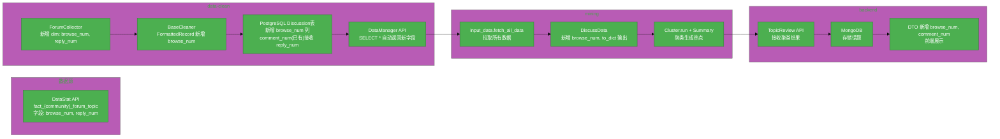

# #281 论坛渠道补充浏览量与回复量指标需求分析说明书

## 1. 基础信息

* **需求链接**: https://github.com/opensourceways/backlog/issues/281
* **需求名称**: 论坛渠道补充浏览量与回复量指标
* **开发责任人**: huanglei 30082796

---

## 2. 需求场景说明

> 描述"在什么情况下，为了解决什么问题，用户需要做什么"。

**场景说明:**

当前热点问题数据库已接入论坛类渠道（覆盖 openubmc、cann、mindspore、openeuler、mindcluster、mindie、mindstudio、mindseriessdk 共 8 个社区），但社区现有数据缺少浏览量和回复量指标。用户在查看论坛热点问题时，无法了解帖子的受关注程度（浏览数）和社区参与度（回复数），影响问题优先级判断和热度评估。本次需求对论坛渠道的数据结构进行补充，新增浏览量（browse_num）和回复量（reply_num）两个字段，贯穿数据采集→清洗→聚类→展示全链路。

## 3. 需求验收标准

> 明确需求完成的标志，必须是可量化、可测试的。

**验收标准:**

* [ ] 论坛渠道数据在 data-clean 采集阶段从 DataStat API 获取 `browse_num` 和 `reply_num` 字段
* [ ] `Discussion` 表新增浏览量字段，已有 `comment_num` 字段接收回复量数据
* [ ] 清洗层（FormattedRecord）和聚类层（DiscussData）正确传递浏览量和回复量
* [ ] data-clean API 分页查询返回的数据包含浏览量和回复量
* [ ] mining 聚类服务输入/输出数据中携带浏览量和回复量
* [ ] 后端 Go 服务 API 响应模型新增浏览量和回复量字段
* [ ] 8 个论坛社区（openubmc、cann/cannopen、mindspore、openeuler、mindcluster、mindie、mindstudio、mindseriessdk）均能正确采集

---

## 4. 需求设计与分解

> 说明：基于初步方案，将需求拆解为可实施的原子 Task。后续的流程判定将严格依据这些 Task 的影响范围进行。

### 4.1 核心逻辑方案

**技术栈：**
- 数据采集与清洗：`hotopic-data-clean`（Python/FastAPI + PostgreSQL + SQLAlchemy）
- 聚类分析：`hotopic-mining`（Python）
- 后端服务：`hot-topic-website-backend`（Go + MongoDB）
- 部署管理：`helm-chart-value`

**数据源：** DataStat API（`beta.datastat.osinfra.cn`），论坛主题表 `fact_{community}_forum_topic`

**逻辑方案：**

本次需求是在现有论坛数据采集链路上补充两个字段，不改变数据流向和架构。核心改动为：

1. **data-clean 采集层**：`ForumCollector._get_dim()` 新增 `browse_num` 和 `reply_num`，`collect()` 方法将这两个字段透传至返回数据
2. **data-clean 数据库层**：`Discussion` 表新增 `browse_num` 列（`comment_num` 列已存在，直接接收 `reply_num` 的值）
3. **data-clean 清洗层**：`FormattedRecord` 新增 `browse_num` 字段，`_build_record()` 从 raw_data 中提取并赋值
4. **data-clean 存储层**：`build_upsert_statement()` 将 `browse_num` 和 `comment_num`（reply_num 映射到 comment_num）写入数据库
5. **data-clean API 层**：`DataManager` 分页查询 SELECT * 自动包含新字段
6. **mining 聚类层**：`DiscussData` 新增 `browse_num`，`to_dict()` 序列化输出包含浏览量和回复量
7. **后端 Go 服务**：`DiscussionSource` / `DiscussionSourceInfo` / `DiscussionSourceToReview` DTO 新增 `browse_num` 和 `comment_num` 字段

**字段映射关系：**

| DataStat API 字段 | Discussion 表字段 | 含义 |
|-------------------|------------------|------|
| `browse_num` | `browse_num`（新增） | 浏览量 |
| `reply_num` | `comment_num`（已有） | 回复量 |

### 4.2 任务清单

**任务清单:**

| 任务 ID | 任务描述 (Task Description) | 预期产出 (Deliverables) | 预期工作量（人天） |
|---------|------------------------------|-------------------------|-----------------|
| **task1** | `hotopic-data-clean` 采集层：`ForumCollector._get_dim()` 新增 `browse_num` 和 `reply_num`；`collect()` 透传字段 | collector.py 改动 | 0.5 |
| **task2** | `hotopic-data-clean` 清洗层：`FormattedRecord` 新增 `browse_num`；`_build_record()` 提取赋值；`build_upsert_statement()` 写入新字段 | clean.py + main.py 改动 | 0.5 |
| **task3** | `hotopic-data-clean` 数据库层：`Discussion` 表新增 `browse_num` 列，SQLAlchemy 自动检测并添加缺失列 | base.py 改动 | 0.25 |
| **task4** | `hotopic-mining` 聚类层：`DiscussData` 新增 `browse_num` 字段，`to_dict()` 输出包含 `browse_num` 和 `comment_num` | utils.py 改动 | 0.25 |
| **task5** | `hot-topic-website-backend` Go 服务：`DiscussionSource` 等 DTO 新增 `BrowseNum` 和 `CommentNum` 字段 | Go DTO 改动 | 0.25 |
| **task6** | 部署验证：各社区配置确认，端到端数据链路验证 | 验证报告 | 0.25 |

**任务依赖说明**：task1 → task2 → task3 有顺序依赖（采集→清洗→存储）。task4 依赖 task3（mining 从 data-clean API 读取数据，新增字段需先入库）。task5 可与 task4 并行。task6 在所有 task 完成后执行。

---

## 5. 需求相关性分析

> **操作说明**：根据上述拆解出的 Task，识别其变更行为。任何一项勾选为"是"：打上对应issue标签，必须执行对应的流程门禁。全部未勾选：该需求自动判定为轻量化特性，打上need_light标签。

### A. 安全相关性分析

> 若涉及以下任一项，打标 `need_security`标签，PR 必须关联特性issue的架构设计文档（含安全设计部分）**如勾选需要给出原因**。

无勾选项

* [ ] **边界变更**：新增公网端口、修改防火墙规则、变更网关配置。
* [ ] **凭证处理**：涉及密钥（Secret/Key）、Token、证书的存储或分发。
* [ ] **权限调整**：修改权限模型、服务账号（SA）权限或鉴权逻辑。
* [ ] **供应链**：引入新的第三方二进制文件、SDK 或重大版本依赖升级。
* [ ] **隐私风险评估**：涉及用户个人数据（Email、手机号、IP、邮箱 等）的处理。
* [ ] **AI使用**：涉及AIGC能力应用，并提供服务。

### B. 架构设计相关性分析

> 若涉及以下任一项，打标 `need_design`标签，PR 必须关联特性issue的架构设计文档。 **如勾选需要给出原因**。

无勾选项

* [ ] A环节判定需要完成安全设计
* [ ] 改变了现有系统的物理/逻辑拓扑
* [ ] 新增或大幅修改对外暴露的 API/CLI 接口
* [ ] 引入了新的中间件、数据库或三方核心组件

### C. 系统集成测试相关性分析

> *若涉及以下任一项，打标 `need_itest`标签，PR必须关联特性issue的测试策略和测试报告文档。 **如勾选需要给出原因**。

* [x] **跨组件影响**：变更会触发下游服务或关联系统的连锁反应（级联效应）。
  - 原因：数据库新增列影响 data-clean API 查询结果，进而影响 mining 聚类输入和 backend 展示输出，涉及 data-clean → mining → backend 三级链路。

无其他勾选项

* [ ] 上述环节判定需要执行安全设计或架构设计。
* [ ] **核心组件管控**：含项目定级为 Core 的核心逻辑变更。
* [ ] **环境强依赖**：功能高度依赖内核参数、网络拓扑或特定的物理挂载。
* [ ] **端到端流程**：涉及从用户输入到持久化存储的全链路逻辑。

### D. 用户体验相关性分析

> 若涉及以下任一项，打标 `need_ux`标签，PR必须关联特性issue的用户体验设计文档。 **如勾选需要给出原因**。

无勾选项

* [ ] **交互逻辑变更**：涉及 Web 门户、控制台（Dashboard）或命令行工具（CLI）的交互流程调整。
* [ ] **感知性能变动**：变更可能显著影响页面的加载时间、同步请求的响应时延或异步任务的进度反馈。
* [ ] **文档与辅助能力**：涉及报错提示语、帮助中心链接、FAQ 或新功能的 Runbook 说明。
* [ ] **无障碍与多语种**：涉及国际化（i18n）支持、辅助功能或不同终端（移动端/桌面端）的适配。

### 5.1 需求相关性分析汇总结果

* [ ] need_security (需架构设计（含安全威胁分析和安全设计）)
* [ ] need_design (需架构设计)
* [x] need_itest (需执行测试策略设计和全链路集成测试)
* [ ] need_ux (需架构设计（含UX设计）)
* [ ] need_light (上述均未勾选，走快速合入通道)

---

## 6. 价值识别与业务评估

> **判定准则**：基础设施接纳需求必须具备明确的 ROI（投资回报比）或合规必要性。

| 维度 | 评估问题 | 结论/说明 |
|------|---------|----------|
| **范围判定** | 该需求是否属于基础设施范围内？ | 是，属于热点问题数据库数据采集能力补充 |
| **规划一致性** | 该需求是否在年度技术规划中？ | 是 |
| **优先级** | 该需求优先级评估（高/中/低）？ | 中 |
| **通用性** | 该需求是否解决 3 个以上业务方的共性痛点？ | 是，8 个论坛社区的运营和开发人员均可受益于浏览量和回复量数据 |
| **必要性** | 现有组件通过配置变更是否无法实现目标或没有不用开发的替代方案？ | 是，需修改代码在数据采集链路中新增字段 |
| **工作量** | 预计总工作量 2 人天？ | 2 人天 |
| **价值评估** | 实现后能减少多少手动操作或提升多少系统稳定性？ | 实现后论坛热点问题可直接展示浏览量和回复量，为问题优先级判断和社区活跃度评估提供量化指标，无需人工查询原始论坛页面 |

> **状态定义：** **Accept (准入)** | **Reject (驳回)** | **Pending (待议)**

**建议结论**： Accept

**原因描述:** 该需求在现有数据采集链路上做字段级增量补充，不影响现有架构和数据流向，改动范围明确（data-clean → mining → backend），实现后可为运营人员和开发者提供论坛帖子的浏览量和回复量指标，辅助热点问题筛选和优先级判断。

---

## 7. 附录

### 7.1 数据源字段验证

以下 8 个社区论坛主题表（`fact_{community}_forum_topic`）均已通过 DataStat API 验证包含 `browse_num` 和 `reply_num` 字段：

| 社区 | browse_num | reply_num |
|------|-----------|----------|
| openubmc | ✅ | ✅ |
| cann（含 cannopen，共用 `fact_cann_forum_topic`） | ✅ | ✅ |
| mindspore | ✅ | ✅ |
| openeuler | ✅ | ✅ |
| mindcluster | ✅ | ✅ |
| mindie | ✅ | ✅ |
| mindstudio | ✅ | ✅ |
| mindseriessdk | ✅ | ✅ |

### 7.2 涉及仓库

| 仓库 | 分支 | 改动范围 |
|------|------|---------|
| `hotopic-data-clean` | hl_dev | collector.py / clean.py / base.py / main.py |
| `hotopic-mining` | hl_dev | utils.py（DiscussData + to_dict） |
| `hot-topic-website-backend` | hl_dev | Go DTO（DiscussionSource 等模型） |
| `helm-chart-value` | hl_dev | 无代码改动（仅配置确认） |

### 7.3 不在本次需求范围内

- Issue 渠道和 Mail 渠道：这两个渠道已有各自的数据指标体系，不在本次改动范围
- 论坛帖子详情页数据采集：浏览量/回复量在 topic 表已有汇总值，无需从 post 表聚合
- 前端 UI 展示：由后端 DTO 透出后，前端按需消费
