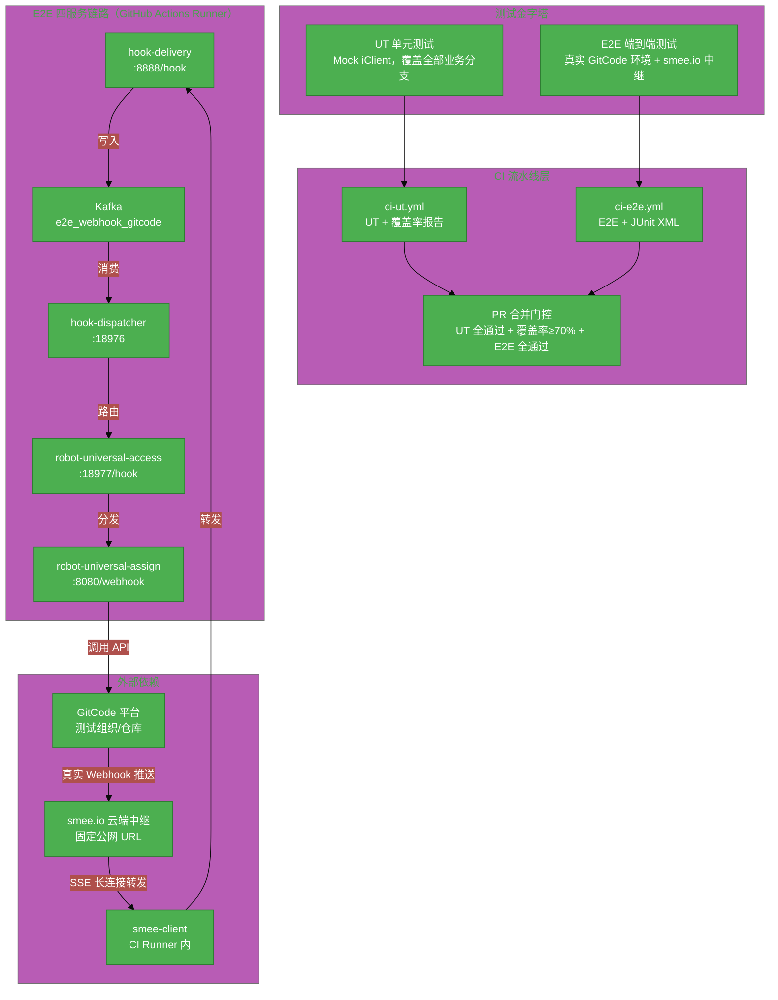
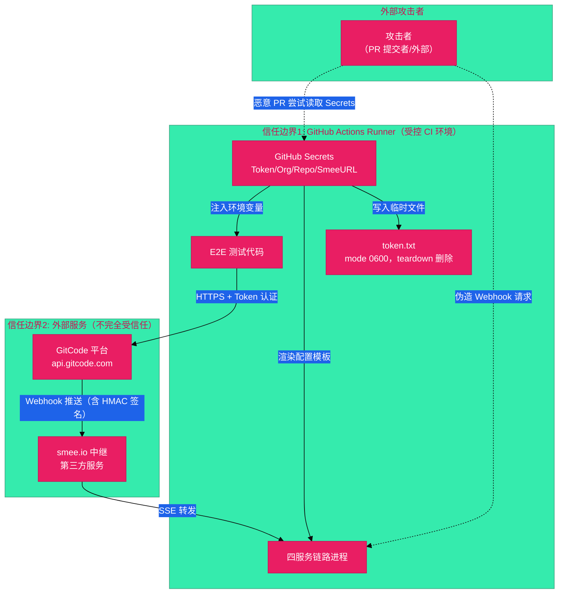

# #298 机器人服务全自动化测试流程设计与搭建 架构设计说明书

---

## 1. 基础信息

* **需求链接**: **[#298](https://github.com/opensourceways/backlog/issues/298)**
* **需求名称**: **机器人服务全自动化测试流程设计与搭建**
* **开发责任人**: **Coopermasaaki**
* **设计目标**: 采用"测试金字塔"两层架构（UT + E2E），基于真实 GitCode 环境 + smee.io Webhook 中继，搭建完整四服务链路的全自动化测试流程，并集成到 GitHub Actions CI 流水线，实现 PR 提交即自动运行、输出测试报告、门控合并。

---

## 2. 功能设计

> **说明**：描述系统的组件构成、职责划分及交互逻辑。

### 2.1 架构图

> 此处建议插入架构拓扑系统组件图或时序图，描述组件间的交互关系。推荐使用Mermaid实现，可代码化，GitHub可渲染。
> **不涉及需要说明原因**

**设计说明/归档：** 本需求为测试基础设施搭建，核心架构为"测试金字塔"两层结构，上层 E2E 测试依赖完整四服务链路。

**系统整体架构图：**

**架构说明：**

- **UT 层**：Mock iClient 接口，隔离外部依赖，秒级运行，覆盖全部业务逻辑分支
- **E2E 层**：启动完整四服务链路，通过 smee.io 中继接收真实 GitCode Webhook，验证端到端行为
- **CI 流水线层**：PR 提交自动触发，输出测试报告，作为 PR 合并门控
- **smee.io**：提供固定公网 URL，GitHub 公共 Runner 无需公网 IP 即可接收 GitCode Webhook

### 2.2 数据流图

> 此处建议插入数据流图，描述核心业务数据的生命周期，即威胁建模的基础。推荐使用Mermaid实现，可代码化，GitHub可渲染。
> **不涉及需要说明原因**

**设计说明/归档：** 核心数据流为 E2E 测试触发链路，从测试代码发起 GitCode API 调用，到 Webhook 经 smee.io 中继进入四服务链路，最终由机器人回写 GitCode，测试代码轮询验证结果。

**E2E 测试数据流图：**

```mermaid
%%{init: {
  'theme': 'base',
  'themeVariables': {
    'primaryColor': '#2196f3',
    'primaryBorderColor': '#1565c0',
    'primaryTextColor': '#ffffff',
    'fontSize': '14px'
  }
}}%%
graph LR
    subgraph "测试驱动层"
        TestCode["测试代码<br/>assign_test.go<br/>dashboard_test.go"]
    end

    subgraph "GitCode 平台（外部）"
        GCApi["GitCode REST API<br/>api.gitcode.com/api/v5"]
        GCWebhook["GitCode Webhook<br/>推送机制"]
    end

    subgraph "Webhook 中继层"
        Smee["smee.io<br/>固定公网 URL"]
        SmeeClient["smee-client<br/>SSE 订阅"]
    end

    subgraph "四服务链路（Runner 内）"
        Delivery["hook-delivery<br/>:8888"]
        Kafka["Kafka Topic<br/>e2e_webhook_gitcode"]
        Dispatcher["hook-dispatcher<br/>:18976"]
        Access["universal-access<br/>:18977"]
        Robot["robot-assign<br/>:8080"]
    end

    TestCode -->|"① 创建 Issue/评论\n(gitcode_client.go)"| GCApi
    GCApi -->|"② 触发 Webhook 推送"| GCWebhook
    GCWebhook -->|"③ POST smee.io URL"| Smee
    Smee -->|"④ SSE 转发"| SmeeClient
    SmeeClient -->|"⑤ POST localhost:8888/hook"| Delivery
    Delivery -->|"⑥ 写入 Kafka"| Kafka
    Kafka -->|"⑦ 消费"| Dispatcher
    Dispatcher -->|"⑧ POST :18977/hook"| Access
    Access -->|"⑨ 路由分发"| Robot
    Robot -->|"⑩ 调用 GitCode API\n(更新 Issue/发评论)"| GCApi
    TestCode -->|"⑪ 轮询验证结果\n(PollAssignee 等)"| GCApi
```

**数据流说明：**

- **步骤①**：测试代码通过 `gitcode_client.go` 封装的 GitCode REST API 创建 Issue 或发表评论，触发测试场景
- **步骤②-④**：GitCode 平台向 smee.io 固定 URL 推送真实 Webhook，smee-client 通过 SSE 长连接实时接收
- **步骤⑤-⑨**：Webhook 数据经完整四服务链路处理，最终到达 robot-universal-assign 业务逻辑
- **步骤⑩**：机器人处理完成后调用 GitCode API 执行操作（更新 Assignee、发评论、归集看板等）
- **步骤⑪**：测试代码轮询 GitCode API 验证机器人处理结果（最多重试 3 次，每次间隔 30 秒）

### 2.3 组件职责与接口

> 列出新增/修改的组件及其定义的 API 规范。**不涉及需要说明原因**

**设计说明/归档：** 本需求新增测试框架组件，不修改现有业务服务接口。

**新增组件职责表：**

| 组件 | 文件路径 | 职责 | 输入 | 输出 |
|------|---------|------|------|------|
| **Mock Client** | `mock_client_test.go` | 实现 iClient 接口，替换真实 HTTP 调用，控制各 API 方法返回值并记录调用参数 | 测试用例配置的返回值 | 模拟 API 响应 + 调用记录 |
| **UT 测试文件** | `*_test.go`（根目录） | 表驱动测试，覆盖全部业务逻辑分支 | Mock Client + 业务函数入参 | 断言结果 |
| **E2E Setup** | `test/e2e/setup_test.go` | TestMain 入口，管理四服务链路启动/停止、Webhook 动态注册/注销、环境清理 | 环境变量（GitHub Secrets） | 就绪的测试环境 |
| **GitCode Client** | `test/e2e/gitcode_client.go` | 封装 GitCode REST API，提供创建/查询 Issue、评论、看板、Webhook 及轮询验证方法 | 环境变量中的 Token/Org/Repo | GitCode API 响应 |
| **E2E 测试用例** | `test/e2e/assign_test.go` `test/e2e/dashboard_test.go` | 覆盖 assign/unassign/看板归集等核心场景 | 就绪的测试环境 | JUnit XML 测试报告 |
| **配置模板** | `test/e2e/testdata/*.yaml` | 四服务链路配置模板，含环境变量占位符，运行时渲染 | 环境变量 | 渲染后的配置文件 |
| **ci-ut.yml** | `.github/workflows/ci-ut.yml` | PR 触发 UT 流水线：运行测试、生成覆盖率报告、门控检查 | PR 事件 | coverage.html + junit-ut.xml |
| **ci-e2e.yml** | `.github/workflows/ci-e2e.yml` | PR 触发 E2E 流水线：启动 Kafka、编译四服务、运行 E2E 测试 | PR 事件 + GitHub Secrets | junit-e2e.xml |

**gitcode_client.go 核心方法：**

| 方法 | 说明 |
|------|------|
| `CreateIssue(title, issueType)` | 创建 Issue，返回 Issue 编号 |
| `GetIssue(number)` | 查询 Issue 详情 |
| `CreateComment(number, body)` | 发表评论 |
| `ListComments(number)` | 列出所有评论 |
| `CloseIssue(number)` | 关闭 Issue |
| `CreateWebhook(smeeURL, secret)` | 动态注册 Webhook，返回 ID |
| `DeleteWebhook(id)` | 删除 Webhook |
| `PollAssignee(number, want)` | 轮询直到 Assignee 变为期望值（最多 3 次，间隔 30s） |
| `PollAssigneeEmpty(number)` | 轮询直到 Assignee 被清空 |
| `PollCommentContains(number, substr)` | 轮询直到出现包含指定内容的评论 |
| `PollIssueInDashboard(dashboardID, issueNumber)` | 轮询直到 Issue 出现在看板中 |

### 2.4 UX设计

> 设计目标：确保功能不仅"可用"，而且"好用"，降低开发者的认知负担和运维人员的误操作风险。 **不涉及需要说明原因**

**设计说明/归档：** 不涉及，原因：本需求为测试基础设施，无 Web 门户或 CLI 交互界面变更，开发者体验通过 CI 报告和测试规范文档体现。

### 2.5 SOD设计

> 设计目标：通过维护SOD权限设计文档，确保权限设计可审计、可复用、可跨服务重用。 SOD权限设计参考[XX SOD权限设计.md](XX%20SOD%E6%9D%83%E9%99%90%E8%AE%BE%E8%AE%A1.md)
>
>**不涉及需要说明原因**
>
>**需要说明文档位置**

**设计说明/归档：** 不涉及，原因：本需求不修改现有权限模型，测试账号权限通过 GitHub Secrets 管理，仅限 CI 环境使用，无需 SOD 权限设计文档。

### 2.6 功能设计分解TASK清单

**设计说明/归档：**

**任务清单:**

| 任务 ID | 可服务性任务描述 | 责任人 |
|---------|--------------|--------|
| **task1** | 补全 UT 单元测试：实现 Mock Client，编写表驱动测试覆盖全部业务分支，接入 ci-ut.yml 流水线，覆盖率达标（核心文件 ≥80%，整体 ≥70%） | Coopermasaaki |
| **task2** | 搭建 E2E 基础设施：创建 GitCode 测试组织/仓库/看板，申请 smee.io 频道，配置 GitHub Secrets（10 个 Secret） | Coopermasaaki |
| **task3** | 编写 E2E 测试框架：实现 setup_test.go（四服务链路启动/停止、动态 Webhook 注册/注销）、gitcode_client.go（API 封装 + 轮询验证）、testdata 配置模板 | Coopermasaaki |
| **task4** | 编写 E2E 核心测试用例：assign_test.go（5 个场景）、dashboard_test.go（3 个场景），输出 JUnit XML 报告 | Coopermasaaki |
| **task5** | 接入 ci-e2e.yml 流水线：Kafka Docker 启动、四服务编译、E2E 运行、Artifact 上传，配置 PR 合并门控 | Coopermasaaki |
| **task6** | 制定测试用例补充规范文档，明确新需求开发时 UT + E2E 用例补充要求和命名规范 | Coopermasaaki |

---

## 3. 非功能设计

### 3.1 安全与隐私设计评估和设计

> **注意**：仅当需求判定为 **`need_security`** 时，本章节为必填项。 **无该标签可删除本章节。**

> 关注点：防御能力与合规边界。

### 3.1.1 威胁分析 (Threat Modeling)

> 基于 **STRIDE** 或类似模型，识别本项目可能面临的安全威胁。推荐使用Mermaid绘制DFD数据流图和信任边界，展示系统的安全边界和数据流向。
> **建议归档服务模块设计图，后续需要可增量复用（导入设计文件到工具中即可复用增量设计）。**

**设计说明/归档：** 本需求的安全风险集中在 CI 环境中的凭证管理（GitHub Secrets 中存储的 GitCode Token）和 Webhook 签名验证。

**信任边界图：**

**威胁分析表：**

| 威胁类别 | 攻击场景描述 (Scenario) | 风险等级 | 对应减缓措施 (Mitigation) |
|---------|----------------------|---------|------------------------|
| **信息泄露** | 恶意 PR 代码通过 `echo $SECRET` 等方式在 CI 日志中打印 Token | 高 | GitHub Actions 自动屏蔽 Secrets 值；fork PR 默认不传递 Secrets（GitHub 保护机制） |
| **信息泄露** | token.txt 临时文件残留在 Runner 上被其他 Job 读取 | 中 | token.txt 设置 mode 0600；teardown 阶段（always 执行）强制删除 |
| **篡改/伪造** | 攻击者向 smee-client 监听端口发送伪造 Webhook，触发机器人执行非预期操作 | 中 | 配置 `E2E_WEBHOOK_SECRET` 进行 HMAC 签名验证；hook-delivery 校验签名后才处理 |
| **信息泄露** | smee.io 作为第三方服务，Webhook 内容（含 Issue 标题/评论）经过其服务器 | 低 | 测试仓库使用专用测试组织，不含真实业务数据；smee.io 频道 URL 存于 Secrets，不公开 |
| **拒绝服务** | E2E 测试频繁调用 GitCode API 触发限流，导致测试失败或影响其他服务 | 低 | E2E 用例间加适当间隔；定时任务错开业务高峰；限流错误时测试失败而非重试风暴 |
| **隐私泄露** | 测试过程中创建的 Issue/评论残留在测试仓库，包含测试数据 | 低 | teardown 统一关闭所有测试创建的 Issue；使用专用测试组织隔离 |

### 3.1.2 安全设计实现 (Security Mechanisms)

> **参考：**
> 威胁模型评估：
> * 是否已根据业务逻辑绘制 Data Flow Diagram 并识别单点风险？
>
> 软件供应链：
>* 是否扫描并修补了已知漏洞（CVE）？
>* 是否限制了第三方二进制包的直接引入？
>*
>凭证管理：
>* 严禁硬编码。
>* 密钥是否定期自动轮转（Rotation）？
>
>身份认证：
>* 是否具备多因素认证支持或联邦认证（OIDC）对接能力？
>* 内部微服务调用是否执行了身份校验（Identity-based Auth）？
>
>数据安全：
>* 传输加密（TLS 1.2+）与静态加密（AES-128）是否全覆盖？
>* 是否对高敏感字段（如手机号、秘钥）执行了哈希/加盐或差分隐私处理？
>
>运行时隔离：
>* 容器是否以非 Root 用户运行（Non-root Enforcement）？
>* 是否配置了 Read-only Root Filesystem 防止二进制篡改？
>
>日志审计：
>* 关键操作日志是否具备防篡改性？
>* 是否包含了足够用于追溯的 4W 信息（Who, When, Where, What）？

**设计说明/归档：**

* **凭证管理**：所有 Token（`E2E_ROBOT_TOKEN`、`E2E_TEST_USER_TOKEN`、`GO_PRIVATE_TOKEN` 等）严禁硬编码，全部存储于 GitHub Secrets，通过环境变量注入 CI 运行时。token.txt 临时文件权限设置为 0600，teardown 阶段强制删除。Token 轮转由 GitCode 账号管理员负责，建议每 90 天轮转一次。
* **Webhook 签名验证**：配置 `E2E_WEBHOOK_SECRET` 作为 HMAC 签名密钥，hook-delivery 服务在接收 Webhook 时校验签名，拒绝未签名或签名错误的请求，防止伪造 Webhook 攻击。
* **传输加密**：测试代码与 GitCode API 的所有通信均通过 HTTPS（TLS 1.2+）进行，smee.io 中继也使用 HTTPS。
* **数据隔离**：使用专用测试组织和测试仓库，与生产环境完全隔离，测试数据不含真实用户信息。
* **日志安全**：CI 日志中 GitHub Actions 自动屏蔽 Secrets 值，避免 Token 明文出现在日志中。

### 3.1.3 安全任务分解 (Security Task Breakdown)

> 将安全设计转化为具体的开发任务，需在代码或后续开发流程的安全配置中落实。

**任务清单:**

| 任务 ID | 安全任务描述 (Security Tasks) | 责任人 |
|---------|---------------------------|--------|
| **SEC-TASK1** | 配置 GitHub Secrets（10 个），确保所有 Token 不硬编码，通过环境变量注入 CI | Coopermasaaki |
| **SEC-TASK2** | 实现 token.txt 临时文件权限控制（mode 0600）及 teardown 强制删除逻辑 | Coopermasaaki |
| **SEC-TASK3** | 配置 `E2E_WEBHOOK_SECRET` 并在 hook-delivery 启用 HMAC 签名验证 | Coopermasaaki |
| **SEC-TASK4** | 验证 ci-e2e.yml 中 fork PR 的 Secrets 隔离策略（GitHub 默认保护，需确认配置正确） | Coopermasaaki |

### 3.2 可靠性与韧性设计评估和设计（可选）

> **注意**：根据项目定级决定，含Core、Critical服务变更需要完成

> **关注点**：极端情况下的生存与恢复能力。
> **参考：**
> * 面向失败设计：是否识别了强依赖风险？当游依赖失效时，本服务是否具备降级或熔断能力？
> * 重试与避让：重试逻辑中是否包含指数退避和随机抖动以防止请求风暴？
> * 熔断限流：核心接口是否定义了明确的限流阈值？是否实现了断路器模式以保护下游？
> * 幂等设计：所有涉及写操作的任务是否支持重复调用而无副作用？

**设计说明/归档：** 不涉及，原因：本需求为测试基础设施，非生产服务，无高可用要求。E2E 测试对外部依赖（smee.io、GitCode API）的失败通过测试失败报告体现，不需要降级或熔断机制。关键风险与应对措施已在 E2E 设计文档中说明（smee.io 不可用时 E2E 失败不阻塞紧急 hotfix 合并）。

**任务清单:**

| 任务 ID | 可靠性与韧性任务描述 | 责任人 |
|---------|------------------|--------|
| — | 不涉及 | — |

---

### 3.3 可服务性与可观测性评估和设计（可选）

> **关注点**：排障效率与全生命周期管理，确保故障可感知、可定位、可修复。

> **参考：**
>* 排障文档：是否提供了错误码对照表及对应的排障步骤？
>* 健康诊断：是否提供 /health 或 /status 接口，展示系统内部子模块的状态？
>* 平滑变更：升级或配置变更时如何实现灰度发布？是否具备一键回滚的判定指标？
>* 黄金指标覆盖：是否已定义并暴露出延迟、错误、流量和饱和度指标？

**设计说明/归档：** 不涉及，原因：本需求为 CI 测试基础设施，无长驻服务，无需健康检查接口或黄金指标。可观测性通过 GitHub Actions 日志和 JUnit XML 测试报告实现，CI 失败时可直接查看 Runner 日志定位问题。

**任务清单:**

| 任务 ID | 可服务性任务描述 | 责任人 |
|---------|--------------|--------|
| — | 不涉及 | — |

---

### 3.4 性能与伸缩性评估和设计（可选）

> **关注点**：社区生态兼容性与未来扩展。

> **参考：**
> * 并发模型：在高并发场景下，锁竞争、连接池和线程池的配置是否已评估？
> * 水平扩展：服务是否实现了完全无状态化，支持快速扩容？
> * 延迟评估：关键路径的延迟是否业务需求？是否存在明显的 IO 或计算瓶颈？

**设计说明/归档：** 不涉及，原因：本需求为 CI 测试基础设施，E2E 测试串行执行，无高并发要求。E2E 测试总超时设置为 30 分钟，轮询策略（最多 3 次，间隔 30 秒）已考虑 smee.io 中转延迟，满足当前需求。

**任务清单:**

| 任务 ID | 性能任务描述 | 责任人 |
|---------|-----------|--------|
| — | 不涉及 | — |

---
