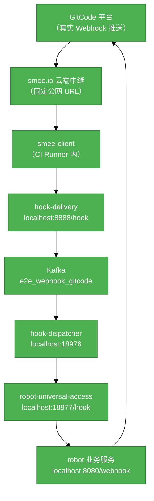

# #298 机器人服务全自动化测试流程设计与搭建

## 1. 基础信息

* **需求链接**: **[#298](https://github.com/opensourceways/backlog/issues/298)**
* **需求名称**: **机器人服务全自动化测试流程设计与搭建**
* **开发责任人**: **Coopermasaaki**

---

## 2. 需求场景说明

> 描述”在什么情况下，为了解决什么问题，用户需要做什么”。

**场景说明:** 目前机器人服务只具备少量单元测试（UT），缺少端到端（E2E）测试覆盖。每次需求交付前，测试人员需要人工模拟真实线上场景（手动在 GitCode 平台提 Issue、发评论等）来验证功能，测试效率低下，难以支撑机器人需求的快速、高质量交付。随着社区业务的增长，机器人需求日益增加，亟需设计并搭建一套全自动化测试流程，并逐步补充完善每个机器人的测试用例，以提升需求交付效率和质量。

## 3 需求验收标准

> 明确需求完成的标志，必须是可量化、可测试的。

**验收标准:**

- 核心业务文件 UT 行覆盖率 ≥ 80%，整体行覆盖率 ≥ 70%
- E2E 测试覆盖所有核心场景，所有用例在 CI 中稳定通过
- GitHub Actions CI 流水线（UT + E2E）在每次 PR 提交时自动触发，输出测试报告（覆盖率 HTML + JUnit XML）
- PR 门控生效：UT 全部通过且覆盖率达标、E2E 全部通过，PR 方可合并
- 建立测试用例补充规范，后续每个新需求 PR 同步补充 UT + E2E 用例

---

## 4. 需求设计与分解

> 说明：基于初步方案，将需求拆解为可实施的原子 Task。后续的流程判定将严格依据这些 Task 的影响范围进行。

### 4.1 核心逻辑方案

> 简述实现逻辑（如：数据流向、模块改动、新增配置项等），作为任务拆解的理论依据。推荐使用Mermaid图表展示流程，支持GitHub原生渲染。

**逻辑方案:** 采用"测试金字塔"两层架构：底层为 UT 单元测试（Mock iClient 接口，覆盖全部业务逻辑分支），上层为 E2E 端到端测试（基于真实 GitCode 环境 + smee.io Webhook 中继，完整验证四服务链路）。两层测试均集成到 GitHub Actions CI 流水线，PR 提交即自动运行，输出测试报告并作为 PR 合并门控。

**整体测试架构：**

```
测试金字塔
┌────────────────────────────────────────────────────────────────┐
│                      E2E 真实环境测试                           │
│   真实 GitCode 仓库 + 真实 Webhook 推送                         │
│   GitHub 公共 Runner + smee.io Webhook 中继                    │
│   完整四服务链路 delivery→Kafka→dispatcher→access→robot         │
├────────────────────────────────────────────────────────────────┤
│                        UT 单元测试                              │
│          Mock iClient 接口，覆盖全部业务逻辑分支                  │
└────────────────────────────────────────────────────────────────┘
```

**E2E 数据流向（Mermaid）：**



**说明：**
- E2E 测试通过 GitCode API 在测试仓库创建 Issue/评论，触发真实 Webhook 推送
- smee.io 提供固定公网 URL，无需 CI Runner 具备公网 IP
- Webhook 在每次 CI 运行时动态注册，teardown 时自动删除，不污染仓库配置
- 测试代码通过轮询 GitCode API 验证机器人处理结果

### 4.2 任务清单

**任务清单:**

| 任务 ID | 任务描述 (Task Description) | 预期产出 (Deliverables) | 预期工作量（人天） |
|--------|--------------------------|----------------------|--------------|
| **task1** | 补全 UT 单元测试，覆盖全部业务逻辑分支，接入 ci-ut.yml 流水线 | UT 测试文件、Mock Client、ci-ut.yml、覆盖率报告 | 0.5 |
| **task2** | 搭建 E2E 基础设施：创建 GitCode 测试组织/仓库/看板、申请 smee.io 频道、配置 GitHub Secrets | 测试环境就绪文档、Secrets 配置清单 | 1 |
| **task3** | 编写 E2E 测试框架：四服务链路启动/停止、动态 Webhook 注册/注销、GitCode API 封装（gitcode_client.go）、setup/teardown 机制 | test/e2e/ 框架代码、testdata 配置模板 | 1 |
| **task4** | 编写 E2E 核心测试用例 | E2E 测试用例代码、JUnit XML 报告 | 1 |
| **task5** | 接入 ci-e2e.yml 流水线，配置 PR 合并门控（UT 覆盖率 ≥ 70%、E2E 全部通过） | ci-e2e.yml、PR 门控配置 |1 |
| **task6** | 制定测试用例补充规范文档，明确新需求开发时 UT + E2E 用例补充要求 | 测试规范文档 | 0.5 |

---

## 5. 需求相关性分析

> **操作说明**：根据上述拆解出的 Task，识别其变更行为。任何一项勾选为”是”：打上对应issue标签，必须执行对应的流程门禁。全部未勾选：该需求自动判定为轻量化特性，打上need_light标签。

### A. 安全相关性分析

> 若涉及以下任一项，打标 `need_security`标签，PR 必须关联特性issue的架构设计文档（含安全设计部分）**如勾选需要给出原因**。

* [ ] **边界变更**：新增公网端口、修改防火墙规则、变更网关配置。
* [ ] **凭证处理**：涉及密钥（Secret/Key）、Token、证书的存储或分发。
* [ ] **权限调整**：修改权限模型、服务账号（SA）权限或鉴权逻辑。
* [ ] **供应链**：引入新的第三方二进制文件、SDK 或重大版本依赖升级。
* [ ] **隐私风险评估**：涉及用户个人数据（Email、手机号、IP、邮箱 等）的处理。
* [ ] **AI使用**：涉及AIGC能力应用，并提供服务。

### B. 架构设计相关性分析

> 若涉及以下任一项，打标 `need_design`标签，PR 必须关联特性issue的架构设计文档。 **如勾选需要给出原因**。

* [ ] A环节判定需要完成安全设计
* [ ] 改变了现有系统的物理/逻辑拓扑
* [ ] 新增或大幅修改对外暴露的 API/CLI 接口
* [ ] 引入了新的中间件、数据库或三方核心组件 **[勾选必填]**_原因：如：引入了新的中间件、数据库或三方核心组件_

### C. 系统集成测试相关性分析

> *若涉及以下任一项，打标 `need_itest`标签，PR必须关联特性issue的测试策略和测试报告文档。 **如勾选需要给出原因**。

* [ ] 上述环节判定需要执行安全设计或架构设计。
* [ ] **跨组件影响**：变更会触发下游服务或关联系统的连锁反应（级联效应）。
* [ ] **核心组件管控**：含项目定级为 Core 的核心逻辑变更。
* [ ] **环境强依赖**：功能高度依赖内核参数、网络拓扑或特定的物理挂载。
* [ ] **端到端流程**：涉及从用户输入到持久化存储的全链路逻辑。

### D. 用户体验相关性分析

> 若涉及以下任一项，打标 `need_ux`标签，PR必须关联特性issue的用户体验设计文档。 **如勾选需要给出原因**。

* [ ] **交互逻辑变更**：涉及 Web 门户、控制台（Dashboard）或命令行工具（CLI）的交互流程调整。
* [ ] **感知性能变动**：变更可能显著影响页面的加载时间、同步请求的响应时延或异步任务的进度反馈。
* [ ] **文档与辅助能力**：涉及报错提示语、帮助中心链接、FAQ 或新功能的 Runbook 说明。
* [ ] **无障碍与多语种**：涉及国际化（i18n）支持、辅助功能或不同终端（移动端/桌面端）的适配。

### 5.1 需求相关性分析汇总结果

* [ ] need_security (需架构设计（含安全威胁分析和安全设计）)
* [ ] need_design (需架构设计)
* [ ] need_itest (需执行测试策略设计和全链路集成测试)
* [ ] need_ux (需架构设计（含UX设计)）
* [ ] need_light (上述均未勾选，走快速合入通道)

---

## 6. 价值识别与业务评估

> **判定准则**：基础设施接纳需求必须具备明确的 ROI（投资回报比）或合规必要性。

| 维度        | 评估问题                            | 结论/说明               |
|-----------|---------------------------------|---------------------|
| **范围判定**  | 该需求是否属于基础设施范围内？                 | 是，属于机器人服务质量保障基础设施   |
| **规划一致性** | 该需求是否是否在年度技术规划中？                | 是，属于机器人服务质量保障基础设施  |
| **优先级**   | 该需求优先级评估（高/中/低）？                | 高，直接影响机器人需求交付效率     |
| **通用性**   | 该需求是否解决 3 个以上业务方的共性痛点？          | 是，适用于所有机器人服务的测试覆盖   |
| **必要性**   | 现有组件通过配置变更是否无法实现目标或没有不用开发的替代方案？ | 是，需要专门设计并搭建自动化测试框架  |
| **工作量**   | 预计总工作量 xx 人天？        | 5人天 |
| **价值评估**  | 实现后能减少多少手动操作或提升多少系统稳定性？         | 消除每次需求交付前的人工测试环节，预计可将测试效率提升 60% 以上，同时通过 CI 门控保障代码质量，降低线上故障风险 |

> **状态定义：** **Accept (准入)** | **Reject (驳回)** |  **Pending (待议)**

**建议结论**： Accept

**原因描述:** 该需求通过搭建全自动化测试流程（UT + E2E + CI 流水线），消除机器人服务每次需求交付前的人工测试环节，显著提升测试效率和交付质量。随着社区机器人需求持续增长，该基础设施投入具有明确的长期 ROI，符合”质量即代码”的演进目标。

---
