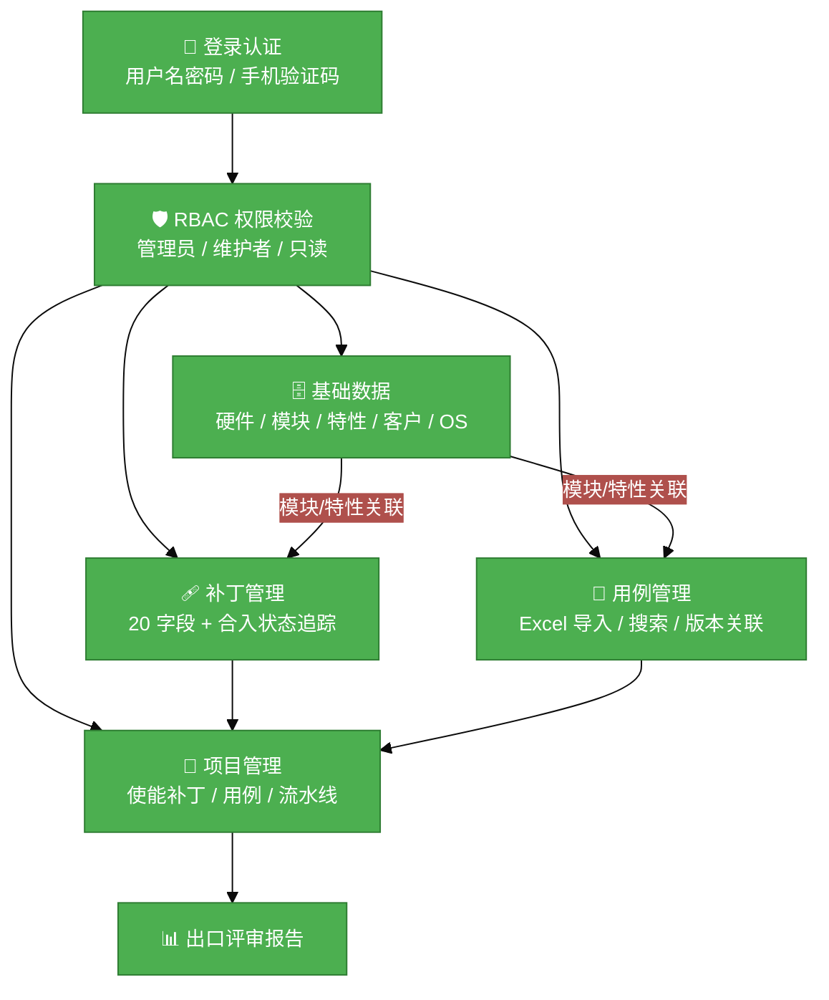
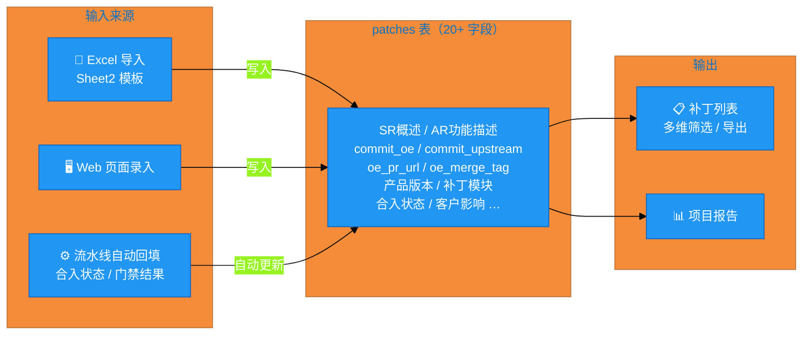

# patch-manager 需求分析说明书 v2.0

## 1. 基础信息

* **需求链接**: https://gitcode.com/georgecao/patch-manager
* **需求名称**: openEuler 开源社区特性补丁管理系统（完整版）
* **开发责任人**: georgecao
* **参考文件**: `requirement-list.xlsx`（Sheet1: 需求描述 / Sheet2: 使能补丁 dashboard 模板）

---

## 2. 需求场景说明

> 描述"在什么情况下，为了解决什么问题，用户需要做什么"。

**场景说明:**

openEuler 硬件使能团队负责将上游社区（如 kernel.org）的关键补丁适配到各类商用硬件（Hi1820、120/120Pro 等），并推动客户侧合入。当前补丁信息散落在 Excel 表格中，无法与 CI/CD 流水线打通，补丁合入状态、测试用例执行结果均需人工记录维护。本系统提供统一 Web 平台，覆盖补丁全生命周期：从补丁录入、上游/下游 commit 追踪、自动合入适配、门禁检视，到测试用例管理、项目出口评审报告生成。

**核心用户角色：**
- **补丁维护者**：录入/管理补丁，跟踪合入状态
- **测试工程师**：管理测试用例，查看执行结果
- **项目经理**：管理使能项目，查看整体进度与出口报告
- **客户**：录入客户侧合入状态（部分字段闭源依赖）

---

## 3. 需求验收标准

> 明确需求完成的标志，必须是可量化、可测试的。

**验收标准:**

- **认证**：用户名密码登录成功率 100%，未登录访问任意 API 均返回 401
- **权限**：不同角色用户访问越权资源返回 403，RBAC 测试覆盖 3 种角色（管理员/维护者/只读）
- **补丁字段完整性**：补丁数据模型覆盖 Sheet2 全部 20 个字段，批量导入 Excel 100 行数据无丢失
- **补丁搜索**：支持按模块、特性、补丁类型、合入状态至少 4 个维度筛选，响应时间 < 1s（1000 条数据）
- **用例管理**：支持 Excel 批量导入用例，导入 200 条耗时 < 5s；与版本关联的用例不可删除
- **项目管理**：能创建项目并关联补丁列表、用例列表，支持查看项目维度的合入状态汇总

---

## 4. 需求设计与分解

> 基于初步方案，将需求拆解为可实施的原子 Task。

### 4.1 核心逻辑方案

**逻辑方案：** 在现有 Project→SR→AR→Patch→TestCase 层级基础上，新增用户认证层（JWT）、RBAC 权限层、基础数据层（硬件/模块/特性/客户/OS），并扩展补丁字段（对齐 Sheet2 的 20 个字段），增强用例管理和项目使能管理功能。

**系统整体架构流程：**

**补丁字段数据流（Sheet2 → 数据库）：**

### 4.2 任务清单

| 任务 ID | 任务描述 | 预期产出 | 预计工作量（人天）|
|---------|---------|---------|----------------|
| **TASK1** | 用户认证：JWT 登录（用户名密码）+ Token 刷新 + 登出 + 认证中间件 | `internal/auth/` + 登录 API + 前端登录页 | 4 |
| **TASK2** | RBAC 权限：角色（管理员/维护者/只读）、用户-角色绑定、接口级鉴权中间件 | 角色/用户管理 API + 权限拦截层 | 4 |
| **TASK3** | 基础数据管理：硬件、模块、特性、客户、OS 版本五类基础信息 CRUD | 5 张基础数据表 + API | 3 |
| **TASK4** | 补丁字段扩展：对齐 Sheet2 全部 20 字段，支持 Excel 批量导入/更新 | 扩展 `patches` 表 + 批量导入接口 | 4 |
| **TASK5** | 补丁搜索：按模块/特性/类型/合入状态/产品版本多维筛选（分页+排序） | 补丁搜索 API | 2 |
| **TASK6** | 用例管理增强：通用字段扩展、Excel 批量导入/更新、版本关联保护、搜索 | 扩展 `test_cases` 表 + 导入 API | 3 |
| **TASK7** | 项目使能管理：关联补丁/用例列表，合入状态汇总，出口评审报告导出 | 项目增强 API + 报告导出 | 4 |
| **TASK8** | 前端重构：登录页、基础数据管理页、补丁富字段展示与筛选页、用例管理页 | Vue 页面更新 | 5 |

---

## 5. 需求相关性分析

> **操作说明**：根据拆解出的 Task，识别其变更行为。任何一项勾选为"是"：打上对应标签，必须执行对应流程门禁。

### A. 安全相关性分析

> 若涉及以下任一项，打标 `need_security`。**如勾选需要给出原因**。

* [x] **边界变更**：新增 `/api/v1/auth/*` 公开端点，其余所有接口由完全公开变为需要 JWT Token — **引入认证边界，改变了系统对外暴露的访问模式**
* [x] **凭证处理**：用户密码 bcrypt 哈希存储、JWT Secret 管理、手机 OTP 验证码凭证 — **引入密码凭证和 Token 凭证的全生命周期管理**
* [x] **权限调整**：新增 RBAC 权限模型，所有现有接口增加角色鉴权 — **全新权限模型影响所有现有接口**
* [ ] **供应链**：golang-jwt / bcrypt 均为业界标准开源库，无新增高风险依赖
* [x] **隐私风险评估**：手机号（验证码登录）属于 PII 数据，需脱敏展示和安全存储 — **手机号属个人隐私数据**
* [ ] **AI 使用**：不涉及

### B. 架构设计相关性分析

> 若涉及以下任一项，打标 `need_design`。**如勾选需要给出原因**。

* [x] A 环节判定需要完成安全设计 — **A 环节已触发 need_security**
* [x] **改变了现有系统的物理/逻辑拓扑** — **新增认证层作为所有 API 的前置拦截，改变了整体请求链路**
* [x] **新增或大幅修改对外暴露的 API/CLI 接口** — **新增认证/权限/基础数据/搜索等约 30 个接口**
* [x] **引入了新的中间件、数据库或三方核心组件** — **引入 golang-jwt、bcrypt，新增 5 张基础数据表，patches 表字段从 9 扩展至 20+**

### C. 系统集成测试相关性分析

> 若涉及以下任一项，打标 `need_itest`。**如勾选需要给出原因**。

* [x] **上述环节判定需要执行安全设计或架构设计** — **B 环节已触发**
* [x] **跨组件影响**：认证中间件横切所有资源模块，RBAC 影响补丁/用例/项目全部接口 — **认证层是横切关注点，任何组件变更均会影响**
* [ ] **核心组件管控**：不涉及
* [ ] **环境强依赖**：不涉及
* [x] **端到端流程**：登录→Token→访问资源→权限校验→数据返回，是完整端到端链路 — **认证流程覆盖全链路逻辑**

### D. 用户体验相关性分析

> 若涉及以下任一项，打标 `need_ux`。**如勾选需要给出原因**。

* [x] **交互逻辑变更**：新增登录页，现有页面需处理 Token 过期自动跳转，补丁管理页字段大幅增加 — **登录是用户第一交互入口，影响所有页面状态**
* [x] **感知性能变动**：补丁 20 字段列表的渲染和搜索体验需专项设计 — **字段增多后列表可读性和操作效率是核心体验问题**
* [ ] **文档与辅助能力**：不涉及
* [ ] **无障碍与多语种**：不涉及

### 5.1 需求相关性分析汇总结果

* [x] **need_security**（需架构设计，含安全威胁分析和安全设计）
* [x] **need_design**（需架构设计）
* [x] **need_itest**（需执行测试策略设计和全链路集成测试）
* [x] **need_ux**（需架构设计，含 UX 设计）
* [ ] need_light（上述均未勾选，走快速合入通道）

---

## 6. 价值识别与业务评估

> **判定准则**：基础设施接纳需求必须具备明确的 ROI 或合规必要性。

| 维度 | 评估问题 | 结论/说明 |
|------|---------|---------|
| **范围判定** | 该需求是否属于基础设施范围内？ | 是，核心工具链需求 |
| **规划一致性** | 该需求是否在年度技术规划中？ | 是，对应 requirement-list.xlsx 全部需求 |
| **优先级** | 该需求优先级评估？ | 高，所有子需求均标注"高"优先级 |
| **通用性** | 是否解决 3 个以上业务方的共性痛点？ | 是，补丁维护者/测试工程师/项目经理/客户均受益 |
| **必要性** | 现有方案是否可满足？ | 否，Excel 手工管理无法与流水线打通，无权限控制 |
| **工作量** | 预计总工作量 | 约 29 人天（TASK1~TASK8）|
| **价值评估** | 实现后效果 | 消除 Excel 手工维护，补丁状态自动回填，预计减少 80% 重复性对账工作 |

> **状态定义：** **Accept（准入）** | **Reject（驳回）** | **Pending（待议）**

**建议结论：** Accept

**原因描述：** 本系统涵盖认证权限、基础数据管理、补丁全字段管理、用例管理和项目使能管理五大核心模块，通过自动化手段替代 Excel 手工维护，实现补丁合入状态自动回填，预计减少 80% 重复性对账工作，ROI 明确，具备明确的业务价值。

---

## 附录 A：补丁字段对照表（Sheet2 → 数据模型）

| Sheet2 列名 | 建议字段名 | 类型 | 说明 |
|-------------|-----------|------|------|
| 概述（SR粒度） | `sr_title` | varchar(256) | SR 级描述，导入时可关联 SR |
| 功能介绍（AR粒度）| `ar_title` | varchar(256) | AR 级描述 |
| 关联社区 issue | `community_issue` | varchar(256) | 社区 Issue 链接 |
| 补丁类型 | `patch_type` | varchar(32) | feat / bug / cleanup / cve |
| 产品版本 | `product_version` | varchar(64) | 如 120 / 120Pro |
| 用户态or内核态 | `space_type` | varchar(32) | user / kernel |
| 补丁模块 | `module_id` | bigint FK | 关联基础数据模块表 |
| Commit OE | `commit_oe` | varchar(512) | OE 仓库 commit 信息 |
| PR 前后置补丁 | `patch_dependencies` | text | 依赖补丁描述 |
| OE Merge tag | `oe_merge_tag` | varchar(128) | OE 合入版本 tag |
| OE PR | `oe_pr_url` | varchar(512) | OE 仓库 PR 链接 |
| Commit upstream | `commit_upstream` | varchar(64) | 上游 commit hash |
| upstream Merge tag | `upstream_merge_tag` | varchar(128) | 上游合入版本 tag |
| 主键 | `external_key` | varchar(128) | 外部系统主键 |
| 是否合入 | `is_merged` | boolean | 是否已合入 |
| 客户影响 | `customer_impact` | varchar(512) | 客户侧影响描述 |
| 华为仓库合入状态 | `hw_merge_status` | varchar(32) | 全合入/部分合入/未合入 |
| 客户侧合入状态 | `customer_merge_status` | varchar(32) | 客户录入 |
| 合入版本 | `merge_version` | varchar(128) | 客户仓库分支版本 |
| OS 发布版本 | `os_release_version` | varchar(128) | 客户 OS 镜像发布版本 |

