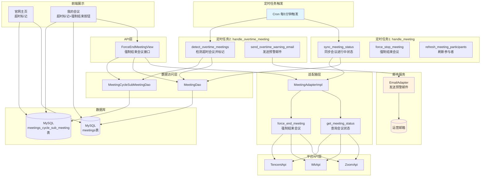
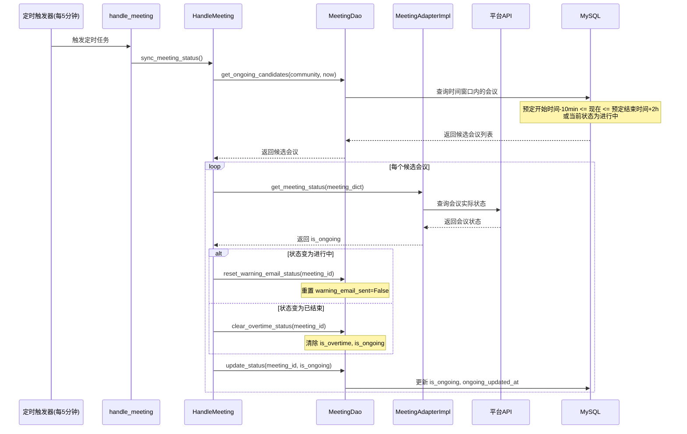
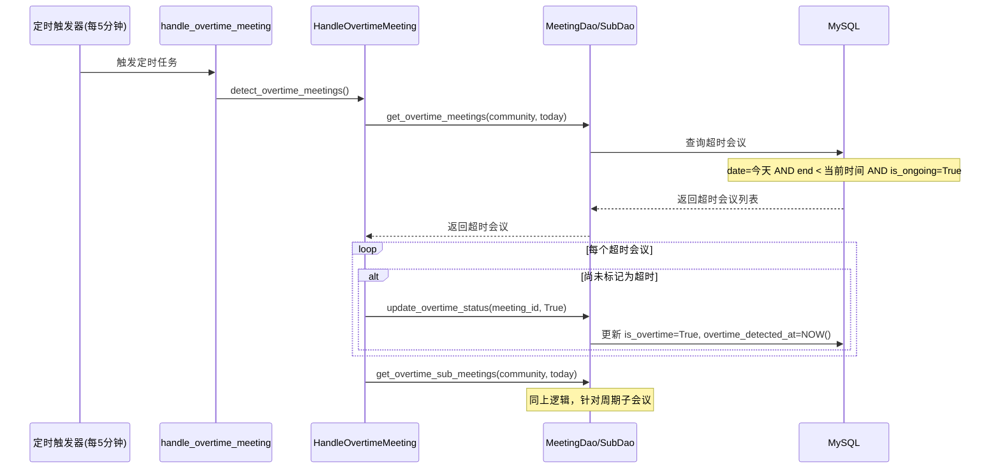
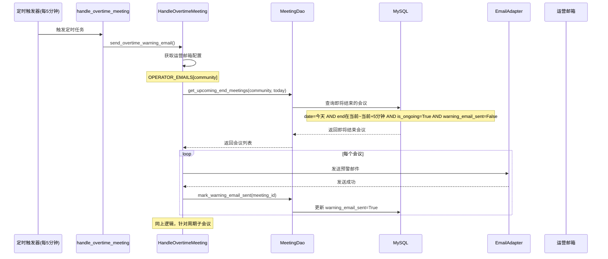
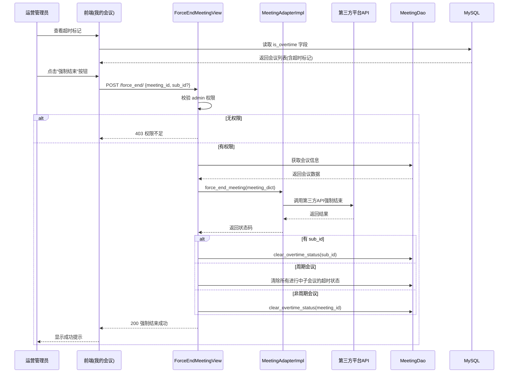

# #100 会议超时处理功能架构设计说明书 (Architecture Design Document)
---

## 1. 基础信息

* **需求链接**: https://github.com/opensourceways/backlog/issues/100
* **需求名称**: 会议超时处理功能
* **开发责任人**: Tom_zc
* **设计目标**: 在 meeting-platform 中实现会议超时检测、预警通知和运营强制结束功能，将会议优先权的决策交给运营，解决共享资源场景下的会议冲突问题。

---

## 2. 功能设计

> **说明**：描述系统的组件构成、职责划分及交互逻辑。

### 2.1 架构图

> 描述会议超时处理功能的系统组件交互关系。

**设计说明/归档：**



**关键设计说明：**
- 两个独立的定时任务：`handle_meeting` 负责状态同步，`handle_overtime_meeting` 负责超时检测和预警
- 每5分钟执行一次，与定会时间点（0/15/30/45）对齐
- 通过适配器模式支持多平台（Zoom、WeLink、腾讯会议）
- 前端通过读取 `is_overtime` 字段展示超时标记
- 运营通过 API 强制结束会议，而非系统自动强制结束

### 2.2 数据流图

> 描述会议超时处理的数据生命周期。

**设计说明/归档：**

#### 2.2.1 会议状态同步流程



#### 2.2.2 超时检测流程



#### 2.2.3 预警邮件发送流程



#### 2.2.4 运营强制结束会议流程



### 2.3 组件职责与接口

> 列出新增/修改的组件及其定义的 API 规范。

**设计说明/归档：**

#### 2.3.1 模型层变更 (models.py)

**Meeting 模型新增字段：**

| 字段名 | 类型 | 默认值 | 说明 |
|--------|------|--------|------|
| `is_ongoing` | BooleanField | False | 是否正在进行中 |
| `ongoing_updated_at` | DateTimeField | null | 状态更新时间 |
| `is_overtime` | BooleanField | False | 是否超时 |
| `overtime_detected_at` | DateTimeField | null | 超时检测时间 |
| `warning_email_sent` | BooleanField | False | 是否已发送预警邮件 |

**MeetingCycleSubMeeting 模型新增字段：**

| 字段名 | 类型 | 默认值 | 说明 |
|--------|------|--------|------|
| `is_ongoing` | BooleanField | False | 是否正在进行中 |
| `ongoing_updated_at` | DateTimeField | null | 状态更新时间 |
| `is_overtime` | BooleanField | False | 是否超时 |
| `overtime_detected_at` | DateTimeField | null | 超时检测时间 |
| `warning_email_sent` | BooleanField | False | 是否已发送预警邮件 |

#### 2.3.2 DAO层变更

**MeetingDao 新增方法：**

| 方法名 | 功能 | 参数 |
|--------|------|------|
| `get_ongoing_candidates(community, now)` | 获取需要同步状态的会议 | community, now |
| `update_status(meeting_id, is_ongoing)` | 更新会议状态 | meeting_id, is_ongoing |
| `get_overtime_meetings(community, today)` | 获取超时的非周期会议 | community, today |
| `update_overtime_status(meeting_id, is_overtime)` | 更新超时状态 | meeting_id, is_overtime |
| `get_upcoming_end_meetings(community, today, warning_minutes)` | 获取即将结束的会议 | community, today, warning_minutes=5 |
| `mark_warning_email_sent(meeting_id)` | 标记已发送预警邮件 | meeting_id |
| `reset_warning_email_status(meeting_id)` | 重置预警邮件状态 | meeting_id |
| `clear_overtime_status(meeting_id)` | 清除超时状态 | meeting_id |

**MeetingCycleSubMeetingDao 新增方法：**

| 方法名 | 功能 | 参数 |
|--------|------|------|
| `get_overtime_sub_meetings(community, today)` | 获取超时的周期子会议 | community, today |
| `update_status(sub_meeting_id, is_ongoing)` | 更新子会议状态 | sub_meeting_id, is_ongoing |
| `update_overtime_status(sub_meeting_id, is_overtime)` | 更新子会议超时状态 | sub_meeting_id, is_overtime |
| `get_upcoming_end_sub_meetings(community, today, warning_minutes)` | 获取即将结束的周期子会议 | community, today, warning_minutes=5 |
| `mark_warning_email_sent(sub_meeting_id)` | 标记已发送预警邮件 | sub_meeting_id |
| `reset_warning_email_status(sub_id)` | 重置预警邮件状态 | sub_id |
| `clear_overtime_status(sub_id)` | 清除子会议超时状态 | sub_id |

#### 2.3.3 定时任务实现

**handle_meeting.py（新增 sync_meeting_status 方法）：**

```python
# meeting_platform/apps/meeting/management/commands/handle_meeting.py

class HandleMeeting:
    def sync_meeting_status(self):
        """同步会议状态"""
        now = datetime.datetime.now()
        meetings = self.meeting_dao.get_ongoing_candidates(self.community, now)

        for meeting in meetings:
            try:
                meeting_dict = model_to_dict(meeting)

                # 非周期会议
                if not meeting.is_cycle:
                    previous_ongoing = meeting.is_ongoing
                    is_ongoing = self.meeting_adapter_impl.get_meeting_status(meeting_dict)
                    self.meeting_dao.update_status(meeting.id, is_ongoing)

                    # 如果会议从"未进行中"变为"进行中"，重置预警邮件状态
                    if not previous_ongoing and is_ongoing:
                        self.meeting_dao.reset_warning_email_status(meeting.id)
                    # 如果会议已结束，清除超时状态
                    if not is_ongoing and meeting.is_overtime:
                        self.meeting_dao.clear_overtime_status(meeting.id)
                else:
                    # 周期会议：查询每个子会议
                    sub_meetings = self._meeting_cycle_sub_dao.get_by_mid(meeting.mid)
                    for sub in sub_meetings:
                        # 只同步今天的子会议或正在进行中的子会议
                        # ... 子会议处理逻辑 ...
            except Exception as e:
                logger.error(f"[sync_meeting_status] meeting {meeting.mid} error: {e}")
```

**handle_overtime_meeting.py（新增独立任务）：**

```python
# meeting_platform/apps/meeting/management/commands/handle_overtime_meeting.py

class HandleOvertimeMeeting:
    """超时会议检测处理类"""

    def detect_overtime_meetings(self):
        """检测超时会议并更新标记"""
        now = datetime.datetime.now()
        today = now.strftime('%Y-%m-%d')

        # 检测非周期会议
        overtime_meetings = self.meeting_dao.get_overtime_meetings(self.community, today)
        for meeting in overtime_meetings:
            if not meeting.is_overtime:
                self.meeting_dao.update_overtime_status(meeting.id, True)

        # 检测周期会议子会议
        overtime_sub_meetings = self._meeting_cycle_sub_dao.get_overtime_sub_meetings(self.community, today)
        for sub_meeting in overtime_sub_meetings:
            if not sub_meeting.is_overtime:
                self._meeting_cycle_sub_dao.update_overtime_status(sub_meeting.id, True)

    def send_overtime_warning_email(self):
        """发送超时预警邮件（会议结束前5分钟）"""
        now = datetime.datetime.now()
        today = now.strftime('%Y-%m-%d')

        # 获取运营邮箱配置
        operator_emails = settings.OPERATOR_EMAILS.get(self.community, [])
        if not operator_emails:
            return

        # 获取即将结束的非周期会议
        upcoming_meetings = self.meeting_dao.get_upcoming_end_meetings(self.community, today)
        for meeting in upcoming_meetings:
            self._send_warning_email(meeting, operator_emails)

        # 获取即将结束的周期子会议
        upcoming_sub_meetings = self._meeting_cycle_sub_dao.get_upcoming_end_sub_meetings(self.community, today)
        for sub_meeting in upcoming_sub_meetings:
            self._send_warning_email(sub_meeting.meeting, operator_emails, sub_meeting)
```

#### 2.3.4 API层变更 (controller/inner.py)

**新增接口：**

| 接口路径 | 方法 | 功能 | 请求参数 |
|----------|------|------|----------|
| `/inner/v1/meeting/force_end/` | POST | 强制结束会议（统一接口） | `meeting_id`(必填), `sub_id`(可选) |

```python
# meeting_platform/apps/meeting/controller/inner.py

class ForceEndMeetingView(GenericAPIView):
    """强制结束会议（内部API）- 统一接口

    请求参数（POST body）：
    - 非周期会议: {"meeting_id": 123}
    - 周期子会议: {"meeting_id": 123, "sub_id": "xxx"}
    """
    serializer_class = EmptySerializers
    queryset = MeetingDao.get_queryset().filter(is_delete=0)

    @capture_my_validation_exception
    def post(self, request, *args, **kwargs):
        meeting_id = request.data.get('meeting_id')
        sub_id = request.data.get('sub_id')

        if not meeting_id:
            raise MyValidationError(RetCode.STATUS_PARAMETER_ERROR)

        meeting = self.queryset.filter(id=meeting_id).first()
        if not meeting:
            raise MyValidationError(RetCode.STATUS_PARAMETER_ERROR)

        meeting_adapter = MeetingAdapterImpl()
        meeting_dict = model_to_dict(meeting)

        if sub_id:
            # 强制结束周期子会议
            sub_meeting = MeetingCycleSubMeetingDao.get_all().filter(sub_id=sub_id).first()
            if not sub_meeting:
                raise MyValidationError(RetCode.STATUS_PARAMETER_ERROR)

            meeting_dict["sub_id"] = sub_id
            meeting_adapter.force_end_meeting(meeting_dict)
            MeetingCycleSubMeetingDao.clear_overtime_status(sub_id)

            return ret_json(data={"message": "Sub meeting force ended successfully"})
        else:
            # 强制结束非周期会议
            meeting_adapter.force_end_meeting(meeting_dict)

            if meeting.is_cycle:
                # 周期会议：清除所有正在进行中的子会议的超时状态
                sub_meetings = MeetingCycleSubMeetingDao.get_by_mid(meeting.mid)
                for sub in sub_meetings:
                    if sub.get('is_ongoing') or sub.get('is_overtime'):
                        MeetingCycleSubMeetingDao.clear_overtime_status(sub.get('sub_id'))
            else:
                MeetingDao.clear_overtime_status(meeting_id)

            return ret_json(data={"message": "Meeting force ended successfully"})
```

#### 2.3.5 配置说明

```python
# meeting_platform/settings/prod.py

# 运营团队邮箱配置（用于超时预警邮件）
# 格式：{"community_name": ["email1@example.com", "email2@example.com"]}
OPERATOR_EMAILS = VAULT_CONF.get("OPERATOR_EMAILS", {})
```

### 2.4 功能设计分解TASK清单

**设计说明/归档：**

**任务清单:**

| 任务 ID | 功能任务描述 | 责任人 |
|---------|-------------|--------|
| **TASK1** | 权限中心增加 admin 权限配置 | Tom_zc |
| **TASK2** | 模型层新增超时相关字段 | Tom_zc |
| **TASK3** | DAO层实现超时检测相关的数据访问方法 | Tom_zc |
| **TASK4** | 适配器层新增 force_end_meeting 和 get_meeting_status 方法 | Tom_zc |
| **TASK5** | 定时任务 handle_meeting.py 新增 sync_meeting_status 方法 | Tom_zc |
| **TASK6** | 新增独立定时任务 handle_overtime_meeting.py | Tom_zc |
| **TASK7** | API层实现强制结束会议接口 ForceEndMeetingView | Tom_zc |
| **TASK8** | 前端官网主页增加超时标记展示 | Tom_zc |
| **TASK9** | 前端我的会议增加超时标记和强制结束按钮 | Tom_zc |
| **TASK10** | 编写单元测试 | Tom_zc |

---

## 3. 非功能设计

### 3.1 安全与隐私设计评估和设计

> **注意**：仅当需求判定为 **`need_security`** 时，本章节为必填项。

> 关注点：防御能力与合规边界。

### 3.1.1 威胁分析 (Threat Modeling)

**设计说明/归档：**

会议超时处理功能涉及敏感操作（强制结束会议），以下是潜在威胁分析：

| 威胁类别 | 攻击场景描述 (Scenario) | 风险等级/评分 | 对应减缓措施 (Mitigation) |
|---------|------------------------|--------------|--------------------------|
| **权限提升** | 非授权用户尝试调用强制结束API | 高 | API层校验 admin 权限，返回403 |
| **信息泄露** | 攻击者通过API枚举获取会议状态 | 低 | 仅返回必要信息，不暴露敏感数据 |
| **拒绝服务** | 恶意频繁调用强制结束API | 中 | API限流保护 |
| **篡改** | 攻击者修改他人会议的超时状态 | 中 | 数据库字段受权限保护，仅admin可修改 |

### 3.1.2 安全设计实现 (Security Mechanisms)

**设计说明/归档：**

* **权限控制**：强制结束API仅限 admin 角色调用
* **API限流**：对强制结束API实施请求频率限制，防止恶意调用
* **审计日志**：记录所有强制结束操作的操作者、时间、目标会议，便于审计追溯
* **输入验证**：所有API参数进行严格校验，防止注入攻击

### 3.2 可靠性与韧性设计评估和设计（可选）

> **关注点**：极端情况下的生存与恢复能力。

**设计说明/归档：**

* **定时任务容错**：单个会议状态同步失败不影响其他会议处理，异常被捕获并记录日志
* **邮件发送容错**：预警邮件发送失败时记录错误日志，不影响其他流程
* **状态一致性**：强制结束后同步更新 `is_ongoing`、`is_overtime`、`warning_email_sent` 字段，确保数据一致性

### 3.3 可服务性与可观测性评估和设计（可选）

> **关注点**：排障效率与全生命周期管理，确保故障可感知、可定位、可修复。

**设计说明/归档：**

* **日志记录**：定时任务执行情况、API调用情况、异常情况均记录详细日志
* **监控指标**：建议添加以下监控指标：
  - 定时任务执行耗时
  - 超时会议数量
  - 预警邮件发送成功率
  - 强制结束API调用次数

---