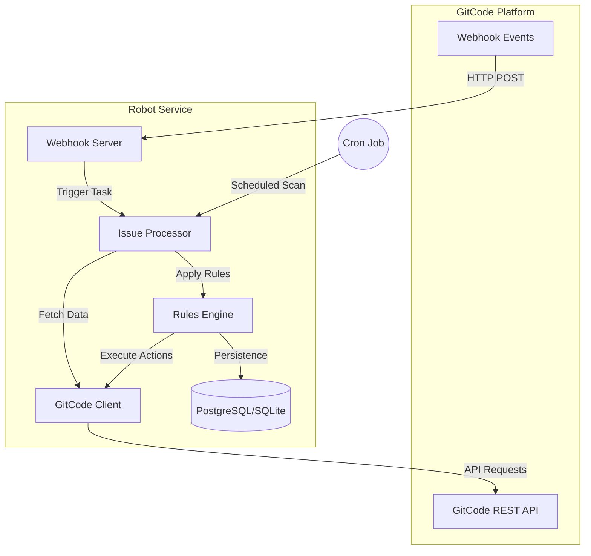
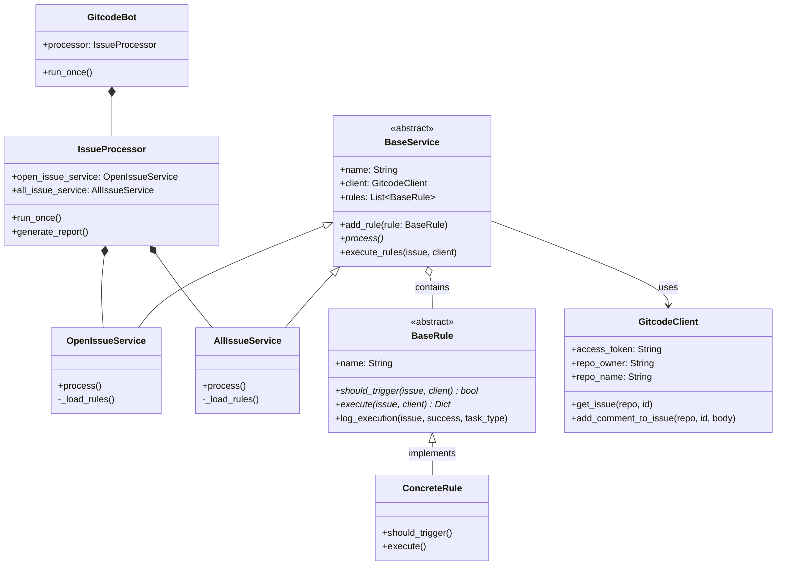

# GitCode Issue 自动化管理机器人架构设计说明书 (Architecture Design Document)

---

## 1. 基础信息

* **需求链接**: https://github.com/opensourceways/backlog/issues/61
* **需求名称**: GitCode Issue 自动化管理机器人
* **开发责任人**: [drizzlezyk](https://github.com/drizzlezyk)
* **设计目标**: 通过自动化技术手段（定时扫描 + Webhook 实时触发）实现社区 Issue 的全生命周期管理，包括自动打标、超期提醒、自动关闭及状态刷新，旨在降低人工维护成本，提升社区响应效率。

---

## 2. 功能设计

### 2.1 架构图

系统的核心组件及交互关系如下：

**设计说明：**
- **Webhook Server**: 负责接收 GitCode 的实时事件（如 Issue 创建、评论等），确保高优先级的任务能被即时处理。
- **Issue Processor**: 任务调度中心，支持一次性运行或周期性扫描仓库中的 Issue。
- **Rules Engine**: 业务逻辑的核心，采用策略模式实现，每个规则（如 `ResolveLabelRule`）独立负责特定的业务逻辑。
- **GitCode Client**: 统一的 API 封装层，处理请求认证、异常重试和数据模型转换。
- **Database**: 存储 Issue 的中间状态（如最后一次提醒时间），保证规则判定的准确性和幂等性。

### 2.2 类图 (Class Diagram)

本系统的核心类及其关系设计如下：

### 2.3 数据流图

核心业务数据的处理流程（威胁建模参考点）：

1. **输入阶段**: 
   - 外部事件输入（Webhook）带有签名校验。
   - 定时任务从 GitCode API 拉取 Issue 列表。
2. **判定阶段**: 
   - 规则引擎结合 Issue 当前属性（标签、评论、状态）及数据库中的历史记录进行多维度判定。
3. **执行阶段**: 
   - 机器人通过 API 执行写操作（评论、打标、关闭）。
   - 同步更新本地数据库中的状态快照。

### 2.3 设计模式与逻辑抽象

本系统在架构设计上采用了多种经典设计模式，以实现业务逻辑的解耦和高度可扩展性：

- **策略模式 (Strategy Pattern)**：
  - **逻辑设计**：将每种 Issue 处理场景（如：自动打标、超期预警、自动关闭）抽象为独立的“规则策略”。系统定义统一的规则执行接口，不同的业务逻辑只需实现该接口即可接入系统。
  - **优势**：新增业务场景时，只需扩展新的规则策略，无需修改核心调度引擎，符合开闭原则。
- **模板方法模式 (Template Method Pattern)**：
  - **逻辑设计**：定义一套标准的服务执行模板，规定了“获取数据 -> 遍历数据 -> 匹配规则 -> 执行动作 -> 记录结果”的标准流程。具体的子服务（如针对 Open 状态的 Issue 服务）仅需提供特定的数据获取方式。
  - **优势**：确保了所有自动化处理流程的一致性，复用了核心判定的骨架逻辑。
- **简单工厂模式 (Simple Factory Pattern)**：
  - **逻辑设计**：建立规则实例化的管理机制。系统启动时，根据配置文件中的“启用列表”，动态地从规则库中创建并加载对应的规则实例。
  - **优势**：实现了功能开关的灵活配置，业务逻辑的加载与具体执行过程完全解耦。
- **外观模式 (Facade Pattern)**：
  - **逻辑设计**：为外部调用者（如主程序、定时器）提供一个统一的高层接口。该接口封装了内部多个服务模块（Open 服务、All 服务等）的复杂交互逻辑。
  - **优势**：简化了外部系统的调用难度，屏蔽了内部子系统的实现细节。
- **单例模式 (Singleton Pattern)**：
  - **逻辑设计**：对于全局共享的资源（如数据库连接池、全局配置中心），在设计上确保其在整个应用生命周期内仅存在一个全局访问点。
  - **优势**：保证了全局状态的一致性，并优化了系统资源的利用率。

### 2.4 组件职责与接口

| 组件名称 | 主要职责 | 关键接口/方法 |
| :--- | :--- | :--- |
| **GitcodeBot** | 服务入口，管理生命周期 | `run_once()`, `start_webhook_server()` |
| **IssueProcessor** | 流程编排与任务调度 | `process_issue()`, `run_once()` |
| **BaseRule** | 业务规则基类，定义标准逻辑 | `should_trigger()`, `execute()` |
| **GitcodeClient** | GitCode API 通讯层 | `add_comment_to_issue()`, `update_issue_labels()` |
| **DatabaseManager** | 数据库 ORM 管理 | `get_session()`, `update_issue_state()` |

### 2.5 UX 设计

- **透明化反馈**: 机器人每次执行关键操作（如标记 `stale` 或关闭 Issue）都会在 Issue 下方发布详细的评论，告知用户原因及如何撤销该操作。
- **用户指令支持**: 支持用户通过特定评论（如 `/label remove stale`）与机器人交互，覆盖机器人的自动判定，增加灵活性。

### 2.6 SOD 设计

- **权限最小化**: 机器人 Token 仅需具备操作 Issue 和 Merge Request 的权限，不赋予管理员或其他高危权限。
- **审计追踪**: 所有机器人操作均记录在 `IssueState` 表中，并输出到标准日志流，支持追溯。

### 2.7 功能设计分解 TASK 清单

| 任务 ID | 可服务性任务描述 | 责任人 |
| :--- | :--- | :--- |
| **TASK1** | 实现核心业务规则（Resolve, Stale, Auto-close） | 开发团队 |
| **TASK2** | 封装 GitCode 客户端，支持多仓库操作 | 开发团队 |
| **TASK3** | 编写 20% 以上的单元测试覆盖核心逻辑 | 开发团队 |
| **TASK4** | 部署 Webhook 服务并完成内网穿透/域名映射 | 运维人员 |

---

## 3. 非功能设计

### 3.1 安全与隐私设计评估

#### 3.1.1 威胁分析 (Threat Modeling)

| 威胁类别 | 攻击场景描述 | 风险等级 | 对应减缓措施 |
| :--- | :--- | :--- | :--- |
| **篡改/伪造** | 伪造 Webhook 回调请求触发机器人异常操作 | 高 | 引入 Webhook Secret 校验 (HMAC-SHA256) |
| **信息泄露** | 配置文件或日志中泄露 API Token | 高 | 使用环境变量注入配置，日志脱敏处理 |
| **拒绝服务** | 恶意构造大量 Issue 评论触发 API 调用风暴 | 中 | 规则引擎引入执行频率限制和幂等性校验 |

#### 3.1.2 安全设计实现

- **身份认证**: 所有 API 调用必须携带合法的 `Private-Token`。
- **凭证管理**: 严禁硬编码 Token，统一通过 `config.yaml` 或环境变量管理。
- **输入校验**: 对 Issue 标题前缀及评论指令进行正则强校验，防止注入攻击。

### 3.2 可靠性与韧性设计

- **幂等设计**: 在执行 `execute()` 前再次校验 `should_trigger()`，并根据数据库中的 `last_action_time` 避免重复执行。
- **异常捕获**: 核心 Processor 具备全局异常捕获能力，确保单条 Issue 处理失败不影响整体扫描任务。

### 3.3 可服务性与可观测性

- **日志审计**: 详细记录每次规则判定的输入参数和输出结果。
- **健康检查**: Webhook Server 提供 `/health` 接口用于探活。
- **错误码**: 统一 API 调用错误处理，输出 GitCode 原始错误信息便于排障。

### 3.4 性能与伸缩性

- **并发模型**: `IssueProcessor` 采用顺序处理模型，对于大规模仓库可扩展为生产者-消费者模型。
- **连接池**: 数据库访问使用 SQLAlchemy 连接池，API 请求使用 `requests.Session` 复用连接。
