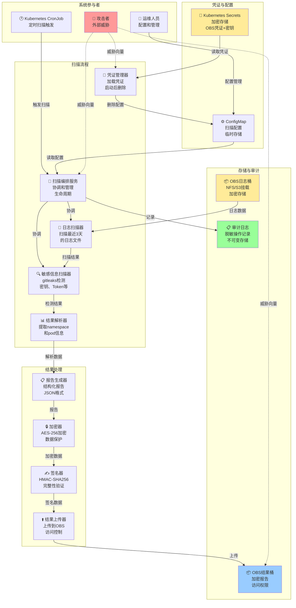
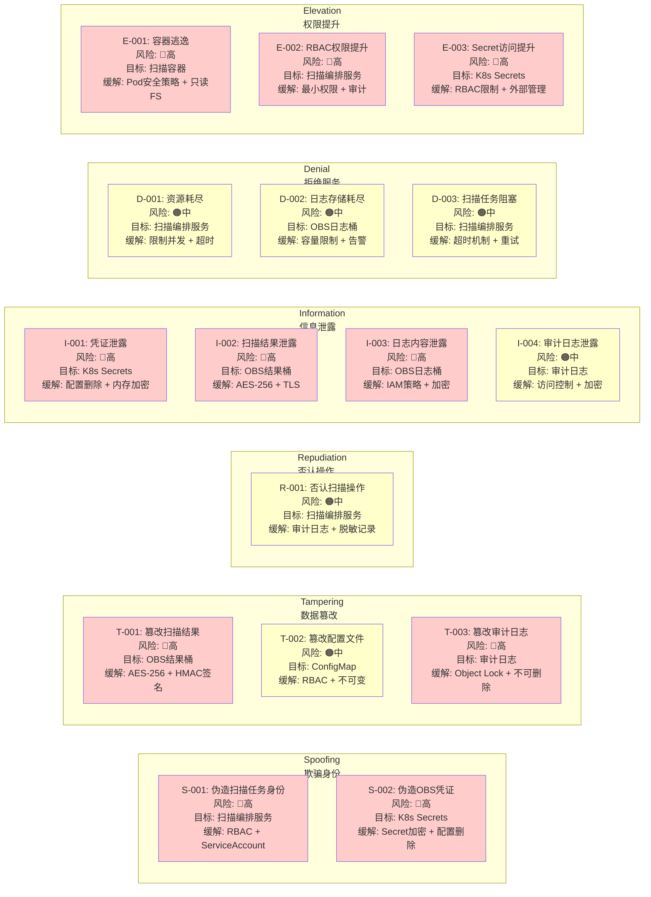
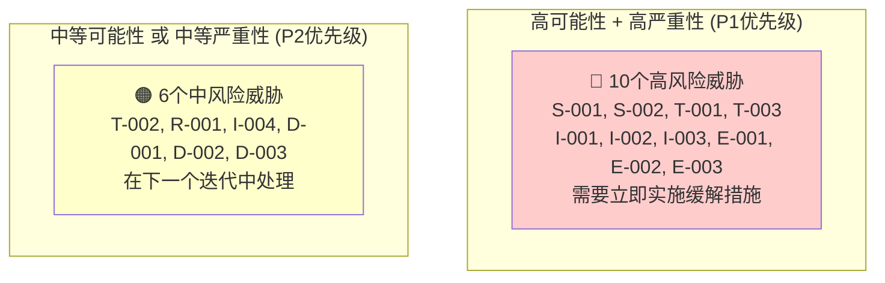
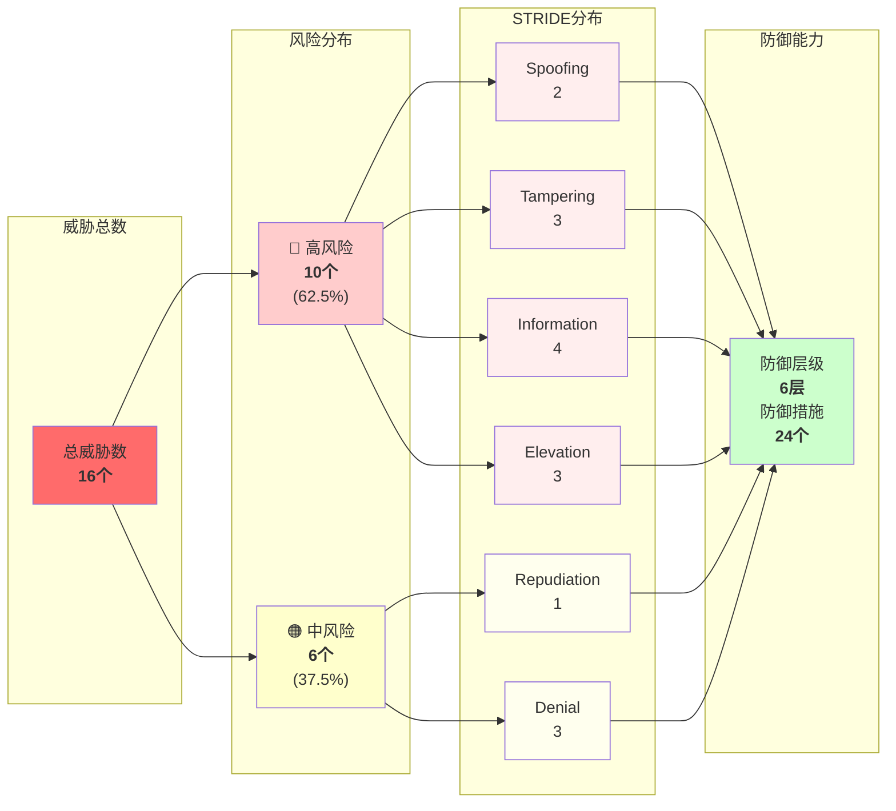

# #67 LTS日志敏感信息扫描 架构设计说明书 (Architecture Design Document)

---

## 1. 基础信息

* **需求链接**: **[#67 支持扫描各个云账号LTS服务运行日志敏感信息](https://github.com/opensourceways/backlog/issues/67)**
* **需求名称**: **支持扫描各个云账号LTS服务运行日志敏感信息**
* **开发责任人**: **zkhzkhz**
* **设计目标**: **通过定期自动化扫描挂载的OBS日志目录，使用gitleaks工具检测敏感信息，生成结构化报告定位问题namespace和pod，同时确保扫描过程和结果本身的安全性（凭证保护、结果加密、访问控制）。凭证通过配置文件注入，启动后立即删除。**

---

## 2. 功能设计

> **说明**：描述系统的组件构成、职责划分及交互逻辑。

### 2.1 架构图

> 此处建议插入架构拓扑系统组件图或时序图,描述组件间的交互关系。

**设计说明/归档：**


**架构说明：**

- **定时任务层**：使用APScheduler或Kubernetes CronJob定期触发扫描任务（月度或按需）
- **扫描编排层**：主控制器，协调各个模块的执行流程，处理错误和重试
- **凭证管理层**：从配置文件读取OBS凭证，启动后立即删除配置文件，避免硬编码
- **多云账号OBS层**：各云账号的OBS桶通过NFS/S3挂载到Pod，存储LTS归档的日志文件
- **扫描处理层**：
  - 日志扫描器：直接扫描挂载目录中最近三天的日志文件
  - 敏感信息扫描器：集成gitleaks工具，检测密钥、Token、凭证等
  - 结果解析器：从扫描结果中提取namespace和pod信息
- **报告生成层**：生成JSON格式的结构化报告，使用AES-256加密
- **结果存储层**：将加密报告上传到OBS结果桶，设置严格的访问权限
- **审计日志层**：记录扫描过程（脱敏），便于事后审计和问题追踪

### 2.2 数据流图

> 此处建议插入数据流图，描述核心业务数据的生命周期，即威胁建模。

**设计说明/归档：**


**数据流说明：**

1. **输入阶段**：读取扫描配置（云账号、时间范围）和OBS凭证（从配置文件）
2. **处理阶段**：
   - 扫描：直接扫描挂载目录中最近三天的日志文件
   - 检测：使用gitleaks检测敏感信息
   - 解析：从扫描结果中提取namespace和pod
   - 富化：添加时间戳、日志来源等元数据
3. **输出阶段**：
   - 生成JSON格式报告
   - 使用AES-256加密
   - 上传到OBS结果桶（设置严格访问权限）
4. **清理阶段**：启动后立即删除凭证配置文件（覆写后删除）
5. **审计阶段**：记录所有操作的脱敏日志，不记录完整的敏感信息

### 2.3 组件职责与接口

> 列出新增/修改的组件及其定义的 API 规范。

**设计说明/归档：**

| 组件名称 | 职责 | 输入 | 输出 | 接口/方法 |
|---------|------|------|------|---------|
| **扫描编排服务** | 协调整个扫描流程，管理生命周期 | 扫描配置(JSON) | 扫描状态、错误信息 | `start_scan(config)`, `get_status()`, `cancel_scan()` |
| **凭证管理器** | 从配置文件读取凭证，启动后删除配置文件 | 配置文件路径 | OBS凭证(AK/SK) | `load_credentials()`, `cleanup_credentials()` |
| **日志扫描器** | 扫描挂载目录中的日志文件，过滤最近三天 | 挂载目录路径、时间范围 | 日志文件列表 | `scan_directory(path, time_range)`, `get_log_files()` |
| **敏感信息扫描器** | 调用gitleaks进行敏感信息检测 | 日志文件路径 | 扫描结果(JSON.GZ) | `scan_files(file_paths)`, `get_scan_result()` |
| **结果解析器** | 从扫描结果中提取namespace和pod信息 | 扫描结果(JSON.GZ) | 结构化报告(JSON) | `parse_results(scan_result)`, `extract_metadata()` |
| **报告生成器** | 生成最终的结构化报告 | 解析后的数据 | 报告JSON | `generate_report(parsed_data)` |
| **加密器** | 使用AES-256加密报告 | 报告JSON、加密密钥 | 加密报告(二进制) | `encrypt_report(report, key)`, `decrypt_report(encrypted, key)` |
| **结果上传器** | 将加密报告上传到OBS结果桶 | 加密报告、目标路径 | 上传状态 | `upload_report(encrypted_data, target_path)` |
| **审计日志记录器** | 记录扫描过程的脱敏日志 | 操作事件 | 审计日志 | `log_event(event_type, details)` |

### 2.4 UX设计

> 设计目标：确保功能不仅"可用"，而且"好用"，降低开发者的认知负担和运维人员的误操作风险。

**设计说明/归档：**

不涉及。原因：本需求是后台定时扫描任务，无用户交互界面。运维人员通过查看OBS中的扫描报告了解结果，通过配置文件或环境变量配置扫描参数。

### 2.5 SOD设计

> 设计目标：通过维护SOD权限设计文档，确保权限设计可审计、可复用、可跨服务重用。

**设计说明/归档：**

不涉及。原因：本需求是自动化扫描任务，无复杂的权限分离需求。扫描任务以服务账号运行，具有OBS读权限和结果桶写权限。

### 2.6 功能设计分解TASK清单

**设计说明/归档：**

**任务清单:**

| 任务 ID | 功能任务描述 | 责任人 |
|--------|-----------|------|
| **TASK1** | 实现扫描编排服务框架，支持定时触发和手动触发，包含错误处理和重试机制 | zkhzkhz |
| **TASK2** | 实现凭证管理模块，从配置文件读取OBS凭证，启动后立即删除配置文件（覆写后删除） | zkhzkhz |
| **TASK3** | 实现日志扫描器，扫描挂载目录中最近三天的日志文件，支持多云账号 | zkhzkhz |
| **TASK4** | 集成gitleaks工具，实现敏感信息扫描和结果解析 | zkhzkhz |
| **TASK5** | 实现结果解析器，从扫描结果中提取namespace和pod信息，生成结构化报告 | zkhzkhz |
| **TASK6** | 实现报告加密和上传功能，使用AES-256加密，上传到OBS结果桶 | zkhzkhz |

### 2.7 部署架构

**设计说明/归档：**


**部署说明：**

- **CronJob**：Kubernetes原生定时任务，按月度或按需触发扫描
- **Pod**：扫描容器，以非Root用户运行，资源限制已设置
- **Secret**：存储凭证配置文件路径和加密密钥，由Kubernetes加密存储
- **ConfigMap**：存储扫描配置（云账号列表、时间范围等）
- **OBS挂载**：通过NFS或S3挂载各云账号的OBS日志目录到Pod（`/mnt/obs/`）
- **凭证配置文件**：启动时从Secret读取，启动后立即删除（覆写后删除）
- **日志收集**：脱敏处理后发送到日志系统，保留90天
- **监控告警**：实时监控扫描状态，异常时告警

---

## 3. 非功能设计

### 3.1 安全与隐私设计评估和设计

> **注意**：仅当需求判定为 **`need_security`** 时，本章节为必填项。

> 关注点：防御能力与合规边界。

### 3.1.1 威胁分析 (Threat Modeling)

> 基于 **STRIDE** 或类似模型，识别本项目可能面临的安全威胁。

**设计说明/归档：**

| 威胁类别 | 攻击场景描述 (Scenario) | 风险等级 | 对应减缓措施 (Mitigation) |
|---------|----------------------|--------|------------------------|
| **信息泄露** | 攻击者通过网络嗅探或日志文件访问，获取OBS凭证(AK/SK) | 高 | 凭证存储在Kubernetes Secret或云密钥管理服务，不硬编码；传输使用TLS 1.2+加密 |
| **信息泄露** | 扫描结果中包含敏感信息（密钥、Token等），被未授权访问 | 高 | 扫描报告使用AES-256加密存储；OBS结果桶设置严格的访问权限（仅授权用户可读） |
| **信息泄露** | 审计日志中记录了完整的敏感信息，导致日志泄露 | 中 | 审计日志实现脱敏，不记录完整的敏感信息内容，仅记录操作类型和时间戳 |
| **篡改/伪造** | 攻击者篡改扫描结果报告，隐藏真实的敏感信息问题 | 高 | 报告使用HMAC签名，确保完整性；存储在OBS时设置版本控制和不可修改属性 |
| **拒绝服务** | 攻击者通过大量扫描请求或恶意日志文件，导致扫描服务过载 | 中 | 限制并发扫描任务数量；对日志文件大小设置上限；实现扫描超时机制 |
| **权限提升** | 扫描任务以过高权限运行，被利用进行横向移动 | 中 | 扫描任务以最小权限原则运行，仅具有OBS读权限和结果桶写权限；容器以非Root用户运行 |
| **隐私泄露** | 扫描过程中，日志文件被临时存储在不安全的位置，导致敏感信息泄露 | 中 | 临时文件存储在加密的本地存储或内存中；扫描完成后立即删除临时文件 |

**威胁模型可视化：**


### 3.1.2 安全设计实现 (Security Mechanisms)

> **参考**：威胁模型评估与安全设计实现

**设计说明/归档：**

**凭证管理：**
- ✅ 严禁硬编码：所有OBS凭证(AK/SK)存储在Kubernetes Secret或云密钥管理服务
- ✅ 密钥轮转：支持定期自动轮转凭证，通过环境变量或配置文件更新
- ✅ 最小权限：OBS凭证仅授予特定桶的读权限和结果桶的写权限

**凭证注入与清理机制：**

凭证通过以下流程安全注入和清理：

1. **启动前注入**：
   - Kubernetes Secret挂载到Pod的临时目录（`/tmp/credentials/`）
   - 或从Vault/密钥管理服务读取凭证写入临时配置文件
   - 配置文件权限设置为 `600`（仅所有者可读）

2. **启动时加载**：
   ```python
   import os
   import json
   from pathlib import Path

   def load_credentials():
       """从配置文件加载凭证"""
       cred_file = Path('/tmp/credentials/obs-credentials.json')

       if not cred_file.exists():
           raise ValueError('Credentials file not found')

       # 读取凭证
       with open(cred_file, 'r') as f:
           creds = json.load(f)

       # 验证凭证格式
       required_keys = ['access_key', 'secret_key', 'endpoint']
       if not all(k in creds for k in required_keys):
           raise ValueError('Invalid credentials format')

       return creds

   # 应用启动时加载
   CREDENTIALS = load_credentials()
   ```

3. **启动后清理**：
   - 应用启动成功后，立即删除配置文件
   - 应用启动失败时，也删除配置文件（防止泄露）
   - 使用安全删除方式（覆写后删除）

   ```python
   import os
   import shutil
   from pathlib import Path

   def cleanup_credentials():
       """安全删除凭证配置文件"""
       cred_file = Path('/tmp/credentials/obs-credentials.json')

       if cred_file.exists():
           try:
               # 方式1：覆写后删除（更安全）
               with open(cred_file, 'wb') as f:
                   f.write(os.urandom(cred_file.stat().st_size))
               cred_file.unlink()

               # 方式2：直接删除（快速）
               # cred_file.unlink()

               print(f"Credentials file cleaned: {cred_file}")
           except Exception as e:
               print(f"Warning: Failed to clean credentials: {e}")

   # 应用启动成功后立即清理
   try:
       CREDENTIALS = load_credentials()
       cleanup_credentials()  # 立即清理
       # 继续应用逻辑
   except Exception as e:
       cleanup_credentials()  # 失败时也清理
       raise
   ```

4. **内存中的凭证管理**：
   - 凭证加载到内存后，不再从磁盘读取
   - 使用时通过变量引用，避免重复读取文件
   - 应用关闭时，内存中的凭证自动释放

5. **Kubernetes Pod配置示例**：
   ```yaml
   apiVersion: v1
   kind: Pod
   metadata:
     name: log-scanner
   spec:
     serviceAccountName: log-scanner
     containers:
     - name: scanner
       image: log-scanner:latest
       env:
       - name: CRED_FILE_PATH
         value: /tmp/credentials/obs-credentials.json
       volumeMounts:
       - name: credentials
         mountPath: /tmp/credentials
         readOnly: true
       securityContext:
         runAsNonRoot: true
         runAsUser: 1000
         readOnlyRootFilesystem: true
       resources:
         limits:
           memory: "256Mi"
           cpu: "500m"
     volumes:
     - name: credentials
       secret:
         secretName: obs-credentials
         defaultMode: 0600  # 仅所有者可读
   ```

**数据安全：**
- ✅ 传输加密：所有与OBS的通信使用TLS 1.2+
- ✅ 静态加密：扫描报告使用AES-256加密存储在OBS
- ✅ 完整性保护：报告使用HMAC签名，防止篡改

**运行时隔离：**
- ✅ 非Root运行：扫描容器以非Root用户运行
- ✅ 只读文件系统：容器根文件系统设置为只读，仅允许写入临时目录
- ✅ 资源限制：设置CPU和内存限制，防止资源耗尽

**日志审计：**
- ✅ 脱敏日志：审计日志不记录完整的敏感信息，仅记录操作类型、时间戳、云账号ID
- ✅ 日志保留：审计日志保留至少90天，便于事后审计
- ✅ 日志加密：审计日志也使用加密存储

**访问控制：**
- ✅ OBS结果桶权限：仅授予特定的IAM角色读权限
- ✅ 报告加密密钥：密钥存储在密钥管理服务，不在代码中硬编码
- ✅ 审计日志访问：仅授予安全团队和运维团队查看权限

### 3.1.3 安全任务分解

**任务清单:**

| 任务 ID | 安全任务描述 | 责任人 |
|--------|-----------|------|
| **SEC-TASK1** | 设计和实现凭证管理模块，集成Kubernetes Secret或云密钥管理服务，支持凭证轮转 | zkhzkhz |
| **SEC-TASK2** | 实现报告加密和HMAC签名机制，使用AES-256和SHA-256 | zkhzkhz |
| **SEC-TASK3** | 配置OBS结果桶的访问权限和版本控制，确保只有授权用户可访问 | zkhzkhz |
| **SEC-TASK4** | 实现审计日志脱敏机制，确保日志中不记录完整的敏感信息 | zkhzkhz |
| **SEC-TASK5** | 配置容器安全策略，包括非Root运行、只读文件系统、资源限制 | zkhzkhz |
| **SEC-TASK6** | 进行安全测试和渗透测试，验证凭证管理、加密、访问控制的有效性 | zkhzkhz |

### 3.1.4 OWASP威胁建模分析

> **说明**：使用OWASP Threat Dragon方法论进行全面的威胁分析，采用STRIDE威胁分类模型和数据流图（DFD）方法。

#### 威胁建模项目文件

**项目文件**：
- **PlantUML威胁建模**: [THREAT_MODELING_PLANTUML.md](./THREAT_MODELING_PLANTUML.md) ⭐ **主要文档**
- **Mermaid图表版本**: [THREAT_MODELING_DIAGRAMS.md](./THREAT_MODELING_DIAGRAMS.md)
- **详细导入指南**: [IMPORT_INSTRUCTIONS.md](./IMPORT_INSTRUCTIONS.md)
- **工具**: [OWASP Threat Dragon Online](https://www.threatdragon.com/#/dashboard)

---

#### 1. DFD数据流图 - 系统架构与威胁建模

系统级的数据流图，包括外部实体、处理实体、存储实体、数据流和信任边界。

**PlantUML DFD图**（详见 [THREAT_MODELING_PLANTUML.md](./THREAT_MODELING_PLANTUML.md) - 第1节）

**关键元素**：

| 元素类型 | 数量 | 描述 |
|---------|------|------|
| **外部实体(Actors)** | 3个 | Kubernetes CronJob、运维人员、攻击者 |
| **处理实体(Processes)** | 9个 | P1-P9：扫描编排、凭证管理、日志扫描、敏感检测等 |
| **存储实体(DataStores)** | 5个 | D1-D5：K8s Secrets、ConfigMap、OBS日志桶、OBS结果桶、审计日志 |
| **数据流(Flows)** | 16条 | D1-D16：完整的数据流转链路 |
| **信任边界** | 2个 | Kubernetes集群 + OBS存储 |

**威胁向量**：
- 攻击者 -.-> 扫描编排服务(P1)
- 攻击者 -.-> 凭证管理器(P2)
- 攻击者 -.-> OBS结果桶(D4)
- 攻击者 -.-> Kubernetes Secrets(D1)

---

#### 2. STRIDE威胁分类与分析

使用STRIDE威胁建模方法，完整覆盖6个威胁类别的16个具体威胁。

**PlantUML STRIDE矩阵**（详见 [THREAT_MODELING_PLANTUML.md](./THREAT_MODELING_PLANTUML.md) - 第2节）

**STRIDE覆盖**：

| 威胁类别 | 英文名称 | 中文含义 | 威胁数 | 高风险 |
|---------|---------|---------|--------|--------|
| **S** | Spoofing | 欺骗身份 | 2个 | 2个 🔴 |
| **T** | Tampering | 数据篡改 | 3个 | 2个 🔴 + 1个 🟠 |
| **R** | Repudiation | 否认操作 | 1个 | 1个 🟠 |
| **I** | Information | 信息泄露 | 4个 | 3个 🔴 + 1个 🟠 |
| **D** | Denial | 拒绝服务 | 3个 | 3个 🟠 |
| **E** | Elevation | 权限提升 | 3个 | 3个 🔴 |
| **总计** | **STRIDE** | **全覆盖** | **16个** | **10高 + 6中** |

**具体威胁清单**：

##### Spoofing（欺骗身份）- 2个威胁
| ID | 威胁名称 | 风险 | 目标 | 攻击场景 | 缓解措施 |
|----|---------|------|------|---------|---------|
| S-001 | 伪造扫描任务身份 | 🔴高 | P1扫描编排 | 攻击者伪造CronJob注入恶意任务 | RBAC + ServiceAccount |
| S-002 | 伪造OBS凭证 | 🔴高 | D1 K8s Secrets | 攻击者盗取凭证后冒用 | Secret加密 + 配置删除 |

##### Tampering（数据篡改）- 3个威胁
| ID | 威胁名称 | 风险 | 目标 | 攻击场景 | 缓解措施 |
|----|---------|------|------|---------|---------|
| T-001 | 篡改扫描结果 | 🔴高 | D4 OBS结果桶 | 篡改报告隐藏敏感发现 | AES-256 + HMAC签名 |
| T-002 | 篡改配置文件 | 🟠中 | D2 ConfigMap | 修改扫描参数改变范围 | RBAC + 不可变ConfigMap |
| T-003 | 篡改审计日志 | 🔴高 | D5 审计日志 | 删除日志掩盖痕迹 | Object Lock + 不可删除 |

##### Repudiation（否认操作）- 1个威胁
| ID | 威胁名称 | 风险 | 目标 | 攻击场景 | 缓解措施 |
|----|---------|------|------|---------|---------|
| R-001 | 否认扫描操作 | 🟠中 | P1扫描编排 | 否认执行过扫描或修改 | K8s审计日志 + 脱敏记录 |

##### Information Disclosure（信息泄露）- 4个威胁
| ID | 威胁名称 | 风险 | 目标 | 攻击场景 | 缓解措施 |
|----|---------|------|------|---------|---------|
| I-001 | 凭证泄露 | 🔴高 | D1 K8s Secrets | 从日志或内存获取凭证 | 配置删除 + 内存加密 |
| I-002 | 扫描结果泄露 | 🔴高 | D4 OBS结果桶 | 访问报告获取敏感位置 | AES-256 + TLS 1.3 |
| I-003 | 日志内容泄露 | 🔴高 | D3 OBS日志桶 | 直接访问原始敏感日志 | IAM策略 + 加密 |
| I-004 | 审计日志泄露 | 🟠中 | D5 审计日志 | 读取脱敏日志推断行为 | 访问控制 + 加密 |

##### Denial of Service（拒绝服务）- 3个威胁
| ID | 威胁名称 | 风险 | 目标 | 攻击场景 | 缓解措施 |
|----|---------|------|------|---------|---------|
| D-001 | 资源耗尽 | 🟠中 | P1扫描编排 | 提交大量任务消耗资源 | 并发限制 + 超时 |
| D-002 | 日志存储耗尽 | 🟠中 | D3 OBS日志桶 | 填充OBS导致存储溢出 | 容量限制 + 告警 |
| D-003 | 扫描任务阻塞 | 🟠中 | P1扫描编排 | 注入恶意日志导致阻塞 | 超时机制 + 重试 |

##### Elevation of Privilege（权限提升）- 3个威胁
| ID | 威胁名称 | 风险 | 目标 | 攻击场景 | 缓解措施 |
|----|---------|------|------|---------|---------|
| E-001 | 容器逃逸 | 🔴高 | P3日志扫描器 | 利用容器漏洞逃逸 | Pod安全策略 + 只读FS |
| E-002 | RBAC权限提升 | 🔴高 | P1扫描编排 | 通过RBAC链提升权限 | 最小权限 + 定期审计 |
| E-003 | Secret访问提升 | 🔴高 | D1 K8s Secrets | 通过SA权限链提升 | RBAC细粒度 + 外部管理 |

---

#### 3. 威胁风险评估矩阵

**PlantUML风险评估**（详见 [THREAT_MODELING_PLANTUML.md](./THREAT_MODELING_PLANTUML.md) - 第3节）

| 优先级 | 威胁数 | 风险类型 | 处理时间 | 威胁ID列表 |
|--------|--------|---------|---------|-----------|
| **P1** | 10个 | 高可能性 + 高严重性 | 立即处理 | S-001, S-002, T-001, T-003, I-001, I-002, I-003, E-001, E-002, E-003 |
| **P2** | 6个 | 中等可能性或中等严重性 | 后续迭代 | T-002, R-001, I-004, D-001, D-002, D-003 |

---

#### 4. 防御分层架构（6层纵深防御）

**PlantUML防御层级**（详见 [THREAT_MODELING_PLANTUML.md](./THREAT_MODELING_PLANTUML.md) - 第4节）

| 防御层 | 防御措施 | 关键技术 | 防御威胁 | 验证方法 |
|--------|---------|---------|---------|---------|
| **Layer 1** | 身份与访问控制 | Kubernetes RBAC<br/>ServiceAccount验证<br/>Secret加密<br/>Pod安全策略 | S-001, S-002, E-002, E-003 | RBAC权限测试 |
| **Layer 2** | 数据保护与加密 | AES-256加密<br/>HMAC-SHA256签名<br/>TLS 1.3传输<br/>OBS SSE-KMS加密 | T-001, I-001, I-002, I-003, I-004 | 签名验证测试 |
| **Layer 3** | 配置与凭证管理 | 配置文件启动后删除<br/>凭证30天轮换<br/>临时STS Token<br/>不可变ConfigMap | I-001, T-002 | 凭证轮转测试 |
| **Layer 4** | 审计与监控 | Kubernetes审计日志<br/>脱敏日志记录<br/>不可变存储<br/>实时告警 | R-001, T-003, I-004 | 日志记录验证 |
| **Layer 5** | 网络与容器隔离 | NetworkPolicy网络隔离<br/>只读文件系统<br/>非Root用户<br/>资源限制 | E-001, D-001, D-002, D-003 | seccomp/AppArmor测试 |
| **Layer 6** | 存储与访问控制 | OBS桶策略<br/>IAM细粒度权限<br/>版本控制<br/>MFA删除保护 | I-002, I-003, T-001, T-003 | IAM访问测试 |

**防御覆盖分析**：
- 总缓解措施：**24个**
- 威胁覆盖率：**100%** (16/16)
- 平均每个威胁：**1.5个缓解措施**
- 纵深防御：**任意单层失效时其他层承接**

---

#### 5. 威胁建模关键指标

```
总体统计：
├─ 威胁总数：16个 (100% STRIDE覆盖)
├─ 高风险(P1)：10个 (62.5%)
├─ 中风险(P2)：6个 (37.5%)
├─ 防御层级：6层 (纵深设计)
├─ 缓解措施：24个 (全面覆盖)
└─ 实施成本：高 + 中等收益

DFD关键元素：
├─ 外部实体：3个 (CronJob/运维/攻击者)
├─ 处理实体：9个 (P1-P9)
├─ 存储实体：5个 (D1-D5)
├─ 数据流：16条 (D1-D16)
└─ 信任边界：2个 (K8s + OBS)

STRIDE分布：
├─ Spoofing：2个 (都是P1)
├─ Tampering：3个 (2×P1 + 1×P2)
├─ Repudiation：1个 (P2)
├─ Information：4个 (3×P1 + 1×P2)
├─ Denial：3个 (都是P2)
└─ Elevation：3个 (都是P1)
```

---

#### 6. 实施路线图

**第1阶段：P1高风险威胁（立即处理）**
```
□ Layer 1: 配置Kubernetes RBAC和ServiceAccount
□ Layer 2: 实施AES-256加密和TLS 1.3
□ Layer 3: 配置凭证自动删除和轮换
□ Layer 4: 启用Kubernetes审计日志
□ Layer 5: 配置Pod安全策略和只读文件系统
□ Layer 6: 配置OBS IAM策略和Object Lock
```

**第2阶段：P2中风险威胁（后续迭代）**
```
□ 增强监控和告警机制
□ 定期进行渗透测试
□ 性能优化和资源限制调整
□ 灾难恢复和应急预案
□ 安全审计和合规验证
```

---

#### GitHub代码库

**项目链接**：
- **代码库**: [https://github.com/opensourceways/backlog/tree/main/opensourceways/issue_docs/67/Architecture%20Desgin](https://github.com/opensourceways/backlog/tree/main/opensourceways/issue_docs/67/Architecture%20Desgin)
- **PlantUML威胁建模**: [THREAT_MODELING_PLANTUML.md](https://github.com/opensourceways/backlog/blob/main/opensourceways/issue_docs/67/Architecture%20Desgin/THREAT_MODELING_PLANTUML.md)
- **Mermaid图表**: [THREAT_MODELING_DIAGRAMS.md](https://github.com/opensourceways/backlog/blob/main/opensourceways/issue_docs/67/Architecture%20Desgin/THREAT_MODELING_DIAGRAMS.md)
- **导入指南**: [IMPORT_INSTRUCTIONS.md](https://github.com/opensourceways/backlog/blob/main/opensourceways/issue_docs/67/Architecture%20Desgin/IMPORT_INSTRUCTIONS.md)
- **详细分析**: [OWASP_Threat_Analysis.md](https://github.com/opensourceways/backlog/blob/main/opensourceways/issue_docs/67/Architecture%20Desgin/OWASP_Threat_Analysis.md)

完整的系统架构，包含所有参与者、流程、数据存储和数据流。



---

#### 2. STRIDE威胁分类矩阵

16个威胁按STRIDE分类，标注风险等级和缓解措施。



---

#### 3. 威胁优先级矩阵

P1（高风险10个）vs P2（中风险6个）的分布。



---

#### 4. 威胁与防御措施映射

6层防御如何覆盖所有威胁。

```mermaid
graph TB
    subgraph "威胁向量"
        TH1["🎯 Spoofing<br/>身份欺骗<br/>2个威胁"]
        TH2["✏️ Tampering<br/>数据篡改<br/>3个威胁"]
        TH3["❌ Repudiation<br/>否认操作<br/>1个威胁"]
        TH4["👁️ Information<br/>信息泄露<br/>4个威胁"]
        TH5["💥 Denial<br/>拒绝服务<br/>3个威胁"]
        TH6["🔝 Elevation<br/>权限提升<br/>3个威胁"]
    end

    subgraph "防御层1: 身份与访问"
        D1["🔐 Kubernetes RBAC"]
        D2["🆔 ServiceAccount"]
        D3["🔑 Secret加密"]
        D4["🚫 Pod安全策略"]
    end

    subgraph "防御层2: 数据保护"
        D5["🔒 AES-256加密"]
        D6["✍️ HMAC-SHA256"]
        D7["🔐 TLS 1.3"]
        D8["📦 OBS加密"]
    end

    subgraph "防御层3: 配置管理"
        D9["🗑️ 配置文件删除"]
        D10["⏱️ 凭证轮换"]
        D11["🔄 临时凭证"]
        D12["🚫 不可变ConfigMap"]
    end

    subgraph "防御层4: 审计监控"
        D13["📋 Kubernetes审计"]
        D14["🔒 不可变存储"]
        D15["👁️ 日志脱敏"]
    end

    subgraph "防御层5: 网络隔离"
        D16["🌐 NetworkPolicy"]
        D17["🚫 只读文件系统"]
        D18["👤 非Root用户"]
    end

    subgraph "防御层6: 存储控制"
        D19["🔐 OBS桶策略"]
        D20["🔒 IAM策略"]
        D21["🔄 版本控制"]
    end

    TH1 --> D1
    TH1 --> D2
    TH1 --> D13

    TH2 --> D5
    TH2 --> D6
    TH2 --> D12
    TH2 --> D14

    TH3 --> D13
    TH3 --> D15

    TH4 --> D3
    TH4 --> D5
    TH4 --> D7
    TH4 --> D8
    TH4 --> D9
    TH4 --> D15
    TH4 --> D19
    TH4 --> D20

    TH5 --> D4
    TH5 --> D10

    TH6 --> D1
    TH6 --> D17
    TH6 --> D18
    TH6 --> D20

    style TH1 fill:#ffcccc
    style TH2 fill:#ffcccc
    style TH3 fill:#ffffcc
    style TH4 fill:#ffcccc
    style TH5 fill:#ffffcc
    style TH6 fill:#ffcccc

    style D1 fill:#ccffcc
    style D2 fill:#ccffcc
    style D3 fill:#ccffcc
    style D4 fill:#ccffcc
    style D5 fill:#ccddff
    style D6 fill:#ccddff
    style D7 fill:#ccddff
    style D8 fill:#ccddff
    style D9 fill:#ffddcc
    style D10 fill:#ffddcc
    style D11 fill:#ffddcc
    style D12 fill:#ffddcc
    style D13 fill:#ffccdd
    style D14 fill:#ffccdd
    style D15 fill:#ffccdd
    style D16 fill:#ddddff
    style D17 fill:#ddddff
    style D18 fill:#ddddff
    style D19 fill:#ddffdd
    style D20 fill:#ddffdd
    style D21 fill:#ddffdd
```



---

#### 5. 威胁统计仪表板



---

#### 威胁统计信息

**威胁总体统计**：

| 指标 | 数量 |
|-----|------|
| 总威胁数 | 16个 |
| 高风险(P1) | 10个 |
| 中风险(P2) | 6个 |
| 防御措施 | 24个 |
| 防御层级 | 6层 |
| 覆盖的STRIDE类别 | 6个 |

**威胁分布**：

- **Spoofing (欺骗)**: 2个高风险威胁
- **Tampering (篡改)**: 3个高风险威胁 + 1个中风险威胁
- **Repudiation (否认)**: 1个中风险威胁
- **Information Disclosure (信息泄露)**: 3个高风险威胁 + 1个中风险威胁
- **Denial of Service (拒绝服务)**: 3个中风险威胁
- **Elevation of Privilege (权限提升)**: 3个高风险威胁

#### 威胁详细分析

详见 [OWASP_Threat_Analysis.md](./OWASP_Threat_Analysis.md)

**威胁优先级总结（P1 - 高优先级）**：

| 威胁ID | 威胁名称 | 风险等级 | 优先级 |
|--------|---------|---------|--------|
| S-001 | 伪造扫描任务身份 | 🔴 高 | P1 |
| S-002 | 伪造OBS凭证 | 🔴 高 | P1 |
| T-001 | 篡改扫描结果 | 🔴 高 | P1 |
| T-003 | 篡改审计日志 | 🔴 高 | P1 |
| I-001 | 凭证泄露 | 🔴 高 | P1 |
| I-002 | 扫描结果泄露 | 🔴 高 | P1 |
| I-003 | 日志内容泄露 | 🔴 高 | P1 |
| E-001 | 容器逃逸 | 🔴 高 | P1 |
| E-002 | RBAC权限提升 | 🔴 高 | P1 |
| E-003 | Secret访问权限提升 | 🔴 高 | P1 |

**威胁优先级总结（P2 - 中等优先级）**：

| 威胁ID | 威胁名称 | 风险等级 | 优先级 |
|--------|---------|---------|--------|
| T-002 | 篡改配置文件 | 🟠 中 | P2 |
| R-001 | 否认扫描操作 | 🟠 中 | P2 |
| I-004 | 审计日志泄露 | 🟠 中 | P2 |
| D-001 | 资源耗尽 | 🟠 中 | P2 |
| D-002 | 日志存储耗尽 | 🟠 中 | P2 |
| D-003 | 扫描任务阻塞 | 🟠 中 | P2 |

#### GitHub代码库

**项目链接**：
- **代码库**: [https://github.com/opensourceways/backlog/tree/main/opensourceways/issue_docs/67/Architecture%20Desgin](https://github.com/opensourceways/backlog/tree/main/opensourceways/issue_docs/67/Architecture%20Desgin)
- **威胁建模文件**: [threat-model-complete.json](https://github.com/opensourceways/backlog/blob/main/opensourceways/issue_docs/67/Architecture%20Desgin/threat-model-complete.json)
- **导入指南**: [IMPORT_INSTRUCTIONS.md](https://github.com/opensourceways/backlog/blob/main/opensourceways/issue_docs/67/Architecture%20Desgin/IMPORT_INSTRUCTIONS.md)
- **威胁分析**: [OWASP_Threat_Analysis.md](https://github.com/opensourceways/backlog/blob/main/opensourceways/issue_docs/67/Architecture%20Desgin/OWASP_Threat_Analysis.md)

---

### 3.2 可靠性设计评估和设计（可选）

> **关注点**：系统的容错能力与故障恢复。

**设计说明/归档：**

不涉及。原因：本需求是定期批处理任务，非关键路径服务。扫描失败可在下一个周期重试，无需高可用设计。

### 3.3 可服务性设计评估和设计（可选）

> **关注点**：系统的可观测性、可维护性与故障排查能力。

**设计说明/归档：**

不涉及。原因：本需求是批处理任务，无长驻服务。通过审计日志和扫描报告进行故障排查即可。

### 3.4 性能与伸缩性评估和设计（可选）

> **关注点**：社区生态兼容性与未来扩展。

**设计说明/归档：**

不涉及。原因：本需求是定期扫描任务，无高并发要求。日志下载和扫描可通过并发控制实现，无需特殊的性能优化。

---
